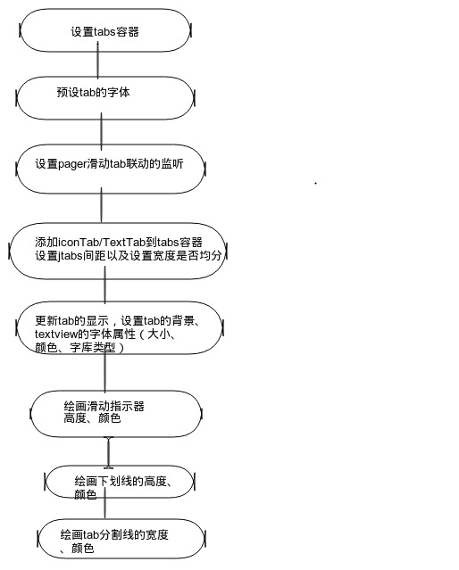
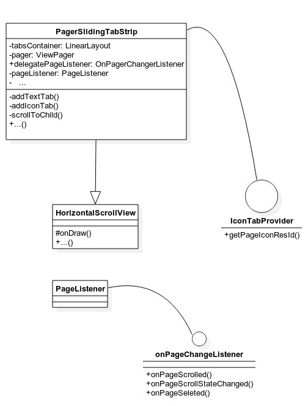

${PagerSlidingTabStrip} 源码解析
====================================
> 本文为 [Android 开源项目源码解析](https://github.com/android-cn/android-open-project-analysis) 中 ${PagerSlidingTabStrip} 部分

项目地址：[${PagerSlidingTabStrip}](${https://github.com/astuetz/PagerSlidingTabStrip})，分析的版本：[1.0.1](https://github.com/astuetz/PagerSlidingTabStrip)，Demo 地址：[PagerSlidingTabStrip Demo](https://github.com/ayyb1988/android-open-project-demo/tree/master/pager-sliding-tab-strip-demo-ayyb1988})
 
 分析者：[ayyb1988](https://github.com/ayyb1988)，分析状态：已完成
 
 校对者：[]()，校对状态：未开始


###1. 总体设计
PagerSlidingTabStrip 滑动viewpager时tab联动的控件。可以设置tab的类型为textview还是icon。对于textview可设置字库属性。通过提供方法如滑动指示器 下划线 tab风格线 tab权重等达到自定义的效果。

###2. 流程图


###3. 功能介绍
####3.1 特性介绍
* 兼容Android支持库中的ViewPager 的一个滑动分页指示器的控件。
* 滑动时实现TextView颜色状态的联动
* 支持文字导航指示，可指定选中的pager导航字体属性
* 支持图片导航指示，可高亮选中pager页导航背景
* 很好的扩展性

####3.2 集成及使用指南
#####3.2.1
    在 gradle 中
    dependencies {
        compile 'com.astuetz:pagerslidingtabstrip:1.0.1'
    }
#####3.2.2 在layout布局文件中引入PagerSlidingTabStrip，通常布局在viewpager上面。如下：
```
<com.astuetz.PagerSlidingTabStrip
    android:id="@+id/tabs"
    android:layout_width="match_parent"
    android:layout_height="48dip" />
```
#####3.2.3 在oncreate方法中（或Fragment的onCreateView）中，绑定PagerSlidingTabStrip到Viewpager
 ```
 // 初始化ViewPager和Adapter
 ViewPager pager = (ViewPager) findViewById(R.id.pager);
 pager.setAdapter(new TestAdapter(getSupportFragmentManager()));

 // 绑定PagerSlidingTabStrip到ViewPager上
 PagerSlidingTabStrip tabs = (PagerSlidingTabStrip) findViewById(R.id.tabs);
 tabs.setViewPager(pager);
```

#####3.2.4 如果你的view pager使用到OnPageChangeListener。你应该通过这个PagerSlidingTabStrip控件设置而不是Viewpager。如下：

     // continued from above
     tabs.setOnPageChangeListener(mPageChangeListener);
####3.3 用户定制
 根据你的需要修改下面的值
* pstsIndicatorColor 滑动指示器的颜色
* pstsUnderlineColor 整个view【PagerSlidingTabStrip】下划线的颜色
* pstsDividerColor tabs之间分割线的颜色
* pstsIndicatorHeight 滑动指示器的高度
* pstsUnderlineHeight 整个View【PagerSlidingTabStrip】下滑线的高度
* pstsDivviderPadding 分割线上部、下部的内间距
* pstsTabPaddingLeftRight 每个tab左右内间距
* pstsScrollOffset 选中tab的滑动的距离
* pstsTabBackground 每个tab的背景图片，使用StateListDrawable
* pstsShouldExpand 如果设置为true，每个tab的宽度拥有相同的权重
* pstsTextAllCaps 如果设置为true，所有的tab字体转为大写


###4. 详细设计
####4.1 类详细介绍


#### 4.2 核心方法及功能介绍
pagerSlidingTabStrip实现联动效果的原理是，它引用了ViewPager的 OnPageChangeListener。但是viewpager注册的listener不是自身的OnPageChangeListener，而是pagerSlidingTabStrip内部类PageListener。通过PageListener实现对对viewpager和tab的封装。从而实现滑动联动效果。下面结合代码详细说明
```
 private class PageListener implements OnPageChangeListener {

        @Override
        public void onPageScrolled(int position, float positionOffset, int positionOffsetPixels) {

			//当前view的位置也即tab的位置
            currentPosition = position;
            //当前view滑动的距离 。其中currentPositionOffset 为float，介于0~1 代表相对于tab宽偏移的比例
            currentPositionOffset = positionOffset;
            //根据上面得到的view的位置和偏移位置，来同步tab的位置和偏移距离。
            scrollToChild(position, (int) (positionOffset * tabsContainer.getChildAt(position).getWidth()));
			//重绘view，实现tab滑动的效果。
            invalidate();
			//下面的delegatePageListener就是我们设置的viewpager.setOnPageChangeListener.而现在把它封装在整个pagerSlidingTabStrip中，实现viewpager滑动的效果。
            if (delegatePageListener != null) {
                delegatePageListener.onPageScrolled(position, positionOffset, positionOffsetPixels);
            }
        }

        @Override
        public void onPageScrollStateChanged(int state) {
        	//滑动结束。positionOffset归零
            if (state == ViewPager.SCROLL_STATE_IDLE) {
                scrollToChild(pager.getCurrentItem(), 0);
            }
            //调用viewpager.setOnPageChangeListener
            if (delegatePageListener != null) {
                delegatePageListener.onPageScrollStateChanged(state);
            }
        }

        @Override
        public void onPageSelected(int position) {
        //调用viewpager.setOnPageChangeListener
            if (delegatePageListener != null) {
                delegatePageListener.onPageSelected(position);
            }
        }

    }
```

scrollToChild，tab的滑动位置 实现如下：
```
    private void scrollToChild(int position, int offset) {

        if (tabCount == 0) {
            return;
        }

        int newScrollX = tabsContainer.getChildAt(position).getLeft() + offset;

        if (position > 0 || offset > 0) {
            newScrollX -= scrollOffset;
        }

		//滑动到的位置。
        if (newScrollX != lastScrollX) {
            lastScrollX = newScrollX;
            scrollTo(newScrollX, 0);
        }

    }
```

接下来说下 **addTextTab**   **addIconTab**66。即tab是text还是icon。如果是icon的话，通过viewpager的adapter实现接口IconTabProvider。来确定icontab。
```
        for (int i = 0; i < tabCount; i++) {

            if (pager.getAdapter() instanceof IconTabProvider) {
                addIconTab(i, ((IconTabProvider) pager.getAdapter()).getPageIconResId(i));
            } else {
                addTextTab(i, pager.getAdapter().getPageTitle(i).toString());
            }

        }
```

####4.3 View绘制机制
请参考[公共技术点viewdrawflow](https://github.com/android-cn/android-open-project-analysis/blob/master/tech/viewdrawflow.md)部分

在pagerSlidingTabStrip中重写了onDraw函数
**绘画滑动指示器; 绘画整个tabs下划线; 绘画tab之间间隔线。**代码如下
```
 // draw indicator line

        rectPaint.setColor(indicatorColor);

        // default: line below current tab
        View currentTab = tabsContainer.getChildAt(currentPosition);
        float lineLeft = currentTab.getLeft();
        float lineRight = currentTab.getRight();

        // if there is an offset, start interpolating left and right coordinates between current and next tab
        if (currentPositionOffset > 0f && currentPosition < tabCount - 1) {

            View nextTab = tabsContainer.getChildAt(currentPosition + 1);
            final float nextTabLeft = nextTab.getLeft();
            final float nextTabRight = nextTab.getRight();

            lineLeft = (currentPositionOffset * nextTabLeft + (1f - currentPositionOffset) * lineLeft);
            lineRight = (currentPositionOffset * nextTabRight + (1f - currentPositionOffset) * lineRight);
        }

        canvas.drawRect(lineLeft, height - indicatorHeight, lineRight, height, rectPaint);

        // draw underline

        rectPaint.setColor(underlineColor);
        canvas.drawRect(0, height - underlineHeight, tabsContainer.getWidth(), height, rectPaint);

        // draw divider

        dividerPaint.setColor(dividerColor);
        for (int i = 0; i < tabCount - 1; i++) {
            View tab = tabsContainer.getChildAt(i);
            canvas.drawLine(tab.getRight(), dividerPadding, tab.getRight(), height - dividerPadding, dividerPaint);
        }
```


###5. 杂谈
该库有很好的自定义性和扩展性。比如修改滑动指示器为一张图片【目前为设定颜色值和高度来决定】


###参考文献
[ViewPagerindicator 源码解析](https://github.com/android-cn/android-open-project-analysis/tree/master/view-pager-indicator)
####View的绘制：
1. [How Android Draws Views](http://developer.android.com/guide/topics/ui/how-android-draws.html)
2. [View 绘制流程](https://github.com/aosp-exchange-group/android-open-project-analysis/blob/master/tech/viewdrawflow.md)
3. [ Android View绘制流程](http://blog.csdn.net/wangjinyu501/article/details/9008271)
4. [Android中View绘制流程以及invalidate()等相关方法分析](http://blog.csdn.net/qinjuning/article/details/7110211)
5. [Android中measure过程、WRAP_CONTENT详解以及xml布局文件解析流程浅析(下)](http://blog.csdn.net/qinjuning/article/details/8074262)

####TOUCH事件处理
1. [View 事件传递](https://github.com/aosp-exchange-group/android-open-project-analysis/blob/master/tech/touch-event.md)
2. [Andriod 从源码的角度详解View,ViewGroup的Touch事件的分发机制](http://blog.csdn.net/xiaanming/article/details/21696315)
3. [Android 中Touch（触屏）事件传递机制](http://blog.csdn.net/wangjinyu501/article/details/22584465)
