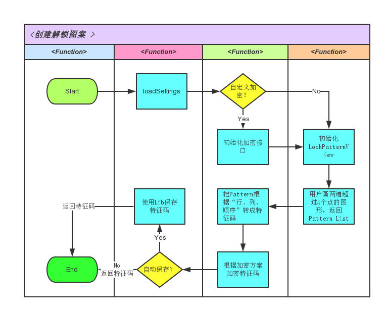
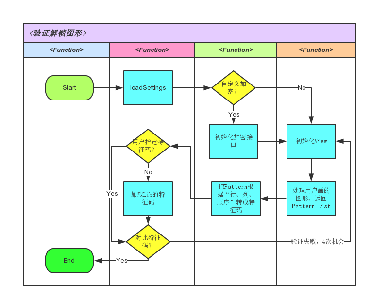
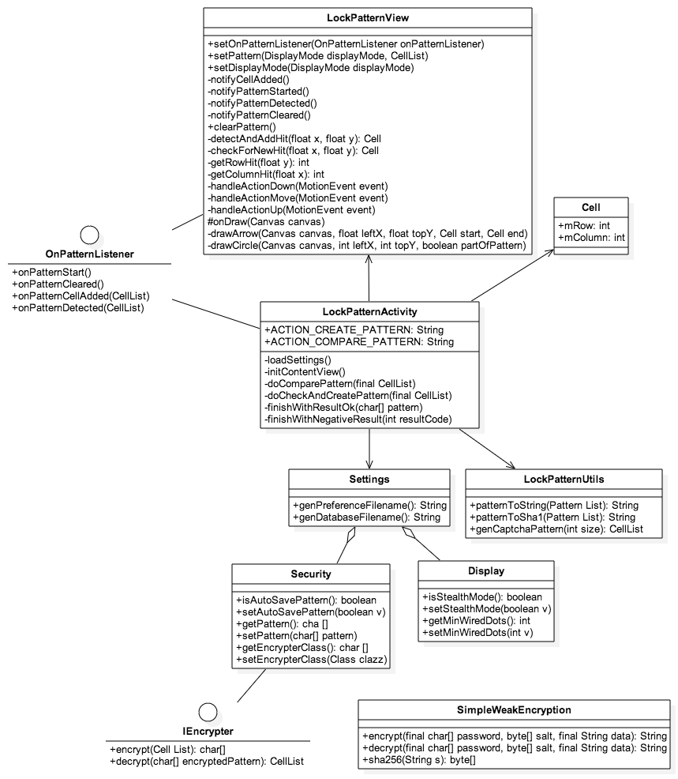
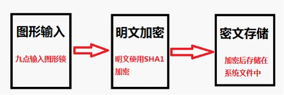
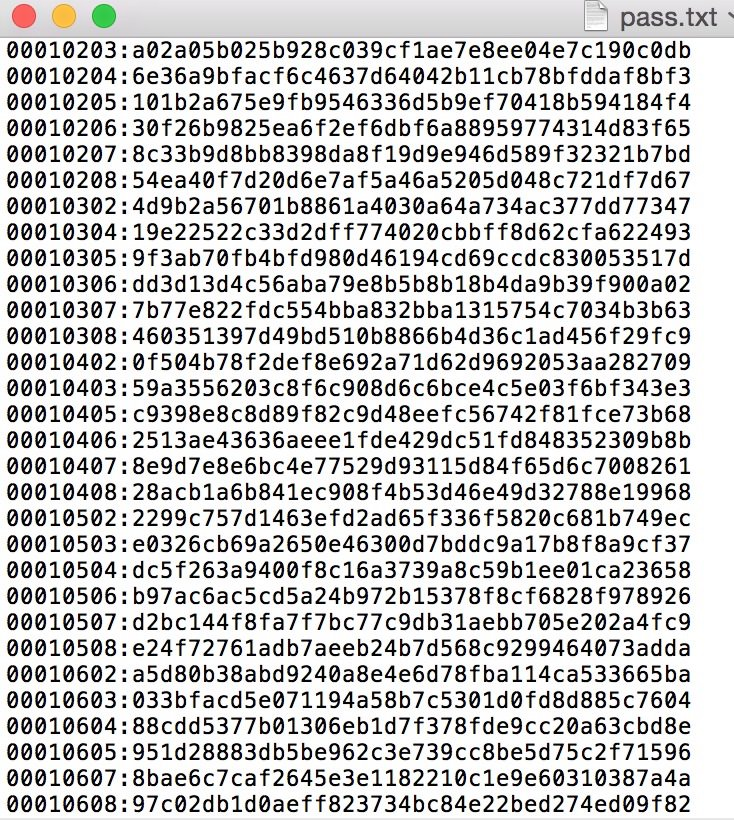

Android Lock Pattern 源码解析
====================================
> 本文为 [Android 开源项目源码解析](https://github.com/android-cn/android-open-project-analysis) 中 android-lockpattern 部分  
> 项目地址：[android-lockpattern](https://code.google.com/p/android-lockpattern/)，分析的版本：[40293d2250c2](https://code.google.com/p/android-lockpattern/source/detail?r=40293d2250c2b273223ba25e4aeb3d290a0fdfad)，Demo 地址：等待添加    
> 分析者：[爱早起](https://github.com/liang7)，校对者：[Trinea](https://github.com/Trinea)，校对状态：未完成   

###1. 介绍

####1.1 关于

Android 的图案密码解锁，通过手势连接 3 * 3 的点矩阵绘制图案表示解锁密码。基于 [Android Source Code](https://android.googlesource.com/platform/frameworks/base/+/master/core/java/com/android/internal/widget/LockPatternView.java)。  

####1.2 特点

- 支持: Android 1.6+ (API 4+)。
- 无特殊依赖。
- 支持手机与平板的布局。
- Stealth mode (invisible pattern)。
- 包含 5 种主题：
  - Dark/Light
  - Light with dark action bar (API 14+)
  - Dark/Light dialogs
- 有验证码模式。

####1.3 使用

#####1.3.1 Manifest 配置

```
<activity
    android:name="com.haibison.android.lockpattern.LockPatternActivity"
    android:theme="@style/Alp.42447968.Theme.Dark" />
```

#####1.3.2 创建图形锁模式

```	
private static final int REQ_CREATE_PATTERN = 1;

Intent intent = new Intent(LockPatternActivity.ACTION_CREATE_PATTERN, null, your-context, LockPatternActivity.class);
startActivityForResult(intent, REQ_CREATE_PATTERN);
```

```
@Override
protected void onActivityResult(int requestCode, int resultCode,
        Intent data) {
    switch (requestCode) {
        case REQ_CREATE_PATTERN: {
            if (resultCode == RESULT_OK) {
                char[] pattern = data.getCharArrayExtra(
                        LockPatternActivity.EXTRA_PATTERN);
                ...
            }
            break;
        }
    }
}
```

#####1.3.3 验证图形锁

```
private static final int REQ_ENTER_PATTERN = 2;

char[] savedPattern = ...

Intent intent = new Intent(LockPatternActivity.ACTION_COMPARE_PATTERN, null,
        your-context, LockPatternActivity.class);
intent.putExtra(LockPatternActivity.EXTRA_PATTERN, savedPattern);
startActivityForResult(intent, REQ_ENTER_PATTERN);
```

```
@Override
protected void onActivityResult(int requestCode, int resultCode,
        Intent data) {
    switch (requestCode) {
        case REQ_ENTER_PATTERN: {
        
            switch (resultCode) {
            case RESULT_OK:
                // The user passed
                break;
            case RESULT_CANCELED:
                // The user cancelled the task
                break;
            case LockPatternActivity.RESULT_FAILED:
                // The user failed to enter the pattern
                break;
            case LockPatternActivity.RESULT_FORGOT_PATTERN:
                // The user forgot the pattern and invoked your recovery Activity.
                break;
            }

            int retryCount = data.getIntExtra(
                    LockPatternActivity.EXTRA_RETRY_COUNT, 0);

            break;
        }
    }
}
```

###2. 总体设计

本项目较为简单，总体设计略过，具体实现请参考下面的分析。  

###3. 流程图

####3.1 创建解锁图案流程图

  

####3.2 验证解锁图案流程图

  

###4. 详细设计

####4.1 类关系图

  

####4.2 核心类功能介绍

#####4.2.1 LockPatternActivity.java

`LockPatternActivity`类负责所有外部请求，根据`ACTION_CREATE_PATTERN` `ACTION_COMPARE_PATTERN` `ACTION_VERIFY_CAPTCHA` 等`Action`选择操作模式，加载设置后初始化`LockPatternView`，在用户完成操作后退出并返回结果。

**主要方法说明：**  

* public void onCreate(Bundle savedInstanceState)  
首次创建时调用，根据 intent 设置 theme，设置 resultIntent，调用 loadSettings() initContentView()。  
* private void loadSettings()  
根据 metaData 与 Settings 类的内容得到显示模式、最少图形点数、自动存储、自定义加密等配置。  
* private void initContentView()  
根据 Aciton 与配置信息初始化 UI，实例化 OnPatternListener 设置到 LockPatternView 类的对象。  
* private void doCheckAndCreatePattern(final List<Cell> pattern)  
首先检查 pattern 是否合法，然后判断 Intent 是否保存有特征码，如果没有就把 pattern 加密并提取特征码 put 到 Intent，如果有就把特征码解密并与 pattern 对比，根据对比结果设置 UI。  
* private void doComparePattern(final List<Cell> pattern)  
首先检查 pattern 是否合法，然后从 Intent 或者 Settings 中 get 特征码，把特征码解密后与 pattern 对比，成功则调用 finishWithResultOk(null)，失败次数超过最大次数则调用 finishWithNegativeResult(result_failed)。  
* private void finishWithResultOk(char[] pattern)  
* private void finishWithNegativeResult(int resultCode)  

#####4.2.2 LockPatternView.java

`LockPatternView`类主要是显示解锁的图形界面，在用户操作的时候显示连线与动画，用户操作完成后根据结果做提示。  

**添加图形点**  

* private int getRowHit(float y)  
遍历所有图形点行高，寻找坐标 y 在哪个图案点的行高范围内。  
* private int getColumnHit(float x)  
遍历所有图形点列宽，寻找坐标 x 在哪个图案点的列宽范围内。  
* private Cell checkForNewHit(float x, float y)  
根据`getRowHit(float y)`与`getColumnHit(float x)`返回的行、列判断是否是新的图形点，如果是返回新点，否则返回 null。  
* private Cell detectAndAddHit(float x, float y)  
调用`checkForNewHit(float x, float y)`返回当前图形点，如图形点非 null，继续判断 pattern list 是否为空，如果不为空就把 last 与当前的图形点之间同一直线的其他点加入 list，然后把当前点加入 list。  

**按下事件**  

* handleActionDown(MotionEvent event)  
首先清理屏幕，获取当前手指的坐标，调用`detectAndAddHit(float x, float y)`并判断其返回值发送通知与局部刷新。  

**移动事件**  

* private void handleActionMove(MotionEvent event)  
检查手指移动过程中每一个点的坐标，判断如果 pattern list 不为空，则把最后一个图形点的坐标与当前手指坐标的区域进行局部刷新，如果在移动过程中加入了新的图形点则以此点坐标继续局部刷新。  

**弹起事件**  

* private void handleActionUp(MotionEvent event)  
检查 pattern list 如果不为空则停止添加，发送完成消息，全局刷新。  

#####4.2.3 LockPatternUtils.java

**图形摘要并加密**

* public static String patternToSha1(List<LockPatternView.Cell> pattern)  
调用`List<LockPatternView.Cell> pattern`把pattern list进行信息摘要，然后使用SHA-1算法加密，返回加密的摘要。
* public static String patternToString(List<LockPatternView.Cell> pattern)  
把pattern list进行信息摘要，从左上角起编号为00，至右下角止编号为08，按照list中点的顺序生成编号序列，返回序列。

####5. 安全性分析

android-lockpattern默认的加密存储流程与Android系统的图形解锁是一致的，以Android系统为例来破解图形锁。

#####5.1 加密存储过程

 

#####5.2 破解思路

* 图案总数固定：至少四个点、最多九个点、无重复点
* 加密较弱：单次SHA-1
* 最快的方法：暴力猜解

#####5.3 实战

首先获取系统图形锁加密摘要文件  

`
adb pull /data/system/gesture.key gesture.key
`

参考`4.2.3`中的图形摘要规则，然后我写了一个python脚本，生成了9个点所有组合的摘要字符串，同时再生成对应的SHA-1 HEX，这个字典也就57m。

 

把`gesture.key`中的加密字符串在字典中反查即可得出图形锁的原始信息摘要，然后就可以按步骤画图解锁了。
