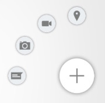
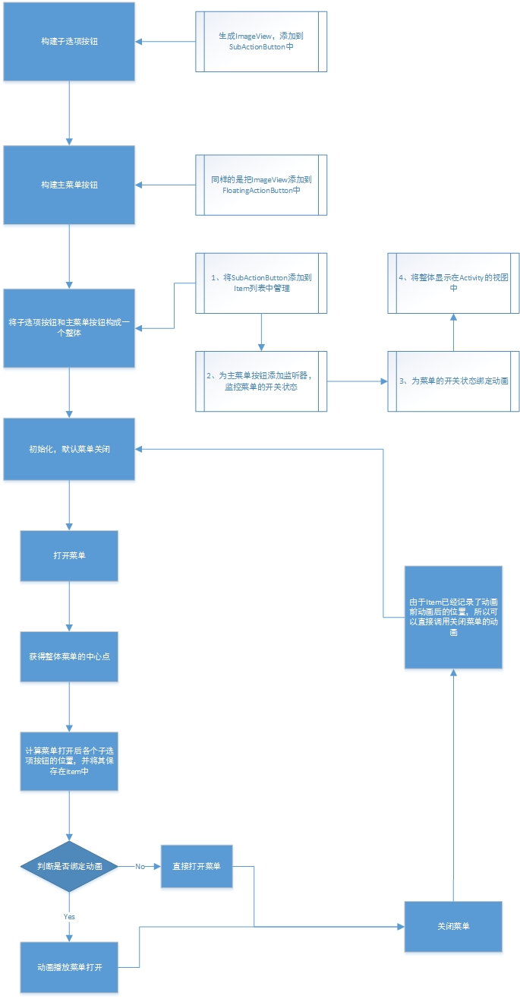
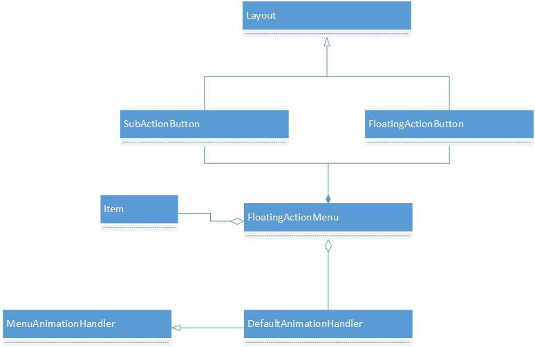
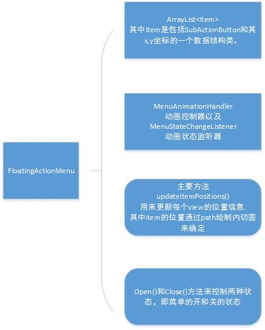
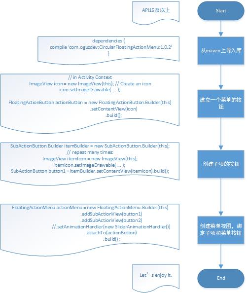

CircularFloatingActionMenu 源码解析
====================================
> 本文为 [Android 开源项目源码解析](https://github.com/android-cn/android-open-project-analysis) 中 circular-foating-action-menu 部分  
> 项目地址：[CircularFloatingActionMenu](https://github.com/oguzbilgener/CircularFloatingActionMenu)，分析的版本：[8efb1aa](https://github.com/oguzbilgener/CircularFloatingActionMenu/commit/8efb1aab2b361ed9019fa4af6e5d43e77777bcb6)，Demo 地址：[CFAMenu-demo](https://github.com/android-cn/android-open-project-demo/tree/master/circular-floating-actionmenu-demo)    
> 分析者：[cpacm](https://github.com/cpacm)，校对者：[dkmeteor](https://github.com/dkmeteor)、[Trinea](https://github.com/trinea)，校对状态：进行中   

###1. 功能介绍  
一个与著名应用 [Path](https://play.google.com/store/apps/details?id=com.path) 菜单类似的圆形弹出菜单，可方便的定制菜单以及动画。  
菜单可能是非完整圆形，本文统称为`圆形菜单`。  

####1.1 特点
可自定义动画、菜单、角度范围、半径等。  

####1.2 概念
  
以上是简单的圆形弹出菜单示例，更详细的示例图见：[Screenshot](https://github.com/android-cn/android-open-project-demo/blob/master/circular-floating-actionmenu-demo/README.md#2-screenshot)。  
**菜单按钮(Event)：**点击会弹出圆形菜单的控件，如上图的 + 对应控件，对应代码中的`FloatingActionButton.java`。  

**子菜单按钮(Event)：**圆形菜单中的控件，如上图的定位、视频、相机、文本对应的控件，对应代码中的`SubActionButton.java`。  

**菜单：**整个菜单，包含上面的`菜单按钮`和`子菜单按钮`，对应代码中的`FloatingActionMenu.java`。  

**菜单动画回调：**点击`菜单按钮`弹出`子菜单按钮`的动画设置的抽象类，对应代码中的`MenuAnimationHandler.java`。  

###2. 总体设计
本项目较为简单，总体设计省略。  

###3. 流程图
  
流程图如上图所示，中间最复杂的可能是计算`子菜单按钮`位置的地方。

###4. 详细设计
####4.1 类关系图
  
以上是`CircularFloatingActionMenu`主要类的关系图。  

`FloatingActionButton`、`SubActionButton`都是继承自`FrameLayout`的自定义控件，可支持以其他 View 为内容，如`ImageView`、`TextView`。  

`FloatingActionMenu`由`FloatingActionButton`、`SubActionButton`以及`MenuAnimationHandler`等构成。  

####4.2 类功能介绍
`CircularFloatingActionMenu`源码主要分成两部分，一部分是构成菜单的 View 部分，另一部分是动画的操作类。  

View 部分包含我们上面提到的菜单按钮`FloatingActionButton.java`、子菜单按钮`SubActionButton.java`、菜单`FloatingActionMenu.java`。 

动画部分包含菜单动画回调抽象类`MenuAnimationHandler.java`以及它默认的实现`DefaultAnimationHandler.java`。  

#####4.2.1 SubActionButton.java 
子菜单按钮，即按菜单键弹出来的选项按钮。这个类继承自`FrameLayout`，实现一个自定义图标的功能。  
可以根据构造函数传进来的参数来选择不同风格的图案底纹，然后将其传给`FloatingActionMenu`以便控制。  
首先是构造函数
```java
public SubActionButton(Activity activity, LayoutParams layoutParams, int theme, Drawable backgroundDrawable, View contentView, LayoutParams contentParams) {
        super(activity);
        setLayoutParams(layoutParams);
        // If no custom backgroundDrawable is specified, use the background drawable of the theme.
        if(backgroundDrawable == null) {
            if(theme == THEME_LIGHT) {
                backgroundDrawable = activity.getResources().getDrawable(R.drawable.button_sub_action_selector);
            }
            else if(theme == THEME_DARK) {
                backgroundDrawable = activity.getResources().getDrawable(R.drawable.button_sub_action_dark_selector);
            }
            else if(theme == THEME_LIGHTER) {
                backgroundDrawable = activity.getResources().getDrawable(R.drawable.button_action_selector);
            }
            else if(theme == THEME_DARKER) {
                backgroundDrawable = activity.getResources().getDrawable(R.drawable.button_action_dark_selector);
            }
            else {
                throw new RuntimeException("Unknown SubActionButton theme: " + theme);
            }
        }
        else {
            //通过mutate()方法解决Drawable共用一个内存空间的问题
            backgroundDrawable = backgroundDrawable.mutate().getConstantState().newDrawable();
        }
        //设置背景（考虑版本问题）
        setBackgroundResource(backgroundDrawable);
        if(contentView != null) {
            //添加view(即菜单的选项视图)
            setContentView(contentView, contentParams);
        }
        setClickable(true);
    }
```

从构造函数可以看的出来，选项按钮有四个主题可以选择，分别是下面的四种颜色
```java
    public static final int THEME_LIGHT = 0;
    public static final int THEME_DARK = 1;
    public static final int THEME_LIGHTER = 2;
    public static final int THEME_DARKER = 3;
```

之后是设定 ImageView 到这个按钮上，并且设定与父 View 的距离。（通过 setMargins()）  
这个我们在创建 subActionButton 时就要调用。核心函数是 addView(contentView, params)。这个方法能够在视图上再添加一个 view，作为子视图。
```java
    /**
     * Sets a content view with custom LayoutParams that will be displayed inside this SubActionButton.
     * @param contentView
     * @param params
     */
    public void setContentView(View contentView, LayoutParams params) {
        if(params == null) {
            params = new LayoutParams(LayoutParams.WRAP_CONTENT, LayoutParams.WRAP_CONTENT, Gravity.CENTER);
            final int margin = getResources().getDimensionPixelSize(R.dimen.sub_action_button_content_margin);
            params.setMargins(margin, margin, margin, margin);
        }

        contentView.setClickable(false);
        this.addView(contentView, params);
    }
```

最后就是一个建造器了，专门生成用于生成该类的建造器，静态全局
```java
    /**
     * A builder for {@link com.cpacm.library.SubActionButton} in conventional Java Builder format
     * 菜单选项的建造器
     */
    public static class Builder {
        ...
       public SubActionButton build() {
            return new SubActionButton(activity,
                    layoutParams,
                    theme,
                    backgroundDrawable,
                    contentView,
                    contentParams);
        }
    }
```
传入 activity，视图特性配置，主题的 id，背景图，imageview（子视图），imageview（子视图）的特性配置。用这些来配置选项按钮。

#####4.2.2 FloatingActionButton.java
菜单按钮，点击会弹出圆形菜单的控件。   

这个类跟`SubActionButton`基本相似，同样可以通过内部自定义的`build`构造器来定制自己的按钮。  
菜单按钮其实跟选项按钮的代码模式差不多，也是由设定子视图和一个建造器组成。  
不过它多了几个方法：    
设定位置，如左下，右下等方位
```java
    /**
     * Sets the position of the button by calculating its Gravity from the position parameter
     * @param position one of 8 specified positions.
     * @param layoutParams
     */
    public void setPosition(int position, FrameLayout.LayoutParams layoutParams) {
        int gravity;
        switch(position) {
            ...//具体代码请自行查看源代码
        }
        layoutParams.gravity = gravity;
        setLayoutParams(layoutParams);
    }
```

将视图绑定到 activity 的主视图中。这样我们就能在 activity 的主视图中操作这个 view 了。
FloatingActionButton的建造器
```java
    /**
     * A builder for {@link com.cpacm.library.FloatingActionButton} in conventional Java Builder format
     */
    public static class Builder {
    ...
        public FloatingActionButton build() {
                return new FloatingActionButton(activity,
                                               layoutParams,
                                               theme,
                                               backgroundDrawable,
                                               position,
                                               contentView,
                                               contentParams);
            }
    }
```
比 SubActionButton 多了一个位置的属性。

#####4.2.3 FloatingActionMenu.java
那么最重要的类来了，`FloatingActionMenu`表示整个菜单，它存放着所有的按钮以及动画操作。  

基本结构图如下：  
  
这个类也是由一个建造器生成，那么我们从建造器开始说起  
我们先看看生成 Menu 的代码：
```java
FloatingActionMenu rightLowerMenu = new FloatingActionMenu.Builder(this)
                .addSubActionView(rLSubBuilder.setContentView(rlIcon1).build())
                .addSubActionView(rLSubBuilder.setContentView(rlIcon2).build())
                .addSubActionView(rLSubBuilder.setContentView(rlIcon3).build())
                .addSubActionView(rLSubBuilder.setContentView(rlIcon4).build())
                .setAnimationHandler(new SliderAnimationHandler())
                .attachTo(rightLowerButton)
                .build();
```

* Builder(this) 将 activity 传入 menu 中
* addSubActionView 添加选项按钮到 activity 的视图中。在 FloatingActionMenu中管理 SubActionView 是一个 Item 的 list 集合，每次加一个按钮就往里面添加。Item 是一个辅助类，里面包括一个视图，x 坐标，y 坐标，长度，宽度。
* setAnimationHandler 则是设定动画。
* attachTo 是将 menu 与 activity 的视图绑定。（即把菜单按钮的视图添加到 activity 的视图中）  

FloatingActionMenu 类主要是管理菜单按钮和选项按钮的位置和状态（开和关）  
（1）首先是通过 view 的 onClick 监听器来控制状态  

（2）开关主要是两种状态，开的时候会获得菜单按钮的中心位置 center（getActionViewCenter()）和计算 item 的位置（calculateItemPositions()）。然后发送动画的请求到 AnimationHandler 中（animationHandler.animateMenuOpening(center)）。
```java
    /**
     * Simply opens the menu by doing necessary calculations.
     * @param animated if true, this action is executed by the current {@link MenuAnimationHandler}
     */
    public void open(boolean animated) {
        ...//具体代码请自行查看源代码
    }
```
其中 item 的 x，y 是记录视图的终点位置，然后经过动画把 view 移到 x，y 的位置上。  

stateChangeListener 为状态变化的监听器，开关都会响应相应的方法。主要在 AnimationHandler 中添加具体方法。
```java
    /**
     * A listener to listen open/closed state changes of the Menu
     */
    public static interface MenuStateChangeListener {
        public void onMenuOpened(FloatingActionMenu menu);
        public void onMenuClosed(FloatingActionMenu menu);
    }
```
（3）计算位置
```java
    /**
     * Calculates the desired positions of all items.
     */
    private void calculateItemPositions() {
        ...//具体代码请自行查看源代码
    }
```

#####4.2.4 MenuAnimationHandler.java
这是是所有动画类的父类，它主要定义了菜单打开，关闭，以及运行结束后状态的保存的方法。  

    animateMenuOpening(Point center)
    animateMenuClosing(Point center)   
    restoreSubActionViewAfterAnimation(FloatingActionMenu.Item subActionItem, ActionType actionType)

#####4.2.5 DefaultAnimationHandler.java
这一个默认的动画类，当我们不对动画做修改时就会默认使用这个类里面的动画效果。我们也可以参考这个类来进行设计新的动画效果。  
动画效果主要是通过`ObjectAnimator.ofPropertyValuesHolder(menu.getSubActionItems().get(i).view, pvhX, pvhY, pvhR, pvhsX, pvhsY, pvhA)`来实现。  
动画实现的主要类，继承自 MenuAnimationHandler    
主要通过 Animator 来实现属性动画。    
里面有一个 restoreSubActionViewAfterAnimation 的方法，它主要是恢复选项按钮到未打开的状态。 
```java
    /**
     * Restores the specified sub action view to its final state, accoding to the current actionType
     * Should be called after an animation finishes.
     * @param subActionItem
     * @param actionType
     */
    protected void restoreSubActionViewAfterAnimation(FloatingActionMenu.Item subActionItem, ActionType actionType) {
        ...//具体代码请自行查看源代码
    }
```
Animator属性动画以及其他动画的实现请参考我写的博客  
[Android的动画效果](http://www.cnblogs.com/cpacm/p/4067283.html)

####4.3 如何使用
        // Set up the white button on the lower right corner
        // more or less with default parameter
        ImageView fabIconNew = new ImageView(this);
        fabIconNew.setImageDrawable(getResources().getDrawable(R.drawable.ic_action_new_light));
        FloatingActionButton rightLowerButton = new FloatingActionButton.Builder(this)
                .setContentView(fabIconNew)
                .build();

        SubActionButton.Builder rLSubBuilder = new SubActionButton.Builder(this);
        ImageView rlIcon1 = new ImageView(this);
        ImageView rlIcon2 = new ImageView(this);
        ImageView rlIcon3 = new ImageView(this);
        ImageView rlIcon4 = new ImageView(this);

        rlIcon1.setImageDrawable(getResources().getDrawable(R.drawable.ic_action_chat_light));
        rlIcon2.setImageDrawable(getResources().getDrawable(R.drawable.ic_action_camera_light));
        rlIcon3.setImageDrawable(getResources().getDrawable(R.drawable.ic_action_video_light));
        rlIcon4.setImageDrawable(getResources().getDrawable(R.drawable.ic_action_place_light));

        // Build the menu with default options: light theme, 90 degrees, 72dp radius.
        // Set 4 default SubActionButtons
        FloatingActionMenu rightLowerMenu = new FloatingActionMenu.Builder(this)
                .addSubActionView(rLSubBuilder.setContentView(rlIcon1).build())
                .addSubActionView(rLSubBuilder.setContentView(rlIcon2).build())
                .addSubActionView(rLSubBuilder.setContentView(rlIcon3).build())
                .addSubActionView(rLSubBuilder.setContentView(rlIcon4).build())
                .setAnimationHandler(new SliderAnimationHandler())
                .attachTo(rightLowerButton)
                .build();
如以上代码所示  

（1）先建立一个 view 来作为一个总容器，设置好图片，然后作为菜单的按钮  

（2）建立好选项菜单的视图，添加属性后，添加到 FloatingActionMenu 中的 ArrayList<item> 数组中，并同时绑定上面的菜单按钮。  

（3）如果使用自己定义的动画，setAnimationHandler(new SliderAnimationHandler())。  

这样子，一个简单的案例就做好了



###5. 杂谈
动画的类型有点少，以及在屏幕尺寸异常的机子上测试时（如 mx3 的 1800x1080）会出现子选项偏离中心菜单键的问题，原因出在 view 的位置计算上，它没有考虑到一些特殊机型的机子。
