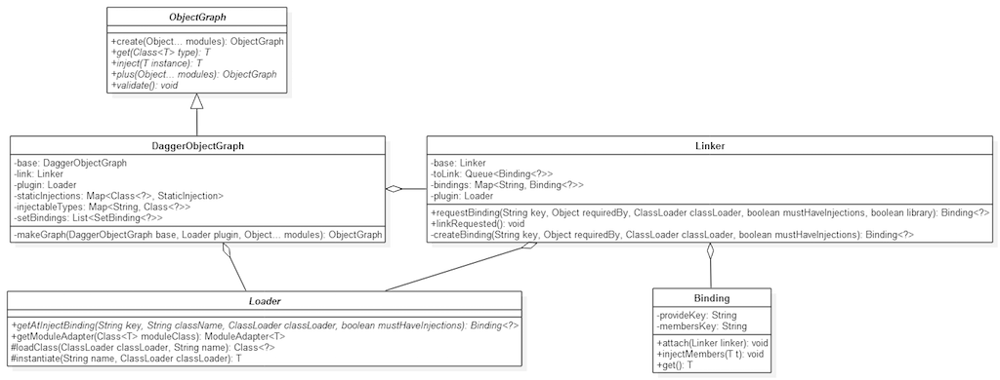

Dagger 源码解析
====================================
> 本文为 [Android 开源项目源码解析](https://github.com/android-cn/android-open-project-analysis) 中 Dagger 部分  
> 项目地址：[Dagger](https://github.com/square/dagger)，分析的版本：[2f9579c](https://github.com/square/dagger/commit/2f9579c48e887ffa316f329c12c2fa2abbec27b1 "Commit id is 2f9579c48e887ffa316f329c12c2fa2abbec27b1")，Demo 地址：[Dagger Demo](https://github.com/android-cn/android-open-project-demo/tree/master/dagger-demo)    
> 分析者：[扔物线](https://github.com/rengwuxian)，校对者：[Trinea](https://github.com/trinea)，校对状态：完成   

###1. 功能介绍
####1.1 Dagger
Dagger 是一款 Java 平台的依赖注入库，关于依赖注入，详细见 [依赖注入简介](https://github.com/android-cn/blog/tree/master/java/dependency-injection)。  

Java 的依赖注入库中，最有名的应该属 Google 的 Guice，Spring 也很有名，不过是专注于 J2EE 开发。Guice 的功能非常强大，但它是通过在运行时读取注解来实现依赖注入的，依赖的生成和注入需要依靠 Java 的反射机制，这对于对性能非常敏感的 Android 来说是一个硬伤。基于此，Dagger 应运而生。  

Dagger 同样使用注解来实现依赖注入，但它利用 APT(Annotation Process Tool) 在编译时生成辅助类，这些类继承特定父类或实现特定接口，程序在运行时 Dagger 加载这些辅助类，调用相应接口完成依赖生成和注入。Dagger 对于程序的性能影响非常小，因此更加适用于 Android 应用的开发。

####1.2 依赖注入相关概念
**依赖(Dependency)：**如果在 Class A 中，有个属性是 Class B 的实例，则称 Class B 是 Class A 的依赖，本文中我们将 Class A 称为宿主(Host)，并且全文用 Host 表示；Class B 称为依赖(Dependency)，并且全文用 Dependency 表示。一个 Host 可能是另外一个类的 Dependency。  

**宿主(Host)：**如果 Class B 是 Class A 的 Dependency，则称 Class A 是 Class B 的宿主(Host)。  

**依赖注入：**如果 Class B 是 Class A 的 Dependency，B 的赋值不是写死在了类或构造函数中，而是通过构造函数或其他函数的参数传入，这种赋值方式我们称之为依赖注入。  

更详细介绍可见 [依赖注入简介](https://github.com/android-cn/blog/tree/master/java/dependency-injection)。  

####1.3 Dagger 基本使用
本文将以一个简单的“老板和程序员” App 为例。  

Activity 中有一个 Boss 类属性，现在你想把一个 Boss 对象注入到这个 Activity 中，那么有两个问题需要解决：Boss 对象应该怎样被生成 以及 Boss 对象怎样被设置到 Activity 中。  
#####(1). Boss 对象怎样生成
在 Boss 类的构造函数前添加一个 @Inject 注解，Dagger 就会在需要获取 Boss 对象时，调用这个被标记的构造函数，从而生成一个 Boss 对象。

```java
public class Boss {
    ...

    @Inject
    public Boss() {
        ...
    }

    ...
}
```

_需要注意的是，如果构造函数含有参数，Dagger 会在调用构造对象的时候先去获取这些参数(不然谁来传参？)，所以你要保证它的参数也提供可被 Dagger 调用到的生成函数。Dagger 可调用的对象生成方式有两种：一种是用 @Inject 修饰的构造函数，上面就是这种方式。另外一种是用 @Provides 修饰的函数，下面会讲到。_  
#####(2). Boss 对象怎样被设置到 Activity 中
通过 @Inject 注解了构造函数之后，在 Activity 中的 Boss 属性声明之前也添加 @Inject 注解。像这种在属性前添加的 @Inject 注解的目的是告诉 Dagger 哪些属性需要被注入。

```java
public class MainActivity extends Activity {
    @Inject Boss boss;
    ...
}
```

最后，我们在合适的位置(例如 onCreate() 函数中)调用 ObjectGraph.inject() 函数，Dagger 就会自动调用上面 (1) 中的生成方法生成依赖的实例，并注入到当前对象(MainActivity)。

```java
public class MainActivity extends Activity {
    @Inject Boss boss;

    @Override
    protected void onCreate(Bundle savedInstanceState) {
        ObjectGraph.create(AppModule.class).inject(this);
    }
    ...
}
```

具体怎么注入即设置的过程后面会详细介绍，这里简单透露下，APT 会在 MainActivity 所在 package 下生成一个辅助类 MainActivity$$InjectAdapter，这个类有个 injectMembers() 函数，代码类似：  

```java
public void injectMembers(MainActivity paramMainActivity) {
    paramMainActivity.boss = ((Boss)boss.get());
    ……
}
```

上面我们已经通过 ObjectGraph.inject() 函数传入了 paramMainActivity，并且 boss 属性是 package 权限，所以 Dagger 只需要调用这个辅助类的 injectMembers() 函数即可完成依赖注入，这里的 boss.get() 会调用 Boss 的生成函数。  
到此为止，使用 Dagger 的 @Inject 方式将一个 Boss 对象注入到 MainActivity 的流程就完成了。  

#####(3). ObjectGraph.create(AppModule.class) 函数简介
上面 onCreate() 函数中出现了两个类：ObjectGraph 和 AppModule。其中 ObjectGraph 是由 Dagger 提供的类，可以简单理解为一个依赖管理类，它的 create() 函数的参数是一个数组，为所有需要用到的 Module(例如本例中的 AppModule)。AppModule 是一个自定义类，在 Dagger 中称为`Module`，通过 @Module 注解进行标记，代码如下：

```java
@Module(injects = MainActivity.class)
public class AppModule {
}
```

可以看到，AppModule 是一个空类，除了一行注解外没有任何代码。  
@Module 注解表示这个类是一个`Module`，Module 的作用是提供信息，让 ObjectGraph 知道哪些类对象需要被依赖注入，以及该怎么生成某些依赖(这在下面会具体介绍)。例如，上面这段代码中声明了需要依赖注入的类为 MainActivity。  
需要在 Module 类中显式声明这些信息看起来很麻烦，多此一举的方式和 Dagger 的原理有关，下面会讲到。  

####1.4 自定义依赖生成方式
#####(1). @Provides 修饰的生成函数
对构造函数进行注解是很好用的依赖对象生成方式，然而它并不适用于所有情况。例如：  

* 接口(Interface)是没有构造函数的，当然就不能对构造函数进行注解
* 第三方库提供的类，我们无法修改源码，因此也不能注解它们的构造函数
* 有些类需要提供统一的生成函数(一般会同时私有化构造函数)或需要动态选择初始化的配置，而不是使用一个单一的构造函数  

对于以上三种情况，可以使用 @Provides 注解来标记自定义的生成函数，从而被 Dagger 调用。形式如下：

```java
@Provides
Coder provideCoder(Boss boss) {
    return new Coder(boss);
}
```

_和构造函数一样，@Provides 注解修饰的函数如果含有参数，它的所有参数也需要提供可被 Dagger 调用到的生成函数。_  
需要注意的是，所有 @Provides 注解的生成函数都需要在`Module`中定义实现，这就是上面提到的 Module 的作用之一——让 ObjectGraph 知道怎么生成某些依赖。  

```java
@Module
public class AppModule {
    @Provides
    Coder provideCoder(Boss boss) {
        return new Coder(boss);
    }
}
```

#####(2). @Inject 和 @Provide 两种依赖生成方式区别
a. @Inject 用于注入可实例化的类，@Provides 可用于注入所有类  
b. @Inject 可用于修饰属性和构造函数，可用于任何非 Module 类，@Provides 只可用于用于修饰非构造函数，并且该函数必须在某个`Module`内部  
c. @Inject 修饰的函数只能是构造函数，@Provides 修饰的函数必须以 provide 开头  

####1.5 单例
Dagger 支持单例(事实上单例也是依赖注入最常用的场景)，使用方式也很简单：

```java
// @Inject 注解构造函数的单例模式
@Singleton
public class Boss {
    ...

    @Inject
    public Boss() {
        ...
    }

    ...
}
```

```java
// @Provides 注解函数的单例模式
@Provides
@Singleton
Coder provideCoder(Boss boss) {
    return new Coder(boss);
}
```

在相应函数添加 @Singleton 注解，依赖的对象就只会被初始化一次，之后的每次都会被直接注入相同的对象。

####1.6 Qualifier(限定符)
如果有两类程序员，他们的能力值 power 分别是 5 和 1000，应该怎样让 Dagger 对他们做出区分呢？使用 @Qualifier 注解即可。

(1). 创建一个 @Qualifier 注解，用于区分两类程序员：

```java
@Qualifier
@Documented
@Retention(RUNTIME)
public @interface Level {
  String value() default "";
}
```

(2). 为这两类程序员分别设置 @Provides 函数，并使用 @Qualifier 注解对他们做出不同的标记：

```java
@Provides @Level("low") Coder provideLowLevelCoder() {
    Coder coder = new Coder();
    coder.setName("战五渣");
    coder.setPower(5);
    return coder;
}

@Provides @Level("high") Coder provideHighLevelCoder() {
    Coder coder = new Coder();
    coder.setName("大神");
    coder.setPower(1000);
    return coder;
}
```

(3). 在声明 @Inject 对象的时候，加上对应的 @Qualifier 注解。

```java
@Inject @Level("low") Coder lowLevelCoder;
@Inject @Level("high") Coder highLevelCoder;
```

####1.7 编译时检查
实质上，Dagger 会在编译时对代码进行检查，并在检查不通过的时候报编译错误，具体原因请看下面的详细原理介绍。检查内容主要有三点：  
**(1)**. 所有需要依赖注入的类，需要被显式声明在相应的`Module`中。  
**(2)**. 一个`Module`中所有 @Provides 函数的参数都必须在这个 Module 中提供相应的被 @Provides 修饰的函数，或者在 @Module 注解后添加 "complete = false" 注明这是一个不完整 Module，表示它依赖不属于这个 Module 的其他 Denpendency。  
**(3)**. 一个`Module`中所有的 @Provides 函数都要被它声明的注入对象所使用，或者在 @Module 注解后添加 "library = ture" 注明它含有对外的 Denpendency，可能被其他`Module`依赖。  

####1.8 Dagger 相关概念
**Module：**也叫 ModuleClass，指被 @Module 注解修饰的类，为 Dagger 提供需要依赖注入的 Host 信息及一些 Dependency 的生成方式。  

**ModuleAdapter：**指由 APT 根据 @Module 注解自动生成的类，父类是 Dagger 的 ModuleAdapter.java，与 ModuleClass 对应，以 ModuleClass 的 ClassName 加上 $$ModuleAdapter 命名，在 ModuleClass 的同一个 package 下。  

**Binding：**指由 APT 根据 @Inject 注解和 @Provides 注解自动生成，最终继承自 Binding.java 的类。为下面介绍的 DAG 图中的一个节点，每个 Host 及依赖都是一个 Binding。  

**InjectAdapter：**每个属性或构造函数被 @Inject 修饰的类都会生成一个 继承自 Binding.java 的子类，生成类以修饰类的 ClassName 加上 $$InjectAdapter 命名，在该类的同一个 package 下。  

**ProvidesAdapter：**每个被 @Provides 修饰的生成函数都会生成一个继承自 ProvidesBinding.java 的子类，ProvidesBinding.java 继承自 Binding.java，生成类以 Provide 函数名首字母大写加上 ProvidesAdapter 命名，是 Provide 函数所在 Module 对应生成的`ModuleAdapter`中的静态内部类。  
Binding 更具体信息在下面会介绍。  

**Binding 安装：**指将 Binding 添加到 Binding 库中。对 Dagger Linker.java 代码来说是将 Binding 添加到 Linker.bindings 属性中，Linker.bindings 属性表示某个 ObjectGraph 已安装的所有 Binding。对于下面的 DAG 图来说是将节点放到图中，但尚未跟其他任何节点连接起来。  

**Binding 连接：**把当前 Binding 和它内部依赖的 Binding 进行连接，即初始化这个 Binding 内部的所有 Binding，使它们可用。对 DAG 的角度说，就是把某个节点与其所依赖的各个节点连接起来。  

###2. 总体设计

####2.1 概述
事实上，Dagger 这个库的取名不仅仅来自它的本意“匕首”，同时也暗示了它的原理。Jake Wharton 在对 Dagger 的介绍中指出，Dagger 即 DAG-er，这里的 DAG 即数据结构中的 DAG——有向无环图(Directed Acyclic Graph)。也就是说，Dagger 是一个**基于有向无环图结构的依赖注入库。**

####2.2 DAG(有向无环图)
已经了解 DAG 的可以跳过这节。  
DAG 是数据结构的一种。在一组节点中，每一个节点指向一个或多个节点，但不存在一条正向的链最终重新指向自己(即不存在环)，这样的结构称为有向无环图，即 DAG。


上图中的数据结构就是一个有向无环图。图中一共存在 6 个节点和 7 个箭头，但任何一个节点都无法从自己发射出的箭头通过某条回路重新指向自己。

####2.3 Dagger 中依赖注入与 DAG 的关系

Dagger 的运作机制，是运用 [APT(Annotation Process Tool)](http://docs.oracle.com/javase/7/docs/technotes/guides/apt/) 在编译时生成一些用于设定规则的代码，然后在运行时将这些规则进行动态组合 // TODO 不太理解意思，生成一个(或多个)DAG，然后由 DAG 来完成所有依赖的获取，实现依赖注入。关于 DAG 究竟是怎样一步步生成的，后面再讲，这里先说一下在 Dagger 中依赖注入与 DAG 的关系。


我把前面那张图的每个节点重新命名，得到了上图。上图代表了某个应用程序内的一整套依赖关系，其中每个箭头都表示两个类之间依赖关系，Host 和 Dependency 都是其中的一个节点。  

可以看出，一个程序中的整套依赖关系其实就是一个 DAG。而实际上，Dagger 也是这么做的：**预先建立一个 DAG，然后在需要获取对象的时候通过这个依赖关系图来获取到对象并返回，若获取失败则进行查找，查找到后再补充到 DAG 中。**

Dagger 是支持传递依赖的。例如在上图中，当需要获取一个 CustomView，会首先获取一个 DataHelper 作为获取 CustomView 的必要参数；此时如果 DataHelper 还未初始化，则还要分别拿到 HttpHelper 和 Database 用来初始化 DataHelper；以此类推。

Dagger 不支持循环依赖，即依赖关系图中不能出现环。原因很简单，如果鸡依赖蛋，蛋依赖鸡，谁来创造世界？总有一个要先产生的。

####2.4 工作流程

**(1)**. 编译时，通过 APT 查看所有 java 文件，并根据注解生成一些新的 java 文件，即`InjectAdapter`、`ProvidesAdapter`、`ModuleAdapter`，这些文件用于运行时辅助 DAG 的创建和完善。然后，将这些新生成的 java 文件和项目原有的 java 文件一并编译成 class 文件。  
**(2)**. 运行时，在 Application 或某个具体模块的初始化处，使用`ObjectGraph`类来加载部分依赖(实质上是利用编译时生成的`ModuleAdapters`加载了所有的`ProvidesBinding`，后面会讲到)，形成一个不完整的依赖关系图。  
**(3)**. 这个不完整的依赖关系图生成之后，就可以调用`ObjectGraph`的相应函数来获取实例和注入依赖了。实现依赖注入的函数有两个：`ObjectGraph.get(Class<T> type)`函数，用于直接获取对象；`ObjectGraph.inject(T instance)`函数，用于对指定对象进行属性的注入。在这些获取实例和注入依赖的过程中，如果用到了还未加载的依赖，程序会自动对它们进行加载(实质上是加载的编译时生成的`InjectAdapter`)。在此过程中，内存中的 DAG 也被补充地越来越完整。

###3. 流程图

####3.1 编译时：
  

####3.2 运行时(初始化后)：
  

###4. 详细设计

####4.1 类关系图
  
  

上图是 Dagger 整体框架最简类关系图。大致原理可以描述为：`Linker`通过`Loader`加载需要的`Binding`并把它们拼装成合理的依赖关系图 ObjectGraph，由`ObjectGraph`(其子类`DaggerObjectGraph`)最终实现依赖注入的管理。  
ObjectGraph 是个抽象类，DaggerObjectGraph 是它目前唯一的子类，对 Dagger 的调用实际都是对 DaggerObjectGraph 的调用。  

####4.2 类功能详细介绍
#####4.2.1 Binding.java —— 节点
Binding 是一个泛型抽象类，相当于依赖关系 DAG 图中的节点，依赖关系 DAG 图中得每一个节点都有一个由 APT 生成的继承自 Binding 的类与之对应，而依赖关系 DAG 图中的每一个节点与`Host`和`Dependency`一一对应，所以每个`Host`或`Dependency`必然有一个由 APT 生成的继承自 Binding 的子类与之对应，我们先简单的将这些生成类分为`HostBinding`和`DependencyBinding`。  
#####(1). Binding.java 实现的接口
Binding.java 实现了两个接口，第一个是 javax 的`Provider`接口，此接口提供了 get() 函数用于返回一个`Dependency`实例，当然也可以是`Host`实例。  
第二个接口是 Dagger 中的`MembersInjector`接口，此接口提供了 injectMembers() 用来向`Host`对象中注入(即设置)`Dependency`。  
单纯的`DependencyBinding`只要实现`Provider`接口，在 get() 函数中返回自己的实例即可。单纯的`HostBinding`只要实现`MembersInjector`，在 injectMembers() 函数中调用`DependencyBinding`的 get() 函数得到依赖，然后对自己的依赖进行注入即可。如果一个类既是`Host`又是`Dependency`，则与它对应的`Binding`这两个接口都需要实现。 

#####(2). 生成的 Binding 代码示例
如下的 Host 和 Dependency 类  

```java
public class Host {
    @Inject Dependency dependency;
}

public class Dependency {
    @Inject
    public Dependency() {
        ……
    }
}
```
由 APT 生成的 Binding 应该类似

```java
public final class Host$$InjectAdapter extends Binding<Host> implements MembersInjector<Host> {
    private Binding<Dependency> dependencyBinding;

    ……

    public void attach(Linker linker) {
        dependencyBinding = (Dependency$$InjectAdapter)linker.requestBinding(……);
    }

    public void injectMembers(Host host) {
        host.dependency = (Dependency)dependencyBinding.get();
    }
}
```

```java
public final class Dependency$$InjectAdapter extends Binding<Dependency> implements Provider<Dependency> {

    ……
    
    public Dependency get() {
        return new Dependency();
    }
}
```

`HostBinding`指的是生成类 Host$$InjectAdapter，`DependencyBinding`指的是生成类 Dependency$$InjectAdapter，我们可以看到`HostBinding`的 attach 方法用于得到`DependencyBinding`的实例，然后在 injectMembers() 函数中通过调用这个实例的 get() 函数注入 Dependency，`DependencyBinding` 的 get() 函数就是调用`Dependency`的生成方法。  

#####(3). Binding 分类
上面我们将生成的 Binding 子类简单分为了`HostBinding`和`DependencyBinding`，实际根据前面的注入方式我们知道依赖的生成方式有 @Inject 和 @Provides 两种，对这两种方式，Dagger 生成 Binding 子类的规则不同。  

对于 @Inject 方式的注入，APT 会在`Dependency`同一个 package 下以`Dependency`的 ClassName 加上 $$InjectAdapter 为类名生成一个 Binding 子类。
对于 @Provides 方式的注入，@Provides 的生成函数必须写在某个`Module`内部，与此 Module 对应的`ModuleAdapter`(Module$$ModuleAdapter)内部会有一个此 @Provides 方式对应的 Binding 子类，继承自 Binding 的子类 ProvidesBinding，以 @Provides 函数名首字母大写加上 ProvidesAdapter 命名。  

所以实际自动生成的 Binding 子类我们可以分为三种：  
第一种是`Host`对应的 Binding，本文中我们统一称为`HostBinding`。这些`HostBinding`和被 @Module 修饰的`Module` injects 值中每个元素一一对应，他们提供 get()、injectMembers()、attach() 函数。  

第二种是 Inject Dependecy 对应的 Binding 子类，本文中我们统一称为`InjectBinding`。这些`InjectBinding`和所有含有 @Inject 修饰的构造函数的类一一对应，他们提供 get() 函数，不提供 injectMembers() 函数。如果它同时是个`Host`，也会提供 injectMembers() 函数。  

第三种是 Provide Dependecy 对应的 Binding 子类，本文中我们统一称为`ProvidesBinding`。`ProvidesBinding` 和 @Module 类中的被 @Provides 修饰的函数一一对应，他们只提供 get() 函数，不提供 injectMembers() 函数。  
上面三种 Binding 中，第一、二种会在 ObjectGraph.create 时加载进来，第三种在用的时候才会被动态加载。`InjectBinding`和`ProvidesBinding`统称为`DependencyBinding`。  

**Binding.java 的主要函数：**  
#####(1). get()
表示得到此 Binding 对应的`Dependency`。`InjectBinding`会在 get() 中调用被 @Inject 修饰的构造函数，`ProvidesBinding`会在 get() 函数中调用被 @Provides 修饰的生成函数。  
#####(2). injectMembers(T t)
表示向此 Binding 对应`Host`对象中注入依赖，这个函数的实现一般就是对被 @Inject 修饰的属性进行赋值，值为`DependencyBinding`的 get() 函数返回值。  
#####(3). attach(Linker linker)
表示`HostBinding`获取依赖的 Binding 即`DependencyBinding`对象，对于 DAG 图来说相当于把图中两个节点连接起来。对于`DependencyBinding`此函数为空。  
#####(4). getDependencies(…)
表示`HostBinding`得到依赖的`DependencyBinding`)，这个函数在对 DAG 图进行问题检测，比如循环依赖检测时用到。  

**Binding.java 的主要属性：**  
#####(1). provideKey
表示 Binding 所属 Host 或 Dependency 的类名，是 Binding 唯一的 key，在 Linker 管理 Binding 时会用到，作为存储所有 Binding 的 Map 的 key。对`HostBinding`值为 HostClassName.toString()，`DependencyBinding`值为 DependencyClassName.toString()。  
#####(2). membersKey
// TODO。对`HostBinding`值为 members/ 加上 HostClassName.toString()，`InjectBinding`值为  members/ 加上 DependencyClassName.toString()，`ProvidesBinding`值为 null。`ProvidesBinding`值为 null，因为它默认就连接好了。  
#####(3). requiredBy
表示这个 Binding 属于谁，对`HostBinding`值为 HostClass.class，`InjectBinding`值为 DependencyClass.class，`ProvidesBinding`值为 ProvideMethodName.toString()。  
#####(4). bits
表示 Binding 特性的标志位，如是是否是单例(SINGLETON)、是否已连接(LINKED)，是否被访问(VISITING)、是否是可被其他 Module 依赖的 Library(LIBRARY)、是否依赖其他 Module 的 Binding(DEPENDED_ON)、是否不存在循环依赖(CYCLE_FREE)。  

#####4.2.2 Linker.java —— 拼装者
Linker 是 Dagger 最核心的大脑部分，它负责调用 Loader 加载 Binding，存储并管理所有 Binding、调用 attach 方法初始化依赖的 DependencyBinding。对于 DAG 图来说，Linker 就相当于一个管家，负责调用加载器加载节点到图中、存储并管理图中所有的节点，连接图中有依赖关系的节点，也就是 DAG 图的拼装。  
Dagger 在运行时维护一个或多个`Linker`，Linker 与 ObjectGraph 一一对应。  

**Linker.java 的主要属性：**  
#####(1).  bindings 
本文称为 ObjectGraph 的 Binding 库，表示 ObjectGraph 已安装的所有 Binding，包括尚未连接的 Binding，对于 DAG 图来说就是所有在图中的节点，包括尚未跟其他任何节点连接起来的节点。  
bindings 数据结构为 HashMap，value 就是具体的 Binding，key 是用来唯一确定 Binding 的字符串，为 Binding.java 中的 provideKey 和 membersKey，具体形式是类名加上一个用于区分同类型的前缀。这些 Binding 不仅包含已连接的，也包含未连接的。  

#####(2). toLink 
表示待连接的 Binding 队列，包含了所有待连接的 Binding。对于 DAG 图来说就是所有在图中但未和任何节点连接的节点。  

连接(Link)：从 DAG 的角度说，就是把某个节点与其所依赖的各个节点连接起来。而对于 Binding 来说，就是把当前 Binding 和它依赖的 Binding (`ProvidesBinding`)进行连接，即初始化这个 Binding 依赖的所有 Binding，使它们可用。  

#####(3). attachSuccess
一个标志，对于某个 Binding，在获取它依赖的`DependencyBinding`时，如果他所有的`DependencyBinding`都已经添加到`Binding`库中，attachSuccess 则为 true，否则为 false。如果为 false ，表示该 Binding 尚未连接，添加到待连接队列中，否则标记为已连接。  

#####(4). linkedBindings
默认为 null，只有在 linkAll() 函数被调用后才有效，用于存储所有已经连接的 Binding，同时也是一个标记，表示这个 ObjectGraph 已经不能被改变。  

#####(5). Loader plugin
Loader 负责加载类，主要是加载 APT 生成的辅助类(InjectAdapter、ModuleAdapter)。  

#####(6). errors
Linker.linkRequested() 运行过程中积累的 errors。  

**Linker.java 的主要函数：**  
#####(1). requestBinding(String key ……)
根据传入的 key 返回一个 Binding。首先，会尝试从 Bindings 变量(Binding 库)中查找这个 key，如果找到了，就将找到的 Binding 返回(如果找到后发现这个 Binding 还未连接，还需要它放进 toLink 中)；如果找不到，说明需要的 Binding 是一个`InjectBinding`(因为另一种 Binding——ProvidesBinding 在初始化时就已经加载完毕了)，就生成一个包含了这个 key 的`DeferredBinding`，并把它添加到 toLink(等待稍后载入)后返回 null。  

#####(2). linkRequested()
循环取出 toLink 中的 Binding：  
如果是个`DeferredBinding`载入相应的`InjectAdapter`后添加到`toLink`和`bindings`中，等待下次循环。  
否则调用 attach 函数进行连接，对于`DependencyBinding`连接完成。对于`HostBinding`利用 attach() 函数获取依赖的 Binding 即`DependencyBinding`对象，在获取`DependencyBinding`的过程中调用 requestBinding() 函数查找 Binding，不存在或未连接会继续添加到 toLink 队列中，如此循环。  
直到所有依赖`DependencyBinding`被初始化结束。  
对 DAG 图来说就是一次广度优先遍历。  

#####(3). installBindings(BindingsGroup toInstall)
安装 Bindings，表示将 Binding 添加到 ObjectGraph 中，但尚未连接。对 DAG 图来说就是就是将节点放到图中，但尚未和任何其他节点连接。  

#####(4). linkAll()
将 Binding 库中所有未连接的 Binding 添加到 toLink 中，调用 linkRequested() 进行连接。  

#####(5). fullyLinkedBindings()
返回已经全部连接的 Binding，如果没有调用过 linkAll() 则返回 null

#####4.2.3 Loader.java —— 类加载器及对象生成器  
Loader 是一个纯工具类，它通过 ClassLoader 加载 APT 生成的`ModuleAdapter`类和`InjectAdapter`类，并初始化一个该类对象返回。另外，Loader 是一个抽象类，在运行时，Dagger 使用的是 Loader 的子类`FailoverLoader`。

**Loader.java 的主要函数：**  
#####(1). loadClass(ClassLoader classLoader, String name)
用指定的 ClassLoader 根据类名得到类，并缓存起来。  
#####(2). instantiate(String name, ClassLoader classLoader)
用指定的 ClassLoader 根据类名获取类的实例。  
#####(3). getModuleAdapter(Class<T> moduleClass)
获取指定的 Module 类所对应的 ModuleAdapter 实例。  
#####(4). getAtInjectBinding(String key……)  
根据 key 获取 Inject Dependecy 对应的 InjectAdapter 实例。  
#####(5). getStaticInjection(Class<?> injectedClass)
根据被注入的 Class 获取对应的 StaticInjection 实例。  

**Loader.java 的主要变量：**  
#####(1). Memoizer<ClassLoader, Memoizer<String, Class<?>>> caches
用来缓存被初始化过的对象，是一个嵌套的 Memoizer 结构，`Memoizer`具体可看后面介绍，简单理解就是嵌套的 HashMap，第一层 Key 是 ClassLoader，第二层 Key 是 ClassName，Value 是 Class 对象。  

#####4.2.4 FailoverLoader.java
FailoverLoader 是 Loader 的一个子类，它加载类的策略是首先查找 APT 生成的类，如果查找失败，则直接使用反射查找和初始化。  
**FailoverLoader.java 的主要函数：**  
#####(1). getModuleAdapter(Class<T> moduleClass)
获取指定的 Module 类所对应的 ModuleAdapter 实例，如果在生成类中查找失败，则会调用 ReflectiveAtInjectBinding.create(type, mustHaveInjections) 通过反射直接初始化对象。  
#####(2). getAtInjectBinding(String key……)  
根据 key 获取 Inject Dependecy 对应的 InjectAdapter 实例。如果在生成类中查找失败，则会调用 ReflectiveStaticInjection.create(injectedClass) 通过反射直接初始化对象。  
#####(3). getStaticInjection(Class<?> injectedClass)
根据被注入的 Class 获取对应的 StaticInjection 实例。  

**FailoverLoader.java 的主要变量：**  
#####(1). Memoizer<Class<?>, ModuleAdapter<?>> loadedAdapters
用来缓存初始化过的 ModuleAdapter 对象，是一个嵌套的 Memoizer 结构，具体可看下面介绍，简单理解就是嵌套的 HashMap，第一层 Key 是 ClassLoader，第二层 Key 是 ClassName，Value 是 Class 对象。  

#####4.2.5 ObjectGraph —— 管理者
ObjectGraph 是个抽象类，负责 Dagger 所有的业务逻辑，Dagger 最关键流程都是从这个类发起的，包括依赖关系图创建、实例(依赖或宿主)获取、依赖注入。  
**ObjectGraph 主要函数有：**  
#####(1). create(Object... modules)
这是个静态的构造函数，用于返回一个 ObjectGraph 的实例，是使用 Dagger 调用的第一个函数。参数为 ModuleClass 对象，函数作用是根据 ModuleClass 构建一个依赖关系图。此函数实现会直接调用  
```java
DaggerObjectGraph.makeGraph(null, new FailoverLoader(), modules)
```
返回一个`DaggerObjectGraph`对象，我们会在下面`DaggerObjectGraph`介绍中具体介绍实现过程。  
#####(2). inject(T instance)
抽象函数，表示向某个 Host 对象中注入依赖。  
#####(3). injectStatics()
抽象函数，表示向 ObjectGraph 中相关的 Host 注入静态属性。  
#####(4). get(Class<T> type)
抽象函数，表示得到某个对象的实例，多用于得到依赖的实例。  
#####(5). plus(Object... modules)
抽象函数，表示返回一个新的包含当前 ObjectGraph 中所有 Binding 的 ObjectGraph。  
#####(6). validate()
抽象函数，表示对当前 ObjectGraph 做检查。  

#####4.2.6 DaggerObjectGraph 
DaggerObjectGraph 是 ObjectGraph 的静态内部类，也是 ObjectGraph 目前唯一的子类。因为 ObjectGraph 的 create() 函数直接返回了 DaggerObjectGraph 对象，所以对 Dagger 的调用实际都是对 DaggerObjectGraph 的调用。  
**DaggerObjectGraph 主要属性有：**  
#####(1). Map injectableTypes
记录了所有需要被依赖注入的 Host 类型，以 Host 的 ClassName 加上一定规则前缀(// TODO)做为 key，以其所对应的 Module 为 value。
#####(2). Map staticInjections
记录了所有需要被静态依赖注入的 Host 类型，以 Host 的 ClassName 加上一定规则前缀(// TODO)做为 key，以其所对应的 Module 为 value。
#####(3). Linker linker
Linker 是 负责调用 Loader 加载 Binding，存储并管理所有 Binding、调用 attach 方法初始化依赖的 DependencyBinding。具体见上面`Linker.java`介绍。  
#####(4). Loader plugin
Loader 负责通过 ClassLoader 加载 APT 生成的ModuleAdapter类和InjectAdapter类。  
PS：这个变量名叫 plugin，实际也说明了 Dagger 的一大优势，就是它是支持 ClassLoader，这样通过 Dagger 实现依赖注入的 Android 应用，插件化时 Dagger 不会对其产生影响，而截止这个分析文档完成时，轻量级的 ButterKnife 都不支持多个 ClassLoader。  
**DaggerObjectGraph 主要函数有：**  
#####(1). makeGraph 函数
makeGraph 函数首先会通过 Modules.loadModules 函数得到所有的 ModuleAdapter；    
然后遍历所有 ModuleAdapter，将其中需要依赖注入的 Host 类型(injectableTypes)、需要静态静态注入的 Host 类型(staticInjections)、所有的 Binding(这里是ProvidesBinding)都保存下来，做为新的 DaggerObjectGraph 对象构造入参。另一种 Binding —— InjectBinding 会在需要用到的时候进行动态载入；  
第三步新建 Linker 保存上面的 Binding；  
最后用这些变量一起构建新的 DaggerObjectGraph 对象。  

#####(2). inject(T instance)
表示向某个 Host 对象中注入依赖。首先根据下面的 getInjectableTypeBinding() 函数查找到 Host 对应的 InjectBinding，然后调用 injectMembers() 函数注入依赖，将依赖注入结束的 Host 返回。  
#####(3). injectStatics()
表示向 ObjectGraph 中相关的 Host 注入静态属性。  
#####(4). get(Class<T> type)
表示得到某个对象的实例，多用于得到 Denpendency 的实例。首先根据下面的 getInjectableTypeBinding() 函数查找到 Denpendency 对应的 Binding，然后调用 get() 返回该 Denpendency 实例。  
#####(5). plus(Object... modules)
抽象函数，表示返回一个新的包含当前 ObjectGraph 中所有对象的 ObjectGraph。  
#####(6). validate()
表示对当前 ObjectGraph 做检查，首先会利用 Linker 查找到所有节点并连接起来，然后调用 ProblemDetector 进行检查。ProblemDetector 会在后面解释作用。  
#####(7). getInjectableTypeBinding(ClassLoader classLoader, String injectableKey, String key)
表示根据 key 得到某个 Binding。首先会从 ObjectGraph.injectableTypes 中得到其对应的 Module，然后通过 linker.requestBinding 查找其对应的 Binding，若未查找到的 Binding 或是尚未连接，则调用 linker.linkRequested() 得到 InjectBindng 并将其添加到 ObjectGraph 中，此时再次通过 linker.requestBinding 即可查找到其对应的 Binding，返回即可。  
#####(8). linkInjectableTypes()
查找 injectableTypes 记录的所有需要被依赖注入的 Host 类型对应的`HostBinding`。  
#####(9). linkStaticInjections()
查找 staticInjections 记录的所有需要被静态依赖注入的 Host 类型对应的`HostBinding`。  
#####(10) linkEverything()
首先检查是否连接过，没有的话，则先调用 linkInjectableTypes() 和 linkStaticInjections() 将所有 HostBinding 添加到 Linker 中，然后调用 linker.linkAll() 进行全部 Binding 的依赖关联。  

#####4.2.7 BindingsGroup.java
内部主要一个 LinkedHashMap 变量，key 为需要需要依赖注入的类类全名，value 为其对应的 Binding 对象。  

#####4.2.8 DeferredBinding.java
DeferredBinding 是 Binding 的一个子类，实际就是一个标记，在 linker.requestBinding 时候如果某个 Binding 不存在，则生成一个 DeferredBinding 添加到 toLink 队列中，在 linker.linkRequested 如果碰到 DeferredBinding 则根据 key 获得真正的 Binding 添加到 toLink 队列中。  

#####4.2.9 Keys.java
这是个 Key 相关的工具类。
`getMembersKey(Class<?> key)` 用于返回以 "members/" + keyClassName 的字符串。  
#####(1). boxIfPrimitive(Type type) 函数用于将原始类型转换为复杂类型  
// TODO 其他函数作用  

#####4.2.10 Memoizer.java
一个小的缓存抽象类，内部主要是一个用于存储数据的 HashMap 属性和两个读写重入锁。  
**Memoizer 主要函数有：**  
#####(1). create(K key)
需要子类实现的抽象函数，表示创建 Value 的方式。  

#####(2). get(K key)
表示根据 key 从缓存中得到 value，value 如果已经存在则直接返回，否则调用 create(K key) 函数新建 value，存入缓存并返回。  
Memoizer 主要用在 Loader 中，Loder 中包含一个嵌套的 Memoizer 变量，内外分别作为类和 ClassLoader 的缓存。  

#####4.2.11 ModuleAdapter.java 
抽象类，APT 会为每一个被 @Module 修饰的类自动生成一个继承自这个 ModuleAdapter 的子类。该子类会以 ModuleClass 的 ClassName 加上 $$ModuleAdapter 命名，在 ModuleClass 的同一个 package 下。  
**ModuleAdapter 主要属性有：**  
#####(1). Class moduleClass
表示 ModuleAdapter 对应的 ModuleClass。  
#####(2). injectableTypes 
String 数组，存储需要依赖注入的类类名。为 @Module 注解的 injects 属性值。  
#####(3). staticInjections  
Class 数组，存储有静态属性依赖需要注入的类。  
#####(4). boolean overrides 
表示某个 Module 的 @Provides 函数可以覆盖其他 Module，建议只在测试以及开发模式使用。  
#####(5). includes 
表示 Module 由哪些其他类组成。  
#####(6). boolean complete 
表示这个 Module 需要的所有 Binding 是否可以互相提供依赖，即是否能组成一个完整的 DAG。True 表示可以，False 表示不可以。如果一个 Module 有外部依赖的 Bindings 则为 False。  
#####(7). boolean library 
表示这个 Module 是否提供对外的`DenpendencyBinding`，True 表示是，False 表示所有 Binding 仅被自己用到。  

#####4.2.12 Modules.java
Modules.java 对外只有一个静态的 loadModules 函数，作用是返回一组 Module 类所对应的一组 ModuleAdapter 实例。  
该函数入参为 Loader 和一个 ModuleClass 对象数组 seedModulesOrClasses，函数返回一个 HashMap，key 为 ModuleAdapter 对象，Value 为类似入参的 ModuleClass 对象，返回结果不仅包含入参 ModuleClass 及其对应的ModuleAdapter，也包含入参 ModuleClass 嵌套的 ModuleClass 及其对应的ModuleAdapter。  

loadModules 的逻辑比较简单，先通过 Loader.getModuleAdapter() 函数依次得到入参 seedModulesOrClasses 对应的 ModuleAdapter，然后查找得到的 ModuleAdapter 嵌套的 ModuleClass 对应的 ModuleAdapter，ModuleAdapter 嵌套的 ModuleClass 都存放在 ModuleAdapter 的 includes 对象中，由 APT 在编译时解析生成。  

#####4.2.13 ProblemDetector.java
Binding 问题检测。
**ProblemDetector 主要函数有：**  
#####(1). detectCircularDependencies(Collection bindings)
检测一组 Binding 是否存在循环依赖。  
#####(2). detectUnusedBinding(Collection bindings)
检测一组 Binding 中是否存在无用的 Binding，即既不依赖其他 Binding 也不被其他 Binding 依赖，对于 DAG 图来说就是孤立的节点。  
#####(3). detectProblems(Collection values)
检测一组 Binding 是否存在问题，直接调用上面两个函数检测。这个函数会被 DaggerObjectGraph.validate() 调用进行检测。  

#####4.2.14 BuiltInBinding.java
ProvidesBinding 是 Binding 的子类，它的作用是在 attach 时就已经得到了最终的 Binding，get() 调用时直接返回即可。

#####4.2.15 LazyBinding.java
LazyBinding 是 Binding 的子类，它的作用是延迟实例化 Binding，调用它的 get() 函数时只是返回一个 Lazy 匿名内部类对象，只有调用这个对象的 get() 函数时才会 返回真正的 Dependency。  

这样做的一个好处就是如果，真正的 Binding 的生成很耗费性能，则可以在最开始时只生成轻量级的 LazyBinding，真正要使用时才初始化真正的 Binding。  

#####4.2.16 ProvidesBinding.java
ProvidesBinding 是 Binding 的子类，对于 Provide 方式的注入，APT 会一个继承自 ProvidesBinding.java 的子类，该生成类以 Provide 函数名首字母大写加上 ProvidesAdapter 命名，是 Provide 函数所在 Module 对应生成的ModuleAdapter中的静态内部类。  
**ProvidesBinding 主要属性有：**  
#####(1). moduleClass 
表示被 @Provides 修饰的函数所在的 Module 类名。  
#####(2). methodName
表示被 @Provides 修饰的函数函数名。  

#####4.2.17 SetBinding.java
SetBinding 是 Binding 的子类，它的不同处在于保存了父 Binding，这样就形成了一个链表。  

#####4.2.18 StaticInjection.java 
抽象类，APT 会为每一个被 @Inject 修饰的静态属性自动生成一个继承自这个 StaticInjection 的子类。该子类会以属性类的 ClassName 加上 $$StaticInjection 命名，在属性类的同一个 package 下。  

#####4.2.19 Lazy.java
Lazy 是一个接口，用来标记表示可以通过 get() 函数得到真正的对象。

#####4.2.20 MembersInjector.java
MembersInjector 是一个接口，提供了 injectMembers() 用来向`Host`对象中注入(即设置)`Dependency`，`HostDependency`需要实现此接口。  

#####4.2.21 Module.java
Module 是一个运行时注解，可以用来修饰类、接口、Enum。用来为 Dagger 提供需要依赖注入的 Host 信息及一些 Dependency 的生成方式。Module 的属性都在`ModuleAdapter.java`中介绍过，唯一没有介绍过的 addsTo 表示 Module 可以作为哪些类的依赖。  

被 @Module 注解修饰类(ModuleClass)，APT 会生成一个以 ModuleClass 的 ClassName 加上 $$ModuleAdapter 命名，在 ModuleClass 的同一个 package 下的子类。  

#####4.2.22 Provides.java
Provides 是一个注解，只可以用来修饰函数。  
每个被 @Provides 修饰的生成函数都会生成一个继承自 ProvidesBinding.java 的子类，ProvidesBinding.java 继承自 Binding.java，生成类以 Provide 函数名首字母大写加上 ProvidesAdapter 命名，是 Provide 函数所在 Module 对应生成的ModuleAdapter中的静态内部类。
Binding 更具体信息在下面会介绍。  

#####4.2.23 ErrorHandler Interface
位于 Linker.java 内部，表示处理 Linker.linkRequested() 运行过程中的 error。  

#####4.2.24 ThrowingErrorHandler.java
上面 ErrorHandler Interface 的实现类，将 errors 汇总后以 IllegalStateException 抛出，为 Linker.linkRequested() 运行过程中积累的 errors 的默认处理方式。  

###5. 聊聊 Dagger 本身
Dagger 由于其自身的复杂性，其实是一个上手难度颇高的库，难学会、难用好。但从功能上来讲，它又是一个实用价值非常高的库。而且即将发布的 Dagger 2.0 已经被 Square 转手交给了 Google 来开发和维护，从今以后它就是 Google 的官方库了，那么不论从官方支持方面还是从流行度上面， Dagger 都将会有一个很大的提升。关于 Dagger 的功能和用法，我会写一篇文章详细讲述。在本文的最后，列两个可能比较多人会问的问题和简单的回答：

####(1). Dagger 适合什么样的项目
Dagger 是一个依赖注入库，而依赖注入是一种优秀的编程思想，它可以通过解耦项目来提升项目的可阅读性、可扩展性和可维护性，并使得单元测试更为方便。因此，**Dagger 适用于所有项目**。

####(2). Dagger 适合什么样的个人和团队
Dagger 适合**有学习能力并且愿意学习**的个人和团队。这里要注意，如果你是开发团队的负责人，在决定启用 Dagger 之前一定要确认你的所有队员(起码是大部分队员)都符合这样的条件，否则 Dagger 可能会起反作用，毕竟——它不是 ButterKnife。