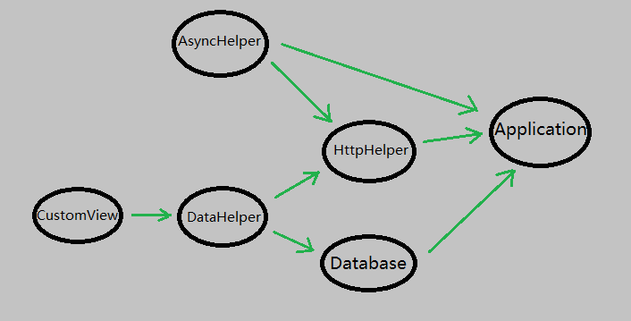

# Dagger的原理分析

如果你还不知道什么是Dagger，务必先看看[这篇文章](https://github.com/android-cn/android-open-project-analysis/tree/master/dagger)。

### 概述

事实上，Dagger这个库的取名不仅仅来自他的本意“匕首”，同时也暗示了它的原理。Jake Wharton在对Dagger的介绍中指出，Dagger即DAG-er，这里的DAG即数据结构中的DAG——有向无环图。也就是说，Dagger是一个**基于有向无环图结构的依赖注入库。**

### DAG（有向无环图）

（已经了解DAG的可以跳过这节。）

DAG是数据结构的一种。在一组节点中，每一个节点指向一个或多个节点，但不存在一条正向的链最终重新指向自己（即不存在环），这样的结构称为有向无环图，即DAG。


上图中的数据结构就是一个有向无环图。图中一共存在6个节点和7个箭头，但任何一个节点都无法从自己发射出的箭头通过某条回路重新指向自己。

### Dagger中依赖注入与DAG的关系

Dagger的运作机制，是运用[APT（Annotation Process Tool）](http://docs.oracle.com/javase/7/docs/technotes/guides/apt/)在编译前生成一些用于设定规则的代码，然后在运行时将这些规则进行动态组合，生成一个（或多个）DAG，然后由DAG来完成所有依赖的获取，实现依赖注入。关于DAG究竟是怎样一步步生成的，后面再讲，这里先说一下在Dagger中依赖注入与DAG的关系。



我把前面那张图的每个节点重新命名，得到了上图。上图代表了某个应用程序内的一整套依赖关系，其中每个箭头都表示两个类之间依赖关系。

可以看出，一个程序中的整套依赖关系其实就是一个DAG。而实际上，Dagger也是这么做的：**预先建立一个DAG，然后在需要获取对象的时候通过这个依赖关系图来获取到对象并返回。**

Dagger是支持传递依赖的。例如在本例中，当需要获取一个CustomView，会首先获取一个DataHelper作为获取CustomView的必要参数；此时如果DataHelper还未初始化，则还要分别拿到HttpHelper和Database用来初始化DataHelper；以此类推。

Dagger不支持循环依赖，即依赖关系图中不能出现环。原因很简单，如果鸡依赖蛋，蛋依赖鸡，谁来创造世界？总有一个要先产生的。

### DAG的具体实现：ObjectGraph

ObjectGraph是Dagger的核心类，它在运行时生成整套依赖关系图，并通过一系列方法获取对象和注入依赖。

```public static ObjectGraph create(Object... modules)```：根据传入的Modules生成依赖关系图。

```public <T> T get(Class<T> type)```：根据传入的class返回相应的对象。

```public <T> T inject(T instance)```：将传入的对象中需要注入依赖的变量全部注入依赖。

```public void injectStatics()```：注入依赖关系图中所有的静态依赖对象（不常用）。

```public void validate()```：检查依赖关系图是否存在问题。可以检查出编译时检查不出的一些问题，例如循环依赖。不过为了性能，应该只在debug时执行这个检查。

```public ObjectGraph plus(Object... modules)```：返回一个新的ObjectGraph，在新的ObjectGraph中加入传入的modules。需要注意的是，这个方法并不会改变当前的ObjectGraph，不过当前ObjectGraph会和新的ObjectGraph共享对象。比如，如果你在当前ObjectGraph中返回过一次@Singleton注解的单例对象，那么你在新ObjectGraph中再次获取，会得到相同的对象。

### Dagger的整体工作流程

1. 编辑前，通过APT找到带有@Module注解的类，生成相应的名为XXX$$ModuleAdapter的帮助类，这些类继承自ModuleAdapter类，用于运行时辅助生成ObjectGraph；同时，找到这些@Module注解中injects参数中的value所对应的每一个类，并为他们一一生成名为YYY$$InjectAdapter的帮助类，这些类继承自Binding类，他们只专注于自己所对应的类的依赖注入。
2. 运行时，需要在合适的地方调用```ObjectGraph.create(Object... modules)```方法来组装依赖关系图。这个方法会根据传入的Modules获取到其对应的ModuleAdapter，并获取到相应的InjectAdapter类。
3. 在需要的时候，你就可以调用```ObjecgGraph```的相应方法实现依赖注入了。实现依赖注入的方法有两个：```ObjectGraph.get(Class<T> type)```方法用于直接获取对象，```ObjectGraph.inject(T instance)```方法用于对指定对象进行成员变量的注入。在这两个方法的调用中，Dagger都会先获取到对应的InjectAdapter对象，然后调用这个InjectAdapter的```get()```方法或```injectMembers()```方法。

### 其他

1. 虽然Dagger使用到了APT，但本项目是原理分析而非源码分析，如果想对APT了解更多，请自行Google。
2. **Dagger的整体工作流程**一节中提到了ModuleAdapter和InjectAdapter这两种辅助类，我在之后会对这两个类给出更详细的分析，如果感兴趣请继续关注。

_Dagger官方介绍：http://square.github.io/dagger/_

_Dagger的github：https://github.com/square/dagger_

_另外，我们公司[友邻小区](http://hiyoulin.com)招聘[Android开发](http://www.lagou.com/jobs/153948.html)一名，地址北京海淀紫竹桥。_

_我的Github地址：https://github.com/rengwuxian_
