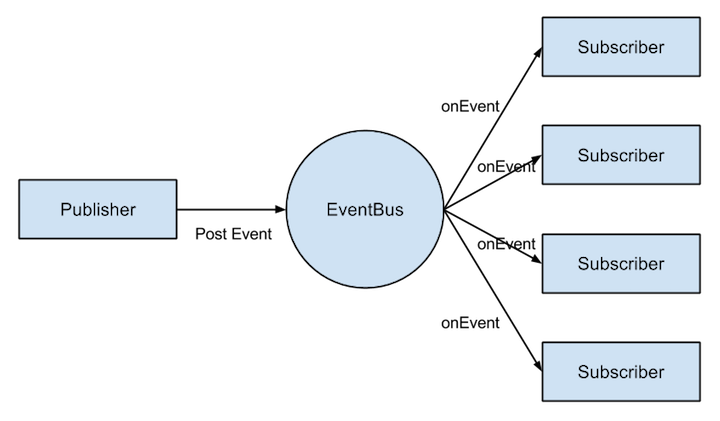
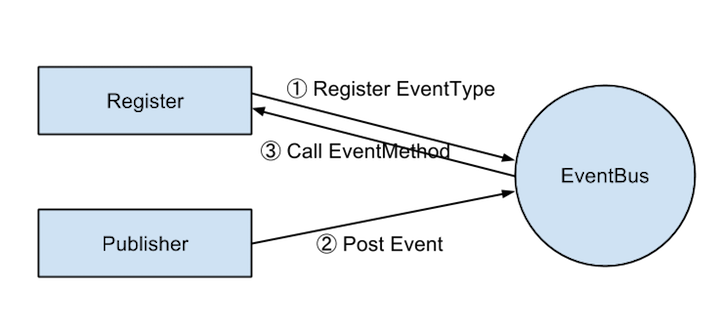
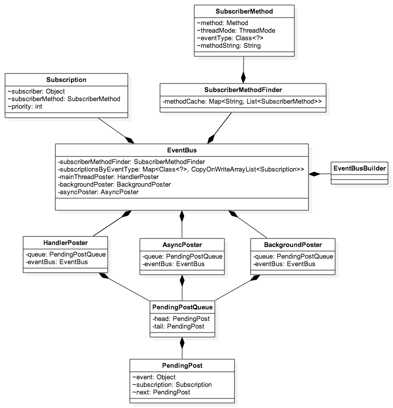

EventBus 源码解析
----------------
> 本文为 [Android 开源项目源码解析](https://github.com/android-cn/android-open-project-analysis) 中 EventBus 部分  
> 项目地址：[EventBus](https://github.com/greenrobot/EventBus)，分析的版本：[ccc2771](https://github.com/greenrobot/EventBus/commit/ccc2771199f958a34bd4ea6c90d0a8c671c2e70a "Commit id is ccc2771199f958a34bd4ea6c90d0a8c671c2e70a")，Demo 地址：[EventBus Demo](https://github.com/android-cn/android-open-project-demo/tree/master/event-bus-demo)    
> 分析者：[Trinea](https://github.com/trinea)，校对者：[扔物线](https://github.com/rengwuxian)，校对状态：完成   

###1. 功能介绍
####1.1 EventBus  
EventBus 是一个 Android 事件发布/订阅框架，通过解耦发布者和订阅者简化 Android 事件传递，这里的事件可以理解为消息，本文中统一称为事件。事件传递既可用于 Android 四大组件间通讯，也可以用户异步线程和主线程间通讯等等。    
传统的事件传递方式包括：Handler、BroadCastReceiver、Interface 回调，相比之下 EventBus 的优点是代码简洁，使用简单，并将事件发布和订阅充分解耦。  

####1.2 概念
**事件(Event)：**又可称为消息，本文中统一用事件表示。其实就是一个对象，可以是网络请求返回的字符串，也可以是某个开关状态等等。`事件类型(EventType)`指事件所属的 Class。  
事件分为一般事件和 Sticky 事件，相对于一般事件，Sticky 事件不同之处在于，当事件发布后，再有订阅者开始订阅该类型事件，依然能收到该类型事件最近一个 Sticky 事件。  

**订阅者(Subscriber)：**订阅某种事件类型的对象。当有发布者发布这类事件后，EventBus 会执行订阅者的 onEvent 函数，这个函数叫`事件响应函数`。订阅者通过 register 接口订阅某个事件类型，unregister 接口退订。订阅者存在优先级，优先级高的订阅者可以取消事件继续向优先级低的订阅者分发，默认所有订阅者优先级都为 0。  

**发布者(Publisher)：**发布某事件的对象，通过 post 接口发布事件。  

###2. 总体设计
本项目较为简单，总体设计请参考`3.1 订阅者、发布者、EventBus 关系图`及`4.1 类关系图`。  

###3. 流程图
####3.1 订阅者、发布者、EventBus 关系图
  
EventBus 负责存储订阅者、事件相关信息，订阅者和发布者都只和 EventBus 关联。  

####3.2 事件响应流程
  
订阅者首先调用 EventBus 的 register 接口订阅某种类型的事件，当发布者通过 post 接口发布该类型的事件时，EventBus 执行调用者的事件响应函数。 

###4. 详细设计
####4.1 类关系图
  
以上是 EventBus 主要类的关系图，从中我们也可以看出大部分类都与 EventBus 直接关联。上部分主要是订阅者相关信息，中间是 EventBus 类，下面是 发布者发布事件后的调用，具体类的功能请看下面的详细介绍。  

####4.2 类详细介绍
#####4.2.1 EventBus.java 
EventBus 类负责所有对外暴露的 API，其中的 register、post、unregister 函数配合上自定义的 EventType 及事件响应函数即可完成核心功能，见 3.2 图。  
EventBus 默认可通过静态函数 getDefault 获取单例，当然有需要也可以通过 EventBusBuilder 或 构造函数新建一个 EventBus，每个新建的 EventBus 发布和订阅事件都是相互隔离的，即一个 EventBus 对象中的发布者发布事件，另一个 EventBus 对象中的订阅者不会收到该订阅。  
EventBus 中对外 API，主要包括两类：  
**(1) register 和 unregister**  
分别表示订阅事件和取消订阅。register 最底层函数有三个参数，分别为订阅者对象、是否是 Sticky 事件、优先级。  
```java
private synchronized void register(Object subscriber, boolean sticky, int priority)
```
PS：在此之前的版本 EventBus 还允许自定义事件响应函数名称，这版本中此功能已经被去除。  
register 函数流程图如下：
  
register 函数中会先根据订阅者类名去`subscriberMethodFinder`中查找当前订阅者所有事件响应函数，然后循环每一个事件响应函数，依次执行下面的 subscribe 函数：  

**(2) subscribe**  
subscribe 函数分三步  
第一步：通过`subscriptionsByEventType`得到该事件类型所有订阅者信息队列，根据优先级将当前订阅者信息插入到订阅者队列`subscriptionsByEventType`中；  
第二步：在`typesBySubscriber`中得到当前订阅者订阅的所有事件队列，将此事件保存到队列`typesBySubscriber`中，用于后续取消订阅；  
第三步：检查这个事件是否是 Sticky 事件，如果是则从`stickyEvents`事件保存队列中取出该事件类型最后一个事件发送给当前订阅者。  

**(3) post、cancel 、removeStickyEvent**  
post 函数用于发布事件，cancel 函数用于取消某订阅者订阅的所有事件类型、removeStickyEvent 函数用于删除 sticky 事件。  
post 函数流程图如下：
  
post 函数会首先得到当前线程的 post 信息`PostingThreadState`，其中包含事件队列，将当前事件添加到其事件队列中，然后循环调用 postSingleEvent 函数发布队列中的每个事件。  

postSingleEvent 函数会先去`eventTypesCache`得到该事件对应类型的的父类及接口类型，没有缓存则查找并插入缓存。循环得到的每个类型和接口，调用 postSingleEventForEventType 函数发布每个事件到每个订阅者。  

postSingleEventForEventType 函数在`subscriptionsByEventType`查找该事件订阅者订阅者队列，调用 postToSubscription 函数向每个订阅者发布事件。  

postToSubscription 函数中会判断订阅者的 ThreadMode，从而决定在什么 Mode 下执行事件响应函数。ThreadMode共有四类：  
1. `PostThread`：默认的 ThreadMode，表示在执行 Post 操作的线程直接调用订阅者的事件响应方法，不论该线程是否为主线程（UI线程）。当该线程为主线程时，响应方法中不能有耗时操作，否则有卡主线程的风险。适用场景：**对于是否在主线程执行无要求，但若 Post 线程为主线程，不能耗时的操作**；  
2. `MainThread`：在主线程中执行响应方法。如果发布线程就是主线程，则直接调用订阅者的事件响应方法，否则通过主线程的 Handler 发送消息在主线程中处理——调用订阅者的事件响应函数。显然，`MainThread`类的方法也不能有耗时操作，以避免卡主线程。适用场景：**必须在主线程执行的操作**；  
3. `BackgroundThread`：在后台线程中执行响应方法。如果发布线程**不是**主线程，则直接调用订阅者的事件响应函数，否则启动**唯一的**后台线程去处理。由于后台线程是唯一的，当事件超过一个的时候，它们会被放在队列中依次执行，因此该类响应方法虽然没有`PostThread`类和`MainThread`类方法对性能敏感，但最好不要有重度耗时的操作或太频繁的轻度耗时操作，以造成其他操作等待。适用场景：*操作轻微耗时且不会过于频繁*，即一般的耗时操作都可以放在这里；  
4. `Async`：不论发布线程是否为主线程，都使用一个空闲线程来处理。和`BackgroundThread`不同的是，`Async`类的所有线程是相互独立的，因此不会出现卡线程的问题。适用场景：*长耗时操作，例如网络访问*。  

**(4) 主要成员变量含义**   
1.`defaultInstance`默认的 EventBus 实例，根据`EventBus.getDefault()`函数得到。  
2.`DEFAULT_BUILDER`默认的 EventBus Builder。  
3.`eventTypesCache`事件对应类型及其父类和实现的接口的缓存，以 eventType 为 key，元素为 Object 的 ArrayList 为 Value，Object 对象为 eventType 的父类或接口。 
4.`subscriptionsByEventType`事件订阅者的保存队列，以 eventType 为 key，元素为`Subscription`的 ArrayList 为 Value，其中`Subscription`为订阅者信息，由 subscriber, subscriberMethod, priority 构成。  
5.`typesBySubscriber`订阅者订阅的事件的保存队列，以 subscriber 为 key，元素为 eventType 的 ArrayList 为 Value。  
6.`stickyEvents`Sticky 事件保存队列，以 eventType 为 key，event 为元素，由此可以看出对于同一个 eventType 最多只会有一个 event 存在。  
7.`currentPostingThreadState`当前线程的 post 信息，包括事件队列、是否正在分发中、是否在主线程、订阅者信息、事件实例、是否取消。  
8.`mainThreadPoster`、`backgroundPoster`、`asyncPoster`事件主线程处理者、事件 Background 处理者、事件异步处理者。  
9.`subscriberMethodFinder`订阅者响应函数信息存储和查找类。  
10.`executorService`异步和 BackGround 处理方式的线程池。  
11.`throwSubscriberException`当调用事件处理函数异常时是否抛出异常，默认为 false，建议通过  
```java
EventBus.builder().throwSubscriberException(true).installDefaultEventBus()
```
打开。   
12.`logSubscriberExceptions`当调用事件处理函数异常时是否打印异常信息，默认为 true。   
13.`logNoSubscriberMessages`当没有订阅者订阅该事件时是否打印日志，默认为 true。  
14.`sendSubscriberExceptionEvent`当调用事件处理函数异常时是否发送 SubscriberExceptionEvent 事件，若此开关打开，订阅者可通过 
```java
public void onEvent(SubscriberExceptionEvent event) 
```  
订阅该事件进行处理，默认为 true。 
15.`sendNoSubscriberEvent`当没有事件处理函数对事件处理时是否发送 NoSubscriberEvent 事件，若此开关打开，订阅者可通过
```java
public void onEvent(NoSubscriberEvent event)
```
订阅该事件进行处理，默认为 true。  
16.`eventInheritance`是否支持事件继承，默认为 true。  

#####4.2.2 EventBusBuilder.java
跟一般 Builder 类似，用于在需要设置参数过多时构造 EventBus。包含的属性也是 EventBus 的一些设置参数，意义见`4.2.1 EventBus.java`的介绍，build 函数用于新建 EventBus 对象，installDefaultEventBus 函数将当前设置应用于 Default EventBus。  

#####4.2.3 SubscriberMethodFinder.java
订阅者响应函数信息存储和查找类，由 HashMap 缓存，以 ${subscriberClassName} 为 key，SubscriberMethod 对象为元素的 ArrayList 为 value。findSubscriberMethods 函数用于查找订阅者响应函数，如果不在缓存中，则遍历自己的每个函数并递归父类查找，查找成功后保存到缓存中。遍历及查找规则为：  
a. 遍历 subscriberClass 每个方法；  
b. 该方法不以`java.`、`javax.`、`android.`这些 SDK 函数开头，并以`onEvent`开头，表示可能是事件响应函数继续，否则检查下一个方法；  
c. 该方法是否是 public 的，并且不是 ABSTRACT、STATIC、BRIDGE、SYNTHETIC 修饰的，满足条件则继续。其中 BRIDGE、SYNTHETIC 为编译器生成的一些函数修饰符；  
d. 该方法是否只有 1 个参数，满足条件则继续；  
e. 该方法名为 `onEvent` 则 threadMode 为`ThreadMode.PostThread`；  
该方法名为 `onEventMainThread` 则 threadMode 为`ThreadMode.MainThread`；  
该方法名为 `onEventBackgroundThread` 则 threadMode 为`ThreadMode.BackgroundThread`；  
该方法名为 `onEventAsync` 则 threadMode 为`ThreadMode.Async`；  
其他情况且不在忽略名单 (skipMethodVerificationForClasses) 中则抛出异常。  
f. 得到该方法唯一的参数即事件类型 eventType，将这个方法、threadMode、eventType 一起构造 SubscriberMethod 对象放到 ArrayList 中。  
g. 回到 b 遍历 subscriberClass 的下一个方法，若方法遍历结束到 h；
h. 回到 a 遍历自己的父类，若父类遍历结束回到 i；  
i. 若 ArrayList 依然为空则抛出异常，否则会将 ArrayList 做为 value，${subscriberClassName} 做为 key 放到缓存 HashMap 中。 
对于事件函数的查找有两个小的性能优化点：  
```xml
a. 第一次查找后保存到了缓存中，即上面介绍的 HashMap  
b. 遇到 java. javax. android. 开头的类会自动停止查找  
```
类中的 skipMethodVerificationForClasses 属性表示跳过哪些类中非法以 `onEvent` 开头的函数检查，若不跳过则会抛出异常。  
PS：在此之前的版本 EventBus 允许自定义事件响应函数名称，缓存的 HashMap key 为 ${subscriberClassName}.${eventMethodName}，这版本中此功能已经被去除。  

#####4.2.4 SubscriberMethod.java
订阅者事件响应函数信息，包括响应方法、线程 Mode、事件类型以及一个用来比较 SubscriberMethod 是否相等的特征值 methodString 共四个变量，其中 methodString 为 ${methodClassName}#${methodName}(${eventTypeClassName}。  
#####4.2.5 Subscription.java
订阅者信息，包括 subscriber 对象、事件响应方法 SubscriberMethod、优先级 priority。  
#####4.2.6 HandlerPoster.jva
事件主线程处理，对应`ThreadMode.MainThread`。继承自 Handler，enqueue 函数将事件放到队列中，并利用 handler 发送 message，handleMessage 函数从队列中取事件，invoke 事件响应函数处理。  
#####4.2.7 AsyncPoster.java
事件异步线程处理，对应`ThreadMode.Async`，继承自 Runnable。enqueue 函数将事件放到队列中，并调用线程池执行当前任务，在 run  函数从队列中取事件，invoke 事件响应函数处理。  
#####4.2.8 BackgroundPoster.java
事件 Background 处理，对应`ThreadMode.BackgroundThread`，继承自 Runnable。enqueue 函数将事件放到队列中，并调用线程池执行当前任务，在 run  函数从队列中取事件，invoke 事件响应函数处理。与 AsyncPoster.java 不同的是，BackgroundPoster中的任务只在同一个线程中依次执行，而不是并发执行。  
#####4.2.9 PendingPost.java
订阅者和事件信息实体类，并含有同一队列中指向下一个对象的指针。通过缓存存储不用的对象，减少下次创建的性能消耗。  
#####4.2.10 PendingPostQueue.java
通过 head 和 tail 指针维护一个`PendingPost`队列。HandlerPoster、AsyncPoster、BackgroundPoster 都包含一个此队列实例，表示各自的订阅者及事件信息队列，在事件到来时进入队列，处理时从队列中取出一个元素进行处理。  
#####4.2.11 SubscriberExceptionEvent.java
当调用事件处理函数异常时发送的 EventBus 内部自定义事件，通过 post 发送，订阅者可自行订阅这类事件进行处理。  
#####4.2.12 NoSubscriberEvent.java
当没有事件处理函数对事件处理时发送的 EventBus 内部自定义事件，通过 post 发送，订阅者可自行订阅这类事件进行处理。  
#####4.2.13 EventBusException.java
封装于 RuntimeException 之上的 Exception，只是覆盖构造函数，相当于一个标记，标记是属于 EventBus 的 Exception。  
#####4.2.14 ThreadMode.java
线程 Mode 枚举类，表示事件响应函数执行线程信息，包括`ThreadMode.PostThread`、`ThreadMode.MainThread`、`ThreadMode.BackgroundThread`、`ThreadMode.Async`四种。  

###5. 与 Otto 对比
等 Otto 分析完成  
