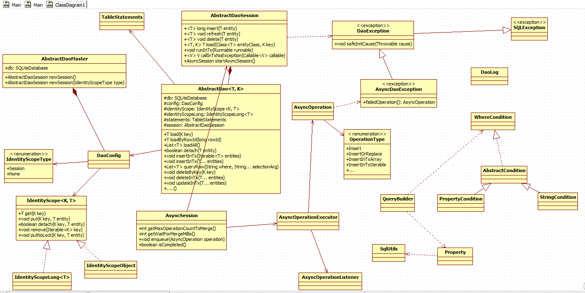

greenDAO 源码解析
----------------
> 本文为 [Android 开源项目实现原理解析](https://github.com/android-cn/android-open-project-analysis) 中 greenDAO 部分  
> 项目地址：[greenDAO](https://github.com/greenrobot/greenDAO)，分析的版本：，Demo 地址：    
> 分析者：[maogy](https://github.com/maogy)，校对者：，校对状态：未完成   

1.功能介绍
1.1greenDao是一个ORM库，将传统数据库操作建表、编写sql语句、使用事务批量处理，都封装到greenDao中，提供方便的面向对象接口，完成数据库操作.库里面还提供异步数据库操作，缓存查找出来的结果.整个代码设计很巧妙，包名和包的功能明确、类名、变量名都非常好理解.整个单元测试代码很完善.

1.2概念
ORM(object-relation mapping，对象关系映射)：是将数据类和一个数据库表对应起来，它其实是创建了一个可在编程语言里使用的“虚拟对象数据库

Entity：实体，对应数据库中的一张表，通过java工程，我们设置属性通过代码来自动生成.

一对多/多对多：entity之间的关系，如订单和消费者是两个entity，一个消费者生成多个订单，是一对多关系，

2.总体设计

3.流程图

4. 详细设计
4.1 类关系图

1.包de.greeenrobot.dao，主要的类
一、DbUtils类
vacuum函数:清除数据库的空闲空间，减少数据库大小
executeSqlScript函数:执行assert目录文件中的sql语句，可以指定是否开启事务执行
readAsset函数：读取assert文件返回byte数组
logTableDump函数：将数据库中指定表的内容输出到debug日志

二、DaoLog类
将系统Log类封装，将tag变量隐藏而已，tag值为greenDao.倒数第二个函数应该是作者写错了，如：Log.w应该是Log.e
``
    public static int e(String msg) {
        return Log.w(TAG, msg);
    }
``

三、AbstractDao类
所有生成代码xxDao的基类，使用泛型，AbstractDao<T, K>其中T是数据库实体（entity）类型，K是主键类型.使用模板模式，来完成crud方法，是抽象类，定义了许多abstract方法，子类来定义它的行为.  
通过DaoConfig和AbstractDaoSession来构造，提供许多crud方法，支持在批处理中执行：
T load(K key)：通过主键值来查找实体结果
T loadByRowId(long rowId):通过行号来查询结果
List<T> loadAll()：加载所有结果
executeInsertInTx：批量插入
....

四、AbstractDaoMaster类
通过SQLiteDatabase和版本号构造，持有SQLiteDatabase对象，保持一个泛型的容器Map<Class<? extends AbstractDao<?, ?>>, DaoConfig> ，做Dao和DaoConfig的缓存,另外加2个抽象方法，给子类来实现

五、AbstractDaoSession类
所有DaoSession的基类，包含一个Map<Class<?>, AbstractDao<?, ?>> entityToDao对象，缓存所有实体类和实体Dao对应关系。因为可以获取Dao，可以做一些crud操作，可以生成异步的session来完成crud操作

六、Property类
对应存入类中的一个属性，对应数据库中一列，用来生成where子句使用。在实体Dao中有引用。

2.de.greenrobot.dao.async包，完成数据库的异步操作，主要的类
一、AsyncOperation类
表示一个将在子线程完成的操作，包含操作的类型、是否成功、操作的Dao、SQLiteDatabase、操作开始和结束时间、是否和其他操作合并、操作唯一号码、操作的实体对象（数组、单个元素或迭代器）

二、AsyncOperationExecutor类
执行数据库操作的类，是runnable对象，还能回调主线程，内部有AsyncOperation类型的阻塞队列，完成数据库操作加入队列、执行操作、结果回调、合并数据库操作等工作。

三、AsyncOperationListener类
数据库异步操作完成后的回调接口

四、AsyncSession类
对外提供的类，可以初始化它，并调用它的异步方法来完成数据库操作的异步执行功能。对它设置回调listen，完成操作后，将整个AsyncOperation回调给界面

3.de.greenrobot.dao.identityscope包
这个包主要是定义一个k-v的缓存组件，定义一些操作缓存的接口,key支持long和object类型，value是entity类型，使用软引用.

一、IdentityScope类
接口类，使用泛型加接口的形式用来派生key为long和key为object的子类，也是实体对象的主键，提供根据主键来查询、删除、插入entity.

二、IdentityScopeLong类
内部有一个锁的成员变量，map使用自定义优化过的LongHashMap，支持带锁操作map和不带锁操作map

三、IdentityScopeObject类
和IdentityScopeLong类似，只是内部使用hashMap，key是object类型

4.de.greenrobot.dao.internal包
里面包含一些内部使用的工具类，
一、DaoConfig类
被AbstractDaoMaster引用。由SQLiteDatabase和AbstractDao的子类来构造，通过这两个参数，反射获取Dao类的属性、主键、主键类型、表名。通过构造方法和Cloneable接口提供创建新对象的方法。

二、FastCursor类
给AbstractDao类的子类使用，快速读取cursor数据。
它实现Cursor接口，重载读取当前游标指向数据的方法（getDouble、getFloat等），提供移动游标函数（），
如move(int offset)、moveToPosition(int position)等，来快速访问Cursor数据。

三、LongHashMap类
给IdentityScopeLong类使用，是自定义的map，针对long类型对map进行优化，例如get、put方法，通过位移运算符来很快完成插入、查找结果

四、SqlUtils类
内部使用,在给AbstractDao类的子类使用，用来帮助创建crud操作的sql语句

五、TableStatements类
greenDao内部使用，给DaoConfig引用，用来给指定的tab创建SQLiteStatement。由DaoConfig传入tab相关的信息来构造，如表名、所有列名、主键名。

5.de.greenrobot.dao.query包
这整个包的作用是使用面向对象的方式来提供可复用的查询对象，用于内部测试

一、AbstractQuery类
一些可以复用的查询基类，返回实体entity，包含泛型T，是entity的类型，包含一些查询必要的参数信息，用于实现子类的查询

二、AbstractQueryData类
辅助类，使用模板方法，来构造AbstractQuery的子类，其中的泛型T是实体类型（entity），Q是需要构造的AbstractQuery子类

三、CountQuery类
AbstractQuery的子类，提供查找数据库符合条件entity的个数

四、DeleteQuery类
AbstractQuery的子类，提供删除符合条件的entity，其中executeDeleteWithoutDetachingEntities方法不会清除identity scope中的缓存

五、Query类
AbstractQuery的子类，提供查找符合条件的entity，以多种形式返回查找结果，如List<entity>、带缓存的LazyList<T>

六、WhereCondition类
用来在查询中构造where子句，使用Dao类中的Property对象构造查询条件

七、QueryBuilder类
构造自定义的查询对象，而不使用sql语句，查询对象内部会生成sql语句，并且在编译时进行语法检查。可以通过AbstractDao.queryBuilder或者AbstractDaoSession.queryBuilder来获取

八、WhereCondition类
内部的接口来构造查询中的where条件，使用DAO类中的Property对象来构造新的查询条件.代码结构是一个接口，加2个实现，分别来构造属性条件和字符串条件
