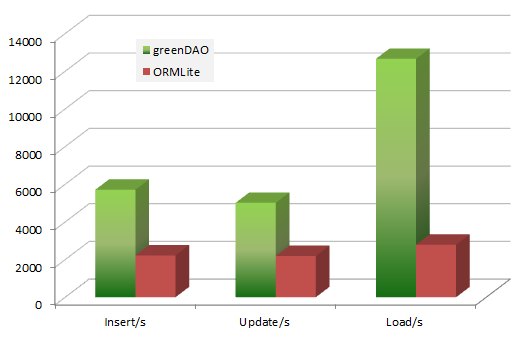
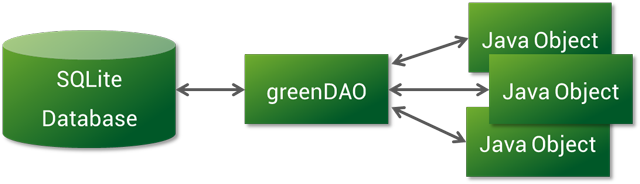
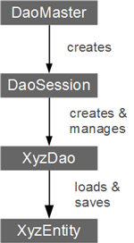
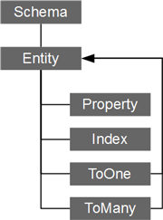

GreenDao 源码解析
----------------
> 本文为 [Android 开源项目实现原理解析](https://github.com/android-cn/android-open-project-analysis) 中 GreenDao 部分  
> 项目地址：[GreenDao](https://github.com/greenrobot/greenDAO)，分析的版本：[07524fc](https://github.com/greenrobot/greenDAO/commit/07524fc2c45426c184110c2d4c78477c224a7f99 "Commit id is 07524fc2c45426c184110c2d4c78477c224a7f99")，Demo 地址：[GreenDao Demo](https://github.com/android-cn/android-open-project-demo/tree/master/greendao-demo)    
> 分析者：[maogy](https://github.com/maogy)，校对者：[Caij](https://github.com/Caij)，校对状态：未完成   

###1. 概述
####1.0 先说下我写这些文字的思路
greenDao开源项目的所有资料在官网上都有描述，而且是最权威的，所以本文有些内容是引用官网翻译过来，官网地址：[greenDao官网](http://greendao-orm.com/)

####1.1 greenDao  
GreenDao帮助android开发者处理数据，将数据存储到sqlite.sqlite是一个极好的嵌入式关系数据库，但基于它开发需要做许多附加的工作.写sql语句和解析查询结果是体力活.greenDao将这些工作为你做完：将java对象映射成数据库表（我们常说的ORM).这样我们可以用简单、面向对象的api来存储、更新、删除和查询java对象.为我们节省时间，将重点放在解决问题上。

###1.2 greenDao设计目标
性能最大化（可能是android上最快的orm库）  
易于使用的api  
对android高度优化  
最小的内存使用  
库大小较小，提供必需的功能

###2.功能
####2.1 ORM（对象关系映射）
greenDao的本质是提供一个面向对象的接口来存储数据到sqlite中.你只需定义数据模型，greenDao会创建java数据对象（entities）和DAOs（数据访问对象）.这样会让你少写许多仅仅是将数据块移来移去的厌烦代码.此外greenDao提供一些高级ORM特性，像session缓存、预先加载、活跃的实体

####2.2 性能
greenDao在性能方面严格把关.数据库很适合存储大量数据，因此速度很关键.使用greenDao，大量的数据可以在每秒几千条的速度下插入、更新和加载.  
和ORMLite比较，同样数量的数据实体，greenDao插入和更新实体的速度是ORMLite的2倍，加载操作要快4.5倍.对典型的应用，加载速度是最重要的.下图是官方提供的，时间：10-23-2011  
  
考虑到greenDao内核一些特性，如session缓存和智能预加载技术，也提升了库的性能

####2.3 较小的库
greenDao的核心库小于100k，因此将greenDao加入到工程不会增加太大APK大小.

####2.4 活跃的数据实体
你可以配置实体（entity）是活跃的，它透明的处理调用关系(你只需要调用getter方法)，通过更新、删除和刷新方法，它来提供便利的保存数据功能.（这段翻译可能不那么好原文:Active entities

If you want, entities can be made “active”: active entities resolve relations transparently (you just call a getter), and have update, delete, and refresh methods for convenient access to persistence functionality.）

####2.5 支持协议缓存（protocol buffers），如google protocol buffer
我理解是有格式的byte数组，greenDao支持类似GPB对象直接存入数据库.如果你和服务器通过GPB传递消息，你不需要另外的映射.所有的增删改查操作都支持GPB对象.这是greenDao的一个特有功能点.

####2.6代码生成
greenDao会生成java数据对象（entity）和DAO对象，DAO对象和数据对象一一对应.

####2.7源码开放
源码放在github上，源码另外也包含JUnit的测试用例，这些用例使用了greenDao的所有功能，因此它是一个很好学习greenDao的方式

###3.使用greenDao
这一小节带你熟悉一个简单的greenDao示例工程，它就是github上的那个.它由两个子工程组成:DaoExample和DaoExampleGenerator.  
DaoExample工程check下来后，可以运行到android设备上，如你看到的，是记录笔记的简单应用.你可以编辑一些文本生成一条记录，通过点击一条记录，来删除它.
####3.1事先生成代码和创建表单
来看一下DaoExample里面的代码，在目录src-gen中，你可以找到一些生成的代码  
1）Note.java是java类，他包含note所有的数据  
2）NoteDao.java是DAO（数据访问对象）类，提供操作Note对象的接口

你可以使用DaoExampleGenerator工程来生成Note和NoteDao.来看DaoExample，使用DaoMaster类，你可以方便的获取SQLiteOpenHelper：  
```
new DaoMaster.DevOpenHelper(this, "notes-db", null)
```  
这样，你不需要编写"CREATE TABLE"的SQL语句.greenDao已经做了这些工作.

####3.2插入和删除notes
从上面代码，我们已经获得一个notes的数据库表，我们可以插入一些notes到数据库.这在NoteActivity中有相关代码.在onCreate中我们创建一个DAO对象  
```
daoMaster = new DaoMaster(db);  
daoSession = daoMaster.newSession();  
noteDao = daoSession.getNoteDao();
```  
再来看下addNote方法，看如何插入一条note到数据库中  
```
Note note = new Note(null, noteText, comment, new Date());
noteDao.insert(note);
Log.d("DaoExample", "Inserted new note, ID: " + note.getId());
```  
创建一个java对象，调用DAO的insert方法.当insert方法返回，刚插入记录的数据库id会赋值给note对象，如log的打印记录可以验证.  
删除一条note也很简单；看一下onListItemClick 方法:  
```
noteDao.deleteByKey(id);
```  
你可以看其他的DAO类中的方法，像loadAll和update

####3.3数据模型和代码生成
如果你想扩展note对象或者创建新的实体，你需要看DaoExampleGenerator工程，里面只有一个类，其中包含定义数据模型的代码:  
```
Schema schema = new Schema(1, "de.greenrobot.daoexample");  
Entity note= schema.addEntity("Note");  
note.addIdProperty();  
note.addStringProperty("text").notNull();  
note.addStringProperty("comment");  
note.addDateProperty("date");  
new DaoGenerator().generateAll(schema, "../DaoExample/src-gen");
```
可以看到，你创建了一个Schema对象，通过他来添加实体（entity），一个实体类对应数据库的一个表.实体包含属性，一个属性对应数据库表的一列.  
完成schema的定义后，你可以触发生成代码.这样可以生成类似Note.java和NoteDao.java的文件.  

###4.介绍
  
greenDao是android上的一个对象/关系映射(ORM)工具，它提供面向对象的接口来使用关系型数据库sqlite.类似greenDao的ORM工具为你做完了许多重复的工作（原本是你来写这些重复代码），并为你的数据提供简单的接口.

####4.1DAO相关类的生成工程
  
为了在你的android工程里面使用greenDao，你需要创建第二个工程，“代码生成”工程，它的任务是生成你工程对应的数据库操作类.这个代码生成工程，是一个java工程（不是andorid工程）.确保greenDAO-generator.jar和Freemarker两个jar包已经导入到工程中.创建一个可运行的java类，定义你的实体类，运行生成代码.

####4.2生成的核心类
代码生成完成后，你可以在你android工程中使用greenDao.不要忘了包含greenDao的jar包(greenDao.jar).  
  

**DaoMaster:**使用greenDao的入口点.DaoMaster保存了一个数据库对象（SQLiteDatabase）并管理实体对应的DAO类(不是对象).它提供静态方法来创建或删除表.它的内部类OpenHelper和DevOpenHelper继承了SQLiteOpenHelper，它们创建数据库表.

**DaoSession:**管理所有的实体相关的DAO对象，你可以通过getter方法获取DAO对象.它也提供通用的接口insert、update、refresh和delete来操作entity.最后，DaoSession对象和标识范围（identity scope）保持联系

**Daos:**保存和查询实体的数据访问对象，对每个实体，greenDao都会生成一个Dao，它比DaoSession有更多的保存方法，例如：count，loadAl和insertInTx.

**Entities：**可保存的对象，通常实体类的代码是通过java工程生成的（你也可以选择手动生成），实体对象对应数据库的一行，且数据成员变量使用标准的java属性（如POJO或者JavaBean）

####4.3.核心库的初始化
下面示例代码说明了如何初始化数据库和greenDao的核心库
```
helper = new DaoMaster.DevOpenHelper(this, "notes-db", null);
db = helper.getWritableDatabase();
daoMaster = new DaoMaster(db);
daoSession = daoMaster.newSession();
noteDao = daoSession.getNoteDao();
```
这个例子假定我们有一个Note实体类和他的DAO（noteDao对象），这样我们就可以调用它的保存方法

###5.构造实体类
使用greenDao的第一步是创建实体模型来表示你应用中的数据.在这个模型的基础上，greenDao生成java代码  

这个模型本身是使用java代码来定义.很简单：创建一个依赖于"DaoExampleGenerator"项目的java工程.这个工程在第三点有说明.  
  
上面的插图描述了实体可能包含的所有元素.他们用来描述你问题域的特定模型.

####5.1Schema类
实体属于一个schema对象.它是你首先要定义的对象.传入schema版本号和默认java包名来构造一个schema对象：
```
Schema schema = new Schema(1, "de.greenrobot.daoexample");
```
默认java包名在greenDao生成实体类、Dao类和测试类时候需要使用.这些参数可以按你需求修改，这样你就完成了第一步.  
如果你想将DAO相关类和测试的类放到不同的包中，你可以重新定义schema类，如下：
```
schema.setDefaultJavaPackageTest("de.greenrobot.daoexample.test");
schema.setDefaultJavaPackageDao("de.greenrobot.daoexample.dao");
```
schema类中，有两个标识和实体创建相关，他们可以被重写.分别标识实体是不是active，是不是"保留修改".这些特性目前还没文档化;在发布的test工程源码中有示例：
```
schema2.enableKeepSectionsByDefault();
schema2.enableActiveEntitiesByDefault();
```

####5.2实体类
你获取schema对象后，就可以往里面添加实体：  
```
Entity user = schema.addEntity("User");
```  
实体提供一些方法来改变它的默认设置，最重要的是它提供添加属性的方法
```
user.addIdProperty();
user.addStringProperty("name");
user.addStringProperty("password");
user.addIntProperty("yearOfBirth");
```  
除了属性外，你可以给实体添加一对一、一对多的关系

####5.3属性和主键
前面段落给你展现了怎么添加属性到实体.实体类的addXXXProperty函数返回一个PropertyBuilder对象，它可以用来配置属性.例如使用columnName方法来覆盖默认的列名，定义自己的列名.如果需要获取属性来创建索引和关系，调用PropertyBuilder的getProperty()方法获取属性.

####5.4目前主键的限制条件
目前，实体类必须有一个long或者Long类型的属性作为主键.这是android和SQLite推荐的做法.greenDao将来会处理主键是任意类型的情况，但现在这些还没做.如果碰到这种情况，你可以使用一个long类型主键和一个唯一的索引来作为替代方案.

####5.5默认值
greenDao尽量提供合理的默认值，这样开发者不必要配置每一个配置项.例如数据库的表名和列名是从实体和属性的名字继承过来的.和java里面的驼峰命名不一样，默认的数据库名是用下划线分隔开的大写字母组成.例如，属性名字“creationData”对应数据库的列名“CREATION_DATE”

####5.6表间关系
一对一和一对多的关系在下面的单独章节描述

####5.7继承、接口和序列化
数据库对应的实体可以从其他不是数据库实体的类继承而来.他的父类由函数setSuperclass(String)来指定.注意：目前不能以另一个实体做为父类（也没有多态的查询）.例如  
```
myEntity.setSuperclass("MyCommonBehavior");
```  
我们最好使用接口作为实体属性和行为的公共基类.例如，如果实体A和B共有一系列属性，这些属性和getters、setters方法可以定义到接口C.如下面的代码，第三行是使B可序列化：  
```
entityA.implementsInterface("C");
entityB.implementsInterface("C");
entityB.implementsSerializable();
```

####5.8触发生成实体类（EntityDAO.java和Entity.java）
完成schema定义完实体类的代码后，你就可以触发生成代码了.在代码生成工程（这工程师java工程，有一个入口函数static main（）方法），你需要初始化DaoGenerator并调用其中一个generateAll方法：
```
DaoGenerator daoGenerator = new DaoGenerator();
daoGenerator.generateAll(schema, "../MyProject/src-gen");
```  
如上面代码，你要做的是提供一个schema对象和目标目录，目标目录是一个典型的android工程源码文件夹.如果想把测试类放到其他目录，可以指定测试目录路径作为第三个参数.

####5.9保存生成类的修改记录
实体类会在每次代码生成后被覆盖掉.为了允许添加自定义的代码到实体类中，greenDao有"keep"段落.为了使keep段落生效，在schema添加实体时候对schema使用函数enableKeepSectionsByDefault()，或者对实体类调用setHasKeepSections(true).一旦启用，三个keep代码段会在实体类中生成:
```
// KEEP INCLUDES - put your custom includes here
// KEEP INCLUDES END
...
// KEEP FIELDS - put your custom fields here
// KEEP FIELDS END
...
// KEEP METHODS - put your custom methods here
// KEEP METHODS END
```
现在你可以将你自定义的代码放到keep[...]和keep[...]END之间.注意不要修改keep注释.在keepBegin和keepEnd之间的代码会在下次生成时候保留下来.对生成代码做备份或提交到svn来避免意外出错的情况是一个不错的做法.

###6.查询
查询接口返回符合指定条件的实体对象集合.你可以使用SQL组织你的查询语句，或者采用更好的方法，使用greenDao的QueryBuilder API.greenDao的查询也支持延迟加载结果，当结果集很大的时候，它会节省内存和提高性能.

####6.1QueryBuilder
QueryBuilder类让你不需要写SQL来构建查询条件.写SQL大多数人都不喜欢，并且容易出错，因为它需要在运行时才能反馈错误.QueryBuilder容易使用并且不需要写SQL.使用它，相比只想代码不容易产生bug，它的语法在编译时候就会检查完.以greenDao为基础的代码生成的方法，使编译时的检查项能包括每一个属性的引用.  
**例如：**查询以Joe为名，以姓排序的所有用户.
```
List joes = userDao.queryBuilder()
.where(Properties.FirstName.eq("Joe"))
.orderAsc(Properties.LastName)
.list();
``` 

**嵌套条件的例子：**获取出生在1970年10月以后名为Joe的所有用户.
我们将用户生日对应到实体的年、月、日属性.我们使用更正式的形式将查询条件表达为：名是Joe AND(生日的年份大于1970 OR(生日的年是1970 AND 生日的月等于或大于10))
```
QueryBuilder qb = userDao.queryBuilder();
qb.where(Properties.FirstName.eq("Joe"),
qb.or(Properties.YearOfBirth.gt(1970),
qb.and(Properties.YearOfBirth.eq(1970), Properties.MonthOfBirth.ge(10))));
List youngJoes = qb.list();
```

####6.2Query类和LazyList类
Query类对象代表一个可以被多次执行的查询.当你使用QueryBuilder中的一个方法来获取结果(如一个list()方法)，QueryBuilder内部使用Query类.如果你要以相同的条件多次查询，你可以调用QueryBuilder的build()方法来产生一个Query，不需要执行它.  
greenDao支持唯一结果(0或1个结果)、和多个结果的查询.如果你期望唯一的结果，调用Query或者QueryBuilder的unique()方法，它会给你唯一的结果或者null(如果没有找到匹配的实体).如果你的情况不允许null作为结果，调用uniqueOrThrow()，它会保证返回非空的实体(如果没有匹配的结果，它会抛出DaoException异常).  
如果查询时你期望返回多个结果，你可以调用list...中的一个方法：

:--:|:--:  
list()|所有实体加载到内存.结果是一个典型的ArrayList.容易使用  
listLazy()|实体根据需要加载到内存.一旦列表中一个元素被使用，这个元素会被加载和缓存起来，给后续重复使用.使用完后需要关闭
listLazyUncached()|一个虚拟的实体列表:任何请求列表中的元素将会触发从数据库加载数据.使用后必须关闭
listIterator()|让你使用迭代器来遍历结果集，它根据需要加载数据(延迟加载).数据没有缓存，使用后必须关闭


listLazy、listLazyUncached和listIterator 使用了greenDao的LazyList类.为了使用时才加载数据，它保存了数据库游标的引用.这也是使用后必须调用关闭方法的原因(一般在try/finally代码块中关闭).一旦所有的元素被访问或遍历到,listLazy()返回有缓存、延迟加载列表和listIterator()返回的延迟加载迭代器会自动关闭数据库游标.如果数据的访问过早的结束了(没有遍历完全)，那么关闭数据库游标是你要做的的工作.

####6.3使用Queries进行多次查询
一旦你使用QueryBuilder构造了一个query，这个query对象后续可以重复使用，来执行查询.这比总是创建新的Query对象要更有效.如果查询条件没有变，你只需要再次调用其中一个list/unique方法.如果参数有改变，你必须对改变的参数调用setParameter方法.目前，各个参数以0开始的索引来区分.对应你传入参数到QueryBuilder的索引.  
下面的例子使用Query对象来查询"名"为Joe，出生在1970年的用于：
```
Query query = userDao.queryBuilder().where(
Properties.FirstName.eq("Joe"), Properties.YearOfBirth.eq(1970))
.build();
List joesOf1970 = query.list();
```
使用这个Query对象，我们查找名为Marias，出生在1977年的用户：
```
query.setParameter(0, "Maria");
query.setParameter(1, 1977);
List mariasOf1977 = query.list();
```

####6.4在多线程中执行查询
如果你想在多线程中使用查询，你必须对query对象调用forCurrentThread()方法来获取一个当前线程的Query实例.从greenDao1.3以后，Query的实例对象绑定到构建query的线程中.这样，你可以安全的对Query对象设置参数而不受其他线程的干扰.如果其他线程试图对query对象设置参数或者执行绑定在其他线程的查询，greenDao会抛出异常.这样，你就不需要使用同步语句.事实上，我们应该避免使用锁，因为如果并发事务使用同一个Query对象，它会导致死锁.  
为了完全避免潜在的死锁，greenDao1.3引入了forCurrentThread()函数.它会返回本线程的Query实例，它在当前线程可以安全的使用.每次调用forCurrentThread()，传入的参数和使用QueryBuilder构造Query的参数一致.

####6.5原始查询
获取数据，有两种方法来执行原始的SQL.比较好的方法是使用QueryBuilder和WhereCondition.StringCondition. 使用它，你可以向QueryBuilder传入任何的SQL WHERE子句片段.下面的代码是一个笨拙的方法，它让你使用一个select子句来起到join的效果
```
Query query = userDao.queryBuilder().where(
new StringCondition("_ID IN " +
"(SELECT USER_ID FROM USER_MESSAGE WHERE READ_FLAG = 0)").build();
```
碰到QueryBuilder没有提供你需要的特性时(例如上面的join关键字)，你可以回到原始的查询语句或者原始查询语句的构造方法.他们允许传入原始SQL字符串，追加到SELECT + 实体列名后面.通过这种方法，你可以拼好任意WHERE和ORDER BY子句，来查询数据库中的对象.实体表名用别名"T"来称呼：  
下面的例子展示了如何使用join创建query对象，它查找组名为"admin"的用户群.
```
Query query = userDao.queryRawCreate(
  ", GROUP G WHERE G.NAME=? AND T.GROUP_ID=G._ID", "admin");
```  
_注意:_你可以使用生成的常量来指向表和列名.这是推荐的做法，它可以避免错别字，因为编译器会检查名字.在实体对应的Dao类中,你会找到TABLENAME，它持有数据库表的名字.Dao类中还有一个Properties内部类
，包含所有的属性常量(对应数据库列名).

####6.6删除查询
批量删除会删除符合条件的实体.想要行批量删除，需要创建一个QueryBuilder，调用它的buildDelete方法，执行返回的DeleteQuery.这部分的api将来可以会修改，例如，会添加便利的方法.记住，批量删除目前不会影响identity scope中的实体，例如实体已经有缓存并且是调用传入ID来获取的函数，你可以"复活"他们.如果这里给你的情况带来一些问题，你可以考虑清除identity scope.

####6.7查找查询中的问题
你的查询没有返回你期望的值？这里有2个静态的标识，一个是将sql语句打印出来，一个是将传入QueryBuilder的参数打印出来：
```
QueryBuilder.LOG_SQL = true;
QueryBuilder.LOG_VALUES = true;
```  
这些日志会记录生成的sql命令和调用build()方法传入的参数.这样你可以对比他们是不是你预期的.这也帮助你们拷贝sql语句到其他数据库浏览工具，并执行他们获取结果。

###7.Sessions（DaoSession类）
生成的DaoSession类是greenDao提供的核心接口之一.作为开始，DaoSession提供开发者一些基础的实体操作方法，也提供DAOs来获取更完整的数据库操作接口.Session还管理一个和实体对应的identity scope.

####7.1DaoMaster和DaoSession
如第三点文档中提到的，你需要创建一个DaoMaster来获取DaoSession：  
```
daoMaster = new DaoMaster(db);
daoSession = daoMaster.newSession();
noteDao = daoSession.getNoteDao();
```  
注意，数据库连接属于DaoMaster，因此多个session指向相同的数据库连接.新的session可以快速的创建出来.然而，每一个session都需要占内存，一般里面有一个对应实体的session缓存.

####7.2Identity scope和session缓存(session “cache”)
如果你有两个查询，返回相同的数据库对象，那它创建了多少个java对象；1个还是2个？它由identity scope来决定.greenDao默认的(这个行为可以配置)是多个请求返回相同的java对象.例如，加载一个USER表中ID为42的用户对象对每一次请求会返回相同的Java对象.  
这样做一个很好的作用是，如果一个实体任然在内存中(greenDao这里使用软引用)，实体将不会使用数据库的值来重新构建.例如，如果你通过ID加载一个实体，而且这个实体以前被加载过，greenDao不需要查询数据库.而是从session缓存中直接返回，这样速度会高出一两个数量级.这种思想类似Hibernate 的session. 

###8.实体之间的关系
数据库表有可能是1对1，1对多或多对多的关系.如果你对数据库关系不了解，在我们讨论ORM特性之前，最好先补充相关的知识.  
greenDao中，实体关系用1对1或1对多来表示.例如，如果你要在greenDao上构建一个1对多的关系，你必须要先有两个实体类，他们彼此间还没有联系，你需要更新他们两个实体.  

####8.1构造1对1关系
在greenDao的代码生成工程中，你必须构造一个属性作为外键，使用这个属性，你可以使用Entity.addToOne()添加1对1关系.  
例如：一个用户有一张图片.  
```
// The variables "user" and "picture" are just regular entities
Property pictureIdProperty = user.addLongProperty("pictureId").getProperty();
user.addToOne(picture, pictureIdProperty);
```  
这样，一个用户实体将有一个Picture属性(getPicture/setPicture)，你可以直接使用Picture对象.  
1对1的getter方法第一次获取目标实体是以懒加载的方式.后续的获取请求会直接返回上次得到的对象.  
注意，外键属性("pictureId")和实体对象属性("picture")是联系在一起了.如果你改变pictureId，下一次调用getPicture()函数会得到和新Id对应的Pciture实体.同时，如果你设置一个新的图片实体，图片id属性也会同时更新.  
greenDao也支持预加载1对1关系.它会通过一次数据库查询，加载一个实体的所有1对1关系.如果许多地方需要使用1对1关系，这对性能是极大的提升.目前，你使用greenDao的loadDeep和queryDeep函数来使用这个特性(将来可能会改变).  
####8.2关系名和多重关系
每一个关系都有一个名字，它和生成实体中的一个属性对应.默认的名字是目标实体的类名.使用setName方法，这个名字可以被重写.记住，如果一个实体和同一个目标实体有多重关系，默认的名字不是唯一的.这种情况你必须显式指定关系的名字.  
让我们展开前面的例子，假设用户还有一张缩略图.因为主图片和缩略图都指向相同的实体Picture，这回有名字冲突.因此我们将后者的关系命名为"thumbnail"：  
```
Property pictureIdProperty = user.addLongProperty("pictureId").getProperty();
Property thumbnailIdProperty = user.addLongProperty("thumbnailId").getProperty();
user.addToOne(picture, pictureIdProperty);
user.addToOne(picture, thumbnailIdProperty, "thumbnail");
```  
####8.3构造1对多关系
除了外键放置在目的表中，1对多关系的构造类似1对1关系.我们来看下顾客/订单的例子.一个顾客会产生多个订单，因此这里有一个1对多的关系.在数据库中，我们在订单表中添加一个顾客ID的列，来创建1对多的关系.这样，我们可以使用顾客的ID，查询顾客所有的订单.  
greenDao中，构造1对多的关系和数据库构造1对多的方法非常类似.第一步，你需要在目标实体中添加一个属性来指向1对多的源头实体.接着，使用刚添加在目标实体的属性，对源头实体添加1对多的关系.  
假设我们有一个顾客和订单实体，我们要把订单和顾客联系起来.下面的代码给顾客实体添加1对多的关系  
```
Property customerId = order.addLongProperty("customerId").notNull().getProperty();
ToMany customerToOrders = customer.addToMany(order, customerId);
customerToOrders.setName("orders"); // Optional
customerToOrders.orderAsc(orderDate); // Optional
```  
像这样，我们可以简单的调用生成的顾客类中getOrders()方法来获取订单：  
`List orders = customer.getOrders(); `  
####8.4获取和更新1对多关系
1对多的关系第一次请求的时候是懒加载.之后，相关的实体被缓存在源头实体里面一个List对象中.后续调用关系的get方法不再请求数据库.  
注意，更新1对多关系需要一些二外工作.因为1对多关系会缓存起来，当相关的实体加入数据库时，他们没有被更新.下面的代码说明了这种情况:  
```  
List orders1 = customer.getOrders();
int size1 = orders1.size();
Order order = new Order();
order.setCustomerId(customer.getId());
daoSession.insert(order);
Listorders2 = customer.getOrders();
// size1 == orders2.size(); // NOT updated
// orders1 == orders2; // SAME list object
```  
因为缓存，你要手动的添加新的关系到源头实体的List中，下面是1对多关系实体进行插入新关系(例如顾客新增一个订单):  
1. 获取1对多的java List(这个必须在保存新实体前完成，因为我们并不知道我们得到的刷新结果是不是从缓存中获取的，这样做的话，我们知道它已经缓存了)  
2. 创建一个新的实体对象(它是'多'的一方，如order)  
3. 设置新实体对象的外键，它对应'1'的一方(如顾客)  
4. 使用insert保存新的对象.  
5. 添加新对象到1对多的java List中.  
示例代码:  
```
List orders = customer.getOrders();
newOrder.setCustomerId(customer.getId());
daoSession.insert(newOrder);
orders.add(newOrder);
```
注意，getOrders方法在insert之前来保证list被缓存了.如果getOrder函数放在insert之后，当订单之前没有被被缓存的话，newOrder会在list中出现两次.  
同样的，你可以删除相关的实体:  
```
List orders = customer.getOrders();
daoSession.delete(newOrder);
orders.remove(newOrder);
```  
有时候，在相关的实体被加入或移除后，手动更新所有1对多关系很繁琐甚至不可能.幸好，greenDao有重置的方法来清理List缓存.如果1对多关系有改变的可能，你可以强制greenDao重新加载相关实体的列表：  
```
customer.resetOrders();
List orders2 = customer.getOrders();
```  
 
####8.5双向的1对多关系(顾客实体获取订单，订单实体可以获取顾客)
有时候你需要操作双向的1对多关系.在greenDao中，你需要添加1对1和1对多关系来达到目的.使用前面提到的例子，下面的代码展示了构造顾客和订单实体的完整过程.这次，我们使用顾客Id属性来创建两个对应关系.  
```
Entity customer = schema.addEntity("Customer");
customer.addIdProperty();
customer.addStringProperty("name").notNull();
Entity order = schema.addEntity("Order");
order.setTableName("ORDERS"); // "ORDER" is a reserved keyword
order.addIdProperty();
Property orderDate = order.addDateProperty("date").getProperty();
Property customerId = order.addLongProperty("customerId").notNull().getProperty();
order.addToOne(customer, customerId);
ToMany customerToOrders = customer.addToMany(order, customerId);
customerToOrders.setName("orders");
customerToOrders.orderAsc(orderDate);
```  
假设我们有一个订单实体.使用交叉对应关系.我们可以获取顾客和所有顾客产生的订单:  
`List allOrdersOfCustomer = order.getCustomer().getOrders();`  
####8.6多对多关系
在数据库中，多对多关系使用联合表来构建.联合表保存拥有指向关系表外键作为列的实体.然而greenDao目前不直接支持多对多关系，你可以构造联合表作为一个独立的实体.事实上，你经常构建带附加属性的"关系实体"，因此你可能都会这么做.在以后的发布版本中，greenDao可能引入对多对多关系的直接支持.  
####8.7构建树形关系(例子)
你可以构建一个实体，它拥有一对一和一对多的关系，并且都指向自身，来构造树形关系:  
```
Entity treeEntity = schema.addEntity("TreeEntity");
treeEntity.addIdProperty();
Property parentIdProperty = treeEntity.addLongProperty("parentId").getProperty();
treeEntity.addToOne(treeEntity, parentIdProperty).setName("parent");
treeEntity.addToMany(treeEntity, parentIdProperty).setName("children");
```
生成的实体让你操作他的父和子实体.  
```
TreeEntity parent = child.getParent();
List grandChildren = child.getChildren();
```  


  


