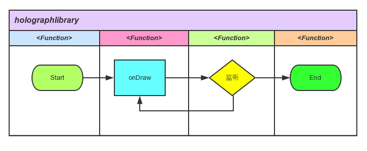
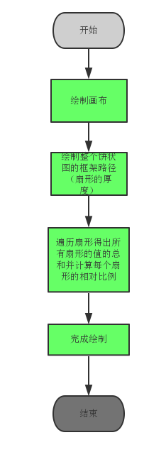

HoloGraphLibrary 实现原理解析
====================================
> 本文为 [Android 开源项目实现原理解析](https://github.com/android-cn/android-open-project-analysis) 中 HoloGraphLibrary部分  
> 项目地址：[HoloGraphLibrary](https://github.com/Androguide/HoloGraphLibrary)，分析的版本：[ccc2771](https://github.com/Androguide/HoloGraphLibrary/commit/028cd2ae6916308bbb96472aafa9ecd8b1343d5c"Commit id is 28cd2ae6916308bbb96472aafa9ecd8b1343d5c")，Demo 地址：[HoloGraphLibrary Demo](https://github.com/android-cn/android-open-project-demo/tree/master/holo-graph-library-demo)    
> 分析者：[AaronPlay](https://github.com/AaronPlay)，校对者：[lightSky](https://github.com/lightSky)，校对状态：完成   


###1. 功能介绍  
 
HoloGraphLibrary是一个专注于常用制图控件的开源项目，扩展了一些常用的基本绘图类型，包括折线图，饼状图以及柱状图。

优点：图形设计友好，使用方便。

###2. 总体设计
本项目较为简单，总体设计请参考4.1类关系图。 

###3. 流程图
本项目的每个控件的流程较为类似，可以抽象成一个流程图来理解。



###4. 详细设计

###4.1 类关系图
 


###4.2 核心类功能介绍
 
####4.2.1柱状图：
Bar.java:用于表现一个柱体，构成柱状图的基本元素。封装了颜色，名字，BarStackSegment（下文将会涉及）数组等属性。若需要对Bar的每一个片段进行控制，通过改变BarStackSegment的数组即可。

BarStackSegment.java:  一般来说，一个柱体用于展示一个类型的数据，而BarStackSegment是作为柱体的扩展部分，用在同一个柱体上有展现多个不同区间的数据。

BarGraph.java:继承View类，负责柱状图的绘制。

- onDraw的流程图：


- onDraw源码分析

```java

        public void onDraw(Canvas ca) {
                    ...
                    
                    //柱体的样式定义
                    float maxValue = 0;
                    float padding = 7;
                    int selectPadding = 4;
                    float bottomPadding = 40;
        
                    //定义绘制柱体的区间
                    float usableHeight;
                    if (showBarText) {
                        this.p.setTextSize(40);
                        this.p.getTextBounds(unit, 0, 1, r3);
                        usableHeight = getHeight() - bottomPadding - Math.abs(r3.top - r3.bottom) - 26;
                    } else {
                        usableHeight = getHeight() - bottomPadding;
                    }
                    
                    ...                    
                    
                    //绘制柱体
                    int count = 0;
                    for (Bar p : points) {
                        //绘制每个柱体里的自定义区间
                        if(p.getStackedBar()){
                                 ...
                            }
                        }else {
                            //若没有自定义区间，则正常绘制
                            ...
                        }
                        
                        ...
            }
                
```

####4.2.2饼状图
PieSlice.java: 扇形，构成饼状图的基本元素。封装了颜色，值，标题，路径以及区域等属性。

PieGraph.java:继承View类, 负责绘制饼状图。

- onDraw的流程图：



####4.2.3折线图：
LinePoint.java：折线的最基本元素，两点构成一条直线，属性包括二维坐标，路径以及区域等属性。

Line.java : 由点构成线，里面封装了一个包含LinePoint的数组。

LineGraph.java: 继承View类，负责折线图的绘制。

- onDraw的流程图：


###5. 杂谈
对于控件类的开源库，可以把重点放在与用户交互关联的触发器上。而这个开源库，也有开发者fork之后扩展得更加有趣。[->链接](https://bitbucket.org/danielnadeau/holographlibrary)

**延伸：**

关于View绘制的原理请浏览：[View 绘制流程](../tech/viewdrawflow.md)


