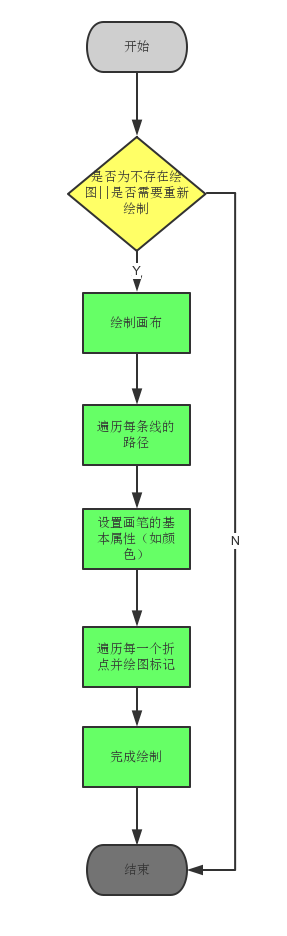

HoloGraphLibrary 源码解析
====================================
> 本文为 [Android 开源项目源码解析](https://github.com/android-cn/android-open-project-analysis) 中 HoloGraphLibrary 部分  
> 项目地址：[HoloGraphLibrary](https://github.com/Androguide/HoloGraphLibrary)，分析的版本：[028cd2a](https://github.com/Androguide/HoloGraphLibrary/commit/028cd2ae6916308bbb96472aafa9ecd8b1343d5c "Commit id is 028cd2ae6916308bbb96472aafa9ecd8b1343d5c")，Demo 地址：[HoloGraphLibrary Demo](https://github.com/android-cn/android-open-project-demo/tree/master/holo-graph-library-demo)    
> 分析者：[AaronPlay](https://github.com/AaronPlay)，校对者：[lightSky](https://github.com/lightSky)，校对状态：完成   

###1. 功能介绍  
HoloGraphLibrary 是一个可用于绘制图表的项目，支持绘制线状图、柱状图、饼状图。  

优点：图形设计友好，使用方便。  

###2. 总体设计
本项目较为简单，总体设计请参考`4.1类关系图`。 

###3. 流程图
本项目的每个控件的流程较为类似，可以抽象成一个流程图来理解。  
  

###4. 详细设计
####4.1 类关系图
  
其中`LineGraph`、`BarGraph`、`PieGraph`分别对应线状图、柱状图、饼状图控件。  
其他除 View 以外的类都表示封装的数据。  

####4.2 核心类功能介绍
#####4.2.1 柱状图：
`Bar.java`：用于表现一个柱体，构成柱状图的基本元素。封装了颜色，名字，`BarStackSegment`（下文将会涉及）数组等属性。若需要对`Bar`的每一个片段进行控制，改变`BarStackSegment`数组属性即可。  

`BarStackSegment.java`：一般来说，一个柱体用于展示一个类型的数据，而`BarStackSegment`是作为柱体的扩展部分，用在同一个柱体上不同区间展示不同数据。  

`BarGraph.java`：继承`View`类，表示柱状图控件，通过数据绘制负责柱状图。  

(1). onDraw 流程图  
  

(2). onDraw 源码分析  
a. 绘制的样式定义（柱体颜色、宽度大小等属性）  
```java
public void onDraw(Canvas ca) {
    ...
    
    // 柱体的样式定义
    float maxValue = 0;
    float padding = 7;
    int selectPadding = 4;
    float bottomPadding = 40;

    // 定义绘制柱体的区间
    float usableHeight;
    if (showBarText) {
        this.p.setTextSize(40);
        this.p.getTextBounds(unit, 0, 1, r3);
        usableHeight = getHeight() - bottomPadding - Math.abs(r3.top - r3.bottom) - 26;
    } else {
        usableHeight = getHeight() - bottomPadding;
    }
    
    ...                    
    
    // 绘制柱体
    int count = 0;
    for (Bar p : points) {
        // 绘制每个柱体里的自定义区间
        if(p.getStackedBar()){
                 ...
        }else {
            // 若没有自定义区间，则正常绘制
            ...
        }
    }    
    ...
}            
```

b. 绘制计算过程（详细看源码）  
1）绘制 X 轴  
2）确定柱体的数量  
3）计算柱体所需的宽度  
4）如果使用动画，柱体最大值（影响绘画的高度）使用动态计算的最大值  
5）计算 X 轴上标签的字体的大小（不考虑动画状态，否则会导致字体抖动）  
6）设置柱体边界  
7）绘制柱体  
8）创建选择区域  
9）绘制标签  
10）绘制柱体顶部的文字  
11）限制总体宽度，防止弹出  
12）若有使用后，设置监听，对进行动画更新  

#####4.2.2 饼状图
`PieSlice.java`：扇形，构成饼状图的基本元素。封装了颜色，值，标题，路径以及区域等属性。  

`PieGraph.java`：：继承`View`类，表示饼状图控件，通过数据绘制负责饼状图。  

(1). onDraw 流程图  
  

(2). 绘制计算过程（详细看源码）  
1）若有背景图片，设置背景图片  
2）设置扇形的开始的位置，大小，圆心  
3）计算不同的扇形的大小，从上次结束的位置进行绘制，记录好该扇形结束的位置。重复此步骤，直到所有扇形绘制完成  

#####4.2.3 折线图：
`LinePoint.java`：折线的最基本元素，两点构成一条直线，属性包括二维坐标，路径以及区域等属性。  

`Line.java`：由点构成线，里面封装了一个包含`LinePoint`的数组。  

`LineGraph.java`：：继承`View`类，表示折线图控件，通过数据绘制负责折线图。  
(1). onDraw 流程图  
  

(2). 绘制计算过程（详细看源码）  
1）若需要填充，先对整个绘制范围内进行直线绘制，然后擦除折线以上的直线  
2）绘制 X 轴  
3）绘制折线  
4）绘制折点  

####5. 杂谈
其实，这个项目的代码并不适写的很好，但无碍我们的使用，有兴趣的同学可以重构一下，也有开发者 fork 之后扩展得更加有趣。[->链接](https://bitbucket.org/danielnadeau/holographlibrary)。对于控件类的开源库，可以把重点放在绘制以及事件处理上。  

**延伸：**关于 View 绘制的原理请浏览：[View 绘制流程](../tech/viewdrawflow.md)  
