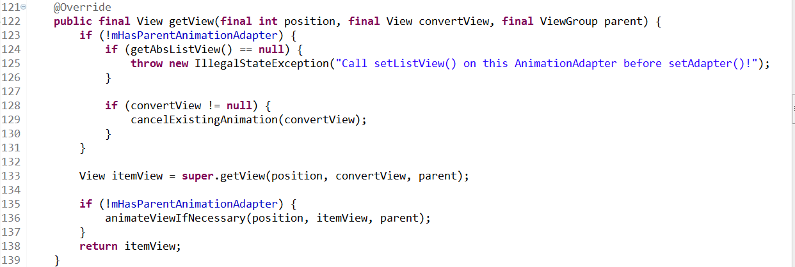
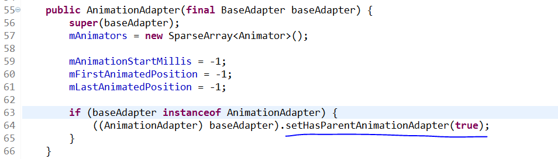
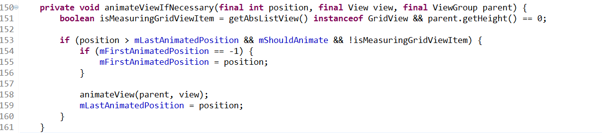
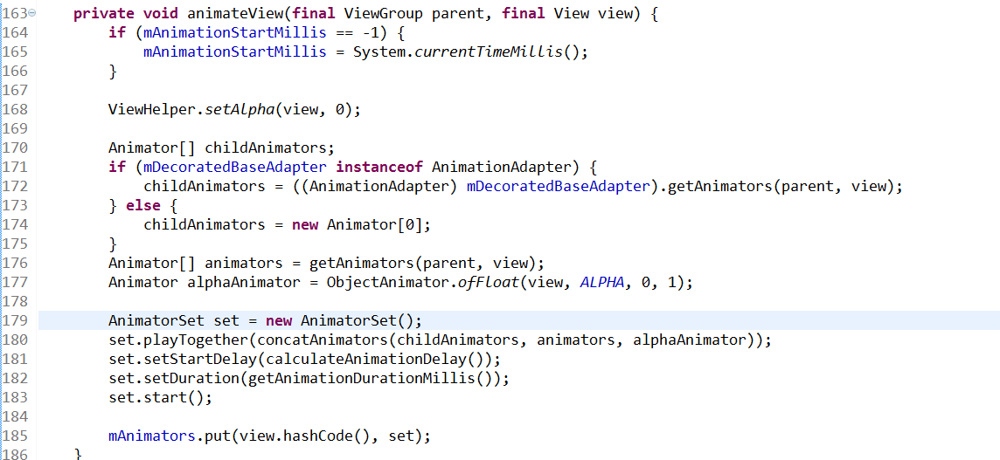
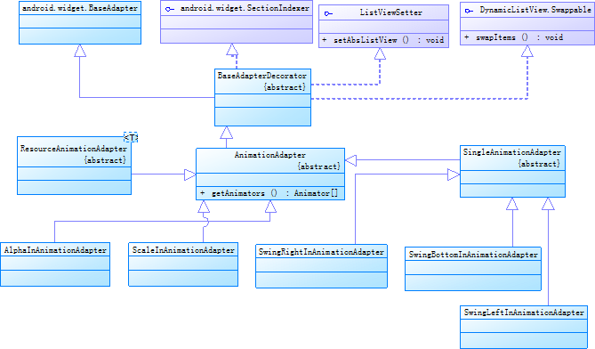

ListViewAnimations  源码解析
----------------
> 本文为 [Android 开源项目源码解析](https://github.com/android-cn/android-open-project-analysis) 中 ListViewAnimations 部分  
> 项目地址：[ListViewAnimations](https://github.com/nhaarman/ListViewAnimations)，分析的版本：，Demo 地址：    
> 分析者：[waylife](https://github.com/waylife)，校对者：，完成状态：未完成   

#功能介绍
原项目主页[https://github.com/nhaarman/ListViewAnimations/](https://github.com/nhaarman/ListViewAnimations/)    
demo工程:[https://github.com/android-cn/android-open-project-demo/tree/master/listview-animations-demo](https://github.com/android-cn/android-open-project-demo/tree/master/listview-animations-demo)   
demo apk:[https://github.com/android-cn/android-open-project-demo/tree/master/listview-animations-demo/apk](https://github.com/android-cn/android-open-project-demo/tree/master/listview-animations-demo/apk)
	    
正如名字所言，这是一个针对ListView的动画库。通过它我们可以很方便的给ListView（或GridView）增加item动画。
同时，除了列表动画之外，也集成了一些其他的操作，比如列表项的滑动删除，列表项的拖动，列表项的删除动画，列表项的展开以及动画等等。  
该库依赖于NineOldAndroids来支持3.0以下版本的动画。   
可通过简单的API调用实现以下**功能**：  
 1. **item展示动画**  
	- 内置动画（底部滑入动画、左边滑入动画、右边滑入动画、item渐变显示、item放大动画）  
	- 其他自定义动画等等  
 2. **item操作**  
	- 滑动删除（以及删除撤销）  
	- item拖动  
	- item（可以是多个item）删除动画  
	- item展开以及动画  

本文分析的[ListViewAnimations](https://github.com/android-cn/android-open-project-demo/tree/master/listview-animations-demo/ListviewAnimationLib)库可能不是最新的库，但基本原理应该差别不大。
本文分析的库基于[此版本](https://github.com/android-cn/android-open-project-demo/tree/master/listview-animations-demo/ListviewAnimationLib)

#如何使用
本文主要介绍ListViewAnimations原理，故此处不过多介绍。  
详细用法请参考[https://github.com/nhaarman/ListViewAnimations/wiki](https://github.com/nhaarman/ListViewAnimations/wiki)  
或者demo [https://github.com/android-cn/android-open-project-demo/tree/master/listview-animations-demo](https://github.com/android-cn/android-open-project-demo/tree/master/listview-animations-demo)

#详细分析
##item展示动画
也就是列表展示时的动画。  
这里所谓的列表包含哪些呢，一般来说继承自AbsListview的类（抽象出来的一个列表基类）都是，包括`ListView`、`GridView`都是它的子类。
我们知道，使用ListView的时候需要给它一个Adapter对象，每次显示一项时，Adapter的getView都会被调用。  
而动画就是在getView的时候被调用的。
也就是说原理十分简单，就是**调用getView的时候播放一个预定义的动画**。那**在什么时候播放**、**如何播放**、**播放什么动画**呢？  

**那在什么时候播放呢？** 
先看一下没有动画的调用代码  
```java
YourCustomAdapter mYourCustomAdapter = new YourCustomAdapter(this);
mListview.setAdapter(mYourCustomAdapter);
```
再看一下包含动画的调用代码，这里以右边滑入（`SwingRightInAnimationAdapter`）动画为例：  
```java
YourCustomAdapter mYourCustomAdapter = new YourCustomAdapter(this);
SwingRightInAnimationAdapter swingRightInAnimationAdapter = new SwingRightInAnimationAdapter(mYourCustomAdapter);
swingRightInAnimationAdapter.setAbsListView(mListView);
mListview.setAdapter(swingRightInAnimationAdapter);
```
与之前的Adapter区别在于设置mListview  Adapter前先用swingRightInAnimationAdapter对mYourCustomAdapter进行处理，同时，给swingRightInAnimationAdapter传入调用的AbsListview。 
也就说，swingRightInAnimationAdapter对getView方法进行了处理。找到`SwingRightInAnimationAdapter`类的代码，发现没有getView这个方法，继续找父类。它的父类是`SingleAnimationAdapter`，它也没有。继续找父类，`AnimationAdapter`，太棒了，里面有getView方法，我们看下内容是什么。  
 
  
  mHasParentAnimationAdapter是做什么用的呢。由于动画库可以同时叠加使用多个动画，先看下如何使用多个动画  
```java
YourCustomAdapter mAdapter = new YourCustomAdapter (this);
SwingRightInAnimationAdapter swingRightInAnimationAdapter = new SwingRightInAnimationAdapter(mAdapter);
SwingBottomInAnimationAdapter swingBottomInAnimationAdapter = new SwingBottomInAnimationAdapter(swingRightInAnimationAdapter);

swingRightInAnimationAdapter.setAbsListView(mListview);
mListview.setAdapter(swingBottomInAnimationAdapter);
```
与上面的单个动画相比，在于swingRightInAnimationAdapter不是直接传给mListview的setAdapter，而是，传给swingBottomInAnimationAdapter的构造函数，然后，swingRightInAnimationAdaptermListview的setAdapter。  
可以肯定的是mAdapter，swingRightInAnimationAdapter，swingBottomInAnimationAdapter的getView方法都被调用了，上述的调用顺序为swingBottomInAnimationAdapter.getView、swingRightInAnimationAdapte.getView、mAdapter.getView。既然动画是在getView里面进行播放的，那岂不是要播放多次？为了解决这个问题，这里用mHasParentAnimationAdapter来进行标示，里层的getView有些操作是不进行的（比如播放动画），这个变量不需要人为维护，在`AnimationAdapter`里面进行了处理，代码如下。   

 
也就是说只要传进去的adapter是`AnimationAdapter`（可以播放动画的adapter），那这个adapter就不进行某些操作。  
回到之前的那段多个动画组合的代码swingRightInAnimationAdapter是不进行某些操作的，动画播放等等是在swingBottomInAnimationAdapter的getView进行的，也就是最外层的`AnimationAdapter`进行动画操作。  
切回到`AnimationAdapter`的getView方法，这里假设Adapter是最后完成的AnimationAdapter，也就是说mHasParentAnimationAdapter为false。大致的流程很简单，判断AbsListview有没有设置，然后取消之前convertView的动画（因为AbsListView里面的getView是循环利用view的）。接着调用父类的getView获得View对象。然后调用animateViewIfNecessary播放动画。 
**以上，我们就解决了在什么时候播放动画的问题**。  
**如何播放动画以及什么时候播放动画呢**，继续看  

    
153行判断是否该播放动画，如果大于上次播放后的最后位置，则不播放，这就是为什么在滑动时只有往后滑才会播放动画，往前滑不会播放动画的原因。然后`AnimationAdapter`还提供了一个函数setShouldAnimate来设置是否播放动画。如果满足播放动画的条件，则调用animateView播放动画，同时保存位置。  
 
  
因此，animationView是播放动画的重头戏。  
173行调用抽象函数getAnimators（这个就是AnimationAdapter子类实现动画的地方）获取动画。然后后面计算动画延时时间并进行播放。
`AlphaInAnimationAdapter`、`ScaleInAnimationAdapter`等都是继承自`AnimationAdapter`然后重写getAnimation函数。`SwingBottomInAnimationAdapter`、`SwingRightInAnimationAdapter`、`SwingLeftInAnimationAdapter`继承自`SingleAnimationAdapter`，`SingleAnimationAdapter`继承自`AnimationAdapter`。
也就是说我们只要继承`AnimationAdapter`并重写getAnimation就可以自定义动画啦。也可以继承自`ResourceAnimationAdapter`从而加载xml布局中的动画。   
OK，三个问题都解决了。  
以上就是AbsListview的item动画，原理很简单，就是在getView里面在适当的实际播放动画而已。   
以下是类图（使用PowerDesigner生成）  

   
综上，动画分析就此结束。   

##item操作
单个item被单独操作以及操作时展示的动画，以下分四部分来介绍。  
分别是滑动删除（以及删除撤销）、item拖动、item（可以是多个item）删除动画、item展开以及动画 

(待续)
###滑动删除

###item拖动
###item删除
###item展开