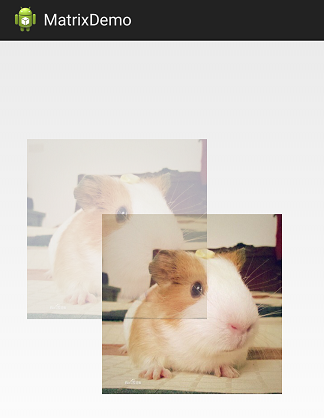
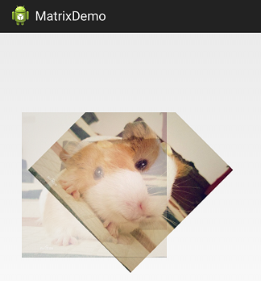

##Matrix Overview
> 本文为 [Android 开源项目实现原理解析](https://github.com/android-cn/android-open-project-analysis) 中 [PhotoView](https://github.com/android-cn/android-open-project-analysis/tree/master/photoview)的一份补充文档.

> 本文作为一个快速补充说明不会对Matrix所有API和实现原理进行系统介绍,仅仅作为一个API的简略说明和效果展示,以便不了解Matrix的开发者在阅读photoview-analysis的时候对背后的机制有一个快速的认识.

####Overview

Matrix是一个 3x3 矩阵,使用matrix可以对 bitmap/canvas 进行变换,在Android系统中很常用.

TODO 补图

####API 

- public void setTranslate(float dx, float dy)

    对目标进行平移dx,dy

    

- public void setScale(float sx, float sy, float px, float py)

    以(px,py)为中心,横向上缩放比例sx,纵向缩放比例sy
    

- public void setRotate(float degrees, float px, float py)

    以(px,py)为中心,旋转degrees度
    

- public void setSkew(float kx, float ky, float px, float py)
	以(px,py)为中心,偏转图片的x轴和y轴.
	
	这个好难用文字解释,请参考下面的实际效果图片.
    Set the matrix to skew by sx and sy, with a pivot point at (px, py).
    
	

