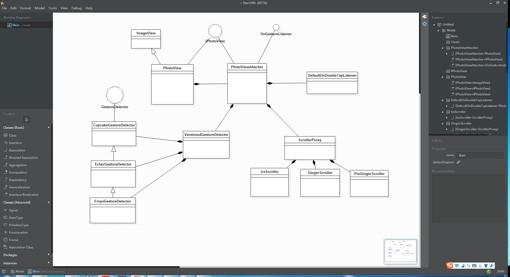

PhotoView 实现原理解析
====================================
> 本文为 [Android 开源项目实现原理解析](https://github.com/android-cn/android-open-project-analysis) 中 PhotoView 部分  
> 项目地址：[PhotoView](https://github.com/chrisbanes/PhotoView)，分析的版本：[48427bf](https://github.com/chrisbanes/PhotoView/commit/48427bff9bb1a408cfebf6697aa019c0788ded76)，Demo 地址：[PhotoView-demo](https://github.com/android-cn/android-open-project-demo/tree/master/photoview-demo)    
> 分析者：[dkmeteor](https://github.com/dkmeteor)，校对者：[${校对者}](${校对者 Github 地址})，校对状态：未完成   

###1. 功能介绍

#####特性(Features)：
- 支持Pinch手势自由缩放。
- 支持双击放大/还原。
- 支持平滑滚动。
- 在滑动父控件下能够运行良好。（例如：ViewPager）
- 支持基于Matrix变化（放大/缩小/移动）的事件监听。

#####优势：
- PhotoView是ImageView的子类，自然的支持所有ImageView的源生行为。
- 任意项目可以非常方便的从ImageView升级到PhotoView，不用做任何额外的修改。
- 可以非常方便的与ImageLoader/Picasso之类的异步网络图片读取库集成使用。
- 事件分发做了很好的处理，可以方便的与ViewPager等同样支持滑动手势的控件集成。

###2. 详细设计
###2.1 核心类功能介绍
##### 2.1.1 PhotoView
PhotoView 类负责暴露所有供外部调用的API,其本身直接继承自ImageView,同时实现了IPhotoView接口.
IPhotoView接口提供了缩放相关的设置属性 和 供缩放变化时回调的接口.

主要方法说明:

- public PhotoView(Context context)
- public PhotoView(Context context, AttributeSet attr)
- public PhotoView(Context context, AttributeSet attr, int defStyle)

构造函数,完全与ImageView相同,你可以将PhotoView直接当做ImageView使用,完全兼容.

- public void setPhotoViewRotation(float rotationDegree)

用于设置图片旋转角度.

注意：
例如使用Android相机拍摄的相片,会根据拍摄时手机方向的不同,在EXIF中存储不同的旋转角度信息,显示时往往需要查询EXIF信息并将照片旋转至正确的方向.
通常我们处理这种问题有两种方案：

- 通过Bitmap.createBitmap方式重建出正确方向的图片，再加载到ImageView中显示。(不建议使用，因为会占用双倍的内存，Bitmap的回收不是立即生效的。)
- 在ImageView中使用自定义Matrix将图片旋转到正确的方向。

由于PhotoView中对图片的 缩放 操作依赖对Matrix的操作，自定义Matrix会干扰 PhotoView 的缩放行为，所以PhotoView并不支持ScaleType.Matrix.
可参见PhotoViewAttacher源码：

        /**
     * @return true if the ScaleType is supported.
     */
    private static boolean isSupportedScaleType(final ScaleType scaleType) {
        if (null == scaleType) {
            return false;
        }

        switch (scaleType) {
            case MATRIX:
                throw new IllegalArgumentException(scaleType.name()
                        + " is not supported in PhotoView");

            default:
                return true;
        }
    }

这里特意提供了一个额外的setPhotoViewRotation方法即是为了解决这个问题。

- public boolean canZoom()
- public void setZoomable(boolean zoomable) 

缩放功能开关及状态获取.
关闭后PhotoView将不再响应 `缩放` 动作.

- public RectF getDisplayRect()
- public Matrix getDisplayMatrix()
- public boolean setDisplayMatrix(Matrix finalRectangle)

获取及设置当前 `matrix` 状态.

- public ScaleType getScaleType()

获取缩放模式。使用的源生的ImageView.ScaleType.
在PhotoView中默认值为FIT_CENTER.

- public void setAllowParentInterceptOnEdge(boolean allow)

设置标志位 是否允许父控件捕获发生在边缘的TouchEvent

这个标志位实际上对应的是
ViewParent.requestDisallowInterceptTouchEvent(boolean flag)

经常做自定义View处理TouchEvent的对这个方法应当都不陌生。

PhotoView中英文注释：

         * Here we decide whether to let the ImageView's parent to start taking
         * over the touch event.
         *
         * First we check whether this function is enabled. We never want the
         * parent to take over if we're scaling. We then check the edge we're
         * on, and the direction of the scroll (i.e. if we're pulling against
         * the edge, aka 'overscrolling', let the parent take over).

对应的代码：

        ViewParent parent = imageView.getParent();
        if (mAllowParentInterceptOnEdge && !mScaleDragDetector.isScaling()) {
            if (mScrollEdge == EDGE_BOTH
                    || (mScrollEdge == EDGE_LEFT && dx >= 1f)
                    || (mScrollEdge == EDGE_RIGHT && dx <= -1f)) {
                if (null != parent)
                    parent.requestDisallowInterceptTouchEvent(false);
            }
        } else {
            if (null != parent) {
                parent.requestDisallowInterceptTouchEvent(true);
            }
        }

通过调用setAllowParentInterceptOnEdge(false),可以完全屏蔽父控件的TouchEvent.

- public void setImageDrawable(Drawable drawable)
- public void setImageResource(int resId) 
- public void setImageURI(Uri uri)

重载了ImageView的3个设置图片的方法,用于通知PhotoViewAttacher更新视图和重置matrix状态

- protected void onDetachedFromWindow()

重载了ImageView的方法,用于在视图被从Window中移除时,通知PhotoViewAttacher清空数据.

###### 2.1.2 IPhotoView 
IPhotoView接口定义了缩放相关的一组set/get方法.
相关方法已在PhotoView中介绍,这里略过.

##### 2.1.3 Compat
用于做View.postOnAnimation方法在低版本上的兼容.
注：View.postOnAnimation (Runnable action) 在PhotoView中用于做默认 双击 放大/缩小 动画，每次系统绘图时都会调用此回调，通过在此时改变视图状态以实现动画效果。该方法仅支持 api >= 16
所以PhotoView中使用了Compat类来做低版本兼容。

实际上也可以使用android.support.v4.view.ViewCompat替代。
对比 android.support.v4.view.ViewCompat 和 uk.co.senab.photoview.Compat
其实现原理完全一致，都是通过
view.postDelayed(runnable, frameTime)来实现

##### 2.1.4 PhotoViewAttacher
核心类

- private static boolean isSupportedScaleType(final ScaleType scaleType) 
 
判断ScaleType是否支持。
实际上只有 Matrix是不支持的。

- public void cleanup()

    Clean-up the resources attached to this object. This needs to be called when the ImageView is no longer used.

用于释放相关资源。移除Observer, Listener.

- public boolean setDisplayMatrix(Matrix finalMatrix)

如果你熟悉Matrix的话，可以直接通过Matrix来修改ImageView的显示状态。

- private void cancelFling()

取消惯性滑动。

- private boolean checkMatrixBounds() 

检查当前显示范围是否处于边界上，并更新mScrollEdge标志位。

处理TouchEvent时需要根据mScrollEdge标志位的状态来判断是否允许ViewParent的InterceptTouchEvent接收TouchEvent.

- private void resetMatrix()

重置Matrix状态，并恢复至FIT_CENTER状态

- private void updateBaseMatrix(Drawable d)

根据PhotoView的宽高和Drawable的宽高计算FIT_CENTER状态的Matrix.

##### 2.1.5 ScrollerProxy
抽象类,主要是为了做不用版本之间的兼容,具体说明见`GingerScroller` `IcsScroller` `PreGingerScroller` 这三个接口实现类的说明.

##### 2.1.6 GingerScroller
`ScrollerProxy` 接口实现类
适用于 API 9 ~ 14 即 2.3 ~ 4.0 之间的所有Android版本.
其实现主要基于 android.widget.OverScroller

##### 2.1.7 IcsScroller
适用于 API 14 以上 即 4.0 以上的所有Android版本
其实现基于源生 android.widget.OverScroller , 没有任何修改.

##### 2.1.8 PreGingerScroller
适用于 API 9 以下 即 2.3 以下的所有Android版本
其实现主要基于 android.widget.Scroller

##### 2.1.9 GestureDetector
接口,主要是为了做不同版本之间的兼容,具体说明见 `CupcakeGestureDetector`,`EclairGestureDetector`,`FroyoGestureDetector` 三个接口的实现类.
##### 2.1.10 OnGestureListener
手势回调接口

##### 2.1.11 CupcakeGestureDetector
适用于 api < 7 的设备,此时PhotoView不支持双指pinch放大/缩小操作
##### 2.1.12 EclairGestureDetector
适用于 api >= 8 , 用于修正多指操控时,使TouchEvent的getActiveX getActiveY指向正确的Pointer,并将事件传递给 `CupcakeGestureDetector` 处理,此时PhotoView不支持双指pinch放大/缩小操作
##### 2.1.13 FroyoGestureDetector
适用于 api > 9 , 通过android.view.ScaleGestureDetector实现对Pinch手势的支持,并将事件传递给 `EclairGestureDetector` 处理

##### 2.1.14 VersionedGestureDetector
提供GestureDetector的实例，由它根据系统版本决定实例化哪一个 GestureDetector ，主要是为了兼容Android的不同版本。
具体调用栈请参考总体设计中调用流程图,注意一点,PhotoViewAttacher本身就实现了OnGestureListener接口,实际的缩放操作是由PhotoViewAttacher完成的,而不是这里声明的各个GestureDetector.

核心类、函数功能介绍及核心功能流程图，流程图可使用 StartUML、Visio 或 Google Drawing。  
###2.2 类关系图

`TODO`  startuml画的图似乎有点问题。还是用umlet重画一下算了。

###3. 流程图
Touch事件判断流程图：
`TODO`

###4. 总体设计
分为3个模块：
`TODO`

- ScrollerProxy
    
    处理图像拖曳事件。

- GestureDetector

    处理缩放手势。
    
- PhotoViewAttacher

    处理相关事件回调和维护matrix状态。

###5. 杂谈
该项目存在的问题、可优化点及类似功能项目对比等，非所有项目必须。  

**完成时间**  
- `两天内`完成  

###6. 修改完善  
在完成了上面 5 个部分后，移动模块顺序，将  
`2. 详细设计` -> `2.1 核心类功能介绍` -> `2.2 类关系图` -> `3. 流程图` -> `4. 总体设计`  
顺序变为  
`2. 总体设计` -> `3. 流程图` -> `4. 详细设计` -> `4.1 类关系图` -> `4.2 核心类功能介绍`  
并自行校验优化一遍，确认无误后，让`校对 Buddy`进行校对，`校对 Buddy`校队完成后将  
`校对状态：未完成`  
变为：  
`校对状态：已完成`  

**完成时间**  
- `两天内`完成  

**到此便大功告成，恭喜大家^_^**  
