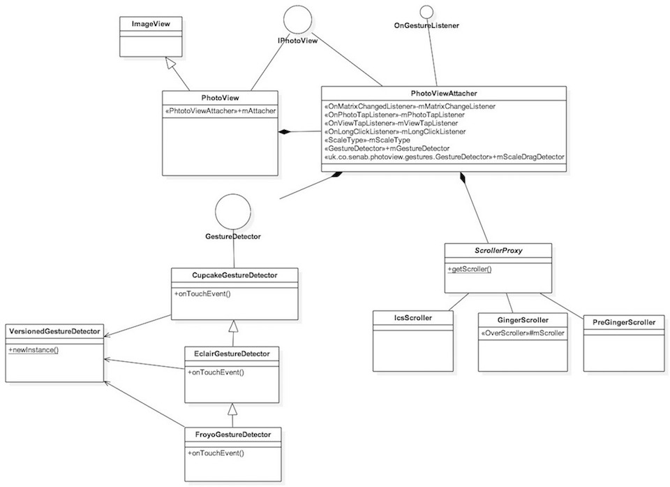

PhotoView 实现原理解析
====================================
> 本文为 [Android 开源项目实现原理解析](https://github.com/android-cn/android-open-project-analysis) 中 PhotoView 部分  
> 项目地址：[PhotoView](https://github.com/chrisbanes/PhotoView)，分析的版本：[48427bf](https://github.com/chrisbanes/PhotoView/commit/48427bff9bb1a408cfebf6697aa019c0788ded76)，Demo 地址：[PhotoView-demo](https://github.com/android-cn/android-open-project-demo/tree/master/photoview-demo)    
> 分析者：[dkmeteor](https://github.com/dkmeteor)，校对者：[${校对者}](${校对者 Github 地址})，校对状态：未完成   

###1. 功能介绍

#####特性(Features)：
- 支持Pinch手势自由缩放。
- 支持双击放大/还原。
- 支持平滑滚动。
- 在滑动父控件下能够运行良好。（例如：ViewPager）
- 支持基于Matrix变化（放大/缩小/移动）的事件监听。

#####优势：
- PhotoView是ImageView的子类，自然的支持所有ImageView的源生行为。
- 任意项目可以非常方便的从ImageView升级到PhotoView，不用做任何额外的修改。
- 可以非常方便的与ImageLoader/Picasso之类的异步网络图片读取库集成使用。
- 事件分发做了很好的处理，可以方便的与ViewPager等同样支持滑动手势的控件集成。

###2. 详细设计
###2.1 核心类功能介绍
##### 2.1.1 PhotoView
PhotoView 类负责暴露所有供外部调用的API,其本身直接继承自ImageView,同时实现了IPhotoView接口.
IPhotoView接口提供了缩放相关的设置属性 和 供缩放变化时回调的接口.

主要方法说明:

- public PhotoView(Context context)
- public PhotoView(Context context, AttributeSet attr)
- public PhotoView(Context context, AttributeSet attr, int defStyle)

构造函数,完全与ImageView相同,你可以将PhotoView直接当做ImageView使用,完全兼容.

- public void setPhotoViewRotation(float rotationDegree)

用于设置图片旋转角度.
例如使用Android相机拍摄的相片,会根据拍摄时手机方向的不同,在EXIF中存储不同的旋转角度信息,显示时往往需要查询EXIF信息并将照片旋转至正确的方向.

- public boolean canZoom()
- public void setZoomable(boolean zoomable) 

缩放功能开关及状态获取.
关闭后PhotoView将不再响应 `缩放` 动作.

- public RectF getDisplayRect()
- public Matrix getDisplayMatrix()
- public boolean setDisplayMatrix(Matrix finalRectangle)

获取及设置当前 `matrix` 状态.

`TODO`

Matrix和Rect展开讲很多,这里一两句话又讲不清楚.....考虑最后加一段matrix简单介绍?

- public ScaleType getScaleType()

获取缩放模式。使用了源生的ImageView.ScaleType,在PhotoView中默认值为FIT_CENTER

- public void setAllowParentInterceptOnEdge(boolean allow)

- public void setImageDrawable(Drawable drawable)
- public void setImageResource(int resId) 
- public void setImageURI(Uri uri)

重载了ImageView的3个设置图片的方法,用于通知PhotoViewAttacher更新视图

- protected void onDetachedFromWindow()

重载了ImageView的方法,用于在视图被从Window中移除时,通知PhotoViewAttacher清空数据.

###### 2.1.2 IPhotoView 
IPhotoView接口定义了缩放相关的一组set/get方法.
相关方法已在PhotoView中介绍,这里略过.

##### 2.1.3 Compat
用于做View.postOnAnimation方法在低版本上的兼容.
注：View.postOnAnimation (Runnable action) 一种新的动画实现方式，每次系统绘图时都会调用此回调，可以在此时改变视图状态以实现动画效果。该方法仅支持 api >= 16

##### 2.1.4 PhotoViewAttacher
核心类
`TODO`

##### 2.1.5 ScrollerProxy
抽象类,主要是为了做不用版本之间的兼容,具体说明见`GingerScroller` `IcsScroller` `PreGingerScroller` 这三个接口实现类的说明.

##### 2.1.6 GingerScroller
`ScrollerProxy` 接口实现类
适用于 API 9 ~ 14 即 2.3 ~ 4.0 之间的所有Android版本.
其实现主要基于 android.widget.OverScroller

'TODO' 追加一些OverScroller的说明

##### 2.1.7 IcsScroller
适用于 API 14 以上 即 4.0 以上的所有Android版本
其实现基于源生 android.widget.OverScroller , 没有任何修改.

##### 2.1.8 PreGingerScroller
适用于 API 9 以下 即 2.3 以下的所有Android版本
其实现主要基于 android.widget.Scroller

'TODO' 追加一些Scroller的说明

##### 2.1.9 GestureDetector
接口,主要是为了做不同版本之间的兼容,具体说明见 `CupcakeGestureDetector`,`EclairGestureDetector`,`FroyoGestureDetector` 三个接口的实现类.
##### 2.1.10 OnGestureListener
手势回调接口
##### 2.1.11 CupcakeGestureDetector
##### 2.1.12 EclairGestureDetector
##### 2.1.13 FroyoGestureDetector
##### 2.1.14 VersionedGestureDetector
GestureDetector分发的顶级节点，由它决定Gesture分发给哪一个具体的GestureDetector处理，主要是为了兼容Android的不同版本。

核心类、函数功能介绍及核心功能流程图，流程图可使用 StartUML、Visio 或 Google Drawing。  
###2.2 类关系图

###3. 流程图
Touch事件分发流程图：
`TODO`

###4. 总体设计
分为3个模块：
`TODO`

- ScrollerProxy
    
    处理图像拖曳事件。

- GestureDetector

    处理缩放手势。
    
- PhotoViewAttacher

    保存相关事件回调和matrix状态

###5. 杂谈
该项目存在的问题、可优化点及类似功能项目对比等，非所有项目必须。  

**完成时间**  
- `两天内`完成  

###6. 修改完善  
在完成了上面 5 个部分后，移动模块顺序，将  
`2. 详细设计` -> `2.1 核心类功能介绍` -> `2.2 类关系图` -> `3. 流程图` -> `4. 总体设计`  
顺序变为  
`2. 总体设计` -> `3. 流程图` -> `4. 详细设计` -> `4.1 类关系图` -> `4.2 核心类功能介绍`  
并自行校验优化一遍，确认无误后，让`校对 Buddy`进行校对，`校对 Buddy`校队完成后将  
`校对状态：未完成`  
变为：  
`校对状态：已完成`  

**完成时间**  
- `两天内`完成  

**到此便大功告成，恭喜大家^_^**  
