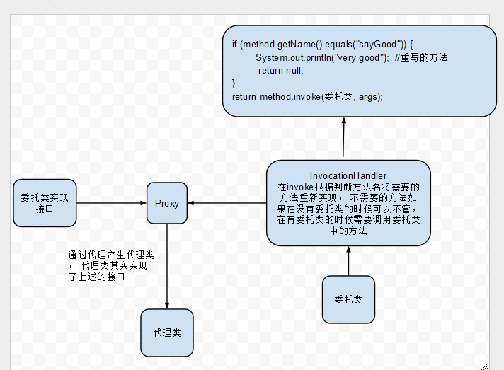
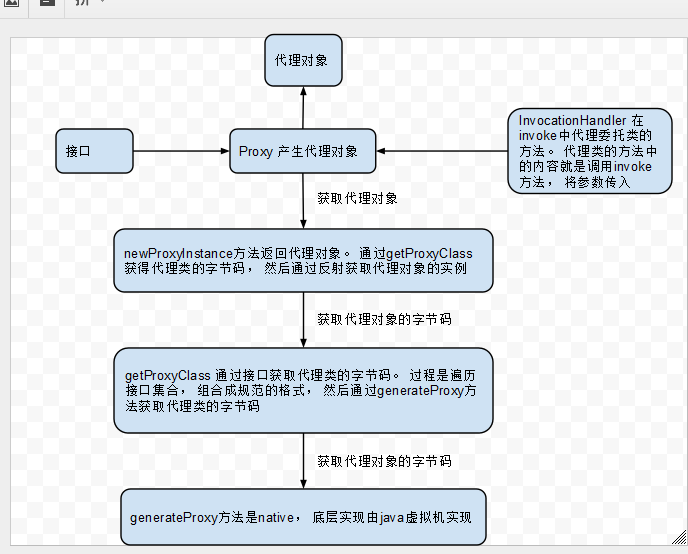

动态代理
----------------
> 本文为 [Android 开源项目实现原理解析](https://github.com/android-cn/android-open-project-analysis) 公共技术点的 动态代理 部分  
> 分析者：[Caij](https://github.com/Caij)，校对者：[Trinea](https://github.com/Trinea)，校对状态：完成

#####一、相关概念
`代理`：如果我们要提供一个给三方使用的 jar ，其中类 A 是很全的功能实现，我们不希望完全暴露给三方调用，所以类 A 设置为包权限，新建类 B，以类 A 为构造函数的入参，重写类 A 需要对外暴露的函数，这种方式我们就称为代理，这里类 A 称为被代理类，也称为委托类，类 B 称为委托类。根据委托类生成方式的不同，代理可以分为静态代理和动态代理。  
通过上面的介绍我们能知道代理的好处是可以隐藏代理类的实现。  

`静态代理`：委托类代码由开发者自己编写的代理方式称为静态代理。如下是简单的静态代理实例：  
```java
class ClassA {
    public void operateMethod1() {};

    public void operateMethod2() {};

    public void operateMethod3() {};
}

public class ClassB {
    private ClassA a;

    public ClassB(ClassA a) {
        this.a = a;
    }

    public void operateMethod1() {
        a.operateMethod1();
    };

    public void operateMethod2() {
        a.operateMethod2();
    };

    // not export operateMethod3()
}
```

`动态代理`：委托类代码由 JDK 运行时刻动态生成的代理方式称为动态代理。  
这种代理方式的一大好处是很方便对代理类的函数做统一或特殊处理，如记录所有函数执行时间、所有函数执行前添加验证判断、对某个特殊函数进行特殊操作。  

对于[编译时刻注解]()生成委托类的代理方式我们也叫做`静态代理`，因为委托类代码在运行时已经决定。  
由于`静态代理`比较简单，本文不做介绍，重点介绍`动态代理`。  

#####二、动态代理实例
现在我们想统计某个类所有函数的执行时间
  

```java
	import java.lang.reflect.InvocationHandler;
	import java.lang.reflect.Method;
	import java.lang.reflect.Proxy;

	/**
	 * @author Caij
	 */
	public class ProxyDemo {
		
		
		public static void main(String[] args) {
			/**
			 * 代理只能代理被代理类实现接口的方法， 所以被代理必须实现接口
			 * */
			final CurrentClass currentClass = new CurrentClass();
			//被代理类实现的接口
			Class<?>[] interfaces = new Class[]{ProxyInterface.class};
			//如果有实际的委托类可以这样写
			interfaces = currentClass.getClass().getInterfaces();
			ProxyInterface proxy = (ProxyInterface) Proxy.newProxyInstance(currentClass.getClass().getClassLoader(), 
						interfaces , new Handler(currentClass));
			proxy.sayGood();
		}
	}

	class Handler implements InvocationHandler {
		
		private Object object;
		
		public Handler(Object ob) {
			this.object = ob;
		}
		
		public Handler() {
		}

		/* (non-Javadoc)
		 * @see java.lang.reflect.InvocationHandler#invoke(java.lang.Object, java.lang.reflect.Method, java.lang.Object[])
		 * 这个方法中调用接口中的方法
		 */
		@Override
		public Object invoke(Object proxy, Method method, Object[] args)
				throws Throwable {
			if (method.getName().equals("sayGood")) {
				System.out.println("very good"); //需要代理的方法修改
				return null; //  返回值为空 直接返回null
			}
			return object == null ? null : method.invoke(object, args); //不需要修改的方法调用CurrentClass的方法 
		}
		
	}

	interface ProxyInterface {
		public void sayHello();
		public void sayGood();
	}

	class CurrentClass implements ProxyInterface {

		@Override
		public void sayHello() {
			System.out.println("hello");
		}

		@Override
		public void sayGood() {
			System.out.println("good");
		}
	}
```

#####三、动态代理的实现原理？
- 1. 提供委托类实现的接口
- 2. 通过实现的接口动态生成代理类， 然后在构造方法中传入InvocationHandler ，在每个实现方法中调用InvocationHandler的invoke()。
- 3. 然后重写invoke() 方法， 把自己需要的逻辑加入。  
注意1、拦截器中invoke方法体的内容就是代理对象方法体的内容
    2、当客户端执行代理对象方法时，进入到了拦截器的invoke方法体
    3、拦截器中invoke方法的method参数是在调用的时候赋值的

  

```java
    /** 
     * loader:类加载器 
     * interfaces:目标对象实现的接口 
     * h:InvocationHandler的实现类 
     */  
    public static Object newProxyInstance(ClassLoader loader,  
                          Class<?>[] interfaces,  
                          InvocationHandler h)  
        throws IllegalArgumentException  
        {  
        if (h == null) {  
            throw new NullPointerException();  
        }  
      
        /* 
         * Look up or generate the designated proxy class. 
         */  
        Class cl = getProxyClass(loader, interfaces);  
      
        /* 
         * Invoke its constructor with the designated invocation handler. 
         */  
        try {  
                // 调用代理对象的构造方法（也就是$Proxy0(InvocationHandler h)）  
            Constructor cons = cl.getConstructor(constructorParams);  
                // 生成代理类的实例并把InvocationHandler的实例传给它的构造方法  
            return (Object) cons.newInstance(new Object[] { h });  
        } catch (NoSuchMethodException e) {  
            throw new InternalError(e.toString());  
        } catch (IllegalAccessException e) {  
            throw new InternalError(e.toString());  
        } catch (InstantiationException e) {  
            throw new InternalError(e.toString());  
        } catch (InvocationTargetException e) {  
            throw new InternalError(e.toString());  
        }  
        }  
		
		/** 
		* 这个方法其实就是通过提供的接口产生一个实现类的字节码
		*/ 
		public static Class<?> getProxyClass(ClassLoader loader,   
                                             Class<?>... interfaces)  
        throws IllegalArgumentException  
        {  
        // 如果目标类实现的接口数大于65535个则抛出异常（我XX，谁会写这么NB的代码啊？）  
        if (interfaces.length > 65535) {  
            throw new IllegalArgumentException("interface limit exceeded");  
        }  
      
        // 声明代理对象所代表的Class对象（有点拗口）  
        Class proxyClass = null;  
      
        String[] interfaceNames = new String[interfaces.length];  
      
        Set interfaceSet = new HashSet();   // for detecting duplicates  
      
        // 遍历目标类所实现的接口  
        for (int i = 0; i < interfaces.length; i++) {  
              
            // 拿到目标类实现的接口的名称  
            String interfaceName = interfaces[i].getName();  
            Class interfaceClass = null;  
            try {  
            // 加载目标类实现的接口到内存中  
            interfaceClass = Class.forName(interfaceName, false, loader);  
            } catch (ClassNotFoundException e) {  
            }  
            if (interfaceClass != interfaces[i]) {  
            throw new IllegalArgumentException(  
                interfaces[i] + " is not visible from class loader");  
            }  
      
            // 中间省略了一些无关紧要的代码 .......  
              
            // 把目标类实现的接口代表的Class对象放到Set中  
            interfaceSet.add(interfaceClass);  
      
            interfaceNames[i] = interfaceName;  
        }  
      
        // 把目标类实现的接口名称作为缓存（Map）中的key  
        Object key = Arrays.asList(interfaceNames);  
      
        Map cache;  
          
        synchronized (loaderToCache) {  
            // 从缓存中获取cache  
            cache = (Map) loaderToCache.get(loader);  
            if (cache == null) {  
            // 如果获取不到，则新建地个HashMap实例  
            cache = new HashMap();  
            // 把HashMap实例和当前加载器放到缓存中  
            loaderToCache.put(loader, cache);  
            }  
      
        }  
      
        synchronized (cache) {  
      
            do {  
            // 根据接口的名称从缓存中获取对象  
            Object value = cache.get(key);  
            if (value instanceof Reference) {  
                proxyClass = (Class) ((Reference) value).get();  
            }  
            if (proxyClass != null) {  
                // 如果代理对象的Class实例已经存在，则直接返回  
                return proxyClass;  
            } else if (value == pendingGenerationMarker) {  
                try {  
                cache.wait();  
                } catch (InterruptedException e) {  
                }  
                continue;  
            } else {  
                cache.put(key, pendingGenerationMarker);  
                break;  
            }  
            } while (true);  
        }  
      
        try {  
            // 中间省略了一些代码 .......  
              
            // 这里就是动态生成代理对象的最关键的地方 ， 产生代理对象的字节码， 底层是通过jni实现的。 
            byte[] proxyClassFile = ProxyGenerator.generateProxyClass(  
                proxyName, interfaces);  
            try {  
                // 根据代理类的字节码生成代理类的实例  
                proxyClass = defineClass0(loader, proxyName,  
                proxyClassFile, 0, proxyClassFile.length);  
            } catch (ClassFormatError e) {  
                throw new IllegalArgumentException(e.toString());  
            }  
            }  
            // add to set of all generated proxy classes, for isProxyClass  
            proxyClasses.put(proxyClass, null);  
      
        }   
        // 中间省略了一些代码 .......  
          
        return proxyClass;  
        }  
```

**这里的代理对象可以理解为这样**
```java
/**
 * @author Caij
 * 理解方式：这样写便于理解， 底层的实现是有java虚拟机实现的
 * 代理类实现了参数中所有的接口
 * 然后在每个方法中调用InvocationHandler invoke方法， 然后将参数传入
 */
public class 代理类 implements MyInterface{
	
	private InvocationHandler handler;
	
	public MyInterfaceAdapter(InvocationHandler handler) {
		this.handler = handler;
	}

	@Override
	public void sayHello() {
		try {
			handler.invoke(this, this.getClass().getMethod("sayHello"), null);
		} catch (Throwable e) {
			e.printStackTrace();
		}
	}

	@Override
	public void sayGood() {
		try {
			handler.invoke(this, this.getClass().getMethod("sayGood"), null);
		} catch (NoSuchMethodException e) {
			e.printStackTrace();
		} catch (SecurityException e) {
			e.printStackTrace();
		} catch (Throwable e) {
			e.printStackTrace();
		}
	}
}
```

#####四、动态代理和装饰， 继承（静态代理）的比较。
代码： 这里的CurrentClass 和 ProxyInterface 是一中代理实现中的对象。
```java
	/**
	 * 继承修改方法
	 * @author Caij
	 */
	class ExtendsClass extends CurrentClass {

		/* (non-Javadoc)
		 * @see com.caij.proxy.CurrentClass#sayHello()
		 * 因为这个方法你不满意， 重写
		 */
		@Override
		public void sayHello() {
			System.out.println("very good");
		}
	}

	/**
	 * @author Caij
	 * 装饰  修改方法
	 */
	class DecorateClass implements ProxyInterface {
		
		private CurrentClass clazz;
		
		public DecorateClass(CurrentClass currentClass) {
			this.clazz = currentClass;
		}

		/* (non-Javadoc)
		 * @see com.caij.proxy.ProxyInterface#sayHello()
		 * 在不需要改变的方法直接调用被装饰类的方法
		 */
		@Override
		public void sayHello() {
			clazz.sayGood();
		}

		/* (non-Javadoc)
		 * @see com.caij.proxy.ProxyInterface#sayGood()
		 * 在需要改变的方法中写自己想要的逻辑
		 */
		@Override
		public void sayGood() {
			System.out.println("very good");
		}
	}
```

- 1.相同点：  
	* 都可以改变对象中的方法。
- 2.不同点
	* 使用场景不同， 在没有具体的类的时候装饰是实现不了的。 继承会造成大量的代码冗余， 比如需要实现的是一个接口， 那个接口有20个方法， 就必须重写20个方法。在这种环境就使用动态代理， 只关注自己代理的方法。
	* 静态代理通常只代理一个类，动态代理是代理一个接口下的多个实现类。静态代理事先知道要代理的是什么，而动态代理不知道要代理什么东西，只有在运行时才知道。
	
#####五、使用场景
- 1. android中监听事件的代理。  
	* 理由： 监听接口是没有实例的， 使用继承或者装饰的话需要实现接口， 而在事件代理的时候都是通过反射技术， 使用代理非常方便，如果要创建实现监听接口的对象造成代码冗余， 扩展性差。
```java
	public class MainActivity extends Activity {

		@Override
		protected void onCreate(Bundle savedInstanceState) {
			super.onCreate(savedInstanceState);
			setContentView(R.layout.activity_main);
			Button btn = (Button) findViewById(R.id.btn);
	//		btn.setOnClickListener(new Listener());
			
			Class<?>[] interfaces = new Class[] {OnClickListener.class};
			//代理类其实实现interfaces中所以接口
			OnClickListener proxy = (OnClickListener) Proxy.newProxyInstance(OnClickListener.class.getClass().getClassLoader(), 
				interfaces , new InvocationHandler() {
				
				@Override
				public Object invoke(Object proxy, Method method, Object[] args)
						throws Throwable {
					if (method.getName().equals("onClick")) {
						onClick(); //需要代理的方法修改
						return null; //  返回值为空 直接返回null
					}
					return null; 
				}
			});
			btn.setOnClickListener(proxy);
		}
		
		
		public void onClick() {
			Toast.makeText(MainActivity.this, "我被点击了", Toast.LENGTH_LONG).show(); 
		}
		
		private class Listener implements OnClickListener {

			@Override
			public void onClick(View v) {
				onClick();
			}
		}

	}
```	

- 2. web开发中spring aop编程
	* 理由：目标方法之间完全是松耦合。  比如在Dao中， 每次数据库操作都需要开启事务， 而且在操作的时候需要关注权限。  如果这些逻辑都放在dao中就会造成代码冗余， 耦合度高。
```java
	//伪代码
	Dao {
		save() {
			判断是否有保存的权限；
			开启事务；
			保存；
			提交事务；
		}
		
		delete() {
			判断是否有删除的权限；
			开启事务；
			删除；
			提交事务；
		}
	}
	
	// 使用动态代理, 组合每个切面的方法， 而每个切面只需要关注自己的逻辑就行， 就达到减少代码， 松耦合的效果
	invoke(Object proxy, Method method, Object[] args)
						throws Throwable {
					判断是否有权限；
					开启事务；
					Object ob = method.invoke(dao, args)；
					提交事务；
					return ob; 
				}
				
				
```	
	
