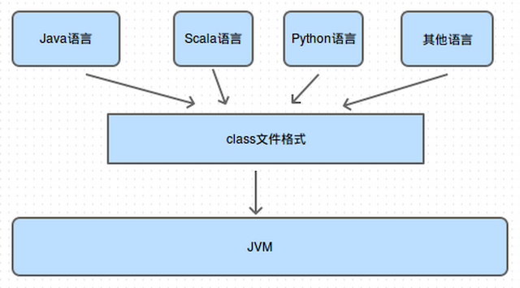

公共技术点之 Java 反射 Reflection
----------------
> 本文为 [Android 开源项目源码解析](http://a.codekk.com) 公共技术点中的 Java 反射 部分  
 分析者：[Mr.Simple](https://github.com/bboyfeiyu)，校对者：[Trinea](https://github.com/Trinea)，校对状态：未完成  

### 1. 了解 Java 中的反射
#### 1.1 什么是 Java 的反射
   Java 反射是可以让我们在运行时获取类的函数、属性、父类、接口等 Class 内部信息的机制。通过反射还可以让我们在运行期实例化对象，调用方法，通过调用 get/set 方法获取变量的值，即使方法或属性是私有的的也可以通过反射的形式调用，这种“看透 class”的能力被称为内省，这种能力在框架开发中尤为重要。
   有些情况下，我们要使用的类在运行时才会确定，这个时候我们不能在编译期就使用它，因此只能通过反射的形式来使用在运行时才存在的类(该类符合某种特定的规范，例如 JDBC)，这是反射用得比较多的场景。    
   还有一个比较常见的场景就是编译时我们对于类的内部信息不可知，必须得到运行时才能获取类的具体信息。比如 ORM 框架，在运行时才能够获取类中的各个属性，然后通过反射的形式获取其属性名和值，存入数据库。这也是反射比较经典应用场景之一。  

#### 1.2 Class 类
   那么既然反射是操作 Class 信息的，Class 又是什么呢?    
     
   当我们编写完一个 Java 项目之后，所有的 Java 文件都会被编译成一个.class 文件，这些 Class 对象承载了这个类型的父类、接口、构造函数、方法、属性等原始信息，这些 class 文件在程序运行时会被 ClassLoader 加载到虚拟机中。当一个类被加载以后，Java 虚拟机就会在内存中自动产生一个 Class 对象。我们通过 new 的形式创建对象实际上就是通过这些 Class 来创建，只是这个过程对于我们是不透明的而已。      
   下面的章节中我们会为大家演示反射的一些常用 api，从代码的角度理解反射。        


### 2. 反射 Class 以及构造对象
#### 2.1 获取 Class 对象   
   在你想检查一个类的信息之前，你首先需要获取类的 Class 对象。Java 中的所有类型包括基本类型，即使是数组都有与之关联的 Class 类的对象。如果你在编译期知道一个类的名字的话，那么你可以使用如下的方式获取一个类的 Class 对象。

```
Class<?> myObjectClass = MyObject.class;
```     

   如果你已经得到了某个对象，但是你想获取这个对象的 Class 对象，那么你可以通过下面的方法得到:
   
```
Student me = new Student("mr.simple");
Class<?> clazz = me.getClass();
```         

   如果你在编译期获取不到目标类型，但是你知道它的完整类路径，那么你可以通过如下的形式来获取 Class 对象:

```  
Class<?> myObjectClass = Class.forName("com.simple.User");
```     

在使用 Class.forName()方法时，你必须提供一个类的全名，这个全名包括类所在的包的名字。例如 User 类位于 com.simple 包，那么他的完整类路径就是 com.simple.User。     
如果在调用 Class.forName()方法时，没有在编译路径下(classpath)找到对应的类，那么将会抛出 ClassNotFoundException。     

**接口说明**     

```
// 加载指定的 Class 对象，参数 1 为要加载的类的完整路径，例如"com.simple.Student". ( 常用方式 )
public static Class<?> forName (String className)

// 加载指定的 Class 对象，参数 1 为要加载的类的完整路径，例如"com.simple.Student";
// 参数 2 为是否要初始化该 Class 对象，参数 3 为指定加载该类的 ClassLoader.
public static Class<?> forName (String className, boolean shouldInitialize, ClassLoader classLoader)

```   

	
### 2.2 通过 Class 对象构造目标类型的对象	
   一旦你拿到 Class 对象之后，你就可以为所欲为了！当你善用它的时候它就是神兵利器，当你心怀鬼胎之时它就会变成恶魔。但获取 Class 对象只是第一步，我们需要在执行那些强大的行为之前通过 Class 对象构造出该类型的对象，然后才能通过该对象释放它的能量。
	我们知道，在 java 中要构造对象，必须通过该类的构造函数，那么其实反射也是一样一样的。但是它们确实有区别的，通过反射构造对象，我们首先要获取类的 Constructor(构造器)对象，然后通过 Constructor 来创建目标类的对象。还是直接上代码的。     
	
```
    private static void classForName() {
        try {
        	// 获取 Class 对象
            Class<?> clz = Class.forName("org.java.advance.reflect.Student");
            // 通过 Class 对象获取 Constructor，Student 的构造函数有一个字符串参数
            // 因此这里需要传递参数的类型 ( Student 类见后面的代码 )
            Constructor<?> constructor = clz.getConstructor(String.class);
            // 通过 Constructor 来创建 Student 对象
            Object obj = constructor.newInstance("mr.simple");
            System.out.println(" obj :  " + obj.toString());
        } catch (Exception e) {
            e.printStackTrace();
        }
    }
``` 	
   通过上述代码，我们就可以在运行时通过完整的类名来构建对象。      
   
**获取构造函数接口**        

```  
// 获取一个公有的构造函数，参数为可变参数，如果构造函数有参数，那么需要将参数的类型传递给 getConstructor 方法
public Constructor<T> getConstructor (Class...<?> parameterTypes)
// 获取目标类所有的公有构造函数
public Constructor[]<?> getConstructors ()

```   
 注意，当你通过反射获取到 Constructor、Method、Field 后，在反射调用之前将此对象的 accessible 标志设置为 true，以此来提升反射速度。值为 true 则指示反射的对象在使用时应该取消 Java 语言访问检查。值为 false 则指示反射的对象应该实施 Java 语言访问检查。例如 :     
```
   Constructor<?> constructor = clz.getConstructor(String.class);
   // 设置 Constructor 的 Accessible
   constructor.setAccessible(true);

   // 设置 Methohd 的 Accessible
   Method learnMethod = Student.class.getMethod("learn"， String.class);
   learnMethod.setAccessible(true);
```    
   由于后面还会用到 Student 以及相关的类，我们在这里就先给出它们的代码吧。      
**Person.java**     
       
```
public class Person {
    String mName;

    public Person(String aName) {
        mName = aName;
    }

    private void sayHello(String friendName) {
        System.out.println(mName + " say hello to " + friendName);
    }

    protected void showMyName() {
        System.out.println("My name is " + mName);
    }

    public void breathe() {
		System.out.println(" take breathe ");
    }
}
```        

**Student.java**    

```
public class Student extends Person implements Examination {
    // 年级
    int mGrade;

    public Student(String aName) {
        super(aName);
    }

    public Student(int grade, String aName) {
        super(aName);
        mGrade = grade;
    }

    private void learn(String course) {
        System.out.println(mName + " learn " + course);
    }

    public void takeAnExamination() {
		System.out.println(" takeAnExamination ");
    }

    public String toString() {
        return " Student :  " + mName;
    }
```   

**Breathe.java**   

```
// 呼吸接口
public interface Breathe {
    public void breathe();
}
```


**Examination.java**   

```
// 考试接口
public interface Examination {
    public void takeAnExamination();
}
```


### 3 反射获取类中函数

#### 3.1 获取当前类中定义的方法
   要获取当前类中定义的所有方法可以通过 Class 中的 getDeclaredMethods 函数，它会获取到当前类中的 public、default、protected、private 的所有方法。而 getDeclaredMethod(String name, Class...<?> parameterTypes)则是获取某个指定的方法。代码示例如下 :  

``` 
 private static void showDeclaredMethods() {
      Student student = new Student("mr.simple");
        Method[] methods = student.getClass().getDeclaredMethods();
        for (Method method : methods) {
            System.out.println("declared method name : " + method.getName());
        }

        try {
            Method learnMethod = student.getClass().getDeclaredMethod("learn", String.class);
            // 获取方法的参数类型列表
            Class<?>[] paramClasses = learnMethod.getParameterTypes() ;
            for (Class<?> class1 : paramClasses) {
                System.out.println("learn 方法的参数类型 : " + class1.getName());
            }
            // 是否是 private 函数，属性是否是 private 也可以使用这种方式判断
            System.out.println(learnMethod.getName() + " is private "
                    + Modifier.isPrivate(learnMethod.getModifiers()));
            learnMethod.invoke(student, "java ---> ");
        } catch (Exception e) {
            e.printStackTrace();
        }
    }
```    


#### 3.2 获取当前类、父类中定义的公有方法      
   要获取当前类以及父类中的所有 public 方法可以通过 Class 中的 getMethods 函数，而 getMethod 则是获取某个指定的方法。代码示例如下 :  

``` 
    private static void showMethods() {
        Student student = new Student("mr.simple");
        // 获取所有方法
        Method[] methods = student.getClass().getMethods();
        for (Method method : methods) {
            System.out.println("method name : " + method.getName());
        }

        try {
            // 通过 getMethod 只能获取公有方法，如果获取私有方法则会抛出异常，比如这里就会抛异常
            Method learnMethod = student.getClass().getMethod("learn", String.class);
            // 是否是 private 函数，属性是否是 private 也可以使用这种方式判断
            System.out.println(learnMethod.getName() + " is private " + Modifier.isPrivate(learnMethod.getModifiers()));
            // 调用 learn 函数
            learnMethod.invoke(student, "java");
        } catch (Exception e) {
            e.printStackTrace();
        }
    }
```    


**接口说明**

```
// 获取 Class 对象中指定函数名和参数的函数，参数一为函数名，参数 2 为参数类型列表
public Method getDeclaredMethod (String name, Class...<?> parameterTypes)

// 获取该 Class 对象中的所有函数( 不包含从父类继承的函数 )
public Method[] getDeclaredMethods ()

// 获取指定的 Class 对象中的**公有**函数，参数一为函数名，参数 2 为参数类型列表
public Method getMethod (String name, Class...<?> parameterTypes)

// 获取该 Class 对象中的所有**公有**函数 ( 包含从父类和接口类集成下来的函数 )
public Method[] getMethods ()

```      
   这里需要注意的是 getDeclaredMethod 和 getDeclaredMethods 包含 private、protected、default、public 的函数，并且通过这两个函数获取到的只是在自身中定义的函数，从父类中集成的函数不能够获取到。而 getMethod 和 getMethods 只包含 public 函数，父类中的公有函数也能够获取到。           
   

### 4 反射获取类中的属性
   获取属性和章节 3 中获取方法是非常相似的，只是从 getMethod 函数换成了 getField，从 getDeclaredMethod 换成了 getDeclaredField 罢了。      

#### 4.1 获取当前类中定义的属性
   要获取当前类中定义的所有属性可以通过 Class 中的 getDeclaredFields 函数，它会获取到当前类中的 public、default、protected、private 的所有属性。而 getDeclaredField 则是获取某个指定的属性。代码示例如下 :  

``` 
    private static void showDeclaredFields() {
        Student student = new Student("mr.simple");
        // 获取当前类和父类的所有公有属性
        Field[] publicFields = student.getClass().getDeclaredFields();
        for (Field field : publicFields) {
            System.out.println("declared field name : " + field.getName());
        }

        try {
            // 获取当前类和父类的某个公有属性
            Field gradeField = student.getClass().getDeclaredField("mGrade");
            // 获取属性值
            System.out.println(" my grade is : " + gradeField.getInt(student));
            // 设置属性值
            gradeField.set(student, 10);
            System.out.println(" my grade is : " + gradeField.getInt(student));
        } catch (Exception e) {
            e.printStackTrace();
        }
    }
```    


#### 4.2 获取当前类、父类中定义的公有属性      
   要获取当前类以及父类中的所有 public 属性可以通过 Class 中的 getFields 函数，而 getField 则是获取某个指定的属性。代码示例如下 :  

``` 
    private static void showFields() {
        Student student = new Student("mr.simple");
        // 获取当前类和父类的所有公有属性
        Field[] publicFields = student.getClass().getFields();
        for (Field field : publicFields) {
            System.out.println("field name : " + field.getName());
        }

        try {
            // 获取当前类和父类的某个公有属性
            Field ageField = student.getClass().getField("mAge");
            System.out.println(" age is : " + ageField.getInt(student));
        } catch (Exception e) {
            e.printStackTrace();
        }
    }
```    


**接口说明**

```
// 获取 Class 对象中指定属性名的属性，参数一为属性名
public Method getDeclaredField (String name)

// 获取该 Class 对象中的所有属性( 不包含从父类继承的属性 )
public Method[] getDeclaredFields ()

// 获取指定的 Class 对象中的**公有**属性，参数一为属性名
public Method getField (String name)

// 获取该 Class 对象中的所有**公有**属性 ( 包含从父类和接口类集成下来的公有属性 )
public Method[] getFields ()

```      
   这里需要注意的是 getDeclaredField 和 getDeclaredFields 包含 private、protected、default、public 的属性，并且通过这两个函数获取到的只是在自身中定义的属性，从父类中集成的属性不能够获取到。而 getField 和 getFields 只包含 public 属性，父类中的公有属性也能够获取到。 


### 5 反射获取父类与接口
#### 5.1 获取父类
获取 Class 对象的父类。

```
    Student student = new Student("mr.simple");
    Class<?> superClass = student.getClass().getSuperclass();
    while (superClass != null) {
        System.out.println("Student's super class is : " + superClass.getName());
        // 再获取父类的上一层父类，直到最后的 Object 类，Object 的父类为 null
        superClass = superClass.getSuperclass();
    }
```             


#### 5.2 获取接口    
   获取 Class 对象中实现的接口。

```
    private static void showInterfaces() {
        Student student = new Student("mr.simple");
        Class<?>[] interfaceses = student.getClass().getInterfaces();
        for (Class<?> class1 : interfaceses) {
            System.out.println("Student's interface is : " + class1.getName());
        }
    }
```         


### 6 获取注解信息
在框架开发中，注解加反射的组合使用是最为常见形式的。关于注解方面的知识请参考[公共技术点之 Java 注解 Annotation](http://a.codekk.com/detail/Android/Trinea/%E5%85%AC%E5%85%B1%E6%8A%80%E6%9C%AF%E7%82%B9%E4%B9%8B%20Java%20%E6%B3%A8%E8%A7%A3%20Annotation)，定义注解时我们会通过@Target 指定该注解能够作用的类型，看如下示例:    

```
    @Target({
            ElementType.METHOD, ElementType.FIELD, ElementType.TYPE
    })
    @Retention(RetentionPolicy.RUNTIME)
    static @interface Test {

    }
```    
上述注解的@target 表示该注解只能用在函数上，还有 Type、Field、PARAMETER 等类型，可以参考上述给出的参考资料。通过反射 api 我们也能够获取一个 Class 对象获取类型、属性、函数等相关的对象，通过这些对象的 getAnnotation 接口获取到对应的注解信息。
   首先我们需要在目标对象上添加上注解，例如 : 
   
```
@Test(tag = "Student class Test Annoatation")
public class Student extends Person implements Examination {
    // 年级
    @Test(tag = "mGrade Test Annotation ")
    int mGrade;
    
    // ......
}
```           	
   然后通过相关的注解函数得到注解信息，如下所示 :   
   
```
    private static void getAnnotationInfos() {
        Student student = new Student("mr.simple");
        Test classTest = student.getClass().getAnnotation(Test.class);
        System.out.println("class Annotatation tag = " + classTest.tag());
        
        Field field = null;
        try {
            field = student.getClass().getDeclaredField("mGrade");
            Test testAnnotation = field.getAnnotation(Test.class);
            System.out.println("属性的 Test 注解 tag : " + testAnnotation.tag());
        } catch (Exception e) {
            e.printStackTrace();
        }
    }
```      
  输出结果为 : 
>
```
class Annotatation tag = Student class Test Annoatation
属性的 Test 注解 tag : mGrade Test Annotation 
```

**接口说明**

```
// 获取指定类型的注解
public <A extends Annotation> A getAnnotation(Class<A> annotationClass) ;
// 获取 Class 对象中的所有注解
public Annotation[] getAnnotations() ;
     
```       

## 杂谈
   反射作为 Java 语言的重要特性，在开发中有着极为重要的作用。很多开发框架都是基于反射来实现对目标对象的操作，而反射配合注解更是设计开发框架的主流选择，例如 ActiveAndroid，因此深入了解反射的作用以及使用对于日后开发和学习必定大有益处。


