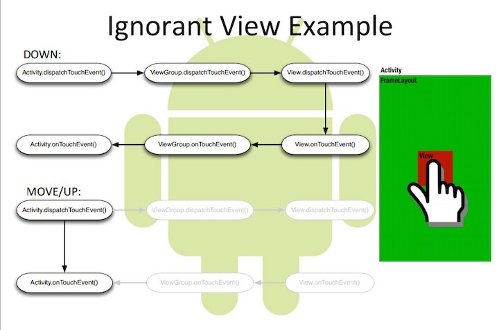
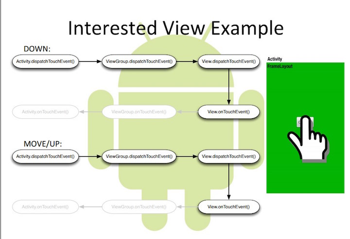

公共技术点之 View 事件传递
----------------
> 本文为 [Android 开源项目源码解析](http://a.codekk.com) 公共技术点中的 View 事件传递 部分  
 分析者：[Trinea](https://github.com/Trinea)，校对者：[Trinea](https://github.com/Trinea)，校对状态：完成  

本文后面后继续整理。  

推荐一篇我看到的对传递机制介绍最清楚的国外文章吧。本文略作翻译。  

### 1、基础知识 
(1) 所有 Touch 事件都被封装成了 MotionEvent 对象，包括 Touch 的位置、时间、历史记录以及第几个手指(多指触摸)等。  

(2) 事件类型分为 ACTION_DOWN, ACTION_UP, ACTION_MOVE, ACTION_POINTER_DOWN, ACTION_POINTER_UP, ACTION_CANCEL，每个事件都是以 ACTION_DOWN 开始 ACTION_UP 结束。  

(3) 对事件的处理包括三类，分别为传递——dispatchTouchEvent()函数、拦截——onInterceptTouchEvent()函数、消费——onTouchEvent()函数和 OnTouchListener  

### 2、传递流程
(1) 事件从 Activity.dispatchTouchEvent()开始传递，只要没有被停止或拦截，从最上层的 View(ViewGroup)开始一直往下(子 View)传递。子 View 可以通过 onTouchEvent()对事件进行处理。   

(2) 事件由父 View(ViewGroup)传递给子 View，ViewGroup 可以通过 onInterceptTouchEvent()对事件做拦截，停止其往下传递。   

(3) 如果事件从上往下传递过程中一直没有被停止，且最底层子 View 没有消费事件，事件会反向往上传递，这时父 View(ViewGroup)可以进行消费，如果还是没有被消费的话，最后会到 Activity 的 onTouchEvent()函数。   

(4) 如果 View 没有对 ACTION_DOWN 进行消费，之后的其他事件不会传递过来。   

(5) OnTouchListener 优先于 onTouchEvent()对事件进行消费。   
上面的消费即表示相应函数返回值为 true。   

**更多请直接阅读 PDF 英文原文：[Mastering the Android Touch System](http://wugengxin.cn/download/pdf/android/PRE_andevcon_mastering-the-android-touch-system.pdf)**  

示例代码：[Demo@Github](https://github.com/devunwired/custom-touch-examples) 

附上两张原文中流程图：  
(1) View 不处理事件流程图  
  

(2) View 处理事件流程图  
  