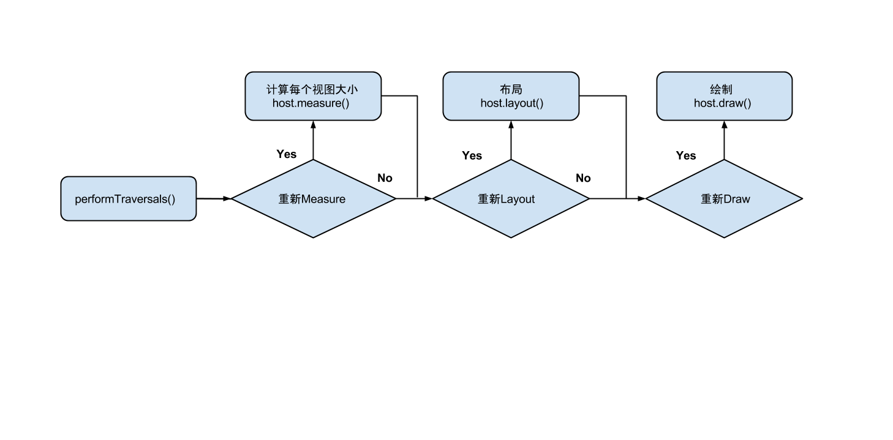
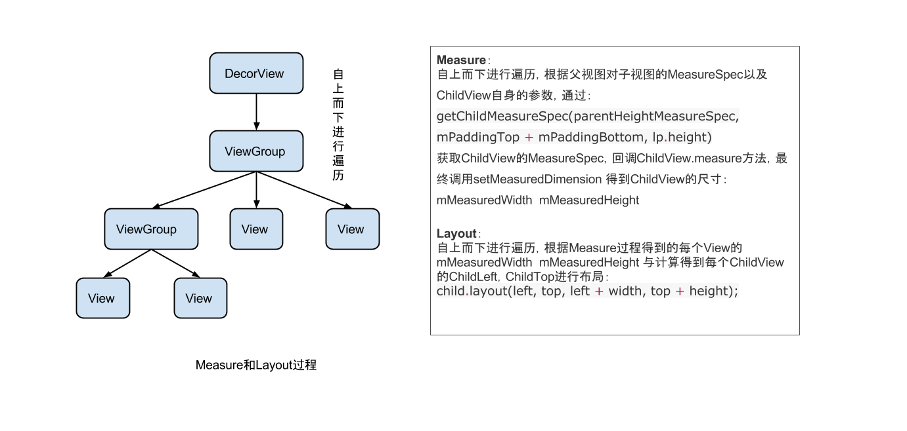

View 绘制流程
----------------
> 本文为 [Android 开源项目实现原理解析](https://github.com/android-cn/android-open-project-analysis) 中 公共技术点 部分  
> 分析者：[Trinea](https://github.com/lightSky)

#### View绘制机制  
#####1 View树的绘图流程
整个View树的绘图流程是由ViewRoot.java类的performTraversals()函数发起的，整个流程如下

  

#####2  概念 
参考文献：http://developer.android.com/guide/topics/ui/how-android-draws.html  

当Activity接收到焦点的时候，它会被请求绘制布局。Android framework将会处理绘制的流程，但Activity必须提供View层级的根节点。绘制是从根节点开始的，需要measure和draw布局树。绘制会遍历和渲染每一个与无效区域相交的view。相反，每一个ViewGroup负责绘制它所有的子视图，而最底层的View会负责绘制自身。树的遍历是有序的，父视图会先于子视图被绘制，

**measure和layout**  

从整体上来看Measure和Layout两个步骤的执行：
  

**具体分析**  
measure过程的发起是在measure(int,int)方法中，而且是从上到下有序的绘制view。在递归的过程中，每一个父视图将尺寸规格向下传递给子视图，在measure过程的最后，每个视图存储了自己的尺寸。
layout过程从layout(int, int, int, int)方法开始，也是自上而下进行遍历。在这个过程中，每个父视图会根据measure过程得到的尺寸确定所有的子视图的具体位置。  

注意：Android框架不会绘制无效区域之外的部分,但会考虑绘制视图的背景。你可以使用invalidate()去强制对一个view进行重绘。  

当一个View的measure过程进行完的时候，它自己及其所有子节点的getMeasuredWidth()和getMeasuredHeight()方法的值就必须被设置了。一个视图的测量宽度和测量高度值必须在父视图约束范围之内，这可以保证在measure的最后,所有的父母都接收所有孩子的测量。
一个父视图，可以在其子视图上多次的调用measure()方法。比如，父视图可以先根据未给定的dimension调用measure方法去测量每一个
子视图的尺寸，如果所有子视图的未约束尺寸太大或者太小的时候，则会使用一个确切的大小，然后在每一个子视图上再次调用measure方法去测量每一个view的大小。（也就是说，如果子视图对于Measure得到的大小不满意的时候，父视图会介入并设置测量规则进行第二次measure）

**measure过程传递传递尺寸的两个类**  
- ViewGroup.LayoutParams类（View自身的布局参数）  
- MeasureSpecs类（父视图对子视图的测量要求）

ViewGroup.LayoutParams  
用于子视图告诉其父视图它们应该怎样被测量和放置（就是子视图自身的布局参数）。一个基本的LayoutParams只用来描述视图的高度和宽度。对于每一方面的尺寸（height和width），你可以指定下列方式之一：  
- 具体数值   
- MATCH_PARENT 表示子视图希望和父视图一样大(不含padding)   
- WRAP_CONTENT 表示视图为正好能包裹其内容大小(包含padding)    

ViewGroup的子类，也有相应的ViewGroup.LayoutParams的子类，例如RelativeLayout有相应的ViewGroup.LayoutParams的子类,拥有设置子视图水平和垂直的能力。其实子view.getLayoutParams()获取到的LayoutParams类型就是其所在父控件类型相应的Params，比如view的父控件为RelativeLayout，那么得到的LayoutParams类型就为RelativeLayoutParams。在强转的时候注意别出错。


MeasureSpecs  
其包含的信息有测量要求和尺寸，有三种模式:      

- UNSPECIFIED  
父视图不对子视图有任何约束，它可以达到所期望的任意尺寸。

- EXACTLY  
父视图为子视图指定一个确切的尺寸，而且无论子视图期望多大，它都必须在该指定大小的边界内，对应的属性为match_parent或具体指，比如100dp，父控件可以直接得到子控件的尺寸，该尺寸就是MeasureSpec.getSize(measureSpec)得到的值。

- AT_MOST  
父视图为子视图指定一个最大尺寸。子视图必须确保它自己的所有子视图可以适应在该尺寸范围内，对应的属性为wrap_content,父控件无法确定子view的尺寸，只能由子控件自己根据需求去计算自己的尺寸。
 
#####3 measure核心方法  
- measure(int widthMeasureSpec, int heightMeasureSpec)  
该方法定义在View.java类中，final修饰符修饰，因此不能被重载，但measure调用链会回调View/ViewGroup对象的onMeasure()方法，因此我们只需要复写onMeasure()方法去根据需求计算自己的控件尺寸即可。

- onMeasure(int widthMeasureSpec, int heightMeasureSpec)  
该方法的两个参数是父视图提供的测量要求。当父视图调用子视图的measure函数对子视图进行测量时，会传入这两个参数。通过这两个参数以及子视图本身的LayoutParams来共同决定子视图的测量要求MeasureSpec。其实整个measure过程就是从上到下遍历，不断的根据父视图的宽高要求MeasureSpec和子视图自身的LayotuParams获取子视图自己的宽高测量要求MeasureSpec，最终调用子视图的measure(int widthMeasureSpec, int heightMeasureSpec)方法（内部调用setMeasuredDimension）确定自己的mMeasuredWidth和mMeasuredHeight。ViewGroup的measureChildren和measureChildWithMargins方法体现了该过程，下面对该过程做了分析。  

- setMeasuredDimension()  
View在测量阶段的最终尺寸是由setMeasuredDimension()方法决定的,该方法最终会对每个View的mMeasuredWidth和mMeasuredHeight进行赋值，一旦这两个变量被赋值，就意味着该View的整个测量过程结束了，setMeasuredDimension()也是必须要调用的方法，否则会报异常。通常我们在自定义的时候，是不需要管上述的Measure过程的，只需要在setMeasuredDimension()方法内部，根据需求，去计算自己View的尺寸即可，你可以在ViewPagerIndicator项目的自定义Viwe的尺寸计算看到。  

下面三个和MeasureSpec相关方法的返回的值都是在getChildMeasureSpec()中确定的，后面的源码有详细分析

- makeMeasureSpec(int size, int mode)
```java
        /**
         * 根据提供的size和mode创建一个measure specification，包含了View的尺寸和测量要求
         * 返回的mode必须为以下枚举值之一：
         * 
         *  View.MeasureSpec#UNSPECIFIED}
         *  View.MeasureSpec#EXACTLY}
         *  View.MeasureSpec#AT_MOST}
         * 
         * 在API17以及之前，makeMeasureSpec的实现是：参数的顺序是不重要的，而且任何值的
         * 溢出都可能会影响到MeasureSpec的结果，RelativeLayout就受此bug影响。在API 17之后，
         * 修复了此bug，使行为更加严谨。
         *
         * @param size the size of the measure specification
         * @param mode the mode of the measure specification
         * @return the measure specification based on size and mode
         */
        public static int makeMeasureSpec(int size, int mode) {
            if (sUseBrokenMakeMeasureSpec) {
                return size + mode;
            } else {
                return (size & ~MODE_MASK) | (mode & MODE_MASK);
            }
        }
```        
- getMode(int measureSpec)
```java 
        /**
         * 从提供的measure specification中抽取Mode，在确定View的尺寸时，需要根据该Mode来决定如何确定最终值
         */
        public static int getMode(int measureSpec) {
            return (measureSpec & MODE_MASK);
        }
```
- getSize(int measureSpec)
```java
        /**
         * 从提供的measure specification中抽取尺寸，在确定自定义View的尺寸时，使用该方法获取到系统Measure的值，
         * 然后根据getMode方法得到的测绘要求，在Measure值和自己计算的值中确定最终值。
         *
         * @return 根据给定的measure specification得到的以pixels为单位的尺寸
         */
        public static int getSize(int measureSpec) {
            return (measureSpec & ~MODE_MASK);
        }
```

下面对整个Measure流程做一个分析，在ViewGroup中，含有两个对子视图Measure的方法:  
```java
    /**
     * 只包含子View的padding   
     */
 measureChildren(int widthMeasureSpec, int heightMeasureSpec)
```

```java
    /**
     * 包含子View的padding和margin  
     */
measureChildWithMargins(View child,
            int parentWidthMeasureSpec, int widthUsed,
            int parentHeightMeasureSpec, int heightUsed)
```
我们取measureChildren（int widthMeasureSpec, int heightMeasureSpec)方法进行分析：

```java
    /**
     * 请求所有子View去measure自己，要考虑的部分有对子View的测绘要求MeasureSpec以及其自身的padding
     * 这里跳过所有为GONE状态的子View，最繁重的工作是在getChildMeasureSpec方法中处理的
     *
     * @param widthMeasureSpec  对该View的width测绘要求
     * @param heightMeasureSpec 对该View的height测绘要求
     */
    protected void measureChildren(int widthMeasureSpec, int heightMeasureSpec) {
        final int size = mChildrenCount;
        final View[] children = mChildren;
        for (int i = 0; i < size; ++i) {
            final View child = children[i];
            if ((child.mViewFlags & VISIBILITY_MASK) != GONE) {
                measureChild(child, widthMeasureSpec, heightMeasureSpec);
            }
        }
    }
    
    protected void measureChild(View child, int parentWidthMeasureSpec,
            int parentHeightMeasureSpec) {
        final LayoutParams lp = child.getLayoutParams();

        final int childWidthMeasureSpec = getChildMeasureSpec(parentWidthMeasureSpec,//获取ChildView的widthMeasureSpec
                mPaddingLeft + mPaddingRight, lp.width);
        final int childHeightMeasureSpec = getChildMeasureSpec(parentHeightMeasureSpec,//获取ChildView的heightMeasureSpec
                mPaddingTop + mPaddingBottom, lp.height);

        child.measure(childWidthMeasureSpec, childHeightMeasureSpec);
    }
    
   /**
    *	getChildMeasureSpec()的分析有点多，只为了分析系统如何确定子视图的MeasureSpec和size的
    */
  
   /** 
     * 该方法是measureChildren中最繁重的部分，为每一个ChildView计算出自己的MeasureSpec。
     * 目标是将ChildView的MeasureSpec和LayoutParams结合起来去得到一个最合适的结果。
     * 比如，如果该View知道自己的尺寸（假设它的MeasureSpec Mode为EXACTLY），并且该Child已经在它的
     * LayoutParams中表明了想获得一个和父视图相同的大小（MatchParent），那么parent应该请求该Child
     * 以一个给定的尺寸放置
     *
     * @param spec 对该view的测绘要求
     * @param padding 当前View在当前唯独上的paddingand，也有可能含有margins
     *
     * @param childDimension 在当前维度上（height或width）的具体指
     * @return a MeasureSpec integer for the child
     */
    public static int getChildMeasureSpec(int spec, int padding, int childDimension) {
    
	    int specMode = MeasureSpec.getMode(spec);  //获得父视图的测量要求  
	    int specSize = MeasureSpec.getSize(spec);  //获得父视图的实际值  
	  
	    int size = Math.max(0, specSize - padding); //父视图的大小减去边距值
	  
	    int resultSize = 0;    //子视图的实际值
	    int resultMode = 0;    //子视图的测量要求 
	  
	    switch (specMode) {  
	    // Parent has imposed an exact size on us  
	    //父视图的测量要求为EXACTLY：为子视图指定了一个明确值
	    case MeasureSpec.EXACTLY:   
	        //子视图的width或height是个精确值，则直接使用该精确值
	        if (childDimension >= 0) {            
	            resultSize = childDimension;         
	            resultMode = MeasureSpec.EXACTLY;    //子视图的Mode设置为EXACTLY
	        }   
	        //子视图的width或height的属性为MATCH_PARENT，
	        else if (childDimension == LayoutParams.MATCH_PARENT) {  
	            // Child wants to be our size. So be it.  
	            resultSize = size;                   //则为子View设置父视图的大小（减去padding后）
	            resultMode = MeasureSpec.EXACTLY;    //子视图测量要求设置为EXACTLY
	        }   
	        //子视图的width或height的属性为WRAP_CONTENT：
	        else if (childDimension == LayoutParams.WRAP_CONTENT) {  
	            // 子视图希望自己确定大小，但不能比父视图大
	            resultSize = size;                  //为子视图指定了一个最大值
	            resultMode = MeasureSpec.AT_MOST;  //子视图测量要求设置为AT_MOST
	        }  
	        break;  
   
	    //父视图的测绘要求为AT_MOST
	    case MeasureSpec.AT_MOST:  
	        //子视图的width或height是个精确值
	        if (childDimension >= 0) {  
	            resultSize = childDimension;        //则直接使用该值
	            resultMode = MeasureSpec.EXACTLY;   //子视图测量要求为 EXACTLY   
	        }  
	        //子视图的width或height的属性为 MATCH_PARENT
	        else if (childDimension == LayoutParams.MATCH_PARENT) {  
	            //子视图希望和父视图相同大小，但是父视图的大小没有指定，
	            //只能约束子视图大小不能比父视图大
	            resultSize = size;                  //子视图尺寸为父视图大小  
	            resultMode = MeasureSpec.AT_MOST;   //子视图测量要求为AT_MOST  
	        }  
	        //子视图的width或height属性为 WRAP_CONTENT  
	        else if (childDimension == LayoutParams.WRAP_CONTENT) {  
	             //子视图希望和父视图相同大小，其大小不能比父视图大
	            resultSize = size;                  //子视图尺寸为父视图大小  
	            resultMode = MeasureSpec.AT_MOST;   //子视图测量要求为AT_MOST  
	        }  
	        break;  
	  
	    //父视图的测绘要求为UNSPECIFIED，大小没有约束
	    case MeasureSpec.UNSPECIFIED:  
	        //子视图的width或height的属性是精确值,则直接使用该值
	        if (childDimension >= 0) {  
	            resultSize = childDimension;      
	            resultMode = MeasureSpec.EXACTLY;   //子视图测量要求为 EXACTLY  
	        }  
	        //子视图的width或height的属性为 MATCH_PARENT
	        else if (childDimension == LayoutParams.MATCH_PARENT) {  
	            //子视图希望和父视图一样大，由于父视图没指定，则这里也无法确定子视图大小
	            //设置为0，后续处理
	            resultSize = 0;                        
	            resultMode = MeasureSpec.UNSPECIFIED;  //子视图测量要求为 UNSPECIFIED  
	        }   
	        //子视图的width或height的属性为 WRAP_CONTENT，子视图大小也无法确定
	        else if (childDimension == LayoutParams.WRAP_CONTENT) {  
	            resultSize = 0;                        
	            resultMode = MeasureSpec.UNSPECIFIED;  //子视图测量要求为 UNSPECIFIED  
	        }  
	        break;  
	    }  
	    //根据获取到的子视图的测量要求和大小创建子视图的MeasureSpec
	    return MeasureSpec.makeMeasureSpec(resultSize, resultMode);  
    }
    
   /**
     *
     * 用于获取View最终的大小，父视图提供了宽、高的约束信息
     * 一个View的真正的测量工作是在onMeasure(int,int)中，由该方法调用。
     * 因此，只有onMeasure(int,int)可以而且必须被子类复写
     *
     * @param widthMeasureSpec 在水平方向上，父视图指定的的Measure要求
     * @param heightMeasureSpec 在竖直方向上，控件上父视图指定的Measure要求
     *
     */
    public final void measure(int widthMeasureSpec, int heightMeasureSpec) {
      ...
      
      onMeasure(widthMeasureSpec, heightMeasureSpec);
      
      ...
    }
    
    protected void onMeasure(int widthMeasureSpec, int heightMeasureSpec) {
        setMeasuredDimension(getDefaultSize(getSuggestedMinimumWidth(), widthMeasureSpec),
                getDefaultSize(getSuggestedMinimumHeight(), heightMeasureSpec));
    }
    
    /**
     * 返回默认值的方法，如果MeasureSpec没有约束（Mode为UNSPECIFIED），则使用给定的值
     * 如果MeasureSpec允许，将得到一个更大的值。 
     * @param size 该View的默认值
     * @param measureSpec 父视图的约束
     * @return 该View应该的大小
     */
    public static int getDefaultSize(int size, int measureSpec) {
        int result = size;
        int specMode = MeasureSpec.getMode(measureSpec);
        int specSize = MeasureSpec.getSize(measureSpec);

        switch (specMode) {
        case MeasureSpec.UNSPECIFIED://父视图没有任何约束，则返回getSuggestedMinimumWidth()得到的最小值
            result = size;
            break;
        case MeasureSpec.AT_MOST://父视图有约束，则返回MeasureSpec.getSize(measureSpec)的值，
        case MeasureSpec.EXACTLY://该值则是getChildMeasureSpec方法内部处理确定的
            result = specSize;
            break;
        }
        return result;
    }
    
    /**
     * 返回建议的最小宽度值。会在View的最小值和背景图片的最小值之间获取一个较大的值
     * 当在onMeasure(int,int)方法中使用的时候，调用者应该始终保证返回的宽度值在其父视图
     * 要求的范围内
     * @return 当前View的建议最小宽度值
     */
    protected int getSuggestedMinimumWidth() {
        return (mBackground == null) ? mMinWidth : max(mMinWidth, mBackground.getMinimumWidth());
    }
```


#####4 layout相关概念及核心方法  
子视图的具体位置都是相对与父视图的位置。与Measure过程类似，ViewGroup在onLayout函数中通过调用其children的layout函数来设置子视图相对与父视图中的位置，具体位置由函数layout的参数决定。

View的onLayout方法为空实现。而ViewGroup的onLayout则为abstract的，因此，如果自定义的View要继承ViewGroup时，必须实现onLayout函数，而onMeasure并不强制实现，因为相对与layout来说，measure过程并不是必须的。  

Note：和Measure过程代码上不太像的是，Measure过程最终调用onMeasure()方法来设置View的尺寸，而Layout过程，onLayout参数是空实现，其是调用了setFrame方法对View进行布局。

实现onLayout通常做法就是进行一个for循环调用每一个子视图的layout(l, t, r, b)函数，传入不同的参数l, t, r, b来确定每个子视图在父视图中的显示位置。onLayout过程会通过调用getMeasuredWidth()和getMeasuredHeight()方法获取到measure过程得到的mMeasuredWidth和mMeasuredHeight,这两个参数为layout过程提供了一个很重要的参考值（不是必须值）。    

之所以说measure过程不是必须的，因为View的Layout步骤是在Measure之后，在Layout里可以拿到Measure过程得到的值进行Layout，当然你也可以对Measure过程的值进行修改，但这样肯定是不可取的，这样违背了Android框架的绘制机制，要不Measure过程这么做的工作还有啥用。通常的做法是根据需求在measure过程决定尺寸，layout步骤决定位置，除非你所定义的View只需要指定View的位置，而不考虑View的尺寸。  

我们来看一下LinearLayout的onLayout的实现：
```java
  @Override
    protected void onLayout(boolean changed, int l, int t, int r, int b) {
        if (mOrientation == VERTICAL) {
            layoutVertical(l, t, r, b);
        } else {
            layoutHorizontal(l, t, r, b);
        }
    }
    
    /**
     * 遍历所有的子View，为其设置相对其父视图上的坐标
     */
    void layoutVertical(int left, int top, int right, int bottom) {
	for (int i = 0; i < count; i++) {
	            final View child = getVirtualChildAt(i);
	            if (child == null) {
	                childTop += measureNullChild(i);
	            } else if (child.getVisibility() != GONE) {
	                final int childWidth = child.getMeasuredWidth();//measure过程确定的Width
	                final int childHeight = child.getMeasuredHeight();//measure过程确定的height
	                
	                ...确定childLeft、childTop的值
	
	                setChildFrame(child, childLeft, childTop + getLocationOffset(child),
	                        childWidth, childHeight);
	            }
	        }
	}
	
    private void setChildFrame(View child, int left, int top, int width, int height) {        
        child.layout(left, top, left + width, top + height);
    }	
    
    /**
     * View的onLayout为空实现，这个和Measure过程不太像，这里调用的是setFrame方法来设置最终坐标
     */
    public void layout(int l, int t, int r, int b) {
    	...
    	setFrame(l, t, r, b)
    }
    
    /**
     * 为该View设置相对其父视图上的坐标
     */
     protected boolean setFrame(int left, int top, int right, int bottom) {
     	...
     }
```
#####5 绘制流程相关概念及核心方法    
draw过程在measure()和layout()之后进行，最终会调用到mView的draw()函数，这里的mView对于Actiity来说就是PhoneWindow.DecorView。  
整个View树的绘图流程是在ViewRoot.java类的performTraversals()函数展开的，该函数做的执行过程可简单概况为根据之前设置的状态，判断是否需要重新计算视图大小(measure)、是否重新需要安置视图的位置(layout)、以及是否需要重绘(draw)，这里就不做延展了，我们只介绍在自定义View中直接涉及到的一些部分。

先来看下与draw过程相关的函数：  

- ViewRootImpl.draw()：  
仅在ViewRootImpl.performTraversals()的内部调用

- DecorView.draw()：  
ViewRootImpl.draw()方法会调用该函数，DecorView.draw()继承自Framelayout，由于DecorView、FrameLayout以及FrameLayout的父类ViewGroup都未复写draw(),而ViewGroup的父类是View，因此DecorView.draw()调用的就是View.draw()。

- View.onDraw()：  
绘制View本身，自定义View往往会重载该函数来绘制View本身的内容。

- View.dispatchDraw()：   
View中的dispatchDraw是空实现，ViewGroup复写了该函数，内部循环调用View.drawChild()来发起对子视图的绘制，你不应该重载View的dispatchDraw()方法，因为该函数的默认实现代表了View的绘制流程，你不可能也没必要把系统的绘制流程写一遍吧。

- ViewGroup.drawChild()：  
该函数只在ViewGroup中实现，因为只有ViewGroup才需要绘制child，drawChild内部还是调用View.draw()来完成子视图的绘制（也有可能直接调用dispatchDraw）。

- View.draw(Canvas)  
```java
 /**
     * Manually render this view (and all of its children) to the given Canvas.
     * The view must have already done a full layout before this function is
     * called.  When implementing a view, implement
     * {@link #onDraw(android.graphics.Canvas)} instead of overriding this method.
     * If you do need to override this method, call the superclass version.
     *
     * @param canvas The Canvas to which the View is rendered.  
     *
     * 根据给定的Canvas自动渲染View（包括其所有子View）。在调用该方法之前必须要完成layout。当你自定义view的时候，
     * 应该去是实现onDraw(Canvas)方法，而不是draw(canvas)方法。如果你确实需要复写该方法，请记得先调用父类的方法。
     */
    public void draw(Canvas canvas) {
    
        / * Draw traversal performs several drawing steps which must be executed
         * in the appropriate order:
         *
         *      1. Draw the background if need
         *      2. If necessary, save the canvas' layers to prepare for fading
         *      3. Draw view's content
         *      4. Draw children (dispatchDraw)
         *      5. If necessary, draw the fading edges and restore layers
         *      6. Draw decorations (scrollbars for instance)
         */

 	// Step 1, draw the background, if needed
        if (!dirtyOpaque) {
            drawBackground(canvas);
        }
        
        // Step 2, save the canvas' layers
        
        // Step 3, draw the content
        if (!dirtyOpaque) 
        	onDraw(canvas);

        // Step 4, draw the children
        dispatchDraw(canvas);

        // Step 5, draw the fade effect and restore layers
        
        // Step 6, draw decorations (scrollbars)
        onDrawScrollBars(canvas);
    }

```

源码中已经清楚的注释了整个绘制过程：  
View的背景绘制----> View本身内容的绘制---->子视图的绘制（如果有子视图）---->渐变框的绘制---->滚动条的绘制  
onDraw()和dispatchDraw()分别为View本身内容和子视图绘制的函数。  
View和ViewGroup的onDraw()都是空实现，因为具体View如何绘制由设计者来决定的，默认不绘制任何东西。
ViewGroup复写了dispatchDraw()来对其子视图进行绘制，通常你自己定义的ViewGroup不应该对dispatchDraw()进行复写，因为它的默认实现体现了View系统的绘制流程，该流程所做的一系列工作你不用去管，你要做的就是复写View.onDraw(Canvas)方法或者ViewGroup.draw(Canvas)方法，但在ViewGroup.draw(Canvas)方法调用前，记得先调用super.draw(canvas)方法，先去绘制基础的View，然后你可以在ViewGroup.draw(Canvas)方法里做一些自己的绘制，在高级的自定义中会有这样的需求。

- dispatchDraw(Canvas)  
核心代码就是通过for循环调用drawChild(canvas, child, drawingTime)方法对ViewGroup的每个子视图进行动画以及绘制:
```java
dispatchDraw(Canvas canvas){

...

 if ((flags & FLAG_RUN_ANIMATION) != 0 && canAnimate()) {//处理ChildView的动画
 	final boolean buildCache = !isHardwareAccelerated();
            for (int i = 0; i < childrenCount; i++) {
                final View child = children[i];
                if ((child.mViewFlags & VISIBILITY_MASK) == VISIBLE) {
                    final LayoutParams params = child.getLayoutParams();
                    attachLayoutAnimationParameters(child, params, i, childrenCount);
                    bindLayoutAnimation(child);
                    if (cache) {
                        child.setDrawingCacheEnabled(true);
                        if (buildCache) {
                            child.buildDrawingCache(true);
                        }
                    }
                }
            }
            
 	final LayoutAnimationController controller = mLayoutAnimationController;
            if (controller.willOverlap()) {
                mGroupFlags |= FLAG_OPTIMIZE_INVALIDATE;
            }

	controller.start();//启动View的动画
}

 //绘制ChildView
 for (int i = 0; i < childrenCount; i++) {
            int childIndex = customOrder ? getChildDrawingOrder(childrenCount, i) : i;
            final View child = (preorderedList == null)
                    ? children[childIndex] : preorderedList.get(childIndex);
            if ((child.mViewFlags & VISIBILITY_MASK) == VISIBLE || child.getAnimation() != null) {
                more |= drawChild(canvas, child, drawingTime);
            }
        }

...

}

protected boolean drawChild(Canvas canvas, View child, long drawingTime) {
        return child.draw(canvas, this, drawingTime);
}

```
- drawChild(canvas, this, drawingTime)  
直接调用了View的child.draw(canvas, this,drawingTime)方法，和View.draw(canvas)不同的是：draw(canvas, this,drawingTime)方法是ViewGroup.drawChild()内部调用的，用于绘制其子视图，而且文档中也说明了，除了被ViewGroup.drawChild()方法外，你不应该去复写该方法或者在其它任何地方调用该方法，也就是说，该方法其实我们永远也接触不到，它是ViewGroup绘制流程中的一步。而View.draw(Canvas) 方法是我们自定义控件中可以复写的方法，具体可以参考上述对view.draw(Canvas)的说明。
child.draw(canvas, this,drawingTime)肯定是处理了和父视图相关的逻辑，但对于View的绘制，最终调用的还是View.draw(Canvas)方法。

- invalidate()  
请求重绘View树，即draw()过程，假如视图发生大小没有变化就不会调用layout()过程，并且只绘制那些调用了invalidate()方法的View。

- requestLayout()  
会触发measure()和layout()过程（不会进行draw）。  

参考文献  
[how-android-draws](http://developer.android.com/guide/topics/ui/how-android-draws.html)  
http://blog.csdn.net/wangjinyu501/article/details/9008271  
http://blog.csdn.net/qinjuning/article/details/7110211  
http://blog.csdn.net/qinjuning/article/details/8074262