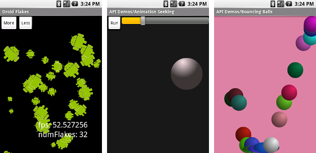
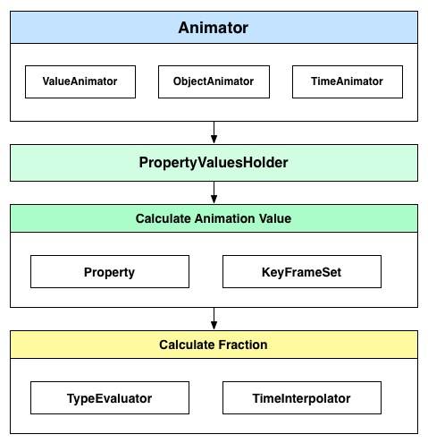
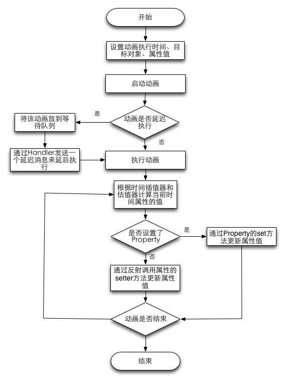
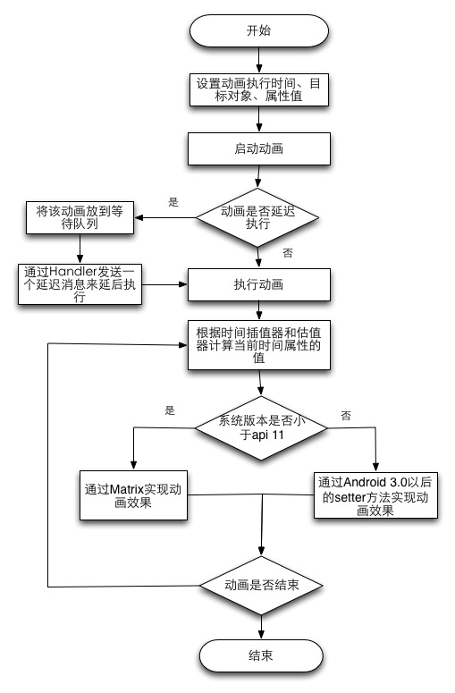

NineOldAnimations 源码解析
====================================
> 本文为 [Android 开源项目源码解析](https://github.com/android-cn/android-open-project-analysis) 中 NineOldAnimations 部分  
> 项目地址：[NineOldAnimations](https://github.com/JakeWharton/NineOldAndroids)，分析的版本：[d582f0e](https://github.com/JakeWharton/NineOldAndroids/commit/d582f0ec8e79013e9fa96c07986160b52e662e63 "Commit id is d582f0ec8e79013e9fa96c07986160b52e662e63")，Demo 地址：[NineoldAnimations Demo](https://github.com/aosp-exchange-group/android-open-project-demo/tree/master/nineoldanimations-demo)    
> 分析者：[Mr.Simple](https://github.com/bboyfeiyu)，校对者：[lightSky](https://github.com/lightSky)，校对状态：未完成   
 

###1. 功能介绍  
   NineOldAndroids是一款支持在低版本( api 11以下 )使用Android属性动画以及3D旋转动画的框架，它提供了一系列如ViewAnimator,ObjectAnimator,ViewPropertyAnimator等API来完成这些动画,解决了Android动画框架在低版本的兼容性问题。在api 11 ( Honeycomb (Android 3.0) )后Android推出了属性动画、X轴翻转等动画效果，但是这些效果却不能运行在api 11以下,NineOldAndroids的出现使得这些动画效果能够兼容低版本系统，保证动画在各个系统版本能够完美运行。     
   
         
   
####1.1 系统属性动画与NOA简单比较  
NineOldAndroids提供了和系统属性一样的动画功能。看源码你可以发现，其实NOA的架构实现和系统属性动画实现架构其实是一样的。只是兼容的那一部分采用了Matrix实现了各种动画效果，中间多了一些辅助类，比如 PreHoneycombCompat，AnimatorProxy，ViewHelper，另外某些类对于兼容有些改动，其它的类几乎和系统属性动画部分是一样的。

####1.2 实现原理
在[属性动画基础](https://github.com/aosp-exchange-group/android-open-project-analysis/blob/master/tech/anim.md)中已经提到：ValueAnimator的缺点是需要通过实现AnimatorUpdateListener自己手动去更新属性值，它的子类ObjectAnimator为用户实现了自动更新动画，但是对于自定义的属性，需要提供标准JavaBean的setter和getter方法，以便获取和更新属性值。NOA也是遵循了这样的实现思路，对于3.0之前的系统来说，属性动画中所提供的属性都是新的，在实现的时候也就都属于自定义的。NOA在PreHoneycombCompat中定义了这些属性，并在get和setValue中提供了标准的setter和getter方法用于设置和获取属性值，这里的setter和getter其实是直接调用AnimatorProxy类的方法。

###2. 总体设计
     
   以上是NineoldAnimations的整体设计图,其实就是系统属性动画的整体设计。Animator通过PropertyValuesHolder来更新对象的目标属性。如果用户没有设置目标属性的Property对象,那么会通过反射的形式调用目标属性的setter方法来更新属性值;否则则通过Property的set方法来设置属性值。这个属性值则通过KeyFrameSet的计算得到,而KeyFrameSet又是通过时间插值器TimeInterpolator和类型估值器TypeEvaluator来计算。在动画执行过程中不断地计算当前时刻目标属性的值,然后更新属性值来达到动画效果。       
   
   
###2.1 类详细介绍

在进行下一步的分析之前，我们先来了解一下NineOldAndroids中一些核心的类以及它们的作用。    

*    **ValueAnimator** :  该类是Animator的子类,实现了动画的整个处理逻辑,也是NineOldAndroids最为核心的类；     

*    **ObjectAnimator**  :  对象属性动画的操作类，继承自ValueAnimator,通过该类使用动画的形式操作对象的属性；    
              
*    **TimeInterpolator** : 时间插值器,它的作用是根据时间流逝的百分比来计算出当前属性值改变的百分比，系统预置的有LinearInterpolator（线性插值器：匀速动画）、AccelerateDecelerateInterpolator（加速减速插值器：动画两头慢中间快）和DecelerateInterpolator（减速插值器：动画越来越慢）等；   
  
*    **TypeEvaluator** :  TypeEvaluator的中文翻译为类型估值算法，它的作用是根据当前属性改变的百分比来计算改变后的属性值，系统预置的有IntEvaluator（针对整型属性）、FloatEvaluator（针对浮点型属性）和ArgbEvaluator（针对Color属性）；        

*    **Property** ： 属性对象,主要是定义了属性的set和get方法；  

*    **PropertyValuesHolder** ： PropertyValuesHolder是持有目标属性Property、setter和getter方法、以及KeyFrameSet的类；     

*    **KeyFrame** ： 一个keyframe对象由一对 time / value的键值对组成，可以为动画定义某一特定时间的特定状态，Animator传入的一个个参数映射为一个个keyframe，存储相应的动画的触发时间和属性值；  

*    **KeyFrameSet** ： 存储一个动画的关键帧集合;  

*    **AnimationProxy** ： 兼容属性动画的最终实现类，每一个应用属性的方法，都会有以下两个步骤：prepareForUpdate(); invalidateAfterUpdate();  而动画的平移和旋转是通过Matrix实现的；  

*    **PreHoneycombCompat** 创建了3.0属性动画中的所有属性，并提供了setter和getter方法获取和更新属性值；  

*    **ViewHelper** ： 设置各种动画值的帮助类,可以简单的设置并应用动画值。内部先做是否需要代理的判断，然后调用不同的实现，NOA的具体实现其实在AnimatorProxy中完成的；  

核心类更详细多介绍，请参考[公共技术点动画基础](https://github.com/aosp-exchange-group/android-open-project-analysis/blob/master/tech/anim.md)部分

### 2.2 基本使用 
**示例1:**      
 改变一个对象（myObject）的 translationY属性，让其沿着Y轴向上平移一段距离：它的高度，该动画在默认时间内完成，动画的完成时间是可以定义的，想要更灵活的效果我们还可以定义插值器和估值算法，但是一般来说我们不需要自定义，系统已经预置了一些，能够满足常用的动画。 

```
ObjectAnimator.ofFloat(myObject, "translationY", -myObject.getHeight()).start();  
```     

**示例2:**        
改变一个对象的背景色属性，典型的情形是改变View的背景色，下面的动画可以让背景色在3秒内实现从0xFFFF8080到0xFF8080FF的渐变，并且动画会无限循环而且会有反转的效果。  

```
ValueAnimator colorAnim = ObjectAnimator.ofInt(this, "backgroundColor", /*Red*/0xFFFF8080, /*Blue*/0xFF8080FF);  
colorAnim.setDuration(3000);  
colorAnim.setEvaluator(new ArgbEvaluator());  
colorAnim.setRepeatCount(ValueAnimator.INFINITE);  
colorAnim.setRepeatMode(ValueAnimator.REVERSE);  
colorAnim.start();  
```    


**示例3：**     
动画集合，5秒内对View的旋转、平移、缩放和透明度都进行了改变 。

``` 
AnimatorSet set = new AnimatorSet();  
set.playTogether(  
    ObjectAnimator.ofFloat(myView, "rotationX", 0, 360),  
    ObjectAnimator.ofFloat(myView, "rotationY", 0, 180),  
    ObjectAnimator.ofFloat(myView, "rotation", 0, -90),  
    ObjectAnimator.ofFloat(myView, "translationX", 0, 90),  
    ObjectAnimator.ofFloat(myView, "translationY", 0, 90),  
    ObjectAnimator.ofFloat(myView, "scaleX", 1, 1.5f),  
    ObjectAnimator.ofFloat(myView, "scaleY", 1, 0.5f),  
    ObjectAnimator.ofFloat(myView, "alpha", 1, 0.25f, 1)  
);  
set.setDuration(5 * 1000).start();  
```   

**示例4:**      
下面是个简单的调用方式，其animate方法是nineoldandroids特有的,动画持续时间为2秒,在Y轴上旋转720度,并且平移到(100, 100)的位置。

```
Button myButton = (Button)findViewById(R.id.myButton);  
animate(myButton).setDuration(2000).rotationYBy(720).x(100).y(100);    
```   

更多使用可参考lightSky的一篇文章[PropertyAnim 实际应用](http://www.lightskystreet.com/2014/12/10/propertyview-anim-practice/),介绍了一些基本使用以及GitHub上使用了NOA的动画开源库


###3. 流程图

#### 3.1 ValueAnimator流程图
   


#### 3.2 View的ObjectAnimator流程图



###4. 详细设计

  
上图左侧其实和系统属性动画的结构是一样的，右侧的AnimatorProxy和ViewHelper是NOA中特有的辅助类。

#### 4.1 核心原理分析

##### 4.1.1 ValueAnimator.java 
ObjectAnimator是ValueAnimator的子类,ObjectAnimator负责的是属性动画,但是真正对于动画进行操作的类实际上是ValueAnimator,它定义了nineoldandroids的执行逻辑,是nineoldandroids的核心之一。
   启动动画时,会将Animator自身添加到等待执行的动画队列中(sPendingAnimations),然后通过AnimationHandler发送一个ANIMATION_START的消息来通知nineoldandroids启动动画。     
   
```
    private void start(boolean playBackwards) {
        if (Looper.myLooper() == null) {
            throw new AndroidRuntimeException("Animators may only be run on Looper threads");
        }
      
      	// ......
        sPendingAnimations.get().add(this);
   		// ...... 
   
        AnimationHandler animationHandler = sAnimationHandler.get();
        if (animationHandler == null) {
            animationHandler = new AnimationHandler();
            sAnimationHandler.set(animationHandler);
        }
        animationHandler.sendEmptyMessage(ANIMATION_START);
    }
    
```           
       
  AnimationHandler是ValueAnimator的内部类,它的职责是处理动画的持续执行。      
	
``` 
 	private static class AnimationHandler extends Handler {
        @Override
        public void handleMessage(Message msg) {
            boolean callAgain = true;
            ArrayList<ValueAnimator> animations = sAnimations.get();
            ArrayList<ValueAnimator> delayedAnims = sDelayedAnims.get();
            switch (msg.what) {
                case ANIMATION_START:
                    ArrayList<ValueAnimator> pendingAnimations = sPendingAnimations.get();
                    // 启动在等待队列中的动画,然后进入ANIMATION_FRAME进行循环执行 
                case ANIMATION_FRAME:
                    // 根据启动时间来判断是否启动等待中的动画,如果是已经启动的动画,则根据时间点来计算此刻该动画应该得到的属性值
                    //,并且跟新属性,如果此时动画没有执行完成,则又会通过发布一个ANIMATION_FRAME消息,使得在此进入到这个代码段,
                    // 这样就相当于循环执行动画,直到动画完成
            }
        }
    }
```      	

   在前文中已经说过,如果是属性动画,且系统低于API 11时会通过矩阵变换的形式来处理属性动画效果;否则会通过set + 属性名的形式调用目标对象的setter方法来达到更新属性值。这个版本兼容问题会在初始化动画时进行处理,处理这个问题的函数在ObjectAnimator的initAnimation中。 
   
``` 
    @Override
    void initAnimation() {
        if (!mInitialized) {
            //   注意这里，很重要
            if ((mProperty == null) && AnimatorProxy.NEEDS_PROXY 
            	&& (mTarget instanceof View) && PROXY_PROPERTIES.containsKey(mPropertyName)) {
                setProperty(PROXY_PROPERTIES.get(mPropertyName));
            }
            int numValues = mValues.length;
            for (int i = 0; i < numValues; ++i) {
                mValues[i].setupSetterAndGetter(mTarget);
            }
            super.initAnimation();
        }
    }
```        
   这里进行包装的属性动画主要是View的alpha、缩放、平移、旋转等几个主要动画。如果是其他类型对象,那么会在会通过该对象中的目标属性的setter和getter方法来访问,例如对象类型是一个自定义的MyCustomButton,它有一个属性为myText,用户通过属性动画修改它时就需要定义它的setter和getter方法,比如setMyText和getMyText,这样nineoldanimations就会在动画执行时通过反射来调用setter方法进行更新对象属性。       
   
   
##### 4.1.2 ObjectAnimator.java   
  ObjectAnimator是属性动画的入口类,用户通过上述一系列的静态工厂函数来构建ObjectAnimator,设置完基本属性之后,用户需要设置动画执行时间、重复模式等其他属性（可选）。
   上述几个静态函数中,参数1都是需要动画的目标对象,参数二要操作的属性名称,参数三是目标属性的取值范围,如果传递一个值那么该值就是目标属性的最终值;如果传递的是两个值,那么第一个值为起始值,第二个为最终值。       
   
**(1)主要函数**     

```    
    public static ObjectAnimator ofInt(Object target, String propertyName, int... values) ;


    public static <T> ObjectAnimator ofInt(T target, Property<T, Integer> property, int... values) ;


    public static ObjectAnimator ofFloat(Object target, String propertyName, float... values) ;


    public static <T> ObjectAnimator ofFloat(T target, Property<T, Float> property,
            float... values) ;

    public static ObjectAnimator ofObject(Object target, String propertyName,
            TypeEvaluator evaluator, Object... values) ;
            
```     
    
 `ValueAnimator`和`ObjectAnimator`都可以完成属性动画，但它们之间的区别和优劣可以参考[公共技术点动画基础](https://github.com/aosp-exchange-group/android-open-project-analysis/blob/master/tech/anim.md)的相关部分
 
##### 4.1.3  KeyFrameSet.java 
   关键帧集合类在动画运行时会根据流逝的时间因子 ( fraction )和类型估值器来计算当前时间目标属性的最新值,然后将这个值通过反射或者Property的set方法设置给目标对象。下面是获取当前属性值的计算函数。     

```

    public Object getValue(float fraction) {

        // Special-case optimization for the common case of only two keyframes
        if (mNumKeyframes == 2) {
            if (mInterpolator != null) {
                fraction = mInterpolator.getInterpolation(fraction);
            }
            return mEvaluator.evaluate(fraction, mFirstKeyframe.getValue(),
                    mLastKeyframe.getValue());
        }
        if (fraction <= 0f) {
            final Keyframe nextKeyframe = mKeyframes.get(1);
            final /*Time*/Interpolator interpolator = nextKeyframe.getInterpolator();
            if (interpolator != null) {
                fraction = interpolator.getInterpolation(fraction);
            }
            final float prevFraction = mFirstKeyframe.getFraction();
            float intervalFraction = (fraction - prevFraction) /
                (nextKeyframe.getFraction() - prevFraction);
            return mEvaluator.evaluate(intervalFraction, mFirstKeyframe.getValue(),
                    nextKeyframe.getValue());
        } else if (fraction >= 1f) {
            final Keyframe prevKeyframe = mKeyframes.get(mNumKeyframes - 2);
            final /*Time*/Interpolator interpolator = mLastKeyframe.getInterpolator();
            if (interpolator != null) {
                fraction = interpolator.getInterpolation(fraction);
            }
            final float prevFraction = prevKeyframe.getFraction();
            float intervalFraction = (fraction - prevFraction) /
                (mLastKeyframe.getFraction() - prevFraction);
            return mEvaluator.evaluate(intervalFraction, prevKeyframe.getValue(),
                    mLastKeyframe.getValue());
        }
        Keyframe prevKeyframe = mFirstKeyframe;
        for (int i = 1; i < mNumKeyframes; ++i) {
            Keyframe nextKeyframe = mKeyframes.get(i);
            if (fraction < nextKeyframe.getFraction()) {
                final /*Time*/Interpolator interpolator = nextKeyframe.getInterpolator();
                if (interpolator != null) {
                    fraction = interpolator.getInterpolation(fraction);
                }
                final float prevFraction = prevKeyframe.getFraction();
                float intervalFraction = (fraction - prevFraction) /
                    (nextKeyframe.getFraction() - prevFraction);
                return mEvaluator.evaluate(intervalFraction, prevKeyframe.getValue(),
                        nextKeyframe.getValue());
            }
            prevKeyframe = nextKeyframe;
        }
        // shouldn't reach here
        return mLastKeyframe.getValue();
    }
    
```     

 
##### 4.1.4 PropertyValuesHolder.java
   PropertyValuesHolder是持有目标属性Property、setter和getter方法、以及关键帧集合的类。如果没有属性的mProperty不为空,比如用户使用了内置的Property或者自定义实现了Property,并且设置给了动画类,那么在更新动画时则会使用Property对象的set方法来更新属性值。否则在初始化时PropertyValuesHolder会拼装属性的setter和getter函数 ( 注意这里的setter和上面说的Property对象的set方法是两码事 ) ,然后检测目标对象中是否含有这些方法,如果含有则获取setter和getter。 
   
```
    void setupSetter(Class targetClass) {
        mSetter = setupSetterOrGetter(targetClass, sSetterPropertyMap, "set", mValueType);
    }
    
	// 通过KeyFrameSet计算属性值
    void calculateValue(float fraction) {
        mAnimatedValue = mKeyframeSet.getValue(fraction);
    }
    
    // ...... 
    
    void setAnimatedValue(Object target) {
        if (mProperty != null) {
        	// 获取新值,并且通过Property的set方法更新值
            mProperty.set(target, getAnimatedValue());
        }
        // 如果没有设置Property,那么通过属性的setter来反射调用更新
        if (mSetter != null) {
            try {
                mTmpValueArray[0] = getAnimatedValue();
                mSetter.invoke(target, mTmpValueArray);
            } catch (InvocationTargetException e) {
                Log.e("PropertyValuesHolder", e.toString());
            } catch (IllegalAccessException e) {
                Log.e("PropertyValuesHolder", e.toString());
            }
        }
    }
    
```    
   在动画执行时通过关键帧中的插值器和类型估值器来计算最新的属性值( 见calculatVealue函数 ),然后通过反射调用setter方法或者Property对象的set方法设置给目标对象来更新目标属性,循环执行这个过程就实现了动画效果。   
   

###5. 杂谈
NineoldAnimations总得来说还是比较不错的，在开发过程中起到了很大的作用。但是从设计角度上看,它可能并不是特别的好,例如代码中到处充斥着没有进行类型检查的警告,也可能是这个库本身存在太多的可变性,导致难以周全。
该项目目前已经标识为DEPRECATED,作者的原意应该是不再更新该库,因为它已经比较稳定,希望朋友们不要误以为是不再建议使用该库的意思。       
