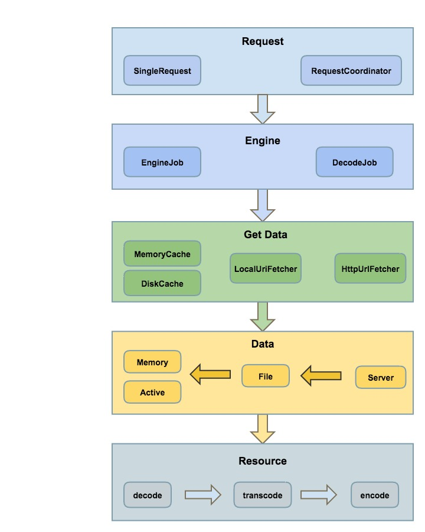
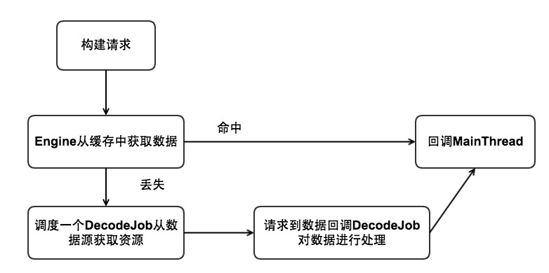
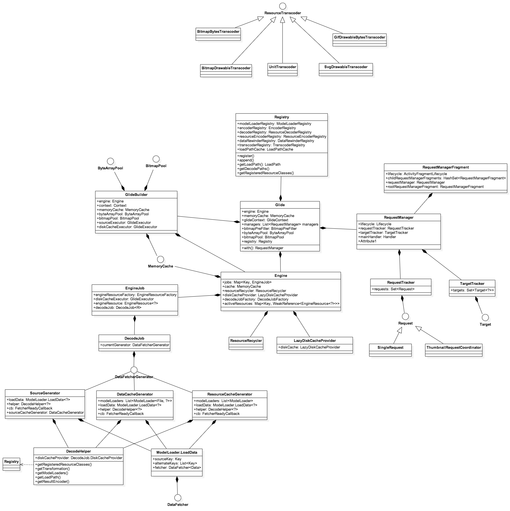
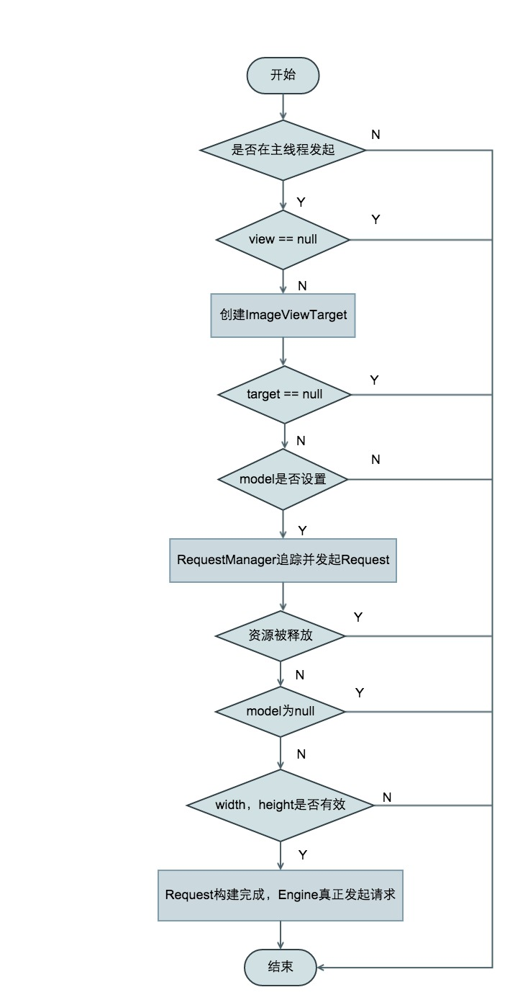
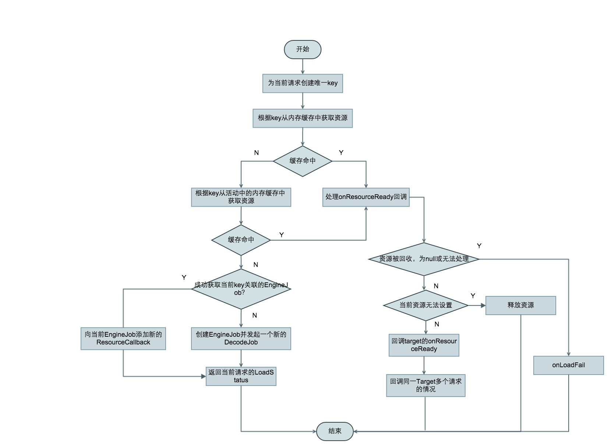
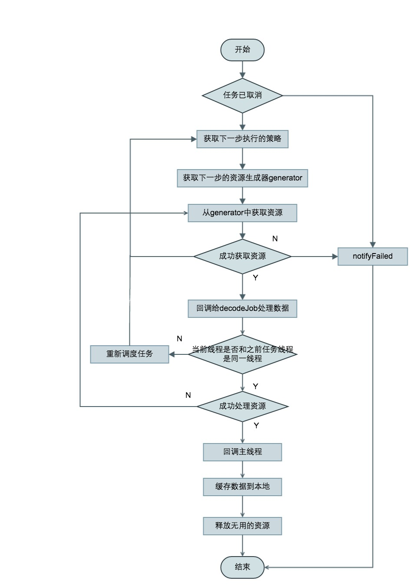
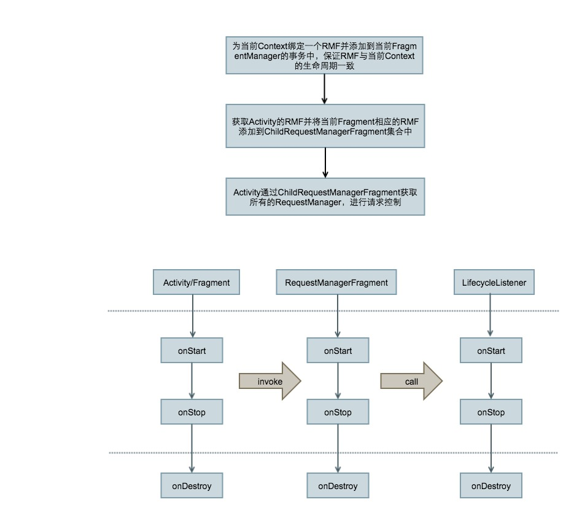
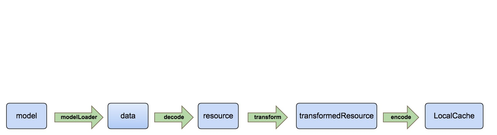
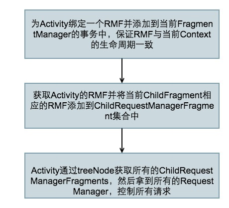

# Glide 源码解析

====================================
> 本文为 [Android 开源项目源码解析](http://a.codekk.com) 中 Glide 部分  
项目地址：[Glide](https://github.com/bumptech/glide)，分析的版本：[cb640b2](https://github.com/bumptech/glide/commit/cb640b2221044fe272ea6a249772cf71ba0d5fab)，Demo 地址：[Glide Demo](https://github.com/android-cn/android-open-project-demo/tree/master/${项目 Demo 地址})    
分析者：[lightSky](https://github.com/lightSky)，分析状态：未完成，校对者：[Trinea](https://github.com/Trinea)，校对状态：未开始   

### 1. 功能介绍  
图片加载框架，相对于 UniversalImageLoader，Picasso，它还支持 video，Gif，SVG 格式，支持缩略图请求，旨在打造更好的列表图片滑动体验。Glide 有生命周期的概念（主要是对请求进行 pause，resume，clear），而且其生命周期与 Activity/Fragment 的生命周期绑定，支持 Volley，OkHttp，并提供了相应的 integration libraries，内存方面也更加友好。

### 2. 总体设计
#### 2.1 总体设计图
  

#### 2.2 Glide 中的概念

**Glide**  
使用 RequestBuilder 创建 request 的静态接口，并持有 Engine，BitmapPool，DiskCache，MemoryCache。
实现了 ComponentCallbacks2，注册了低内存情况的回调。当内存不足的时候，进行相应的内存清理。回调的发生在 RequestManagerFragment 的 onLowMemory 和 onTrimMemory 中。  
更详细的介绍可参考**4.2.1 Glide** 

**GlideBuilder**  
为 Glide 设置一些默认配置，比如：Engine，MemoryCache，DiskCache，RequestOptions，GlideExecutor，MemorySizeCalculator

**GlideModule**  
可以通过 GlideBuilder 进行一些延迟的配置和 ModelLoaders 的注册。

**注意：**   
所有的实现的 module 必须是 public 的，并且只拥有一个空的构造函数，以便 Glide 懒加载的时候可以通过反射调用。
GlideModule 是不能指定调用顺序的。因此在创建多个 GlideModule 的时候，要注意不同 Module 之间的 setting 不要冲突了。
如何创建 Module，请参看 Demo

**Engine**  
负责任务创建，发起，回调，资源的管理
详细介绍请参考**4.2.3 Engine**

**DecodeJob**  
调度任务的核心类，整个请求的繁重工作都在这里完成,处理来自缓存或者原始的资源，应用转换动画以及 transcode。  
详细介绍请参考**4.2.5 DecodeJob**  

**ModelLoader**  
各种资源的 ModelLoader<Model, Data> 

该接口有两个目的： 

- 将任意复杂的 model 转换为可以被 decode 的数据类型
- 允许 model 结合 View 的尺寸获取特定大小的资源

更详细的介绍请参考 **4.2.19 ModelLoader**  

**Resource**  
对资源进行包装的接口，提供 get，recycle，getSize，以及原始类的 getResourceClass 方法。
resource 包下也就是各种资源：bitmap，bytes，drawable，file，gif，以及相关解码器，转换器

**Target**  
request 的载体，各种资源对应的加载类，含有生命周期的回调方法，方便开发人员进行相应的准备以及资源回收工作。

**ThumbnailRequestCoordinator**  
请求协调器，包含两个请求：缩略图请求＋完整图片请求  

**数据相关概念**  

- data ：代表原始的，未修改过的资源，对应 dataClass
- resource : 修改过的资源，对应 resourceClass
- transcoder : 资源转换器，比如 BitmapBytesTranscoder（Bitmap 转换为 Bytes），GifDrawableBytesTranscoder
- ResourceEncoder : 持久化数据的接口，注意，该类并不与 decoder 相对应，而是用于本地缓存的接口
- ResourceDecoder : 数据解码器,比如 ByteBufferGifDecoder（将 ByteBuffer 转换为 Gif），StreamBitmapDecoder（Stream 转换为 Bitmap）
- ResourceTranscoder : 资源转换器，将给定的资源类型，转换为另一种资源类型，比如将 Bitmap 转换为 Drawable，Bitmap 转换为 Bytes  
- Transformation : 比如对图片进行 FitCenter，CircleCrop，CenterCrop 的 transformation，或者根据给定宽高对 Bitmap 进行处理的 BitmapDrawableTransformation  
  
**Registry**  
对 Glide 所支持的 Encoder ，Decoder ，Transcoder 组件进行注册  
因为 Glide 所支持的数据类型太多，把每一种的数据类型及相应处理方式的组合形象化为一种组件的概念。通过 registry 的方式管理。
如下，注册了将使用 BitmapDrawableTranscoder 将 Bitmap 转换为 BitmapDrawable 的组件。

```java
Registry.register(Bitmap.class, BitmapDrawable.class,new BitmapDrawableTranscoder(resources, bitmapPool))
```

关于 Decoder，Transcoder 和 Registry 的详细介绍请参考**4.2.18 Registry**  


### 3. 流程图

  


### 4. 详细设计
#### 4.1 类关系图

  

#### 4.2 类详细介绍
##### 4.2.1 Glide  
向外暴露单例静态接口，构建 Request，配置资源类型，缓存策略，图片处理等，可以直接通过该类完整简单的图片请求和填充。内存持有一些内存变量`BitmapPool`，`MemoryCache`，`ByteArrayPool`，便于低内存情况时自动清理内存。

##### 4.2.2 RequestBuilder 
创建请求，资源类型配置，缩略图配置，以及通过 BaseRequestOptions 进行一些默认图，图片处理的配置  

**主要函数**  
(1) **thumbnail(@Nullable RequestBuilder<TranscodeType> thumbnailRequest)**  
配置缩略图的请求，如果配置的缩略图请求在完整的图片请求完成前回调，那么该缩略图会展示，如果在完整请求之后，那么缩略图就无效。Glide 不会保证缩略图请求和完整图片请求的顺序。 

(2) **多个 load 重载的方法**  
指定加载的数据类型  
load(@Nullable Object model)  
load(@Nullable String string)  
load(@Nullable Uri uri)  
load(@Nullable File file)  
load(@Nullable Integer resourceId)  
load(@Nullable URL url)  
load(@Nullable byte[] model)

(3) **buildRequest(Target<TranscodeType> target)**   
创建请求，如果配置了 thumbnail（缩略图）请求，则构建一个 ThumbnailRequestCoordinator（包含了 FullRequest 和 ThumbnailRequest）请求，否则简单的构建一个 Request。  

(4) **into(Y target)**  
设置资源的 Target，并创建，绑定，跟踪，发起请求

**整个请求的创建流程图**  
  

### 4.2.3 Engine
任务创建，发起，回调，管理存活和缓存的资源

**主要函数**  

**(1) loadFromCache(Key key, boolean isMemoryCacheable)**   
从内存缓存中获取资源，获取成功后会放入到 activeResources 中

**(2) loadFromActiveResources**  
从存活的资源中加载资源，资源加载完成后，再将这个缓存数据放到一个 value 为软引用的 activeResources map 中，并计数引用数，在图片加载完成后进行判断，如果引用计数为空则回收掉。

**(3) getReferenceQueue**  
activeResources 是一个持有缓存 WeakReference 的 Map 集合。ReferenceQueue 就是提供资源 WeakReference 的虚引用队列。
`activeResources.put(key, new ResourceWeakReference(key, cached, getReferenceQueue()));`  
这里要提的是负责清除 WeakReference 被回收的 activeResources 资源的实现：  
使用到了 MessageQueue.IdleHandler，源码的注释：当一个线程等待更多 message 的时候会触发该回调,就是 messageQuene 空闲的时候会触发该回调

```java
/**
* Callback interface for discovering when a thread is going to block
* waiting for more messages.
*/
public static interface IdleHandler {
/**
* Called when the message queue has run out of messages and will now
* wait for more.  Return true to keep your idle handler active, false
* to have it removed.  This may be called if there are still messages
* pending in the queue, but they are all scheduled to be dispatched
* after the current time.
*/
boolean queueIdle();
}

resourceReferenceQueue = new ReferenceQueue<>();
MessageQueue queue = Looper.myQueue();
queue.addIdleHandler(new RefQueueIdleHandler(activeResources, resourceReferenceQueue));

```

`RefQueueIdleHandler`实现了`MessageQueue.IdleHandler`接口，该接口有一个`queueIdle`方法，负责清除 WeakReference 被回收的 activeResources 资源。

(4) **load(
GlideContext glideContext,
Object model,
Key signature,
int width,
int height,
Class<?> resourceClass,
Class<R> transcodeClass,
Priority priority,
DiskCacheStrategy diskCacheStrategy,
Map<Class<?>, Transformation<?>> transformations,
boolean isTransformationRequired,
Options options,
boolean isMemoryCacheable,
ResourceCallback cb)**   
真正的开始加载资源，看下面的流程图

**load 调用处理流程图：**  
注：DecodeJob 是整个任务的核心部分，在下面 DecodeJob 中有详细介绍，这里主要整个流程  


### 4.2.4 EngineJob 
调度 DecodeJob，添加，移除资源回调，并 notify 回调    

#### 主要方法  
**(1)start(DecodeJob<R> decodeJob)**  
调度一个 DecodeJob 任务  

**(2) MainThreadCallback**  
实现了 Handler.Callback 接口，用于 Engine 任务完成时回调主线程  

### 4.2.5  DecodeJob
实现了 Runnable 接口，调度任务的核心类，整个请求的繁重工作都在这里完成：处理来自缓存或者原始的资源，应用转换动画以及 transcode。  
负责根据缓存类型获取不同的 Generator 加载数据，数据加载成功后回调 DecodeJob 的 onDataFetcherReady 方法对资源进行处理

#### 主要方法  

**(1) runWrapped()**  
根据不同的 runReason 执行不同的任务，共两种任务类型：

- runGenerators():load 数据  
- decodeFromRetrievedData()：处理已经 load 到的数据

**RunReason**  
再次执行任务的原因，三种枚举值：  

- INITIALIZE:第一次调度任务
- WITCH_TO_SOURCE_SERVICE:本地缓存策略失败，尝试重新获取数据，两种情况；当 stage 为 Stage.SOURCE，或者获取数据失败并且执行和回调发生在了不同的线程
- DECODE_DATA:获取数据成功，但执行和回调不在同一线程，希望回到自己的线程去处理数据

**(2) getNextStage**  
获取下一步执行的策略，一共 5 种策略：  
`INITIALIZE`，`RESOURCE_CACHE`，`DATA_CACHE`，`SOURCE`，`FINISHED`  

其中加载数据的策略有三种：  
`RESOURCE_CACHE`，`DATA_CACHE`，`SOURCE`，
分别对应的 Generator:  

- `ResourceCacheGenerator`  ：尝试从修改过的资源缓存中获取，如果缓存未命中，尝试从 DATA_CACHE 中获取
- `DataCacheGenerator`  尝试从未修改过的本地缓存中获取数据，如果缓存未命中则尝试从 SourceGenerator 中获取
- `SourceGenerator`  从原始的资源中获取，可能是服务器，也可能是本地的一些原始资源

策略的配置在 DiskCacheStrategy。开发者可通过 BaseRequestOptions 设置：  

- ALL
- NONE
- DATA
- RESOURCE
- AUTOMATIC（默认方式，依赖于 DataFetcher 的数据源和 ResourceEncoder 的 EncodeStrategy）

**(3) getNextGenerator**  
根据 Stage 获取到相应的 Generator 后会执行 currentGenerator.startNext()，如果中途 startNext 返回 true，则直接回调，否则最终会得到 SOURCE 的 stage，重新调度任务

**(4) startNext**  
从当前策略对应的 Generator 获取数据，数据获取成功则回调 DecodeJob 的`onDataFetcherReady`对资源进行处理。否则尝试从下一个策略的 Generator 获取数据。

**(5) reschedule**   
重新调度当前任务  

**(6) decodeFromRetrievedData**  
获取数据成功后，进行处理，内部调用的是`runLoadPath(Data data, DataSource dataSource,LoadPath<Data, ResourceType, R> path)`    

**(7) DecodeCallback.onResourceDecoded**    
decode 完成后的回调，对 decode 的资源进行 transform
path.load(rewinder, options, width, height,
new DecodeCallback<ResourceType>(dataSource));

**数据加载流程图**   
class

#### 4.2.6  LoadPath  
根据给定的数据类型的 DataFetcher 尝试获取数据，然后尝试通过一个或多个 decodePath 进行 decode。  

#### 4.2.7  DecodePath
根据指定的数据类型对 resource 进行 decode 和 transcode

#### 4.2.8 RequestTracker
追踪，取消，重启失败，正在处理或者已经完成的请求  

**重要方法**  

**(1) resumeRequests**   
重启所有未完成或者失败的请求，Activity/Fragment 的生命周期`onStart`的时候，会触发 RequestManager 调用该方法 

**(2) pauseRequests**   
停止所有的请求，Activity/Fragment 的生命周期`onStop`的时候，会触发 RequestManager 调用该方法。  

**(3) clearRequests**   
取消所有的请求并清理它们的资源,Activity/Fragment 的生命周期`onDestory`的时候，会触发 RequestManager 调用该方法。  

**(4) restartRequests**   
重启失败的请求，取消并重新启动进行中的请求,网络重新连接的时候，会调用该方法重启请求。  

**(5) clearRemoveAndRecycle**  
停止追踪指定的请求，清理，回收相关资源。


#### 4.2.9 TargetTracker
持有当前所有存活的 Target，并触发 Target 相应的生命周期方法。方便开发者在整个请求过程的不同状态中进行回调，做相应的处理。  

#### 4.2.10  RequestManager 
核心类之一，用于 Glide 管理请求。  
可通过 Activity/Fragment/Connectivity（网络连接监听器）的生命周期方法进行 stop,start 和 restart 请求。

**重要方法**  
**(1) resumeRequests**  
在 onStart 方法中调用，其实是通过 requestTracker 处理,同时也会调用`targetTracker.onStart();`回调 Target 相应周期方法。

**(2) pauseRequests**
在 onStop 方法中调用，其实是通过 requestTracker 处理，同时也会调用`targetTracker.onStop();`回调 Target 相应周期方法  

**(3) onDestroy**
调用`targetTracker.onDestroy();`，`requestTracker.clearRequests();`，`lifecycle.removeListener(this);`等进行资源清理。  

**(4) resumeRequestsRecursive**  
递归重启所有 RequestManager 下的所有 request。在 Glide 中源码中没有用到，暴露给开发者的接口。

**(5) pauseRequestsRecursive**  
递归所有 childFragments 的 RequestManager 的`pauseRequest`方法。同样也只是暴露给开发者的接口。  
childFragments 表示那些依赖当前 Activity 或者 Fragment 的所有 fragments   

- 如果当前 Context 是 Activity，那么依附它的所有 fragments 的请求都会中止  
- 如果当前 Context 是 Fragment，那么依附它的所有 childFragment 的请求都会中止  
- 如果当前的 Context 是 ApplicationContext，或者当前的 Fragment 处于 detached 状态，那么只有当前的 RequestManager 的请求会被中止

**注意：**  
在 Android 4.2 AP17 之前，如果当前的 context 是 Fragment（当 fragment 的 parent 如果是 activity，fragment.getParentFragment()直接返回 null），那么它的 childFragment 的请求并不会被中止。原因是在 4.2 之前系统不允许获取 parent fragment，因此不能确定其 parentFragment。 但 v4 的 support Fragment 是可以的，因为 v4 包的 Fragment 对应的 SupportRequestManagerFragment 提供了一个 parentFragmentHint，它相当于 Fragment 的 ParentFragment。在 RequestManagerRetriever.get(support.V4.Fragment fragment)的时候将参数 fragment 作为 parentFragmentHint。 

**(6) registerFragmentWithRoot**  
获取 Activity 相应的 RequestManagerFragment，并添加到 Activity 的事务当中去，同时将当前的 Fragment 添加到 childRequestManagerFragments 的 HashSet 集合中去，以便在`pauseRequestsRecursive`和`resumeRequestsRecursive`方法中调用`RequestManagerTreeNode.getDescendants()`的时候返回所有的 childFragments。在 RequestManagerFragment 的`onAttach`方法以及`setParentFragmentHint`方法中调用。

**(6) unregisterFragmentWithRoot**  
对应上面的 registerFragmentWithRoot 方法，在 RequestManagerFragment 的 onDetach，onDestroy 或者重新 register 前将当前的 fragment 进行 remove

很重要的一个相关类:`RequestManagerFragment`。  
当 Glide.with(context)获取 RequestManager 的时候，Glide 都会先尝试获取当前上下文相关的 RequestManagerFragment。  

RequestManagerFragment 初始化时会创建一个 ActivityFragmentLifecycle 对象，并在创建自己的 Request Manager 的时候同时传入，这样 ActivityFragmentLifecycle 便成了它们之间的纽带。RequestManagerFragment 生命周期方法触发的时候，就可以通过 ActivityFragmentLifecycle 同时触发 RequestManager 相应的方法，执行相应的操作。  

Request Manager 通过 ActivityFragmentLifecycle 的 addListener 方法注册一些 LifecycleListener。当 RequestManagerFragment 生命周期方法执行的时候，触发 ActivityFragmentLifecycle 的相应方法，这些方法会遍历所有注册的 LifecycleListener 并执行相应生命周期方法。

RequestManager 注册的 LifecycleListener 类型

- RequestManager 自身  
RequestManager 自己实现了 LifecycleListener。主要的请求管理也是在这里处理的。

- RequestManagerConnectivityListener，该 listener 也实现了 LifecycleListener，用于网络连接时进行相应的请求恢复。 这里的请求是指那些还未完成的请求，已经完成的请求并不会重新发起。
另外 Target 接口也是直接继承自 LifecycleListener，因此 RequestManager 在触发相应的生命周期方法的时候也会调用所有 Target 相应的生命周期方法，这样开发者可以监听资源处理的整个过程，在不同阶段进行相应的处理。

生命周期的管理主要由`RequestTracker`和`TargetTracker`处理。

**生命周期事件的传递**    



#### 4.2.11 RequestManagerFragment  
与当前上下文绑定的 Fragment，统一管理当前上下文下的所有 childFragment 的请求。  
每一个 Context 都会拥有一个 RequestManagerFragment，在自身的 Fragment 生命周期方法中触发 listener 相应的生命周期方法。 
复写了 onLowMemory 和 onTrimMemory，低内存情况出现的时候，会调用 RequestManager 的相应方法进行内存清理。  

释放的内存有：

- bitmapPool： 
- memoryCache： 
- byteArrayPool： 


#### 4.2.12 RequestManagerRetriever 
提供一些静态方法，用语创建或者从 Activity/Fragment 获取 RequestManager。  
get(Activity activity)
get(android.app.Fragment fragment)
get(Activity activity)  
get(FragmentActivity activity)
getSupportRequestManagerFragment

#### 4.2.13 RequestManagerTreeNode
上文提到获取所有 childRequestManagerFragments 的 RequestManager 就是通过该类获得，就一个方法：getDescendants，作用就是基于给定的 Context，获取所有层级相关的 RequestManager。上下文层级由 Activity 或者 Fragment 获得，ApplicationContext 的上下文不会提供 RequestManager 的层级关系，而且 Application 生命周期过长，所以 Glide 中对请求的控制只针对于 Activity 和 Fragment。

#### 4.2.14 LifecycleListener  
用于监听 Activity 或者 Fragment 的生命周期方法的接口，基本上请求相关的所有类都实现了该接口
- void onStart();
- void onStop();
- void onDestroy();  

#### 4.2.15 ActivityFragmentLifecycle  
用于注册，同步所有监听了 Activity 或者 Fragment 的生命周期事件的 listener 的帮助类。  

#### 4.2.16 DataFetcher
每一次通过 ModelLoader 加载资源的时候都会创建的实例。    
`loadData` ：异步方法，如果目标资源没有在缓存中找到时才会被调用,cancel 方法也是。     
`cleanup`：清理或者回收 DataFetcher 使用的资源，在 loadData 提供的数据被 decode 完成后调用。

**主要方法**  
**(1) DataCallback**  
用于数据加载结果的回调,三种 Generator 实现了该接口    
```java
//数据 load 完成并且可用时回调
void onDataReady(@Nullable T data);  
//数据 load 失败时回调
void onLoadFailed(Exception e);
```
**(2) getDataClass()**
返回 fetcher 尝试获取的数据类型

**(3) getDataSource()**
获取数据的来源

**(4) DataSource**
```
public enum DataSource {
//数据从本地硬盘获取，也有可能通过一个已经从远程获取到数据的 Content Provider
LOCAL,
//数据从远程获取
REMOTE,
//数据来自未修改过的硬盘缓存
DATA_DISK_CACHE,
//数据来自已经修改过的硬盘缓存
RESOURCE_DISK_CACHE,
//数据来自内存
MEMORY_CACHE,
}
```

#### 4.2.17  DataFetcherGenerator  
根据注册的 ModelLoaders 和 model 生成一系列的 DataFetchers。

**FetcherReadyCallback**  
DecodeJob 实现的接口，包含以下方法：  
`reschedule`：在 Glide 自己的线程上再次调用 startNext  
当 Generator 从 DataFetcher 完成 loadData 时回调，含有的方法：  
`onDataFetcherReady`：load 完成  
`onDataFetcherFailed`：load 失败  

#### 4.2.18  Registry  
管理组件（数据类型＋数据处理）的注册

**主要成员变量**  
- ModelLoaderRegistry ：注册所有数据加载的 loader
- ResourceDecoderRegistry：注册所有资源转换的 decoder  
- TranscoderRegistry：注册所有对 decoder 之后进行特殊处理的 transcoder
- ResourceEncoderRegistry：注册所有持久化 resource（处理过的资源）数据的 encoder
- EncoderRegistry ： 注册所有的持久化原始数据的 encoder

**标准的数据处理流程：**  


Glide 在初始化的时候，通过 Registry 注册以下所有组件， 每种组件由功能及处理的资源类型组成：

组件| 构成
:--|:-- |  
loader |   model＋data＋ModelLoaderFactory  
decoder |    dataClass＋resourceClass＋decoder  
transcoder |  resourceClass＋transcodeClass  
encoder  |    dataClass＋encoder  
resourceEncoder  | resourceClass + encoder
rewind  |    缓冲区处理

Decoder | 数据源 | 解码后的资源 | 
:--|:-- |:--  |
BitmapDrawableDecoder   | 	Bitmap              |		Drawable  
StreamBitmapDecoder     |  	InputStream         |  	Bitmap	
ByteBufferBitmapDecoder |	  ByteBuffer          |  	Bitmap  
GifFrameResourceDecoder | 	GifDecoder          |	 	Bitmap  
StreamGifDecoder 	      |	  InputStream         | 	GifDrawable  
ByteBufferGifDecoder	  |	  ByteBuffer          |	  Gif	  
SvgDecoder		          |		InputStream	        |   SVG  
VideoBitmapDecoder 	    |	  ParcelFileDescriptor|	  Bitmap  
FileDecoder             |		File                | 	file    
  
  
Transcoder | 数据源 | 转换后的资源 | 
:--|:-- |:--  |
BitmapBytesTranscoder   | 	Bitmap              |		Bytes  
BitmapDrawableTranscoder     |  	Bitmap         |  	Drawable	
GifDrawableBytesTranscoder |	  GifDrawable          |  	Bytes  
SvgDrawableTranscoder | 	Svg          |	 	Drawable  
  
  
`decode＋transcode`的处理流程称为 decodePath。  
LoadPath 是对 decodePath 的封装，持有一个 decodePath 的 List。在通过 modelloader.fetchData 获取到 data 后，会对 data 进行 decode，具体的 decode 操作就是通过 loadPath 来完成。resourceClass 就是 asBitmap，asDrawable 方法的参数。  
  
**ModelLoaderRegistry**  
持有多个 ModelLoader，model 和数据类型按照优先级进行处理

loader 注册示例：
```java
registry  
.append(Integer.class, InputStream.class, new ResourceLoader.StreamFactory())
.append(GifDecoder.class, GifDecoder.class, new UnitModelLoader.Factory<GifDecoder>())
```

**主要函数**  
**(1) register，append，prepend**  
注册各种功能的组件

**(2) getRegisteredResourceClasses(Class<Model> modelClass, Class<TResource> resourceClass, Class<Transcode> transcodeClass)**  
获取 Glide 初始化时注册的所有 resourceClass

**(3) getModelLoaders(Model model)**  

**(4) hasLoadPath(Class<?> dataClass)**  
判断注册的组件是否可以处理给定的 dataClass  

- 直接调用`getLoadPath(dataClass, resourceClass, transcodeClass)`  
- 该方法先从 loadPathCache 缓存中尝试获取 LoadPath,如果没有，则先根据 dataClass, resourceClass, transcodeClass 获取所有的 decodePaths，如果 decodePaths 不为空，则创建一个`LoadPath<>(dataClass, resourceClass, transcodeClass, decodePaths,exceptionListPool)` 并缓存起来。

**(5) getDecodePaths**  
根据 dataClass, resourceClass, transcodeClass 从注册的组件中找到所有可以处理的组合 decodePath。就是将满足条件的不同处理阶段（modelloader，decoder，transcoder）的组件组合在一起。满足处理条件的有可能是多个组合。因为 decodePath 的功能是进行 decode 和 transcode，所以 getDecodePath 的目的就是要找到符合条件的 decoder 和 transcoder 然后创建 DecodePath。  


#### 4.2.19   ModelLoader<Model, Data>

ModelLoader 是一个工厂接口。将任意复杂的 model 转换为准确具体的可以被 DataFetcher 获取的数据类型。
每一个 model 内部实现了一个 ModelLoaderFactory，内部实现就是将 model 转换为 Data

**重要成员**  
`LoadData<Data>`    
Key sourceKey，用于表明 load 数据的来源。
List<Key> alternateKeys：指向相应的变更数据
DataFetcher<Data> fetcher：用于获取不在缓存中的数据

**重要方法**  

**(1) buildLoadData**  
返回一个 LoadData

**(2) handles(Model model)**  
判断给定的 model 是否可以被当前 modelLoader 处理

#### 4.2.20  ModelLoaderFactory   
根据给定的类型，创建不同的 ModelLoader，因为它会被静态持有，所以不应该维持非应用生命周期的 context 或者对象。

#### 4.2.21 DataFetcherGenerator  
通过注册的 DataLoader 生成一系列的 DataFetcher  
`DataCacheGenerator`：根据未修改的缓存数据生成 DataFetcher  
`ResourceCacheGenerator`：根据已处理的缓存数据生成 DataFetcher  
`SourceGenerator`：根据原始的数据和给定的 model 通过 ModelLoader 生成的 DataFetcher  

#### 4.2.22 DecodeHelper
getPriority
getDiskCache
getLoadPath
getModelLoaders
getWidth
getHeight

#### 如何监测当前 context 的生命周期？
为当前的上下文 Activity 或者 Fragment 绑定一个 TAG 为"com.bumptech.glide.manager"的 RequestManagerFragment，然后把该 fragment 作为 rootRequestManagerFragment，并加入到当前上下文的 FragmentTransaction 事务中，从而与当前上下文 Activity 或者 Fragment 的生命周期保持一致。

关键就是`RequestManagerFragment`，用于绑定当前上下文以及同步生命周期。比如当前的 context 为 activity，那么 activity 对应的 RequestManagerFragment 就与宿主 activity 的生命周期绑定了。同样 Fragment 对应的 RequestManagerFragment 的生命周期也与宿主 Fragment 保持一致。

#### 五 请求管理的实现  
`pauseRequests`，`resumeRequests`  
在 RequestManagerFragment 对应 Request Manager 的生命周期方法中触发，

##### 5.1 如何控制当前上下文的所有 ChildFragment 的请求？  
**情景：**  
假设当前上下文是 Activity（Fragment 类似）创建了多个 Fragment，每个 Fragment 通过 Glide.with(fragment.this)方式加载图片   
  
    
- 首先 Glide 会为 Activity 以及每一个 Fragment 创建一个 RequestManagerFragment（原因看下面）并提交到当前上下文的事务中。 
以上保证了每个 Fragment 以及对应的 RequestManagerFragment 生命周期是与 Activity 的生命周期绑定的。  
- 在 RequestManagerFragment 的 onAttach 方法中通过 Glide.with(activity.this)先获得 Activity（宿主）的`RequestManagerFragment`(rootRequestManagerFragment)，并将每个 Fragment 相应的 RequestManagerFragment 添加到 childRequestManagerFragments 集合中。  
- Activity 通过自己的 RequestManager 的 childRequestManagerFragments 获取所有 childFragment 的 RequestManager，然后对请求进行 pause，resume。

同理，如果当前 context 是 Fragment，Fragment 对应的 RequestManagerFragment 可以获取它自己所有的 Child Fragment 的 RequestManagerFragment。

##### 5.2 如何管理没有 ChildFragment 的请求？  
很简单，只会存在当前 context 自己的 RequestManagerFragment，那么伴随当前上下文的生命周期触发，会调用 RequestManagerFragment 的 RequestManager 相应的 lefecycle 方法实现请求的控制，资源回收。

##### 5.3 为何每一个上下文会创建自己的 RequestManagerFragment ？
因为`RequestManagerRetriever.getSupportRequestManagerFragment(fm)`是通过 FragmentManager 来获取的

- 如果传入到 Glide.with(...)的 context 是 activity  
`fm = activity.getSupportFragmentManager();`  
- 如果传入到 Glide.with(...)的 context 是 Fragment
`fm = fragment.getChildFragmentManager();`

因为上下文不同导致得到的 fm 不同，从而`RequestManagerRetriever.getSupportRequestManagerFragment(fm)`方法返回的 RequestManagerFrament 不同。而且如果一个 activity 下面有多个 Fragment，并以 Glide.with(fragment.this)的方式加载图片。那么每个 Fragment 都会为自己创建一个 fm 相关的 RequestManagerFragment。

关键在于每一个上下文拥有一个自己的 RequestManagerFragment。而传入的 context 不同，会返回不同的 RequestManagerFragment，顶层上下文会保存所有的 childRequestManagerFragments。

### 六. 杂谈
Glide 优点在于其生命周期的管理，资源类型的支持多。但相对于简洁的 UniversalImageLoader 和 Picasso，无论从设计上还是细节实现上，都复杂的多，从代码的实现上可以看出，正式因为 Glide 的生命周期管理，内存友好，资源类型支持多这些优点相关。一些设计概念很少碰到，比如 decodePath，loadpath。整个数据处理流程的拆分三个部分，每个部分所支持的数据以及处理方式全部通过组件注册的方式来支持，很多方法或者构造函数会接收 10 多个参数，看着着实眼花缭乱。这里的分析把大体的功能模块分析了，比如请求的统一管理，生命周期的同步，具体的实现细节还需要一部分的工作量。对于开源项目的初学者来说，Glide 并不是一个好的项目，门槛太高。也因为如此，所以 Glide 的使用并没有其它几种图片库的使用那么广泛，相关文档很欠缺，本篇分析希望成为一个很好的参考，也希望大家提出自己的建议和意见，继续优化，让更多开发者能更快了解，使用这个强大的库。


### 参考文档
[开源选型之 Android 三大图片缓存原理、特性对比](http://mp.weixin.qq.com/s?__biz=MzAxNjI3MDkzOQ==&mid=400056342&idx=1&sn=894325d70f16a28bfe8d6a4da31ec304&scene=2&srcid=10210byVbMGLHg7vXUJLgHaR&from=timeline&isappinstalled=0#rd)
[get-to-know-glide-recommended-by-google](http://inthecheesefactory.com/blog/get-to-know-glide-recommended-by-google/en)  
[picasso-vs-imageloader-vs-fresco-vs-glide](http://stackoverflow.com/questions/29363321/picasso-v-s-imageloader-v-s-fresco-vs-glide)  
https://plus.google.com/+HugoVisser/posts/Rra8mrU1pCx  
http://blog.csdn.net/fancylovejava/article/details/44747759

