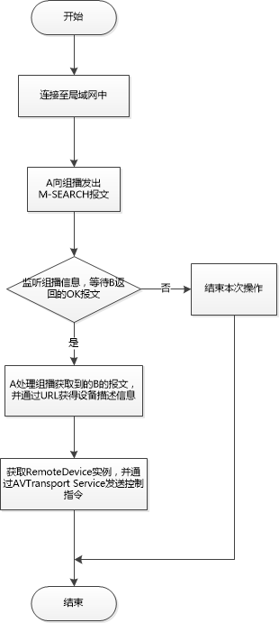
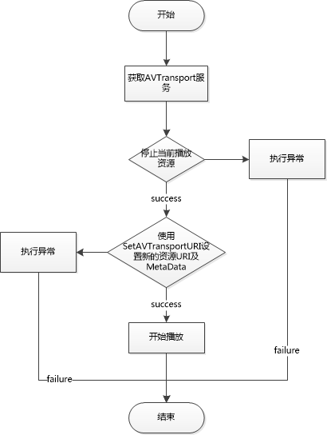
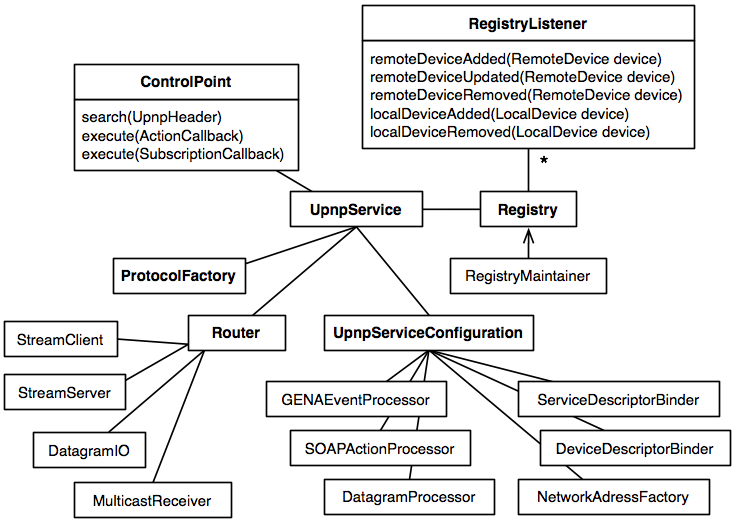

Cling 源码解析
====================================
> 本文为 [Android 开源项目源码解析](http://a.codekk.com) 中 Cling 部分  
> 项目地址：[cling](https://github.com/4thline/cling)，分析的版本：[5fd60eb](https://github.com/4thline/cling/commit/5fd60eb9e2e87f2ae6d1cf049145c4187040518c)，Demo 地址：[BeyondUPnP](https://github.com/kevinshine/BeyondUPnP)  
> 分析者：[kevinshine](https://github.com/kevinshine)，分析状态：完成，校对者：[Trinea](https://github.com/trinea)，校对状态：完成   

### 1. 功能介绍  
#### 1.1 Cling
Cling 类库是由 Java 实现的 DLNA/UPnP 协议栈。基于 DLNA/UPnP 可以开发出类似多屏互动、资源共享、远程控制等功能的应用，通过 Android 应用管理一个或多个设备，将音频、视频、图片推送到指定设备显示。  

UPnP 的实现类库有很多，如 CyberGarage，Intel UPnP stack，在 [http://www.upnp.org](http://upnp.org/certification/toolsoverview/sdks/) 上有详细列表，比较有名的有：  
- Platinum UPnP，基于 C++ 开发，可以支持 Windows，iOS，Android 等平台，XBMC 就是使用的此库。  
- Cling，基于 Java 开发，也是后续要介绍的，市面上很多支持 DLNA 功能的 App 都是使用的此库，如 BubbleUPnP。  

#### 1.2 UPnP 介绍
官方解释为：UPnP 是各种各样的智能设备、无线设备和个人电脑等实现遍布全球的对等网络连接（P2P）的结构。
UPnP 实际使用场景多用于小范围对等网络内（连接至同一路由器的多个设备）之间的相互发现、控制。如使用手机控制电视盒子的音频，视频播放等。  

UPnP 的工作过程大概分为 6 个步骤：  
(0) 寻址(Addressing)  
开始会给所有设备或者控制点分配一个分配一个 IP。对于新设备首次与网络建立连接时也会有这个寻址过程。  
 
(1) 发现(Discovery)  
这步是 UPnP 真正工作的第一步。  
当一个`设备`被加入到网络中时，UPnP 发现协议允许它向控制点介绍自己的功能。  
当一个`控制点`被加入到网络时，UPnP 发现协议允许它搜寻这个网络内它感兴趣的设备。  
 
(2) 描述(Description)  
控制点通过`(1)发现`过程中设备提供的指向设备详细信息的链接，获取设备的详细信息。  
 
(3) 控制(Control)  
控制点通过描述过程对设备的了解，控制点可以发送控制信息控制设备，设备在执行完命令后会给与控制点一个反馈。  
 
(4) 事件(Eventing)  
控制点可以监听设备的状态，这样设备的状态或信息发生了变化，只要产生一个事件广播出去，控制点即可进行响应，类似一般的订阅者模式。  

(5) 展现(Presentation)  
控制点可以从设备获取一个 HTML 页面，用于控制设备或展现设备信息，是对上面`(3) 控制`和`(4) 事件`过程的一个补充。  
更详细的介绍可以参考：[UPnP 简介、优点及工作几大步骤介绍](http://www.trinea.cn/other/upnp-desc-advantage-process/)  

#### 1.3	Cling 基本使用
Cling 库包括两个模块：  
- Cling Core  
核心类库，基于 UDA1.0，实现了定义服务，设备发现，通过 ControlPoint 发送指令等 UPnP 的基本功能。  
- Cling Support  
顾名思义该包为 Cling 中一些功能的扩展，如：avtransport，lastchange 等。  

下面就以 Android 平台创建 UPnP 服务并调用相关的控制方法介绍 Cling 的基本使用。  
(1) 定义自己的 UpnpService 类，继承自 AndroidUpnpServiceImpl  
(2) 启动该 Service  
(3) 从 UpnpService 中获取 ControlPoint，并搜索设备  
```
upnpService.getControlPoint().search(new STAllHeader());
```
搜索注册在多播地址的所有设备，也可根据需要使用不同条件搜索。  

(4) 获取所有类型为 MediaRenderer 的设备  
```
upnpService.getRegistry().getDevices(new UDADeviceType("MediaRenderer"));
```

(5) 向 Device 发送指令  
从查找到的结果中获取一个 Device，并向其发送 Play 指令  
```
Device device = SystemManager.getInstance().getSelectedDevice();
if (device == null) {
    return;
}

Service avtService = device.findService(new UDAServiceType("AVTransport"));
if (avtService != null) {
    ControlPoint cp = SystemManager.getInstance().getControlPoint();
    cp.execute(new Play(avtService) {
        @Override
        public void success(ActionInvocation invocation) {
            Log.i(TAG, "Play success.");
        }

        @Override
        public void failure(ActionInvocation arg0, UpnpResponse arg1, String arg2) {
            Log.e(TAG, "Play failed");
        }
    });
}
```
上述即为一个基本的发现、控制流程，通过 ControlPoint 发送指令并处理 callback。  

**注：上述只涵盖了使用中的几个关键点，详细内容可参考我开源的项目[BeyondUPnP](https://github.com/kevinshine/BeyondUPnP)**  

### 2 总体设计
#### 2.1 概述
Cling 作为 UPnP 协议栈，其主旨即是在设备的发现，控制等过程中对不同的协议及内容进行处理。UPnP 协议栈由多个层组成，Cling 只关心底层的 TCP/IP 协议以及包含 SSDP（设备发现），SOAP（设备控制），GENA（设备事件）协议的层。  

### 2.2 使用场景
以一个简单的设备使用场景为例：  

> 用户将手机 A 中的媒体内容播放到电视 B 上，前提：A、B 在同一个局域网中。
- A 加入到多播组中，建立 MulticastSocket 监听多播信息
- A 向多播发出 M-SEARCH 报文
- B 获取多播的报文，判断是否符合条件，若符合向多播地址回应 OK 报文，报文中包含 description URL
- A 监听多播获取到相关报文，并通过 URL 获得设备描述信息
- A 通过 AVTransport Service 将媒体内容推送到 B 并播放

在整个过程中 A 通过 Cling 既充当了 DMC(Digital Media Controller) 又作为 DMS(Digital Media Server)，而 B 作为 DMR(Digital Media Renderer) 播放媒体内容。  
关于 DMS、DMC、DMR 是指对电子设备的分类，具体可见：[DLNA 简介 设备分类 场景举例 协议栈层次](http://www.trinea.cn/other/dlna-desc-classes-architecture/)  

### 3 流程图
#### 3.1 设备发现及控制流程


#### 3.2 媒体播放流程


### 4 详细设计
#### 4.1 类关系图


#### 4.2 类功能详细介绍
由类图可知，Cling 的一切都是从 UpnpService 开始的，其中包含了 ControlPoint，ProtocolFactory，Registry，Router 四个核心模块，以及一个配置信息类 UpnpServiceConfiguration。  

#### 4.2.1 ControlPoint
控制点的接口，主要功能是异步执行搜索，设备控制订阅等指令。  
此接口定义了查找设备，向设备发送指令，订阅设备变更，其实现类只有一个为 ControlPointImpl。  

**(1) 查找**  
```
public void search(UpnpHeader searchType, int mxSeconds);
```  
第一个参数`UpnpHeader`表示查询条件，第二个参数表示最大超时时间，以秒为单位。  
UpnpHeader 是一个抽象类，其中定义了包含每个过程请求中的 Header 信息的枚举类型`Type`以及泛型 value，查询时常用的实现类有：DeviceTypeHeader，UDNHeader 等，可根据设备类型、UDN、服务类型等多种方式。  


**(2) 执行控制指令**  
```
public Future execute(ActionCallback callback)
```  
将 ActionCallback 放入 DefaultUpnpServiceConfiguration 中定义的线程池 ClingExecutor 执行，执行完毕回调 ActionCallback 中定义的 success 或 failure 函数。  
ActionCallback 是命令执行的回调接口，在其 run 方法内会根据是本地命令还是远程命令进行执行，执行结束后回调成功或失败接口。  

**(3) 执行事件订阅指令**  
```
public void execute(SubscriptionCallback callback)
``` 
将 SubscriptionCallback 放入 DefaultUpnpServiceConfiguration 中定义的线程池 ClingExecutor 执行，执行完毕回调 ActionCallback 中定义的 established、failed、ended 等函数。   

#### 4.2.2 ProtocolFactory
UPnP 协议的工厂类，用于根据收到的 UPnP 协议或是本地设备的 meta 信息，创建一个可执行的协议。  
使用简单工厂模式封装协议内容的处理，实现类为 ProtocolFactoryImpl，主要根据接收报文和发送报文两大类创建不同协议。  
在该类中 UDP 包通过 createReceivingAsync 方法对传递来的 IncomingDatagramMessage 进行处理，如 NOTIFY--ReceivingNotification，MSEARCH--ReceivingSearch。  
TCP 包通过 createReceivingSync 进行分发处理，并通过 ReceivingSync 的子类进行处理，子类中调用 executeSync 方法等待并返回 response。  

**(1) 处理接收到的报文**  
```
public ReceivingAsync createReceivingAsync(IncomingDatagramMessage message)
```
IncomingDatagramMessage 封装了 UDP 包的信息，在 createReceivingAsync 中根据消息的操作类型及方法创建不同的 ReceivingAsync 子类对象，ReceivingAsync 子类通过重写 execute 方法定义具体实现。如请求的 NOTIFY 信息创建 ReceivingNotification，请求的 MSEARCH 创建 ReceivingSearch。  

```
public ReceivingSync createReceivingSync(StreamRequestMessage message)
```
StreamRequestMessage 封装 TCP 报文，在 createReceivingSync 中根据消息的操作类型方法及 UPnP 服务 NameSpace 等的配置创建不同的 ReceivingSync 的子类对象，ReceivingSync 子类通过重写 executeSync 方法定义具体实现。  

**(2) 组装发送的报文**  
有若干功能类似的方法，返回不同的 SendingAsync 子类对象，通过重写 executeSync 方法定义具体实现。如：  
a. 向组播发送 ssdp:alive 告知设备存活  
```
public SendingNotificationAlive createSendingNotificationAlive(LocalDevice localDevice)
```
b. 生产 SendingSearch 实例的工厂方法，SendingSearch 中定义了查询条件以及请求超时时间，在重写的 execute 函数中，在线程启动后创建 OutgoingSearchRequest 对象并通过 Router 发送。  
```
public SendingSearch createSendingSearch(UpnpHeader searchTarget, int mxSeconds)
```

#### 4.2.3 Registry
设备资源管理器，用于设备、资源、订阅消息的管理，包括添加、更新、移除、查询。可将新设备时加入 Registry 中，在设备失效后从 Registry 中移除。目前实现类为 RegistryImpl。  
关联类包括：RegistryListener、Resource、RegistryItem、RegistryItems、LocalItems、RemoteItems、ExpirationDetails、RegistryMaintainer。  

#### 4.2.4 RegistryListener
设备状态监听类，包含本地/远程设备的发现、添加、更新、移除等回调函数。可通过  
```
addListener(RegistryListener listener)
```
添加，保存在`RegistryListener`的 Set\<RegistryListener\> registryListener 参数内。  
实现类有空实现的 DefaultRegistryListener 以及通过注入属性实现的 RegistryListenerAdapter。  

#### 4.2.5 Resource  
资源的父类。该类中定义资源的 URI，model 等属性。  

#### 4.2.6 RegistryItem  
KV 形式的数据项，在 RegistryImpl 中用于包装设备、资源、订阅消息等。  

#### 4.2.7 RegistryItems  
`RegistryImpl`中设备、资源集合的父类，定义了对元素的增删查改等操作。  
包含`deviceItems`和`subscriptionItems`两个属性，分别表示设备集合和订阅消息集合，集合元素为`RegistryItem`。  
子类有`LocalItems`和`RemoteItems`分别表示本地设备和远程设备集合。  

#### 4.2.8 LocalItems  
继承自 RegistryItems，key 为 LocalDevice，value 为 LocalGENASubscription。存储本地设备及其订阅消息。  

#### 4.2.9 RemoteItems  
继承自 RegistryItems，key 为 RemoteDevice，value 为 RemoteGENASubscription。存储远程设备及其订阅消息。  

#### 4.2.10 ExpirationDetails  
为 RegistryItem 的属性，记录上次刷新和最大超时时间，从而判断对象是否过期。  

#### 4.2.11 RegistryMaintainer  
资源管理器中元素有效期的定期维护，每隔 1000ms 调用一次 registry.maintain() 方法，该方法执行的操作有：  
(1) 判断过期的 item，并从 resourceItems 中移除；  
(2) 遍历 resourceItems，对其中的每个 Resource 调用其 maintain() 方法；  
(3) remoteItems.maintain() 对 remote 进行维护；  
(4) localItems.maintain() 对 local 进行维护；  
(5) runPendingExecutions 执行异步任务。  

#### 4.2.12 Router
数据传输层接口，负责接收和发送 UPnP 和 UDP 消息，或者将接收到的数据流广播给局域网内的其他设备。  
目前实现类为 RouterImpl 和 MockRouter，其中 MockRouter 仅用来作为测试时的 Mock 接口，RouterImpl 作为默认的数据传输层实现。  
**(1) enable()**  
启动。  
得到配置中的`NetworkAddressFactory`，其目前实现为`NetworkAddressFactoryImpl`，调用`startInterfaceBasedTransports()`为`NetworkAddressFactory`的每个网络接口绑定一个多播接收器`MulticastReceiver`，用来监听多播地址，并处理获取到的数据。KV 形式存储在`multicastReceivers`中；  
调用`startAddressBasedTransports`为`NetworkAddressFactory`的每个地址绑定一个`StreamServer`和`DatagramIO`，监听并进行数据处理。KV 形式存储在`streamServers`中。  
创建一个`StreamClient`用于发送 TCP 消息。  

**(2) disable()**  
停止。  
停止`StreamClient`，停止`streamServers`中每个`StreamServer`，停止`multicastReceivers`中每个`MulticastReceiver`，停止`datagramIOs`中每个`DatagramIO`。  

通过可重入锁写锁控制启动和停止的并发。  

**(3) getActiveStreamServers(InetAddress preferredAddress)**  
根据 preferredAddress 得到活跃的 StreamServer，如果 preferredAddress 对应的 StreamServer 存在且活跃则返回，否则返回当前所有活跃的 StreamServer。  

**(4) received(IncomingDatagramMessage msg)**  
根据消息类型得到协议并执行。  

**(5) 发送数据**  
send(StreamRequestMessage msg) 通过 StreamClient 发送 TCP 包。  
send(OutgoingDatagramMessage msg) 向所有 datagramIO 发送 UDP 包。  
broadcast(byte[] bytes) 向所有 datagramIO 广播发送数据。  

#### 4.2.13 StreamClient
StreamClient 具体实现类为 AbstractStreamClient 以及其子类 StreamClientImpl。  
在 Android 系统下使用的 Jetty 实现。在该类中具体的 http 协议处理由 HttpClient 实现，核心方法 sendRequest 用于创建请求并获取返回 response，请求及返回值通过 HttpContentExchange 封装，每一个 StreamRequestMessage 及其对应的 HttpContentExchange 通过 createCallable 方法封装为 Callable 对象，并将其压入 DefaultUpnpServiceConfiguration 中的 defaultExecutorService。在 call() 中调用 client.send(exchange) 发送 request 并获取 response。  

#### 4.2.14 StreamServer
StreamServer 用来接收 HTTP 请求并进行处理。在 AndroidUpnpServiceConfiguration 中进行初始化：  
```
public StreamServer createStreamServer(NetworkAddressFactory networkAddressFactory) {
        // Use Jetty, start/stop a new shared instance of JettyServletContainer
        return new AsyncServletStreamServerImpl(
            new AsyncServletStreamServerConfigurationImpl(
                JettyServletContainer.INSTANCE,
                networkAddressFactory.getStreamListenPort()
            )
        );
    }
```
本质上是由 Jetty 实现的 servlet 容器。从 HttpServletRequest 中获取数据流并传递给 Router 的 received(UpnpStream stream) 进行处理。JettyServletContainer 使用了单例模式，其中定义 Server 的具体实现，并使用 synchronized 同步 Server 属性变更操作。  

#### 4.2.15 ReceivingNotification
处理接收到的 notification 消息。如 ALIVE，BYEBYE。当接收到 ALIVE 消息后，会在后台启动一个线程执行 RetrieveRemoteDescriptors 获取该设备的信息。  

#### 4.2.16 RetrieveRemoteDescriptors
用来主动获取远端介绍详情，并返回 RemoteService 加入到 Registry 中。  

### 5 结语
Cling 作为一款优秀的开源 UPnP 协议栈实现，从之前的 1.x 版本发展到现在的 2.x，在稳定性易扩展等方面有着显著的提升，由于对 Android 平台有着较好的支持，越来越多的产品使用 Cling 作为解决方案，如 BubbleUPnP 等。当然它本身也还存在着如 Router 切换 WIFI 时注册设备清除失败等问题，但瑕不掩瑜，本着学习的态度还是可以从中受益良多。  