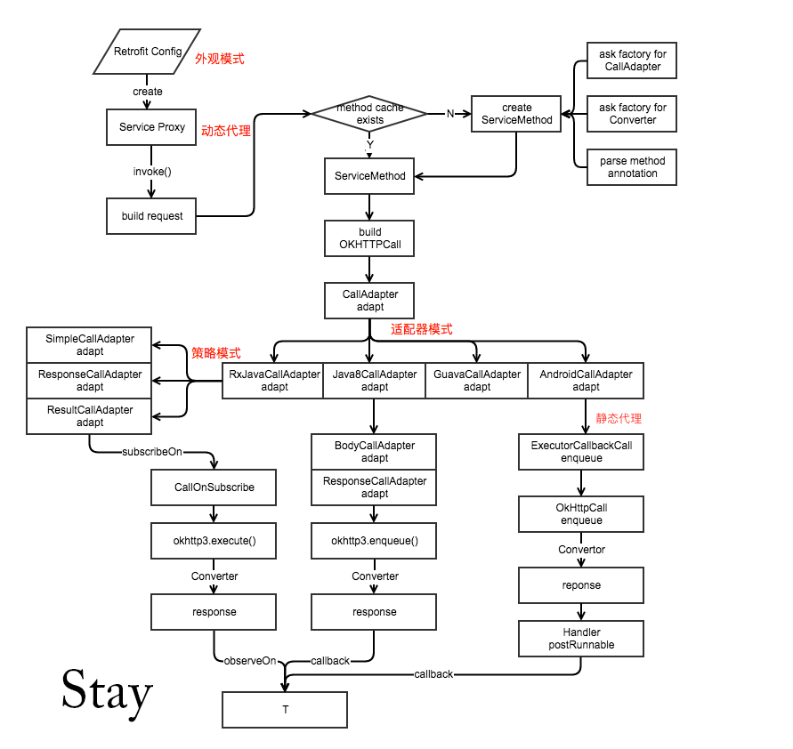
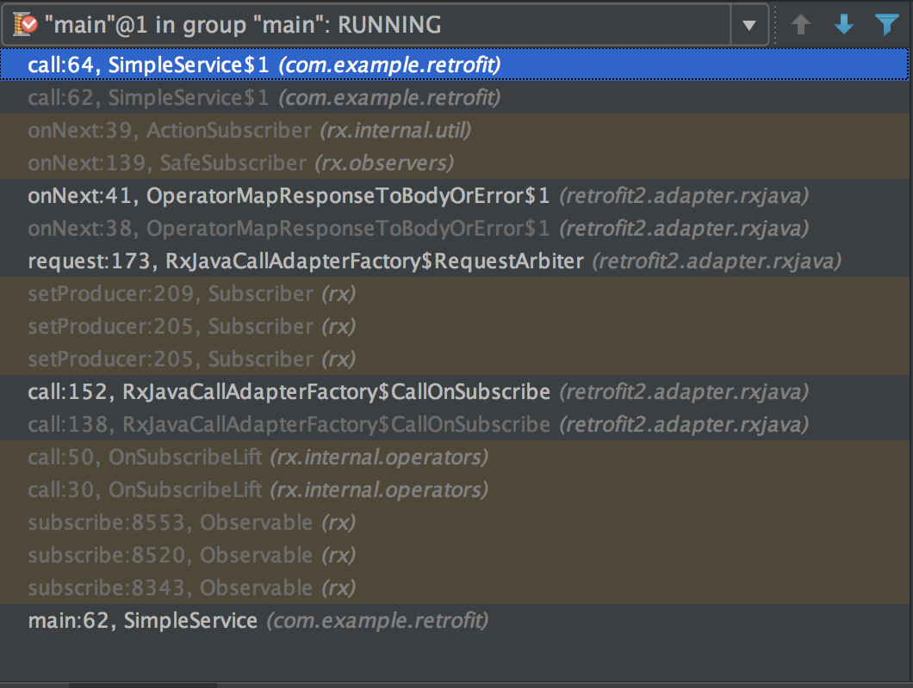

拆轮子系列：拆 Retrofit（Retrofit 源码导读）
======

> 本文为 [Android 开源项目源码解析](http://a.codekk.com) 中 Retrofit 部分  
> 项目地址：[Retrofit](https://github.com/square/retrofit)，分析的版本：[5febe68](https://github.com/square/retrofit/commit/5febe68b3c812a25f60d16e8faa74e39e87528a7)
> 分析者：[Piasy](https://github.com/Piasy)，分析状态：完成，校对者：[Trinea](https://github.com/trinea)，校对状态：未开始   

安卓开发领域，很多重要的问题都有了很好的开源解决方案，例如网络请求 OkHttp + Retrofit 简直就是不二之选。“[我们不重复造轮子不表示我们不需要知道轮子该怎么造及如何更好的造！](https://github.com/android-cn/android-open-project-analysis#我们不重复造轮子不表示我们不需要知道轮子该怎么造及如何更好的造)”，在用了这些好轮子将近两年之后，现在是时候拆开轮子一探究竟了。本文基于 [Retrofit 截至 2016.6.23 的最新源码](https://github.com/square/retrofit/tree/5febe68b3c812a25f60d16e8faa74e39e87528a7)对其进行了详细分析。

## 1，整体思路

从使用方法出发，首先是怎么使用，其次是我们使用的功能在内部是如何实现的，实现方案上有什么技巧，有什么范式。全文基本上是对 Retrofit 源码的一个分析与导读，非常建议大家下载 Retrofit 源码之后，跟着本文，过一遍源码。对于技巧和范式，由于目前我的功力还不到位，分析内容没多少，欢迎大家和我一起讨论。

## 2，基本用例

来自 [Retrofit 官方网站](http://square.github.io/retrofit/)。

### 2.1，创建 Retrofit 对象

~~~ java
Retrofit retrofit = new Retrofit.Builder()
    .baseUrl("https://api.github.com/")
    .addConverterFactory(GsonConverterFactory.create())
    .build();
~~~

**builder 模式，外观模式（门面模式）**，这就不多说了，可以看看 [stay 的 Retrofit分析-经典设计模式案例](http://www.jianshu.com/p/fb8d21978e38)这篇文章。

### 2.2，定义 API 并获取 API 实例

~~~ java
public interface GitHubService {
  @GET("users/{user}/repos")
  Call<List<Repo>> listRepos(@Path("user") String user);
}

GitHubService github = retrofit.create(GitHubService.class);
~~~

先看定义，非常简洁，也没有什么特别之处，除了两个注解：`@GET` 和 `@Path`。它们的用处稍后再分析，我们接着看创建 API 实例：`retrofit.create(GitHubService.class)`。这样就创建了 API 实例了，就可以调用 API 的方法发起 HTTP 网络请求了，太方便了。

但 `create` 方法是怎么创建 API 实例的呢？

~~~ java
public <T> T create(final Class<T> service) {
  // 省略非关键代码
  return (T) Proxy.newProxyInstance(service.getClassLoader(), 
      new Class<?>[] { service },
      new InvocationHandler() {
        @Override 
        public Object invoke(Object proxy, Method method, Object... args)
            throws Throwable {
          // 先省略实现
        }
      });
}
~~~

创建 API 实例使用的是**动态代理技术**，关于动态代理的详细介绍，可以查看 [codeKK 公共技术点之 Java 动态代理](http://a.codekk.com/detail/Android/Caij/%E5%85%AC%E5%85%B1%E6%8A%80%E6%9C%AF%E7%82%B9%E4%B9%8B%20Java%20%E5%8A%A8%E6%80%81%E4%BB%A3%E7%90%86)这篇文章。

简而言之，就是动态生成接口的实现类（当然生成实现类有缓存机制），并创建其实例（称之为代理），代理把对接口的调用转发给 `InvocationHandler` 实例，而在 `InvocationHandler` 的实现中，除了执行真正的逻辑（例如再次转发给真正的实现类对象），我们还可以进行一些有用的操作，例如统计执行时间、进行初始化和清理、对接口调用进行检查等。

为什么要用动态代理？因为对接口的所有方法的调用都会集中转发到 `InvocationHandler#invoke` 函数中，我们可以集中进行处理，更方便了。你可能会想，我也可以手写这样的代理类，把所有接口的调用都转发到 `InvocationHandler#invoke` 呀，当然可以，但是可靠地自动生成岂不更方便？

### 2.3，调用 API 方法

获取到 API 实例之后，调用方法和普通的代码没有任何区别：

~~~ java
Call<List<Repo>> call = github.listRepos("square");
List<Repo> repos = call.execute().body();
~~~

这两行代码就发出了 HTTP 请求，并把返回的数据转化为了 `List<Repo>`，太方便了！

现在我们来看看调用 `listRepos` 是怎么发出 HTTP 请求的。上面 `Retrofit#create` 方法返回时省略的代码如下：

~~~ java
return (T) Proxy.newProxyInstance(service.getClassLoader(), 
    new Class<?>[] { service },
    new InvocationHandler() {
      private final Platform platform = Platform.get();

      @Override 
      public Object invoke(Object proxy, Method method, Object... args)
          throws Throwable {
        // If the method is a method from Object then defer to normal invocation.
        if (method.getDeclaringClass() == Object.class) {
          return method.invoke(this, args);
        }
        if (platform.isDefaultMethod(method)) {
          return platform.invokeDefaultMethod(method, service, proxy, args);
        }
        ServiceMethod serviceMethod = loadServiceMethod(method);
        OkHttpCall okHttpCall = new OkHttpCall<>(serviceMethod, args);
        return serviceMethod.callAdapter.adapt(okHttpCall);
      }
    });
~~~

如果调用的是 `Object` 的方法，例如 `equals`，`toString`，那就直接调用。如果是 default 方法（Java 8 引入），就调用 default 方法。这些我们都先不管，因为我们在安卓平台调用 `listRepos`，肯定不是这两种情况，那这次调用真正干活的就是这三行代码了（好好记住这三行代码，因为接下来很长的篇幅都是在讲它们 :) ）：

~~~ java
ServiceMethod serviceMethod = loadServiceMethod(method);
OkHttpCall okHttpCall = new OkHttpCall<>(serviceMethod, args);
return serviceMethod.callAdapter.adapt(okHttpCall);
~~~

在继续分析这三行代码之前，我们先看看 [Stay 在 Retrofit分析-漂亮的解耦套路](http://www.jianshu.com/p/45cb536be2f4) 这篇文章中分享的流程图，完整的流程概览建议仔细看看这篇文章：

这三行代码基本就是对应于流程图中轴上部了，`ServiceMethod`，`build OkHttpCall`，`CallAdapter adapt`。

### 2.4，`ServiceMethod<T>`

`ServiceMethod<T>` 类的作用正如其 JavaDoc 所言：

> Adapts an invocation of an interface method into an HTTP call. 把对接口方法的调用转为一次 HTTP 调用。

一个 `ServiceMethod` 对象对应于一个 API interface 的一个方法，`loadServiceMethod(method)` 方法负责加载 `ServiceMethod`：

~~~ java
ServiceMethod loadServiceMethod(Method method) {
  ServiceMethod result;
  synchronized (serviceMethodCache) {
    result = serviceMethodCache.get(method);
    if (result == null) {
      result = new ServiceMethod.Builder(this, method).build();
      serviceMethodCache.put(method, result);
    }
  }
  return result;
}
~~~

这里实现了缓存逻辑，同一个 API 的同一个方法，只会创建一次。这里由于我们每次获取 API 实例都是传入的 `class` 对象，而 `class` 对象是进程内单例的，所以获取到它的同一个方法 `Method` 实例也是单例的，所以这里的缓存是有效的。

我们再看看 `ServiceMethod` 的构造函数：

~~~ java
ServiceMethod(Builder<T> builder) {
  this.callFactory = builder.retrofit.callFactory();
  this.callAdapter = builder.callAdapter;
  this.baseUrl = builder.retrofit.baseUrl();
  this.responseConverter = builder.responseConverter;
  this.httpMethod = builder.httpMethod;
  this.relativeUrl = builder.relativeUrl;
  this.headers = builder.headers;
  this.contentType = builder.contentType;
  this.hasBody = builder.hasBody;
  this.isFormEncoded = builder.isFormEncoded;
  this.isMultipart = builder.isMultipart;
  this.parameterHandlers = builder.parameterHandlers;
}
~~~

成员很多，但这里我们重点关注四个成员：`callFactory`，`callAdapter`，`responseConverter` 和 `parameterHandlers`。

1. `callFactory` 负责创建 HTTP 请求，HTTP 请求被抽象为了 `okhttp3.Call` 类，它表示一个已经准备好，可以随时执行的 HTTP 请求；
2. `callAdapter` 把 `retrofit2.Call<T>` 转为 `T`（注意和 `okhttp3.Call` 区分开来，`retrofit2.Call<T>` 表示的是对一个 Retrofit 方法的调用），这个过程会发送一个 HTTP 请求，拿到服务器返回的数据（通过 `okhttp3.Call` 实现），并把数据转换为声明的 `T` 类型对象（通过 `Converter<F, T>` 实现）；
3. `responseConverter` 是 `Converter<ResponseBody, T>` 类型，负责把服务器返回的数据（JSON、XML、二进制或者其他格式，由 `ResponseBody` 封装）转化为 `T` 类型的对象；
4. `parameterHandlers` 则负责解析 API 定义时每个方法的参数，并在构造 HTTP 请求时设置参数；

它们的使用稍后再分析，这里先看看它们的创建（代码比较分散，就不贴太多代码了，大多是结论）：

#### 2.4.1，`callFactory`

`this.callFactory = builder.retrofit.callFactory()`，所以 `callFactory` 实际上由 `Retrofit` 类提供，而我们在构造 `Retrofit` 对象时，可以指定 `callFactory`，如果不指定，将默认设置为一个 `okhttp3.OkHttpClient`。

#### 2.4.2，`callAdapter`

~~~ java
private CallAdapter<?> createCallAdapter() {
  // 省略检查性代码
  Annotation[] annotations = method.getAnnotations();
  try {
    return retrofit.callAdapter(returnType, annotations);
  } catch (RuntimeException e) { 
    // Wide exception range because factories are user code.
    throw methodError(e, "Unable to create call adapter for %s", returnType);
  }
}
~~~

可以看到，`callAdapter` 还是由 `Retrofit` 类提供。在 `Retrofit` 类内部，将遍历一个 `CallAdapter.Factory` 列表，让工厂们提供，如果最终没有工厂能（根据 `returnType` 和 `annotations`）提供需要的 `CallAdapter`，那将抛出异常。而这个工厂列表我们可以在构造 `Retrofit` 对象时进行添加。

#### 2.4.3，`responseConverter`

~~~ java
private Converter<ResponseBody, T> createResponseConverter() {
  Annotation[] annotations = method.getAnnotations();
  try {
    return retrofit.responseBodyConverter(responseType, annotations);
  } catch (RuntimeException e) { 
    // Wide exception range because factories are user code.
    throw methodError(e, "Unable to create converter for %s", responseType);
  }
}
~~~

同样，`responseConverter` 还是由 `Retrofit` 类提供，而在其内部，逻辑和创建 `callAdapter` 基本一致，通过遍历 `Converter.Factory` 列表，看看有没有工厂能够提供需要的 responseBodyConverter。工厂列表同样可以在构造 `Retrofit` 对象时进行添加。

#### 2.4.4，`parameterHandlers`

每个参数都会有一个 `ParameterHandler`，由 `ServiceMethod#parseParameter` 方法负责创建，其主要内容就是解析每个参数使用的注解类型（诸如 `Path`，`Query`，`Field` 等），对每种类型进行单独的处理。构造 HTTP 请求时，我们传递的参数都是字符串，那 Retrofit 是如何把我们传递的各种参数都转化为 String 的呢？还是由 `Retrofit` 类提供 converter！

`Converter.Factory` 除了提供上一小节提到的 responseBodyConverter，还提供 requestBodyConverter 和 stringConverter，API 方法中除了 `@Body` 和 `@Part` 类型的参数，都利用 stringConverter 进行转换，而 `@Body` 和 `@Part` 类型的参数则利用 requestBodyConverter 进行转换。

这三种 converter 都是通过“询问”工厂列表进行提供，而工厂列表我们可以在构造 `Retrofit` 对象时进行添加。

#### 2.4.5，工厂让各个模块得以高度解耦

上面提到了三种工厂：`okhttp3.Call.Factory`，`CallAdapter.Factory` 和 `Converter.Factory`，分别负责提供不同的模块，至于怎么提供、提供何种模块，统统交给工厂，Retrofit 完全不掺和，它只负责提供用于决策的信息，例如参数/返回值类型、注解等。

这不正是我们苦苦追求的**高内聚低耦合**效果吗？解耦的第一步就是**面向接口编程**，模块之间、类之间通过接口进行依赖，**创建怎样的实例，则交给工厂负责**，工厂同样也是接口，添加（Retrofit doc 中使用 install 安装一词，非常贴切）怎样的工厂，则在最初构造 `Retrofit` 对象时决定，各个模块之间完全解耦，**每个模块只专注于自己的职责**，全都是套路，值得反复玩味、学习与模仿。

---

除了上面重点分析的这四个成员，`ServiceMethod` 中还包含了 API 方法的 url 解析等逻辑，包含了众多关于泛型和反射相关的代码，有类似需求的时候，也非常值得学习模仿。

### 2.5，`OkHttpCall`

终于把 `ServiceMethod` 看了个大概，接下来我们看看 `OkHttpCall`。

`OkHttpCall` 实现了 `retrofit2.Call`，我们通常会使用它的 `execute()` 和 `enqueue(Callback<T> callback)` 接口。前者用于同步执行 HTTP 请求，后者用于异步执行。

#### 2.5.1，先看 `execute()`

~~~ java
@Override 
public Response<T> execute() throws IOException {
  okhttp3.Call call;

  synchronized (this) {
    // 省略部分检查代码

    call = rawCall;
    if (call == null) {
      try {
        call = rawCall = createRawCall();
      } catch (IOException | RuntimeException e) {
        creationFailure = e;
        throw e;
      }
    }
  }

  return parseResponse(call.execute());
}

private okhttp3.Call createRawCall() throws IOException {
  Request request = serviceMethod.toRequest(args);
  okhttp3.Call call = serviceMethod.callFactory.newCall(request);
  if (call == null) {
    throw new NullPointerException("Call.Factory returned null.");
  }
  return call;
}

Response<T> parseResponse(okhttp3.Response rawResponse) throws IOException {
  ResponseBody rawBody = rawResponse.body();

  // Remove the body's source (the only stateful object) so we can pass the response along.
  rawResponse = rawResponse.newBuilder()
      .body(new NoContentResponseBody(rawBody.contentType(), rawBody.contentLength()))
      .build();

  int code = rawResponse.code();
  if (code < 200 || code >= 300) {
    // ...返回错误
  }

  if (code == 204 || code == 205) {
    return Response.success(null, rawResponse);
  }

  ExceptionCatchingRequestBody catchingBody = new ExceptionCatchingRequestBody(rawBody);
  try {
    T body = serviceMethod.toResponse(catchingBody);
    return Response.success(body, rawResponse);
  } catch (RuntimeException e) {
    // ...异常处理
  }
}
~~~

主要包括三步：

1. 创建 `okhttp3.Call`，包括构造参数；
2. 执行网络请求；
3. 解析网络请求返回的数据；

`createRawCall()` 函数中，我们调用了 `serviceMethod.toRequest(args)` 来创建 `okhttp3.Request`，而在后者中，我们之前准备好的 `parameterHandlers` 就派上了用场。

然后我们再调用 `serviceMethod.callFactory.newCall(request)` 来创建 `okhttp3.Call`，这里之前准备好的 `callFactory` 同样也派上了用场，由于工厂在构造 `Retrofit` 对象时可以指定，所以我们也可以指定其他的工厂（例如使用过时的 `HttpURLConnection` 的工厂），来使用其它的底层 HttpClient 实现。

我们调用 `okhttp3.Call#execute()` 来执行网络请求，这个方法是阻塞的，执行完毕之后将返回收到的响应数据。收到响应数据之后，我们进行了状态码的检查，通过检查之后我们调用了 `serviceMethod.toResponse(catchingBody)` 来把响应数据转化为了我们需要的数据类型对象。在 `toResponse` 函数中，我们之前准备好的 `responseConverter` 也派上了用场。

好了，之前准备好的东西都派上了用场，还好没有白费 :)

#### 2.5.2，再看 `enqueue(Callback<T> callback)`

这里的异步交给了 `okhttp3.Call#enqueue(Callback responseCallback)` 来实现，并在它的 callback 中调用 `parseResponse` 解析响应数据，并转发给传入的 callback。

### 2.6，`CallAdapter`

终于到了最后一步了，`CallAdapter<T>#adapt(Call<R> call)` 函数负责把 `retrofit2.Call<R>` 转为 `T`。这里 `T` 当然可以就是 `retrofit2.Call<R>`，这时我们直接返回参数就可以了，实际上这正是 `DefaultCallAdapterFactory` 创建的 `CallAdapter` 的行为。至于其他类型的工厂返回的 `CallAdapter` 的行为，这里暂且不表，后面再单独分析。

---

至此，一次对 API 方法的调用是如何构造并发起网络请求、以及解析返回数据，这整个过程大致是分析完毕了。对整个流程的概览非常重要，结合 stay 画的流程图，应该能够比较轻松地看清整个流程了。

虽然我们还没分析完，不过也相当于到了万里长征的遵义，终于可以舒一口气了 :)

## 3，retrofit-adapters 模块

retrofit 模块内置了 `DefaultCallAdapterFactory` 和 `ExecutorCallAdapterFactory`，它们都适用于 API 方法得到的类型为 `retrofit2.Call` 的情形，前者生产的 adapter 啥也不做，直接把参数返回，后者生产的 adapter 则会在异步调用时在指定的 `Executor` 上执行回调。

retrofit-adapters 的各个子模块则实现了更多的工厂：`GuavaCallAdapterFactory`，`Java8CallAdapterFactory` 和 `RxJavaCallAdapterFactory`。这里我主要分析 `RxJavaCallAdapterFactory`，下面的内容就需要一些 RxJava 的知识了，不过我想使用 Retrofit 的你，肯定也在使用 RxJava :)

`RxJavaCallAdapterFactory#get` 方法中对返回值的类型进行了检查，只支持 `rx.Single`，`rx.Completable` 和 `rx.Observable`，这里我主要关注对 `rx.Observable` 的支持。

`RxJavaCallAdapterFactory#getCallAdapter` 方法中对返回值的泛型类型进行了进一步检查，例如我们声明的返回值类型为 `Observable<List<Repo>>`，泛型类型就是 `List<Repo>`，这里对 `retrofit2.Response` 和 `retrofit2.adapter.rxjava.Result` 进行了特殊处理，有单独的 adapter 负责进行转换，其他所有类型都由 `SimpleCallAdapter` 负责转换。

那我们就来看看 `SimpleCallAdapter#adapt`：

~~~ java
@Override
public <R> Observable<R> adapt(Call<R> call) {
  Observable<R> observable = Observable.create(new CallOnSubscribe<>(call))
      .lift(OperatorMapResponseToBodyOrError.<R>instance());
  if (scheduler != null) {
    return observable.subscribeOn(scheduler);
  }
  return observable;
}
~~~

这里创建了一个 `Observable`，它的逻辑由 `CallOnSubscribe` 类实现，同时使用了一个 `OperatorMapResponseToBodyOrError` 操作符，用来把 `retrofit2.Response` 转为我们声明的类型，或者错误异常类型。

我们接着看 `CallOnSubscribe#call`：

~~~ java
@Override
public void call(final Subscriber<? super Response<T>> subscriber) {
  // Since Call is a one-shot type, clone it for each new subscriber.
  Call<T> call = originalCall.clone();

  // Wrap the call in a helper which handles both unsubscription and backpressure.
  RequestArbiter<T> requestArbiter = new RequestArbiter<>(call, subscriber);
  subscriber.add(requestArbiter);
  subscriber.setProducer(requestArbiter);
}
~~~

代码很简短，只干了三件事：

1. clone 了原来的 call，因为 `okhttp3.Call` 是只能用一次的，所以每次都是新 clone 一个进行网络请求；
2. 创建了一个叫做 `RequestArbiter` 的 producer，别被它的名字吓懵了，它就是个 producer；
3. 把这个 producer 设置给 subscriber；

这里需要知晓 producer 的工作机制，老实说尽管我已经翻译了 8 篇讲 producer 的文章，直到今天再仔细看了相关的文档才明白这货到底是干什么的，实在汗颜。

简言之，大部分情况下 Subscriber 都是被动接受 Observable push 过来的数据，但要是 Observable 发得太快，Subscriber 处理不过来，那就有问题了，所以就有了一种 Subscriber 主动 pull 的机制，而这种机制就是通过 Producer 实现的。给 Subscriber 设置 Producer 之后（通过 `Subscriber#setProducer` 方法），Subscriber 就会通过 Producer 向上游根据自己的能力请求数据（通过 `Producer#request` 方法），而 Producer 收到请求之后（通常都是 Observable 管理 Producer，所以“相当于”就是 Observable 收到了请求），再根据请求的量给 Subscriber 发数据。

那我们就看看 `RequestArbiter#request`：

~~~ java
@Override
public void request(long n) {
  if (n < 0) throw new IllegalArgumentException("n < 0: " + n);
  if (n == 0) return; // Nothing to do when requesting 0.
  if (!compareAndSet(false, true)) return; // Request was already triggered.

  try {
    Response<T> response = call.execute();
    if (!subscriber.isUnsubscribed()) {
      subscriber.onNext(response);
    }
  } catch (Throwable t) {
    Exceptions.throwIfFatal(t);
    if (!subscriber.isUnsubscribed()) {
      subscriber.onError(t);
    }
    return;
  }

  if (!subscriber.isUnsubscribed()) {
    subscriber.onCompleted();
  }
}
~~~

producer 相关的逻辑非常简单，看看[Operator 并发原语： producers（二），SingleDelayedProducer](/AdvancedRxJava/2016/06/04/operator-concurrency-primitives-4/)就能懂了，这里就不在赘述。实际干活的逻辑就是执行 `call.execute()`，并把返回值发送给下游。

而 `OperatorMapResponseToBodyOrError#call` 也相当简短：

~~~ java
@Override
public Subscriber<? super Response<T>> call(final Subscriber<? super T> child) {
  return new Subscriber<Response<T>>(child) {
    @Override
    public void onNext(Response<T> response) {
      if (response.isSuccessful()) {
        child.onNext(response.body());
      } else {
        child.onError(new HttpException(response));
      }
    }

    @Override
    public void onCompleted() {
      child.onCompleted();
    }

    @Override
    public void onError(Throwable e) {
      child.onError(e);
    }
  };
}
~~~

关键就是调用了 `response.body()` 并发送给下游。这里，`body()` 返回的就是我们声明的泛型类型了，至于 Retrofit 是怎么把服务器返回的数据转为我们声明的类型的，这就是 `responseConverter` 的事了，还记得吗？

最后看一张返回 `Observable` 时的调用栈：

执行路径就是：

1. `Observable.subscribe`，触发 API 调用的执行；
2. `CallOnSubscribe#call`，clone call，创建并设置 producer；
3. `RequestArbiter#request`，subscriber 被设置了 producer 之后最终调用 request，在 request 中发起请求，把结果发给下游；
4. `OperatorMapResponseToBodyOrError$1#onNext`，把 response 的 body 发给下游；
5. 最终就到了我们 subscribe 时传入的回调里面了；

## 4，retrofit-converters 模块

retrofit 模块内置了 `BuiltInConverters`，只能处理 `ResponseBody`， `RequestBody` 和 `String` 类型的转化（实际上不需要转）。而 retrofit-converters 中的子模块则提供了 JSON，XML，ProtoBuf 等类型数据的转换功能，而且还有多种转换方式可以选择。这里我主要关注 `GsonConverterFactory`。

代码非常简单：

~~~ java
@Override
public Converter<ResponseBody, ?> responseBodyConverter(Type type, 
    Annotation[] annotations, Retrofit retrofit) {
  TypeAdapter<?> adapter = gson.getAdapter(TypeToken.get(type));
  return new GsonResponseBodyConverter<>(gson, adapter);
}

final class GsonResponseBodyConverter<T> implements Converter<ResponseBody, T> {
  private final Gson gson;
  private final TypeAdapter<T> adapter;

  GsonResponseBodyConverter(Gson gson, TypeAdapter<T> adapter) {
    this.gson = gson;
    this.adapter = adapter;
  }

  @Override public T convert(ResponseBody value) throws IOException {
    JsonReader jsonReader = gson.newJsonReader(value.charStream());
    try {
      return adapter.read(jsonReader);
    } finally {
      value.close();
    }
  }
}
~~~

根据目标类型，利用 `Gson#getAdapter` 获取相应的 adapter，转换时利用 Gson 的 API 即可。关于 Gson 的原理，就不是本文内容的范围了，敬请期待“拆 Gson”的文章 :)

## 5，总结

花了这么长的篇幅，终于把 Retrofit 的整个流程捋了一遍，首先要感谢 stay 写的分析文章，我“再拆一次轮子”也就是受到了 stay 文章的启发，分析过程也是在吸收了 stay 的成果的基础上完成的。文章中肯定还是有很多瑕疵之处，欢迎大家指正。
