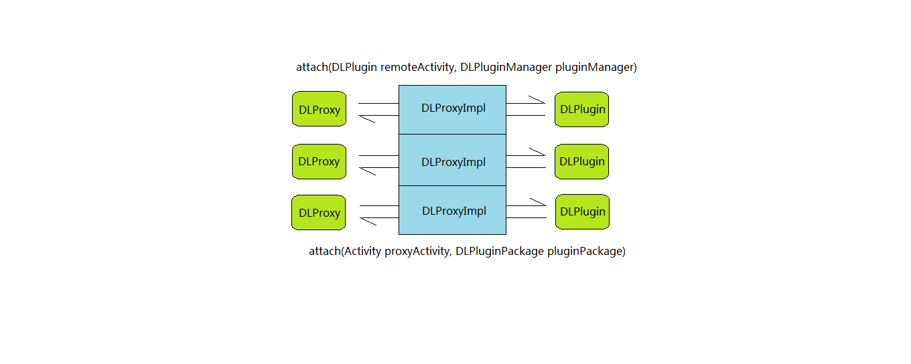

DynamicLoadApk 源码解析
====================================
> 本文为 [Android 开源项目源码解析](https://github.com/android-cn/android-open-project-analysis) 中 DynamicLoadApk 部分  
> 项目地址：[DynamicLoadApk](https://github.com/singwhatiwanna/dynamic-load-apk)，分析的版本：[354fc6c](https://github.com/singwhatiwanna/dynamic-load-apk/commit/354fc6c3d9ab2f55945096d81621f936f49a18e3 "Commit id is 354fc6c3d9ab2f55945096d81621f936f49a18e3")，Demo 地址：[DynamicLoadApk Demo](https://github.com/android-cn/android-open-project-demo/tree/master/dynamic-load-apk-demo)    
> 分析者：[FFish](https://github.com/FFish)，分析状态：未完成，校对者：[Trinea](https://github.com/trinea)，校对状态：未开始   

###1. 功能介绍  
DynamicLoadApk是实现Android App插件化开发的一个开源框架。它提供了3种开发方式，让开发者在无需理解其工作原理的情况下快速的集成插件化功能。

1. 宿主程序与插件完全独立 
2. 宿主程序开放部分接口供插件与之通信 
3. 宿主程序耦合插件的部分业务逻辑 

三种开发模式都可以在demo中看到

###2. 总体设计
   
DynamicLoadApk的设计思路可以总结为两个字：代理。每个插件`Activity`在宿主程序中都有一个代理`Activity`。在这种设计思路下，开发者可以很方便的进行框架扩展

###3. 流程图

红线部分是整个框架的核心，也是宿主程序所要包含的部分。主要流程就2步：1) 加载Apk 2) 启动`Activity`

###4. 详细设计 
####4.1 类关系图

####4.2 类功能介绍
#####4.2.1 DLPluginManager.java
该类为DynamicLoadApk的核心类，负责插件Apk的加载与维护，同时还兼具调起插件Apk中的`Activity`的任务。主要有以下几个方法。
```java
    public DLPluginPackage loadApk(String dexPath);

    private DexClassLoader createDexClassLoader(String dexPath);

    private AssetManager createAssetManager(String dexPath);

    private Resources createResources(AssetManager assetManager);

    public int startPluginActivity(Context context, DLIntent dlIntent);

    public int startPluginActivityForResult(Context context, DLIntent dlIntent, int requestCode);
```
第一个方法为插件化功能的起点，用于将特定路径下的插件Apk加载到内存中。在实际使用时，一般是将插件Apk集中存放到某一文件夹下面，通过循环调用该方法将若干个Apk加载进内存。这里要注意的是，**该方法只能被宿主Apk调用**。
每当加载进来一个插件Apk，都会调用第2,3,4三个方法来生成相应的`DexClassLoader`和资源管理类，从而实现对插件Apk代码和资源的访问。这里有一点技巧的地方在于`AssetManager`的创建。
```java
    private AssetManager createAssetManager(String dexPath) {
        try {
            AssetManager assetManager = AssetManager.class.newInstance();
            Method addAssetPath = assetManager.getClass().getMethod("addAssetPath", String.class);
            addAssetPath.invoke(assetManager, dexPath);
            return assetManager;
        } catch (Exception e) {
            e.printStackTrace();
            return null;
        }

    }
```
在Android中，大多数的资源是通过R文件来访问的。但是实现插件化之后，宿主Apk是无法通过R文件访问插件Apk中的资源的。所以这里使用反射来生成属于插件Apk的`AssetManager`。而使用反射的原因在于`addAssetPath`不是一个公开的api
```java
    /** 
     * Add an additional set of assets to the asset manager.  This can be 
     * either a directory or ZIP file.  Not for use by applications.  Returns 
     * the cookie of the added asset, or 0 on failure. 
     * {@hide} 
     */  
    public final int addAssetPath(String path) {  
        int res = addAssetPathNative(path);  
        return res;  
    }
```
除了`loadApk()`之外，这个类对外提供的主要api还有`startPluginActivity()`和`startPluginActivityForResult()`，主要用于调起插件Apk中的`Activity`。使用方法与理解并无难点，这里不再赘述。
#####4.2.2 DLPluginPackage
该类为插件Apk对应的实体类，主要封装了下面一些信息
```java
    public DexClassLoader classLoader;
        
    public AssetManager assetManager;
        
    public Resources resources;
        
    public PackageInfo packageInfo;

    public String packageName;
        
    private String mDefaultActivity;
        
    public String path;
```
其中前4个成员变量封装了插件Apk的主要信息，并且会在Apk被加载进来的时候(通过`DLPluginManager`的`loadApk()`)完成初始化。每当一个`DLPluginPackage`生成，`DLPluginManager`就会将其存入自己的一个`HashMap`成员变量中。
#####4.2.3 DLPlugin.java
这是一个接口，插件中的`Activity`通过实现这个接口来模拟`Activity`生命周期。接口中包含的方法签名与`Activity`生命周期方法类似。
```java
    public interface DLPlugin {
        public void onCreate(Bundle savedInstanceState);
        public void onStart();
        public void onRestart();
        public void onActivityResult(int requestCode, int resultCode, Intent data);
        public void onResume();
        public void onPause();
        public void onStop();
        public void onDestroy();
        public void attach(Activity proxyActivity, DLPluginPackage pluginPackage);
        public void onSaveInstanceState(Bundle outState);
        public void onNewIntent(Intent intent);
        public void onRestoreInstanceState(Bundle savedInstanceState);
        public boolean onTouchEvent(MotionEvent event);
        public boolean onKeyUp(int keyCode, KeyEvent event);
        public void onWindowAttributesChanged(LayoutParams params);
        public void onWindowFocusChanged(boolean hasFocus);
        public void onBackPressed();
        public boolean onCreateOptionsMenu(Menu menu);
        public boolean onOptionsItemSelected(MenuItem item);
    }
```
#####4.2.4 DLProxyActivity.java/DLProxyFragmentActivity.java
这两个类大同小异，所以这里只分析`DLProxyActivity`。首先来看下它的成员变量。
**(1). 成员变量**
```java
    protected DLPlugin mRemoteActivity;
        
    private DLProxyImpl impl = new DLProxyImpl(this);

    private DLPluginManager mPluginManager;
```
这个类总共有3个成员变量，其中`DLProxyImpl`是不同类型的代理`Activity`的公共代码。下一节会详细介绍。而`DLPluginManager`上面已经说过，是一个插件Apk的加载和维护类。所以这节主要来分析一下`DLPlugin`。
因为插件中的`Activity`并没有在宿主的`AndroidManifest.xml`中注册，所以在运行时，程序不会管理这些`Activity`的生命周期。所以需要规范一个接口，通过接口来模拟`Activity`的生命周期。具体做法如下。
```java
    @Override
    protected void onResume() {
        mRemoteActivity.onResume();
        super.onResume();
    }
    
    @Override
    protected void onDestroy() {
        mRemoteActivity.onDestroy();
        super.onDestroy();
    }
```
可以看出，通过在特定的生命周期中调用`DLPlugin`中的方法，来实现`Activity`生命周期的模拟功能。
**(2). DLProxyActivity.java/DLProxyFragmentActivity.java在DynamicLoadApk框架中的角色**
其实通过名字就可以知道，`DLProxyActivity`就是一个代理`Activity`。具体做法是，先将`DLProxyActivity`注册进宿主的`AndroidManifest.xml`，然后将每个生命周期对应的业务代码写在插件中的`Activity`(实现了`Plugin`接口)。
#####4.2.5 DLProxyImpl.java

该类是连接`DLProxyActivity`和`DLPlugin`之间的桥梁。
**(1). 内部接口DLProxy**
所有的代理`Activity`都要实现这个接口，这个接口就一个方法。用于将插件`Activity`绑定到代理`Activity`
```java
    public void attach(DLPlugin remoteActivity, DLPluginManager pluginManager);
```
**(2). 主要功能**
`DLProxyImpl`主要就做了4件事情:

1. 获取插件Apk中的资源(`AssetManager`)
2. 获取插件Apk中的启动`Activity`
3. 获取插件`Activity`的`ActivityInfo`，并设置给代理`Activity`
4. 将插件`Activity`和代理`Activity`双向绑定

首先来看`DLProxyImpl`是怎么做第1件事的
```java
    public void onCreate(Intent intent) {
        mPackageName = intent.getStringExtra(DLConstants.EXTRA_PACKAGE);
        ...
        mPluginManager = DLPluginManager.getInstance(mActivity);
        mPluginPackage = mPluginManager.getPackage(mPackageName);
        mAssetManager = mPluginPackage.assetManager;
        mResources = mPluginPackage.resources;
        ...
    }
```
在通过`Intent`启动`Activity`时，会传进来一个`mPackageName`。通过这个`mPackageName`从`DLPluginManager`中获取`DLPluginPackage`。这样就能使用插件Apk的资源了。  
接着获取启动`Activity`以及`ActivityInfo`
```java
    private void initializeActivityInfo() {
        PackageInfo packageInfo = mPluginPackage.packageInfo;
        if ((packageInfo.activities != null) && (packageInfo.activities.length > 0)) {
            if (mClass == null) {
                mClass = packageInfo.activities[0].name;
            }
            for (ActivityInfo a : packageInfo.activities) {
                if (a.name.equals(mClass)) {
                    mActivityInfo = a;
                }
            }
        }
    }
```
然后设置`ActivityInfo`给代理`Activity`
```java
    private void handleActivityInfo() {
        Log.d(TAG, "handleActivityInfo, theme=" + mActivityInfo.theme);
        if (mActivityInfo.theme > 0) {
            mActivity.setTheme(mActivityInfo.theme);
        }
        Theme superTheme = mActivity.getTheme();
        mTheme = mResources.newTheme();
        mTheme.setTo(superTheme);

        // TODO: handle mActivityInfo.launchMode here in the future.
    }
```
目前这里主要是设置代理`Activity`的主题。  
最后就是插件`Activity`和代理`Activity`的双向绑定了
```java
@TargetApi(Build.VERSION_CODES.ICE_CREAM_SANDWICH)
    protected void launchTargetActivity() {
        try {
            ...
            ((DLProxy) mActivity).attach(mRemoteActivity, mPluginManager);
            ...
            mRemoteActivity.attach(mActivity, mPluginPackage);
            ...
        } catch (Exception e) {
            e.printStackTrace();
        }
    }
```
#####4.2.6 DLBasePluginActivity.java/DLBasePluginFragmentActivity.java
与`DLProxyActivity`类似，这里只分析`DLBasePluginActivity`这个类。`DLBasePluginActivity`继承自`Activity`，同时实现了`DLPlugin`接口。插件中的所有`Activity`都要继承`DLBasePluginActivity/DLBasePluginFragmentActivity`(使用者也可以定义自己的`BasePluginActivity`)。但这个类在运行的时候并不会被当作一个`Activity`，而是一个普通的java类。原因在4.2.4里面已经提到。
```java
    protected Activity mProxyActivity;

    protected Activity that;
    
    protected DLPluginManager mPluginManager;
    
    protected DLPluginPackage mPluginPackage;
```
通过`DLProxyImpl`的绑定操作，`DLBasePluginActivity`可以通过`mProxyActivity`或者`that`这两个成员变量来操纵代理`Activity`，同时，`DLPlugin`的模拟生命周期也可以使得代理`Activity`和插件`Activity`很好的同步。
###5. 杂谈
####5.1 在Android Studio下使用DynamicLoadApk
在使用DynamicLoadApk时有个地方要注意，就是插件Apk在打包的时候不能把dl-lib.jar文件打包进去，不然会报错(java.lang.IllegalAccessError: Class ref in pre-verified class resolved to unexpected implementation)。换句话说，dl-lib.jar要参与编译，但不参与打包。该框架作者已经给出了Eclipse下的解决方案。我这里再说下怎么在Android Studio里使用。
```groovy
    dependencies {
        provided fileTree(dir: 'dl-lib', include: ['*.jar'])
    }
```