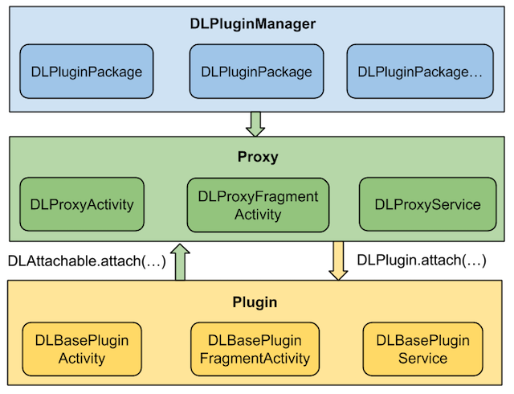
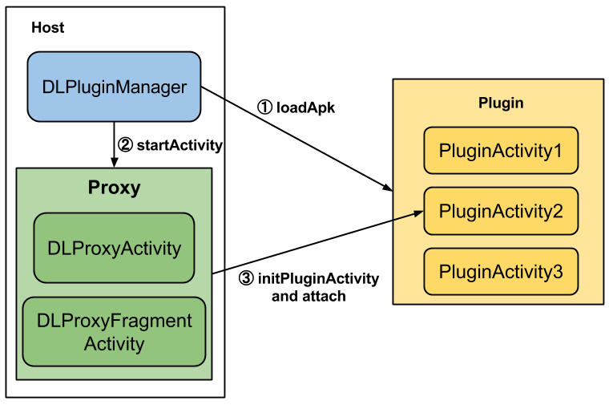
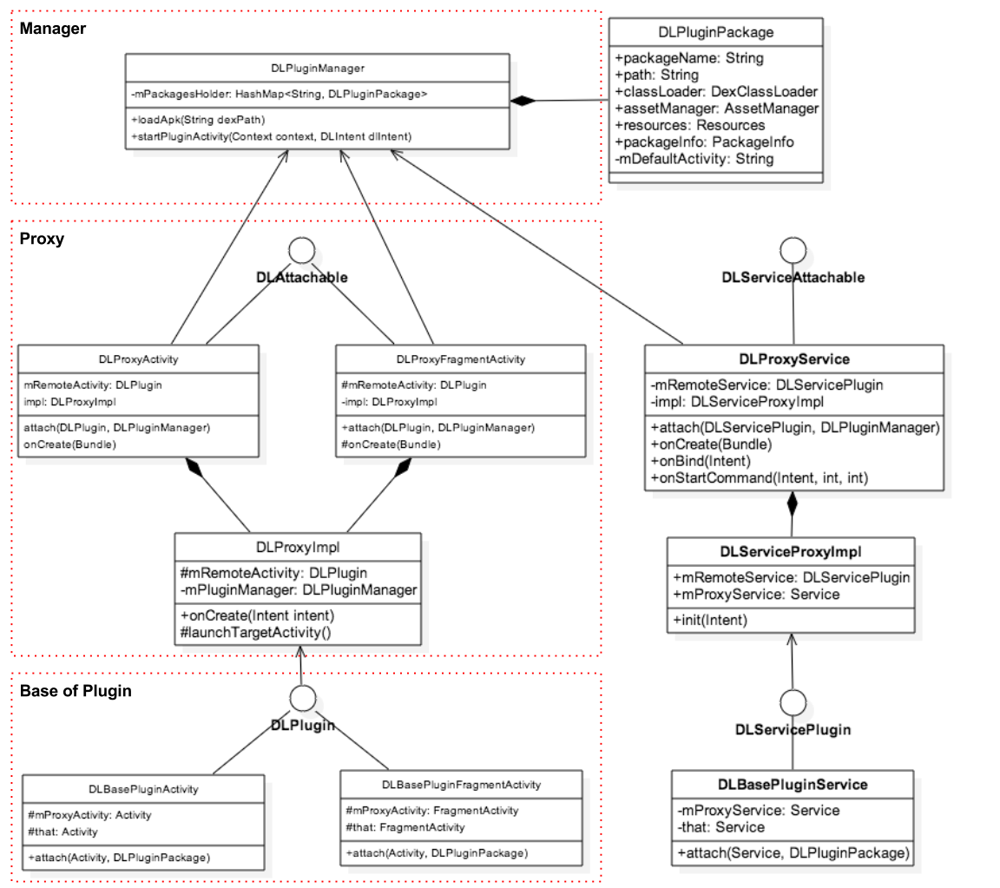
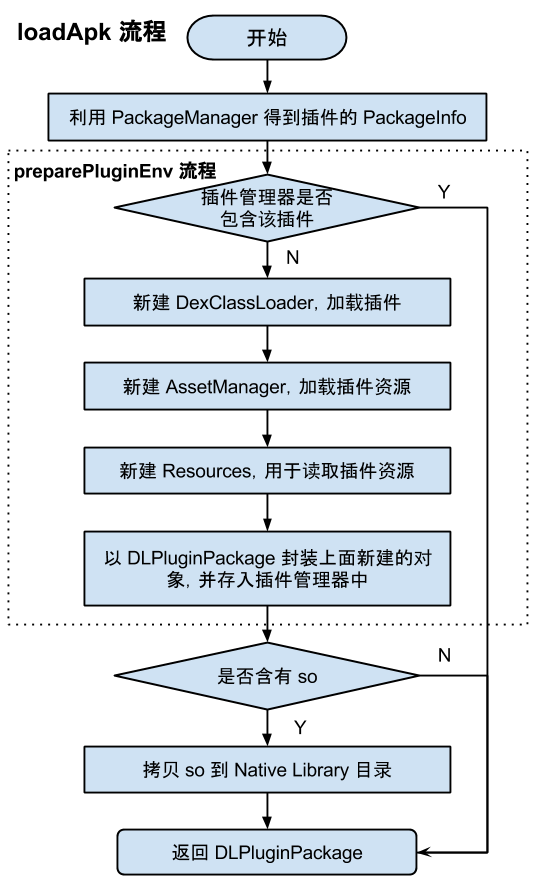
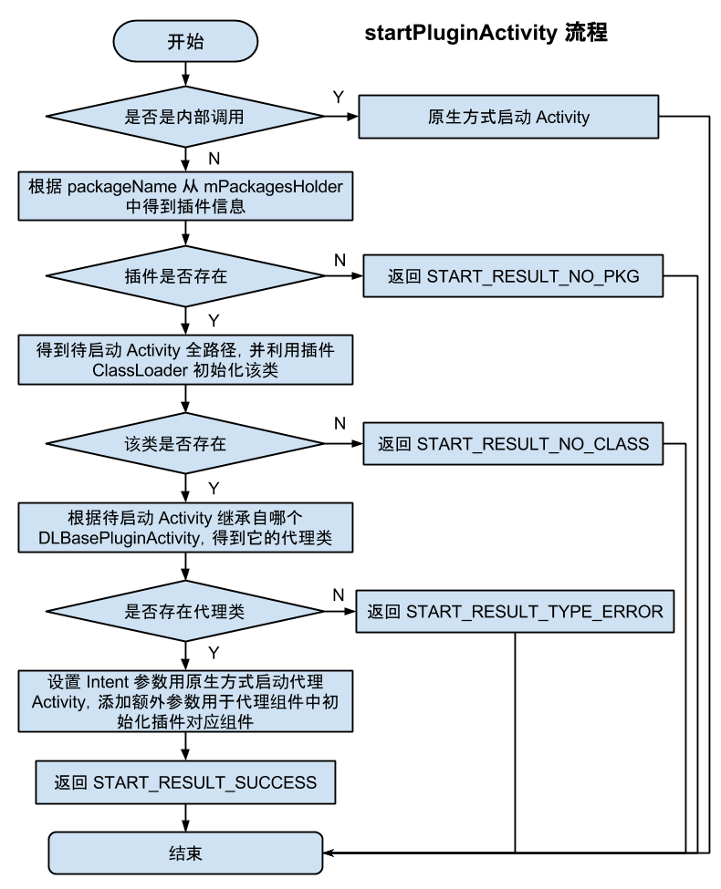
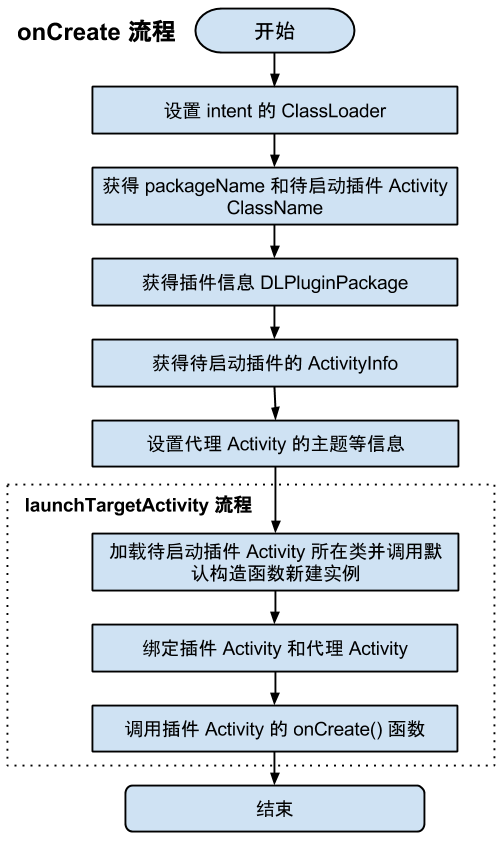

DynamicLoadApk 源码解析
====================================
> 本文为 [Android 开源项目源码解析](http://a.codekk.com) 中 DynamicLoadApk 部分  
> 项目地址：[DynamicLoadApk](https://github.com/singwhatiwanna/dynamic-load-apk)，分析的版本：[144571b](https://github.com/singwhatiwanna/dynamic-load-apk/commit/144571b51a6b42fd18b6e5ecee1142fcb8dc17e5 "Commit id is 144571b51a6b42fd18b6e5ecee1142fcb8dc17e5")，Demo 地址：[DynamicLoadApk Demo](https://github.com/android-cn/android-open-project-demo/tree/master/dynamic-load-apk-demo)    
> 分析者：[FFish](https://github.com/FFish)，分析状态：完成，校对者：[Trinea](https://github.com/trinea)，校对状态：初审完成   

### 1. 功能介绍  
#### 1.1 简介
DynamicLoadApk 是一个开源的 Android 插件化框架。  

插件化的优点包括：(1) 模块解耦，(2) 动态升级，(3) 高效并行开发(编译速度更快) (4) 按需加载，内存占用更低等等。  

DynamicLoadApk 提供了 3 种开发方式，让开发者在无需理解其工作原理的情况下快速的集成插件化功能。  

1. 宿主程序与插件完全独立 
2. 宿主程序开放部分接口供插件与之通信 
3. 宿主程序耦合插件的部分业务逻辑 

三种开发模式都可以在 demo 中看到。  

#### 1.2 核心概念
**(1) 宿主：**主 App，可以加载插件，也称 Host。  
**(2) 插件：**插件 App，被宿主加载的 App，也称 Plugin，可以是跟普通 App 一样的 Apk 文件。  

**(3) 组件：**指 Android 中的`Activity`、`Service`、`BroadcastReceiver`、`ContentProvider`，目前 DL 支持`Activity`、`Service`以及动态的`BroadcastReceiver`。  

**(4) 插件组件：**插件中的组件。  

**(5) 代理组件：**在宿主的 Manifest 中注册，启动插件组件时首先被启动的组件。目前包括 DLProxyActivity(代理 Activity)、DLProxyFragmentActivity(代理 FragmentActivity)、DLProxyService(代理 Service)。  

**(6) Base 组件：**插件组件的基类，目前包括 DLBasePluginActivity(插件 Activity 的基类)、DLBasePluginFragmentActivity(插件 FragmentActivity 的基类)、DLBasePluginService(插件 Service 的基类)。  

DynamicLoadApk 原理的核心思想可以总结为两个字：代理。通过在 Manifest 中注册代理组件，当启动插件组件时首先启动一个代理组件，然后通过这个代理组件来构建、启动插件组件。  

### 2. 总体设计
   
上面是 DynamicLoadApk 的总体设计图，DynamicLoadApk 主要分为四大模块：  
**(1) DLPluginManager**   
插件管理模块，负责插件的加载、管理以及启动插件组件。  
**(2) Proxy**   
代理组件模块，目前包括 DLProxyActivity(代理 Activity)、DLProxyFragmentActivity(代理 FragmentActivity)、DLProxyService(代理 Service)。      
**(3) Proxy Impl**  
代理组件公用逻辑模块，与(2)中的 Proxy 不同的是，这部分并不是一个组件，而是负责构建、加载插件组件的管理器。这些 Proxy Impl 通过反射得到插件组件，然后将插件与 Proxy 组件建立关联，最后调用插件组件的 onCreate 函数进行启动。      
**(4) Base Plugin**  
插件组件的基类模块，目前包括 DLBasePluginActivity(插件 Activity 的基类)、DLBasePluginFragmentActivity(插件 FragmentActivity 的基类)、DLBasePluginService(插件 Service 的基类)。   

### 3. 流程图
  
上面是调用插件 Activity 的流程图，其他组件调用流程类似。   
(1) 首先通过 DLPluginManager 的 loadApk 函数加载插件，这步每个插件只需调用一次。  
(2) 通过 DLPluginManager 的 startPluginActivity 函数启动代理 Activity。  
(3) 代理 Activity 启动过程中构建、启动插件 Activity。  

### 4. 详细设计 
#### 4.1 类关系图
  
以上是 DynamicLoadApk 主要类的关系图，跟总体设计中介绍的一样大致分为三部分。   
(1) 对于 Proxy 部分，每个组件都存在 DLAttachable 接口，方便统一该组件不同类，如 Activity、FragmentActivity。每个组件的公共实现部分都统一放到了对应的 DLProxyImpl 中。  
(2) 对于 Base Plugin 部分，每个组件都存在 DLPlugin 接口，同样是方便统一该组件不同类。  

#### 4.2 类功能介绍
##### 4.2.1 DLPluginManager.java
DynamicLoadApk 框架的核心类，主要功能包括：  
(1) 插件的加载和管理；  
(2) 启动插件的组件，目前包括 Activity、Service。  

**主要属性：**   
`mNativeLibDir`为插件 Native Library 拷贝到宿主中后的存放目录路径。  
`mPackagesHolder` HashMap，key 为包名，value 为表示插件信息的`DLPluginPackage`，存储已经加载过的插件信息。  

**主要函数：**  
**(1) getInstance(Context context)**  
获取 DLPluginManager 对象的单例。  
在私有构造函数中将`mNativeLibDir`变量赋值为宿主 App 应用程序数据目录下名为`pluginlib`子目录的全路径。  

**(2) loadApk(String dexPath)**  
加载插件。参数 dexPath 为插件的文件路径。  
这个函数直接调用 loadApk(final String dexPath, boolean hasSoLib)。  

**(3) loadApk(final String dexPath, boolean hasSoLib)**  
加载插件 Apk。参数 dexPath 为插件的文件路径，hasSoLib 表示插件是否含有 so 库。  

**注意：**在启动插件的组件前，必须先调用上面两个函数之一加载插件，并且只能在宿主中调用。  

流程图如下：  
  
loadApk 函数调用 preparePluginEnv 函数加载插件，图中虚线框为 preparePluginEnv 的流程图。  

**(4) preparePluginEnv(PackageInfo packageInfo, String dexPath)**  
加载插件及其资源。流程图如上图。  
调用`createDexClassLoader(…)`、`createAssetManager(…)`、`createResources(…)`函数完成相应初始化部分。  

**(5) createDexClassLoader(String dexPath)**  
利用`DexClassLoader`加载插件，DexClassLoader 初始化函数如下：    
```java
public DexClassLoader (String dexPath, String optimizedDirectory, String libraryPath, ClassLoader parent)
```
其中`dexPath`为插件的路径。  
`optimizedDirectory`优化后的`dex`存放路径。这里将路径设置为当前 App 应用程序数据目录下名为`dex`的子目录中。  
`libraryPath`为 Native Library 存放的路径。这里将路径设置为`mNativeLibDir`属性，其在`getInstance(Context)`函数中已经初始化。  
`parent`父 ClassLoader，ClassLoader 采用双亲委托模式查找类，具体加载方式可见 [ClassLoader 基础](http://www.trinea.cn/android/java-loader-common-class/)。  

**(6) createAssetManager(String dexPath)**  
创建 AssetManager，加载插件资源。  
在 Android 中，资源是通过 R.java 中的 id 来调用访问的。但是实现插件化之后，宿主是无法通过 R 文件访问插件的资源，所以这里使用反射来生成属于插件的`AssetManager`，并利用`addAssetPath`函数加载插件资源。  
```java
    private AssetManager createAssetManager(String dexPath) {
        try {
            AssetManager assetManager = AssetManager.class.newInstance();
            Method addAssetPath = assetManager.getClass().getMethod("addAssetPath", String.class);
            addAssetPath.invoke(assetManager, dexPath);
            return assetManager;
        } catch (Exception e) {
            e.printStackTrace();
            return null;
        }

    }
```
AssetManager 的无参构造函数以及`addAssetPath`函数都被`hide`了，通过反射调用。  

**(7) createResources(AssetManager assetManager)**  
利用`AssetManager`中已经加载的资源创建`Resources`，代理组件中会从这个`Resources`中读取资源。  
关于`AssetManager`、`Resources`深入的信息可参考：[Android 应用程序资源的查找过程分析](http://blog.csdn.net/luoshengyang/article/details/8806798)。  

**(8) copySoLib(String dexPath)**  
调用`SoLibManager`拷贝 so 库到 Native Library 目录。  

**(9) startPluginActivity(Context context, DLIntent dlIntent)**  
启动插件 Activity，会直接调用`startPluginActivityForResult(…)`函数。  
插件自己内部 Activity 启动依然是调用`Context#startActivity(…)`方法。  

**(10) startPluginActivityForResult(Context context, DLIntent dlIntent, int requestCode)**  
启动插件 Activity，流程图如下：  
  

**(11) startPluginService(final Context context, final DLIntent dlIntent)**  
启动插件 Service。  
主要逻辑在函数`fetchProxyServiceClass(…)`中，流程与`startPluginActivity(…)`类似，只是换成了回调的方式，在各种条件成立后调用原生方式启动代理 Service，不再赘述。  

**(12) bindPluginService(…) unBindPluginService(…)**  
bind 或是 unBind 插件 Service。逻辑与`startPluginService(…)`类似，不再赘述。  

##### 4.2.2 DLPluginPackage
插件信息对应的实体类，主要属性如下：  
```java
    public String packageName;

    public String defaultActivity;

    public DexClassLoader classLoader;

    public AssetManager assetManager;

    public Resources resources;

    public PackageInfo packageInfo;
```
`packageName`为插件的包名；  
`defaultActivity`为插件的 Launcher Main Activity；  
`classLoader`为加载插件的 ClassLoader；  
`assetManager`为加载插件资源的 AssetManager；  
`resources`利用`assetManager`中已经加载的资源创建的`Resources`，代理组件中会从这个`Resources`中读取资源。  
`packageInfo`被`PackageManager`解析后的插件信息。  
这些信息都会在`DLPluginManager#loadApk(…)`时初始化。  

##### 4.2.3 DLAttachable.java/DLServiceAttachable.java
DLServiceAttachable 与 DLAttachable 类似，下面先分析 DLAttachable.java。  

DLAttachable 是一个接口，主要作用是以统一所有不同类型的代理 Activity，如`DLProxyActivity`、`DLProxyFragmentActivity`，方便作为同一接口统一处理。  
`DLProxyActivity`和`DLProxyFragmentActivity`都实现了这个类。  

DLAttachable 目前只有一个  
```java
attach(DLPlugin pluginActivity, DLPluginManager pluginManager)
```
抽象函数，表示将插件`Activity`和代理`Activity`绑定在一起，其中的`pluginActivity`参数就是指插件`Activity`。  

同样 DLServiceAttachable 类似，作用是统一所有不同类型的代理 Service，实现插件`Service`和代理`Service`的绑定。虽然目前只有`DLProxyService`。  

##### 4.2.4 DLPlugin.java/DLServicePlugin.java
DLPlugin 与 DLServicePlugin 类似，下面先分析 DLPlugin.java。  

DLPlugin 是一个接口，包含`Activity`生命周期、触摸、菜单等抽象函数。  
DLBase*Activity 都实现了这个类，这样插件的 Activity 间接实现了此类。  
主要作用是统一所有不同类型的插件 Activity，如`Activity`、`FragmentActivity`，方便作为同一接口统一处理，所以这个类叫`DLPluginActivity`更合适。  

同样 DLServicePlugin 主要作用是统一所有不同类型的插件 Service，方便作为统一接口统一处理，目前包含`Service`生命周期等抽象函数。  

##### 4.2.5 DLProxyActivity.java/DLProxyFragmentActivity.java
代理 Activity，他们是在宿主 Manifest 中注册的组件，也是启动插件 Activity 时，真正被启动的 Activity，他们的内部会完成插件 Activity 的初始化和启动。  

这两个类大同小异，所以这里只分析`DLProxyActivity`。  

首先来看下它的成员变量。  
**(1). DLPlugin mRemoteActivity**  
表示真正需要启动的插件`Activity`。这个属性名应该叫做`pluginActivity`更合适。  
上面我们已经介绍了，`DLPlugin`是所有插件`Activity`都间接实现了的接口。  

接下来在代理`Activity`的生命周期、触摸、菜单等函数中我们都会同时调用 mRemoteActivity 的相关函数，模拟插件`Activity`的相关功能。  

**(2). DLProxyImpl impl**  
主要封装了插件`Activity`的公用逻辑，如初始化插件 Activity 并和代理 Activity 绑定、获取资源等。  

##### 4.2.6 DLProxyImpl.java/DLServiceProxyImpl.java
DLProxyImpl 与 DLServiceProxyImpl 类似，下面先分析 DLProxyImpl.java。  

DLProxyImpl 主要封装了插件`Activity`的公用逻辑，如初始化插件 Activity 并和代理 Activity 绑定、获取资源等，相当于把`DLProxyActivity`和`DLProxyFragmentActivity`的公共实现部分提出出来，核心逻辑位于下面介绍的 onCreate() 函数。  

主要函数：  
**(1) DLProxyImpl(Activity activity)**  
构造函数，参数为代理 Activity。  

**(2) public void onCreate(Intent intent)**  
onCreate 函数，会在代理 Activity onCreate 函数中被调用，流程图如下：  
  
其中第一步`设置 intent 的 ClassLoader`是用于 unparcel Parcelable 数据的，可见介绍： [android.os.BadParcelableException](http://www.trinea.cn/android/android-os-badparcelableexception-classnotfoundexception-unmarshalling/)。  

**(3) protected void launchTargetActivity()**  
加载待启动插件 Activity 完成初始化流程，并通过`DLPlugin`和`DLAttachable`接口的 attach 函数实现和代理 Activity 的双向绑定。流程图见上图虚线框部分。  

**(4) private void initializeActivityInfo()**  
获得待启动插件的 ActivityInfo。  

**(5) private void handleActivityInfo()**  
设置代理 Activity 的主题等信息。  

其他的 get* 函数都是获取一些插件相关信息，会被代理 Activity 调用。  

同样 DLServiceProxyImpl 主要封装了插件`Service`的公用逻辑，如初始化插件 Service 并和代理 Activity 绑定。  

##### 4.2.7 DLBasePluginActivity.java/DLBasePluginFragmentActivity.java
插件 Activity 基类，插件中的`Activity`都要继承 DLBasePluginActivity/DLBasePluginFragmentActivity 之一(目前尚不支持 ActionBarActivity)。  

主要作用是根据是否被代理，确定一些函数直接走父类逻辑还是代理 Activity 或是空逻辑。  

`DLBasePluginActivity`继承自`Activity`，同时实现了`DLPlugin`接口。这两个类大同小异，所以这里只分析`DLBasePluginActivity`。  
主要变量：  
```java
    protected Activity mProxyActivity;

    protected Activity that;
    
    protected DLPluginManager mPluginManager;
    
    protected DLPluginPackage mPluginPackage;
```
`mProxyActivity`为代理 Activity，通过`attach(…)`函数绑定。  
`that`与`mProxyActivity`等同，只是为了和`this`指针区分，表示真实的`Context`，这里真实指的是被代理情况下为代理 Activity，未被代理情况下等同于 this。  

##### 4.2.8 DLBasePluginService.java  
插件 Service 基类，插件中的 Service 要继承这个基类，主要作用是根据是否被代理，确定一些函数直接走父类逻辑还是代理 Service 或是空逻辑。  

主要变量含义与`DLBasePluginActivity`类似，不重复介绍。  
PS：截止目前这个类还是不完善的，至少和`DLBasePluginActivity`对比，还不支持非代理的情况

##### 4.2.9 DLIntent.java
继承自 Intent，封装了待启动组件的 PackageName 和 ClassName。  

#### 4.2.10 SoLibManager.java
调用`SoLibManager`拷贝 so 库到 Native Library 目录。  

**主要函数：**  
**(1) copyPluginSoLib(Context context, String dexPath, String nativeLibDir)**  
函数中以`ZipFile`形式加载插件，循环读取其中的文件，如果为`.so`结尾文件、符合当前平台 CPU 类型且尚未拷贝过最新版，则新建`Runnable`拷贝 so 文件。  

#### 4.2.11 DLUtils.java
这个类中大都是无用或是不该放在这里的函数，也许是大版本升级及维护人过多后对工具函数的维护不够所致。  

### 5. 杂谈
### 5.1 插件不能打包 dl-lib.jar
原因是插件和宿主属于不同的 ClassLoader，如果同时打包 dl-lib.jar，会因为 ClassLoader 隔离导致类型转换错误，具体可见：[ClassLoader 隔离](http://www.trinea.cn/android/java-loader-common-class/)  

Eclipse 打包解决方式见项目主页；  
Android Studio 打包解决方式见 5.2；  
Ant 打包需要修改 build.xml 中 dex target 引用到的 compileclasspath 属性。  

#### 5.2 在 Android Studio 下使用 DynamicLoadApk
在使用 DynamicLoadApk 时有个地方要注意，就是插件 Apk 在打包的时候不能把 dl-lib.jar 文件打包进去，不然会报错(java.lang.IllegalAccessError: Class ref in pre-verified class resolved to unexpected implementation)。换句话说，dl-lib.jar 要参与编译，但不参与打包。该框架作者已经给出了 Eclipse 下的解决方案。我这里再说下怎么在 Android Studio 里使用。
```groovy
    dependencies {
        provided fileTree(dir: 'dl-lib', include: ['*.jar'])
    }
```

#### 5.3 DynamicLoadApk 待完善的问题
(1) 还未支持广播；  
(2) Base Plugin 中的 that 还未去掉，需要覆写 Activity 的相关方法；  
(3) 插件和宿主资源 id 可能重复的问题没有解决，需要修改 aapt 中资源 id 的生成规则；  
(4) 不支持自定义主题，不支持系统透明主题；  
(5) 插件中的 so 处理有异常；  
(6) 不支持静态 Receiver；  
(7) 不支持 Provider；  
(8) 插件不能直接用 this；  

#### 5.4 其他插件化方案
除了 DynamicLoadApk 用代理的方式实现外，目前还有两种插件化方案：  
(1) 用 Fragment 以及 schema 的方式实现。  
(2) 利用字节码库动态生成一个插件类 A 继承自待启动插件 Activity，启动插件 A。这个插件 A 名称固定且已经在 Manifest 中注册。  
具体可见：[Android 插件化](http://www.trinea.cn/android/android-plugin/)  

最后 H5 框架越来越多，也能解决插件化解决的自动升级这部分功能，硬件、网络也在改善，未来何如？  
