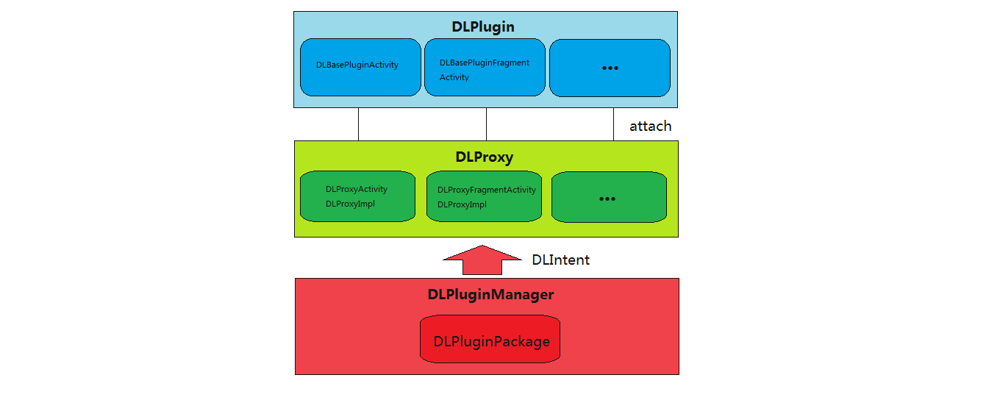
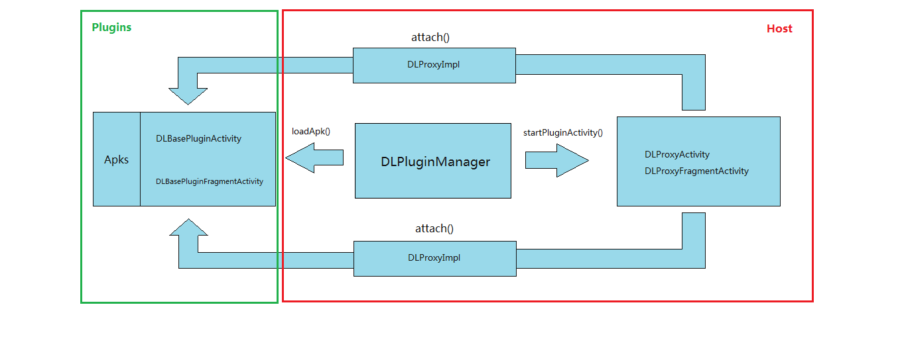
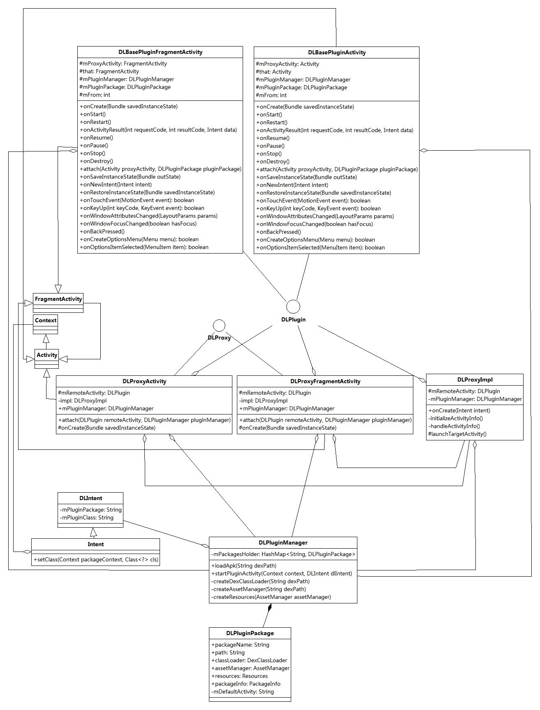

DynamicLoadApk 源码解析
====================================
> 本文为 [Android 开源项目源码解析](https://github.com/android-cn/android-open-project-analysis) 中 DynamicLoadApk 部分  
> 项目地址：[DynamicLoadApk](https://github.com/singwhatiwanna/dynamic-load-apk)，分析的版本：[354fc6c](https://github.com/singwhatiwanna/dynamic-load-apk/commit/354fc6c3d9ab2f55945096d81621f936f49a18e3 "Commit id is 354fc6c3d9ab2f55945096d81621f936f49a18e3")，Demo 地址：[DynamicLoadApk Demo](https://github.com/android-cn/android-open-project-demo/tree/master/dynamic-load-apk-demo)    
> 分析者：[FFish](https://github.com/FFish)，分析状态：未完成，校对者：[Trinea](https://github.com/trinea)，校对状态：未开始   

###1. 功能介绍  
DynamicLoadApk是实现Android App插件化开发的一个开源框架。它提供了3种开发方式，让开发者在无需理解其工作原理的情况下快速的集成插件化功能。
1. 宿主程序与插件完全独立 
2. 宿主程序开放部分接口供插件与之通信 
3. 宿主程序耦合插件的部分业务逻辑 

###2. 总体设计
   

###3. 流程图

###4. 详细设计 
####4.1 类关系图

###5. 杂谈
该项目存在的问题、可优化点及类似功能项目对比等，非所有项目必须。  

**完成时间**  
- `两天内`完成  

###6. 修改完善  
在完成了上面 5 个部分后，移动模块顺序，将  
`2. 详细设计` -> `2.1 核心类功能介绍` -> `2.2 类关系图` -> `3. 流程图` -> `4. 总体设计`  
顺序变为  
`2. 总体设计` -> `3. 流程图` -> `4. 详细设计` -> `4.1 类关系图` -> `4.2 核心类功能介绍`  
并自行校验优化一遍，确认无误后将文章开头的  
`分析状态：未完成`  
变为：  
`分析状态：已完成`  

本期校对会由专门的`Buddy`完成，可能会对分析文档进行一些修改，请大家理解。  

**完成时间**  
- `两天内`完成  

**到此便大功告成，恭喜大家^_^**  
