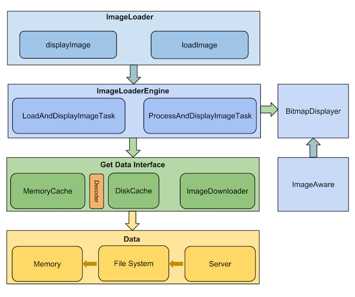
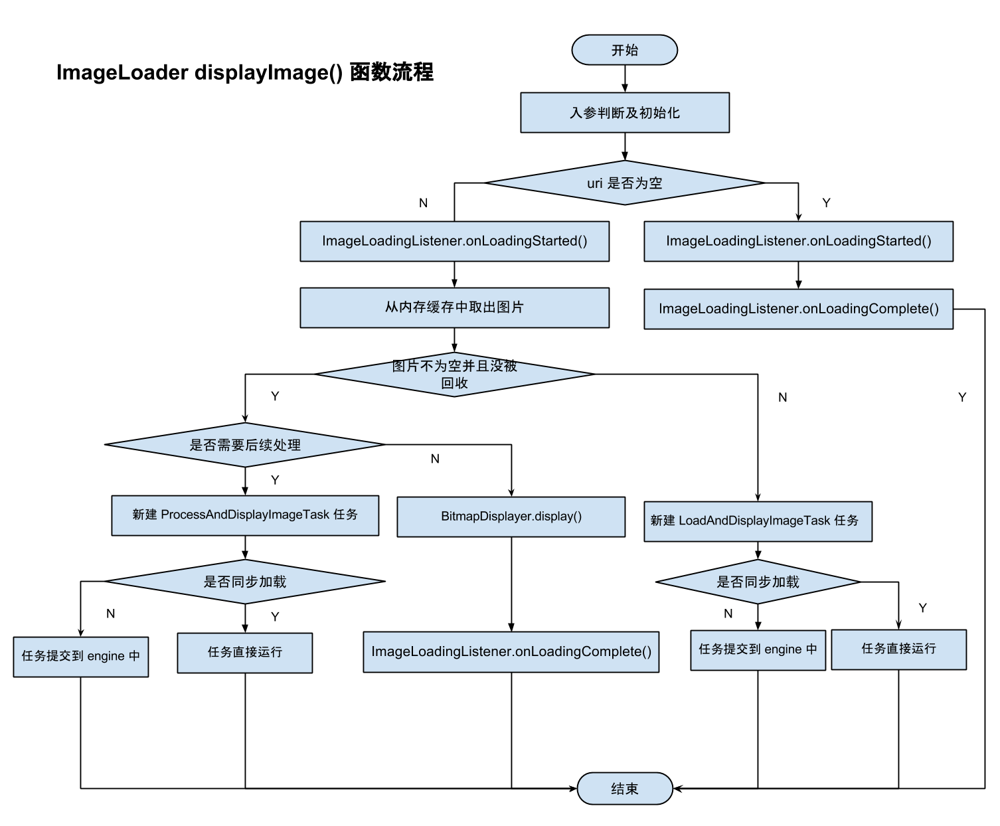
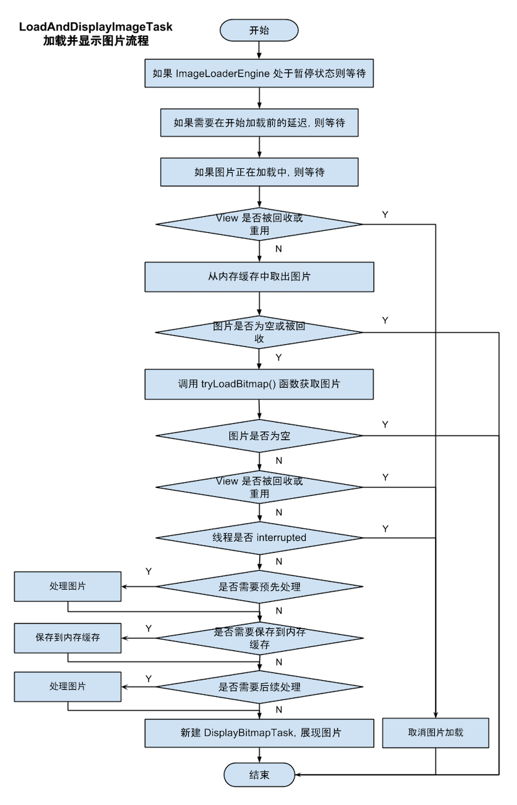

Android Universal Image Loader 源码分析
====================================
> 本文为 [Android 开源项目源码解析](https://github.com/android-cn/android-open-project-analysis) 中 Android Universal Image Loader 部分  
> 项目地址：[Android-Universal-Image-Loader](https://github.com/nostra13/Android-Universal-Image-Loader)，分析的版本：[eb794c3](https://github.com/nostra13/Android-Universal-Image-Loader/commit/eb794c306c1707a6cce80764b01f52109d5b9056)，Demo 地址：[UIL Demo](https://github.com/android-cn/android-open-project-demo/tree/master/universal-image-loader-demo)  
> 分析者：[huxian99](https://github.com/huxian99)，校对者：[Grumoon](https://github.com/grumoon)、[Trinea](https://github.com/trinea)，校对状态：完成

###1. 功能介绍
####1.1 Android Universal Image Loader
Android Universal Image Loader 是一个强大的、可高度定制的图片缓存，本文简称为`UIL`。  
简单的说 UIL 就做了一件事——获取图片并显示在相应的控件上。  

####1.2 基本使用
#####1.2.1 初始化
添加完依赖后在`Application`或`Activity`中初始化`ImageLoader`，如下：  
```java
public class YourApplication extends Application {

	@Override
	public void onCreate() {
	    super.onCreate();
	    ImageLoaderConfiguration configuration = new ImageLoaderConfiguration.Builder(this)
	        // 添加你的配置需求
	        .build();
	    ImageLoader.getInstance().init(configuration);
    }
}
```
其中 configuration 表示`ImageLoader`的配置信息，可包括图片最大尺寸、线程池、缓存、下载器、解码器等等。  

#####1.2.2 Manifest 配置
```xml
<manifest>
    <uses-permission android:name="android.permission.INTERNET" />
    <uses-permission android:name="android.permission.WRITE_EXTERNAL_STORAGE" />
    <application
        android:name=".YourApplication"
        …… >
        ……
    </application>
</manifest>
```  
添加网络权限。如果允许磁盘缓存，需要添加写外设的权限。  

#####1.2.3 下载显示图片
下载图片，解析为 Bitmap 并在 ImageView 中显示。  
```java
imageLoader.displayImage(imageUri, imageView);
```
下载图片，解析为 Bitmap 传递给回调接口。   
```java
imageLoader.loadImage(imageUri, new SimpleImageLoadingListener() {
    @Override
    public void onLoadingComplete(String imageUri, View view, Bitmap loadedImage) {
        // 图片处理
    }
});
```
以上是简单使用，更复杂 API 见本文`详细设计`。  

####1.3 特点
* 可配置度高。支持任务线程池、下载器、解码器、内存及磁盘缓存、显示选项等等的配置。  
* 包含内存缓存和磁盘缓存两级缓存。  
* 支持多线程，支持异步和同步加载。  
* 支持多种缓存算法、下载进度监听、ListView 图片错乱解决等。 

###2. 总体设计
####2.1. 总体设计图
  
上面是 UIL 的总体设计图。整个库分为`ImageLoaderEngine`，`Cache`及`ImageDownloader`，`ImageDecoder`，`BitmapDisplayer`，`BitmapProcessor`五大模块，其中`Cache`分为`MemoryCache`和`DiskCache`两部分。  

简单的讲就是`ImageLoader`收到加载及显示图片的任务，并将它交给`ImageLoaderEngine`，`ImageLoaderEngine`分发任务到具体线程池去执行，任务通过`Cache`及`ImageDownloader`获取图片，中间可能经过`BitmapProcessor`和`ImageDecoder`处理，最终转换为`Bitmap`交给`BitmapDisplayer`在`ImageAware`中显示。  

####2.2. UIL 中的概念
简单介绍一些概念，在`4. 详细设计`中会仔细介绍。  
**ImageLoaderEngine：**任务分发器，负责分发`LoadAndDisplayImageTask`和`ProcessAndDisplayImageTask`给具体的线程池去执行，本文中也称其为`engine`，具体参考`4.2.6 ImageLoaderEngine.java`。  

**ImageAware：**显示图片的对象，可以是`ImageView`等，具体参考`4.2.9 ImageAware.java`。  

**ImageDownloader：**图片下载器，负责从图片的各个来源获取输入流, 具体参考`4.2.22 ImageDownloader.java`。  

**Cache：**图片缓存，分为`MemoryCache`和`DiskCache`两部分。  

**MemoryCache：**内存图片缓存，可向内存缓存缓存图片或从内存缓存读取图片，具体参考`4.2.24 MemoryCache.java`。  

**DiskCache：**本地图片缓存，可向本地磁盘缓存保存图片或从本地磁盘读取图片，具体参考`4.2.38 DiskCache.java`。  

**ImageDecoder：**图片解码器，负责将图片输入流`InputStream`转换为`Bitmap`对象, 具体参考`4.2.53 ImageDecoder.java`。 

**BitmapProcessor：**图片处理器，负责从缓存读取或写入前对图片进行处理。具体参考`4.2.61 BitmapProcessor.java`。  

**BitmapDisplayer：**将`Bitmap`对象显示在相应的控件`ImageAware`上, 具体参考`4.2.56 BitmapDisplayer.java`。  

**LoadAndDisplayImageTask：**用于加载并显示图片的任务, 具体参考`4.2.20 LoadAndDisplayImageTask.java`。  

**ProcessAndDisplayImageTask：**用于处理并显示图片的任务, 具体参考`4.2.19 ProcessAndDisplayImageTask.java`。  

**DisplayBitmapTask：**用于显示图片的任务, 具体参考`4.2.18 DisplayBitmapTask.java`。  

###3. 流程图
  
上图为图片加载及显示流程图，在uil库中给出，这里用中文重新画出。  

###4. 详细设计
####4.1 类关系图
  

####4.2 核心类功能介绍
#####4.2.1 ImageLoader.java
图片加载器，对外的主要 API，采取了单例模式，用于图片的加载和显示。  

**主要函数：**  
#####(1). getInstance()
得到`ImageLoader`的单例。通过双层是否为 null 判断提高性能。  

#####(2). init(ImageLoaderConfiguration configuration)
初始化配置参数，参数`configuration`为`ImageLoader`的配置信息，包括图片最大尺寸、任务线程池、磁盘缓存、下载器、解码器等等。  
实现中会初始化`ImageLoaderEngine engine`属性，该属性为任务分发器。  

#####(3). displayImage(String uri, ImageAware imageAware, DisplayImageOptions options, ImageLoadingListener listener, ImageLoadingProgressListener progressListener)
加载并显示图片或加载并执行回调接口。`ImageLoader` 加载图片主要分为三类接口：  
* `displayImage(…)` 表示异步加载并显示图片到对应的`ImageAware`上。  
* `loadImage(…)` 表示异步加载图片并执行回调接口。  
* `loadImageSync(…)` 表示同步加载图片。  

以上三类接口最终都会调用到这个函数进行图片加载。函数参数解释如下：  
**uri:** 图片的 uri。uri 支持多种来源的图片，包括 http、https、file、content、assets、drawable 及自定义，具体介绍可见`ImageDownloader`。  
**imageAware:** 一个接口，表示需要加载图片的对象，可包装 View。  
**options:** 图片显示的配置项。比如加载前、加载中、加载失败应该显示的占位图片，图片是否需要在磁盘缓存，是否需要在内存缓存等。  
**listener:** 图片加载各种时刻的回调接口，包括开始加载、加载失败、加载成功、取消加载四个时刻的回调函数。  
**progressListener:** 图片加载进度的回调接口。  

**函数流程图如下：**  
  

#####4.2.2 ImageLoaderConfiguration.java
`ImageLoader`的配置信息，包括图片最大尺寸、线程池、缓存、下载器、解码器等等。  

**主要属性：**  
#####(1). Resources resources
程序本地资源访问器，用于加载`DisplayImageOptions`中设置的一些 App 中图片资源。  
#####(2). int maxImageWidthForMemoryCache
内存缓存的图片最大宽度。  
#####(3). int maxImageHeightForMemoryCache
内存缓存的图片最大高度。  
#####(4). int maxImageWidthForDiskCache
磁盘缓存的图片最大宽度。  
#####(5). int maxImageHeightForDiskCache
磁盘缓存的图片最大高度。  
#####(6). BitmapProcessor processorForDiskCache
图片处理器，用于处理从磁盘缓存中读取到的图片。  
#####(7). Executor taskExecutor
`ImageLoaderEngine`中用于执行从源获取图片任务的 Executor。  
#####(18). Executor taskExecutorForCachedImages
`ImageLoaderEngine`中用于执行从缓存获取图片任务的 Executor。  
#####(19). boolean customExecutor
用户是否自定义了上面的 taskExecutor。  
#####(20). boolean customExecutorForCachedImages
用户是否自定义了上面的 taskExecutorForCachedImages。  
#####(21). int threadPoolSize
上面两个默认线程池的核心池大小，即最大并发数。  
#####(22). int threadPriority
上面两个默认线程池的线程优先级。  
#####(23). QueueProcessingType tasksProcessingType
上面两个默认线程池的线程队列类型。目前只有 FIFO, LIFO 两种可供选择。  
#####(24). MemoryCache memoryCache
图片内存缓存。  
#####(25). DiskCache diskCache
图片磁盘缓存，一般放在 SD 卡。  
#####(26). ImageDownloader downloader
图片下载器。  
#####(27). ImageDecoder decoder
图片解码器，内部可使用我们常用的`BitmapFactory.decode(…)`将图片资源解码成`Bitmap`对象。  
#####(28). DisplayImageOptions defaultDisplayImageOptions
图片显示的配置项。比如加载前、加载中、加载失败应该显示的占位图片，图片是否需要在磁盘缓存，是否需要在内存缓存等。  
#####(29). ImageDownloader networkDeniedDownloader
不允许访问网络的图片下载器。  
#####(30). ImageDownloader slowNetworkDownloader
慢网络情况下的图片下载器。  

#####4.2.3 ImageLoaderConfiguration.Builder.java 静态内部类
Builder 模式，用于构造参数繁多的`ImageLoaderConfiguration`。  
其属性与`ImageLoaderConfiguration`类似，函数多是属性设置函数。  

**主要函数及含义：**  
#####(1). build()
按照配置，生成 ImageLoaderConfiguration。代码如下：  
```java
public ImageLoaderConfiguration build() {
	initEmptyFieldsWithDefaultValues();
	return new ImageLoaderConfiguration(this);
}
```  
#####(2). initEmptyFieldsWithDefaultValues()
初始化值为`null`的属性。若用户没有配置相关项，UIL 会通过调用`DefaultConfigurationFactory`中的函数返回一个默认值当配置。  
`taskExecutorForCachedImages`、`taskExecutor`及`ImageLoaderEngine`的`taskDistributor`的默认值如下：  

parameters | taskDistributor | taskExecutorForCachedImages/taskExecutor
--- |--- |---
corePoolSize | 0 | 3
maximumPoolSize | Integer.MAX_VALUE | 3
keepAliveTime | 60 | 0
unit | SECONDS | MILLISECONDS
workQueue | SynchronousQueue | LIFOLinkedBlockingDeque / LinkedBlockingQueue
priority | 5 | 3
`diskCacheFileNameGenerator`默认值为`HashCodeFileNameGenerator`。  
`memoryCache`默认值为`LruMemoryCache`。如果内存缓存不允许缓存一张图片的多个尺寸，则用`FuzzyKeyMemoryCache`做封装，同一个图片新的尺寸会覆盖缓存中该图片老的尺寸。  
`diskCache`默认值与`diskCacheSize`和`diskCacheFileCount`值有关，如果他们有一个大于 0，则默认为`LruDiskCache`，否则使用无大小限制的`UnlimitedDiskCache`。  
`downloader`默认值为`BaseImageDownloader`。  
`decoder`默认值为`BaseImageDecoder`。  
详细及其他属性默认值请到`DefaultConfigurationFactory`中查看。  

#####(3). denyCacheImageMultipleSizesInMemory()
设置内存缓存不允许缓存一张图片的多个尺寸，默认允许。  
后面会讲到 View 的 `getWidth()` 在初始化前后的不同值与这个设置的关系。  

#####(4). diskCacheSize(int maxCacheSize)
设置磁盘缓存的最大字节数，如果大于 0 或者下面的`maxFileCount`大于 0，默认的`DiskCache`会用`LruDiskCache`，否则使用无大小限制的`UnlimitedDiskCache`。  
#####(5). diskCacheFileCount(int maxFileCount)
设置磁盘缓存文件夹下最大文件数，如果大于 0 或者上面的`maxCacheSize`大于 0，默认的`DiskCache`会用`LruDiskCache`，否则使用无大小限制的`UnlimitedDiskCache`。  

#####4.2.4 ImageLoaderConfiguration.NetworkDeniedImageDownloader.java 静态内部类
不允许访问网络的图片下载器，实现了`ImageDownloader`接口。  
实现也比较简单，包装一个`ImageDownloader`对象，通过在 getStream(…) 函数中禁止 Http 和 Https Scheme 禁止网络访问，如下：  
```java
@Override
public InputStream getStream(String imageUri, Object extra) throws IOException {
	switch (Scheme.ofUri(imageUri)) {
		case HTTP:
		case HTTPS:
			throw new IllegalStateException();
		default:
			return wrappedDownloader.getStream(imageUri, extra);
	}
}
```

#####4.2.5 ImageLoaderConfiguration.SlowNetworkImageDownloader.java 静态内部类
慢网络情况下的图片下载器，实现了`ImageDownloader`接口。  
通过包装一个`ImageDownloader`对象实现，在 getStream(…) 函数中当 Scheme 为 Http 和 Https 时，用`FlushedInputStream`代替`InputStream`处理慢网络情况，具体见后面`FlushedInputStream`的介绍。  

#####4.2.6 ImageLoaderEngine.java
`LoadAndDisplayImageTask`和`ProcessAndDisplayImageTask`任务分发器，负责分发任务给具体的线程池。  

**主要属性：**  
#####(1). ImageLoaderConfiguration configuration
`ImageLoader`的配置信息，可包括图片最大尺寸、线程池、缓存、下载器、解码器等等。  
#####(2). Executor taskExecutor
用于执行从源获取图片任务的 Executor，为`configuration`中的 taskExecutor，如果为`null`，则会调用`DefaultConfigurationFactory.createExecutor(…)`根据配置返回一个默认的线程池。  
#####(3). Executor taskExecutorForCachedImages
用于执行从缓存获取图片任务的 Executor，为`configuration`中的 taskExecutorForCachedImages，如果为`null`，则会调用`DefaultConfigurationFactory.createExecutor(…)`根据配置返回一个默认的线程池。  
#####(4). Executor taskDistributor
任务分发线程池，任务指`LoadAndDisplayImageTask`和`ProcessAndDisplayImageTask`，因为只需要分发给上面的两个 Executor 去执行任务，不存在较耗时或阻塞操作，所以用无并发数(Int 最大值)限制的线程池即可。  
#####(5). Map<Integer, String> cacheKeysForImageAwares
`ImageAware`与内存缓存 key 对应的 map，key 为`ImageAware`的 id，value 为内存缓存的 key。
#####(6). Map<String, ReentrantLock> uriLocks
图片正在加载的重入锁 map，key 为图片的 uri，value 为标识其正在加载的重入锁。  
#####(7). AtomicBoolean paused
是否被暂停。如果为`true`，则所有新的加载或显示任务都会等待直到取消暂停(为`false`)。  
#####(8). AtomicBoolean networkDenied
是否不允许访问网络，如果为`true`，通过`ImageLoadingListener.onLoadingFailed(…)`获取图片，则所有不在缓存中需要网络访问的请求都会失败，返回失败原因为`网络访问被禁止`。  
#####(9). AtomicBoolean slowNetwork
是否是慢网络情况，如果为`true`，则自动调用`SlowNetworkImageDownloader`下载图片。  
#####(10). Object pauseLock
暂停的等待锁，可在`engine`被暂停后调用这个锁等待。  

**主要函数：**  
#####(1). void submit(final LoadAndDisplayImageTask task)
添加一个`LoadAndDisplayImageTask`。直接用`taskDistributor`执行一个 Runnable，在 Runnable 内部根据图片是否被磁盘缓存过确定使用`taskExecutorForCachedImages`还是`taskExecutor`执行该 task。  
#####(2). void submit(ProcessAndDisplayImageTask task)
添加一个`ProcessAndDisplayImageTask`。直接用`taskExecutorForCachedImages`执行该 task。  
#####(3). void pause()
暂停图片加载任务。所有新的加载或显示任务都会等待直到取消暂停(为`false`)。  
#####(4). void resume()
继续图片加载任务。
#####(5). stop()
暂停所有加载和显示图片任务并清除这里的内部属性值。  
#####(6). fireCallback(Runnable r)
`taskDistributor`立即执行某个任务。  
#####(7). getLockForUri(String uri)
得到某个 uri 的重入锁，如果不存在则新建。   
#####(8). createTaskExecutor()
调用`DefaultConfigurationFactory.createExecutor(…)`创建一个线程池。  
#####(9). getLoadingUriForView(ImageAware imageAware)
得到某个`imageAware`正在加载的图片 uri。  
#####(10). prepareDisplayTaskFor(ImageAware imageAware, String memoryCacheKey)
准备开始一个`Task`。向`cacheKeysForImageAwares`中插入`ImageAware`的 id 和图片在内存缓存中的 key。  
#####(11). void cancelDisplayTaskFor(ImageAware imageAware)
取消一个显示任务。从`cacheKeysForImageAwares`中删除`ImageAware`对应元素。  
#####(12). denyNetworkDownloads(boolean denyNetworkDownloads)
设置是否不允许网络访问。  
#####(13). handleSlowNetwork(boolean handleSlowNetwork)
设置是否慢网络情况。  

#####4.2.7 DefaultConfigurationFactory.java
为`ImageLoaderConfiguration`及`ImageLoaderEngine`提供一些默认配置。  

**主要函数：**  
#####(1). createExecutor(int threadPoolSize, int threadPriority, QueueProcessingType tasksProcessingType)  
创建线程池。  
`threadPoolSize`表示核心池大小(最大并发数)。  
`threadPriority`表示线程优先级。  
`tasksProcessingType`表示线程队列类型，目前只有 FIFO, LIFO 两种可供选择。  
内部实现会调用`createThreadFactory(…)`返回一个支持线程优先级设置，并且以固定规则命名新建的线程的线程工厂类`DefaultConfigurationFactory.DefaultThreadFactory`。  
#####(2). createTaskDistributor()
为`ImageLoaderEngine`中的任务分发器`taskDistributor`提供线程池，该线程池为 normal 优先级的无并发大小限制的线程池。  
#####(3). createFileNameGenerator()
返回一个`HashCodeFileNameGenerator`对象，即以 uri HashCode 为文件名的文件名生成器。  
#####(4). createDiskCache(Context context, FileNameGenerator diskCacheFileNameGenerator, long diskCacheSize, int diskCacheFileCount)
创建一个 Disk Cache。如果 diskCacheSize 或者 diskCacheFileCount 大于 0，返回一个`LruDiskCache`，否则返回无大小限制的`UnlimitedDiskCache`。  
#####(5). createMemoryCache(Context context, int memoryCacheSize)
创建一个 Memory Cache。返回一个`LruMemoryCache`，若 memoryCacheSize 为 0，则设置该内存缓存的最大字节数为 App 最大可用内存的 1/8。  
这里 App 的最大可用内存也支持系统在 Honeycomb之后(ApiLevel >= 11) application 中`android:largeHeap="true"`的设置。  
#####(6). createImageDownloader(Context context)
创建图片下载器，返回一个`BaseImageDownloader`。  
#####(7). createImageDecoder(boolean loggingEnabled)
创建图片解码器，返回一个`BaseImageDecoder`。  
#####(8). createBitmapDisplayer()
创建图片显示器，返回一个`SimpleBitmapDisplayer`。  

#####4.2.8 DefaultConfigurationFactory.DefaultThreadFactory
默认的线程工厂类，为  
`DefaultConfigurationFactory.createExecutor(…)`  
和  
`DefaultConfigurationFactory.createTaskDistributor(…)`  
提供线程工厂。支持线程优先级设置，并且以固定规则命名新建的线程。  

PS：重命名线程是个很好的习惯，它的一大作用就是方便问题排查，比如性能优化，用 TraceView 查看线程，根据名字很容易分辨各个线程。  

#####4.2.9 ImageAware.java
需要显示图片的对象的接口，可包装 View 表示某个需要显示图片的 View。  

**主要函数：**  
#####(1). View getWrappedView()
得到被包装的 View，图片在该 View 上显示。  
#####(2). getWidth() 与 getHeight()   
得到宽度高度，在计算图片缩放比例时会用到。  
#####(3). getId()
得到唯一标识 id。`ImageLoaderEngine`中用这个 id 标识正在加载图片的`ImageAware`和图片内存缓存 key 的对应关系，图片请求前会将内存缓存 key 与新的内存缓存 key 进行比较，如果不相等，则之前的图片请求会被取消。这样当`ImageAware`被复用时就不会因异步加载(前面任务未取消)而造成错乱了。 

#####4.2.10 ViewAware.java  
封装 Android View 来显示图片的抽象类，实现了`ImageAware`接口，利用`Reference`来 Warp View 防止内存泄露。  

**主要函数：**  
#####(1). ViewAware(View view, boolean checkActualViewSize)
构造函数。  
`view`表示需要显示图片的对象。  
`checkActualViewSize`表示通过`getWidth()`和`getHeight()`获取图片宽高时返回真实的宽和高，还是`LayoutParams`的宽高，true 表示返回真实宽和高。  
如果为`true`会导致一个问题，`View`在还没有初始化完成时加载图片，这时它的真实宽高为0，会取它`LayoutParams`的宽高，而图片缓存的 key 与这个宽高有关，所以当`View`初始化完成再次需要加载该图片时，`getWidth()`和`getHeight()`返回的宽高都已经变化，缓存 key 不一样，从而导致缓存命中失败会再次从网络下载一次图片。可通过`ImageLoaderConfiguration.Builder.denyCacheImageMultipleSizesInMemory()`设置不允许内存缓存缓存一张图片的多个尺寸。  

#####(2). setImageDrawable(Drawable drawable)
如果当前操作在主线程并且 View 没有被回收，则调用抽象函数`setImageDrawableInto(Drawable drawable, View view)`去向`View`设置图片。  

#####(3). setImageBitmap(Bitmap bitmap)
如果当前操作在主线程并且 View 没有被回收，则调用抽象函数`setImageBitmapInto(Bitmap bitmap, View view)`去向`View`设置图片。  

#####4.2.11 ImageViewAware.java  
封装 Android ImageView 来显示图片的`ImageAware`，继承了`ViewAware`，利用`Reference`来 Warp View 防止内存泄露。  
如果`getWidth()`函数小于等于0，会利用反射获取`mMaxWidth`的值作为宽。  
如果`getHeight()`函数小于等于0，会利用反射获取`mMaxHeight`的值作为高。  

#####4.2.12 NonViewAware.java  
仅包含处理图片相关信息却没有需要显示图片的 View 的`ImageAware`，实现了`ImageAware`接口。常用于加载图片后调用回调接口而不是显示的情况。  

#####4.2.13 DisplayImageOptions.java
图片显示的配置项。比如加载前、加载中、加载失败应该显示的占位图片，图片是否需要在磁盘缓存，是否需要在 memory 缓存等。  

**主要属性及含义：**  
#####(1). int imageResOnLoading
图片正在加载中的占位图片的 resource id，优先级比下面的`imageOnLoading`高，当存在时，`imageOnLoading`不起作用。  
#####(2). int imageResForEmptyUri
空 uri 时的占位图片的 resource id，优先级比下面的`imageForEmptyUri`高，当存在时，`imageForEmptyUri`不起作用。  
#####(3). int imageResOnFail
加载失败时的占位图片的 resource id，优先级比下面的`imageOnFail`高，当存在时，`imageOnFail`不起作用。  
#####(4). Drawable imageOnLoading
加载中的占位图片的 drawabled 对象，默认为 null。  
#####(5). Drawable imageForEmptyUri
空 uri 时的占位图片的 drawabled 对象，默认为 null。  
#####(6). Drawable imageOnFail
加载失败时的占位图片的 drawabled 对象，默认为 null。  
#####(7). boolean resetViewBeforeLoading
在加载前是否重置 view，通过 Builder 构建的对象默认为 false。  
#####(8). boolean cacheInMemory
是否缓存在内存中，通过 Builder 构建的对象默认为 false。  
#####(9). boolean cacheOnDisk
是否缓存在磁盘中，通过 Builder 构建的对象默认为 false。  
#####(10). ImageScaleType imageScaleType
图片的缩放类型，通过 Builder 构建的对象默认为`IN_SAMPLE_POWER_OF_2`。  
#####(11). Options decodingOptions;
为 BitmapFactory.Options，用于`BitmapFactory.decodeStream(imageStream, null, decodingOptions)`得到图片尺寸等信息。  
#####(12). int delayBeforeLoading
设置在开始加载前的延迟时间，单位为毫秒，通过 Builder 构建的对象默认为 0。  
#####(13). boolean considerExifParams
是否考虑图片的 EXIF 信息，通过 Builder 构建的对象默认为 false。  
#####(14). Object extraForDownloader
下载器需要的辅助信息。下载时传入`ImageDownloader.getStream(String, Object)`的对象，方便用户自己扩展，默认为 null。  
#####(15). BitmapProcessor preProcessor
缓存在内存之前的处理程序，默认为 null。  
#####(16). BitmapProcessor postProcessor
缓存在内存之后的处理程序，默认为 null。  
#####(17). BitmapDisplayer displayer
图片的显示方式，通过 Builder 构建的对象默认为`SimpleBitmapDisplayer`。  
#####(18). Handler handler
handler 对象，默认为 null。  
#####(19). boolean isSyncLoading
是否同步加载，通过 Builder 构建的对象默认为 false。  

#####4.2.14 DisplayImageOptions.Builder.java 静态内部类  
Builder 模式，用于构造参数繁多的`DisplayImageOptions`。  
其属性与`DisplayImageOptions`类似，函数多是属性设置函数。  

#####4.2.15 ImageLoadingListener.java
图片加载各种时刻的回调接口，可在图片加载的某些点做监听。  
包括开始加载(onLoadingStarted)、加载失败(onLoadingFailed)、加载成功(onLoadingComplete)、取消加载(onLoadingCancelled)四个回调函数。  

#####4.2.16 SimpleImageLoadingListener.java
实现`ImageLoadingListener`接口，不过各个函数都是空实现，表示不在 Image 加载过程中做任何回调监听。  
`ImageLoader.displayImage(…)`函数中当入参`listener`为空时的默认值。  

#####4.2.17 ImageLoadingProgressListener.java
Image 加载进度的回调接口。其中抽象函数  
```java
void onProgressUpdate(String imageUri, View view, int current, int total)
```
会在获取图片存储到文件系统时被回调。其中`total`表示图片总大小，为网络请求结果`Response Header`中`content-length`字段，如果不存在则为 -1。  

#####4.2.18 DisplayBitmapTask.java
显示图片的`Task`，实现了`Runnable`接口，必须在主线程调用。  

**主要函数：**  
#####(1) run()
首先判断`imageAware`是否被 GC 回收，如果是直接调用取消加载回调接口`ImageLoadingListener.onLoadingCancelled(…)`；  
否则判断`imageAware`是否被复用，如果是直接调用取消加载回调接口`ImageLoadingListener.onLoadingCancelled(…)`；  
否则调用`displayer`显示图片，并将`imageAware`从正在加载的 map 中移除。调用加载成功回调接口`ImageLoadingListener.onLoadingComplete(…)`。  

对于 ListView 或是 GridView 这类会缓存 Item 的 View 来说，单个 Item 中如果含有 ImageView，在滑动过程中可能因为异步加载及 View 复用导致图片错乱，这里对`imageAware`是否被复用的判断就能很好的解决这个问题。原因类似：[Android ListView 滑动过程中图片显示重复错位闪烁问题原因及解决方案](http://www.trinea.cn/android/android-listview-display-error-image-when-scroll/)。  

#####4.2.19 ProcessAndDisplayImageTask.java
处理并显示图片的`Task`，实现了`Runnable`接口。  

**主要函数：**  
#####(1) run()
主要通过 imageLoadingInfo 得到`BitmapProcessor`处理图片，并用处理后的图片和配置新建一个`DisplayBitmapTask`在`ImageAware`中显示图片。  

#####4.2.20 LoadAndDisplayImageTask.java
加载并显示图片的`Task`，实现了`Runnable`接口，用于从网络、文件系统或内存获取图片并解析，然后调用`DisplayBitmapTask`在`ImageAware`中显示图片。  

**主要函数：**  
#####(1) run()
获取图片并显示，核心代码如下：  
```java
bmp = configuration.memoryCache.get(memoryCacheKey);
if (bmp == null || bmp.isRecycled()) {
	bmp = tryLoadBitmap();
	...
	...
	...
	if (bmp != null && options.isCacheInMemory()) {
		L.d(LOG_CACHE_IMAGE_IN_MEMORY, memoryCacheKey);
		configuration.memoryCache.put(memoryCacheKey, bmp);
	}
}
……
DisplayBitmapTask displayBitmapTask = new DisplayBitmapTask(bmp, imageLoadingInfo, engine, loadedFrom);
runTask(displayBitmapTask, syncLoading, handler, engine);
```
从上面代码段中可以看到先是从内存缓存中去读取 bitmap 对象，若 bitmap 对象不存在，则调用 tryLoadBitmap() 函数获取 bitmap 对象，获取成功后若在 DisplayImageOptions.Builder 中设置了 cacheInMemory(true), 同时将 bitmap 对象缓存到内存中。  
最后新建`DisplayBitmapTask`显示图片。  

**函数流程图如下：**  
  
1. 判断图片的内存缓存是否存在，若存在直接执行步骤 8；  
2. 判断图片的磁盘缓存是否存在，若存在直接执行步骤 5；  
3. 从网络上下载图片；  
4. 将图片缓存在磁盘上；  
5. 将图片 decode 成 bitmap 对象；  
6. 根据`DisplayImageOptions`配置对图片进行预处理(Pre-process Bitmap)；  
7. 将 bitmap 对象缓存到内存中；  
8. 根据`DisplayImageOptions`配置对图片进行后处理(Post-process Bitmap)；  
9. 执行`DisplayBitmapTask`将图片显示在相应的控件上。  
流程图可以参见`3. 流程图`。  

#####(2) tryLoadBitmap()
从磁盘缓存或网络获取图片，核心代码如下：  
```java
File imageFile = configuration.diskCache.get(uri);
if (imageFile != null && imageFile.exists()) {
	...
	bitmap = decodeImage(Scheme.FILE.wrap(imageFile.getAbsolutePath()));
}
if (bitmap == null || bitmap.getWidth() <= 0 || bitmap.getHeight() <= 0) {
	...
	String imageUriForDecoding = uri;
	if (options.isCacheOnDisk() && tryCacheImageOnDisk()) {
		imageFile = configuration.diskCache.get(uri);
		if (imageFile != null) {
			imageUriForDecoding = Scheme.FILE.wrap(imageFile.getAbsolutePath());
		}
	}
	checkTaskNotActual();
	bitmap = decodeImage(imageUriForDecoding);
	...
}
```
首先根据 uri 看看磁盘中是不是已经缓存了这个文件，如果已经缓存，调用 decodeImage 函数，将图片文件 decode 成 bitmap 对象；
如果 bitmap 不合法或缓存文件不存在，判断是否需要缓存在磁盘，需要则调用`tryCacheImageOnDisk()`函数去下载并缓存图片到本地磁盘，再通过`decodeImage(imageUri)`函数将图片文件decode成bitmap对象，否则直接通过`decodeImage(imageUriForDecoding)`下载图片并解析。  

#####(3) tryCacheImageOnDisk()
下载图片并存储在磁盘内，根据磁盘缓存图片最长宽高的配置处理图片。  
```java
	loaded = downloadImage();
```
主要就是这一句话，调用下载器下载并保存图片。  
如果你在`ImageLoaderConfiguration`中还配置了`maxImageWidthForDiskCache`或者`maxImageHeightForDiskCache`，还会调用`resizeAndSaveImage()`函数，调整图片尺寸，并保存新的图片文件。  
#####(4) downloadImage()
下载图片并存储在磁盘内。调用`getDownloader()`得到`ImageDownloader`去下载图片。  
#####(4) resizeAndSaveImage(int maxWidth, int maxHeight)
从磁盘缓存中得到图片，重新设置大小及进行一些处理后保存。  
#####(5) getDownloader()
根据`ImageLoaderEngine`配置得到下载器。  
如果不允许访问网络，则使用不允许访问网络的图片下载器`NetworkDeniedImageDownloader`；如果是慢网络情况，则使用慢网络情况下的图片下载器`SlowNetworkImageDownloader`；否则直接使用`ImageLoaderConfiguration`中的`downloader`。  

#####4.2.21 ImageLoadingInfo.java
加载和显示图片任务需要的信息。  
`String uri` 图片 url。  
`String memoryCacheKey` 图片缓存 key。  
`ImageAware imageAware` 需要加载图片的对象。  
`ImageSize targetSize` 图片的显示尺寸。  
`DisplayImageOptions options` 图片显示的配置项。  
`ImageLoadingListener listener` 图片加载各种时刻的回调接口。  
`ImageLoadingProgressListener progressListener` 图片加载进度的回调接口。  
`ReentrantLock loadFromUriLock` 图片加载中的重入锁。  

#####4.2.22 ImageDownloader.java
图片下载接口。待实现函数  
```java
getStream(String imageUri, Object extra)
```
表示通过 uri 得到 InputStream。  
通过内部定义的枚举`Scheme`, 可以看出 UIL 支持哪些图片来源。  
```java
HTTP("http"), HTTPS("https"), FILE("file"), CONTENT("content"), ASSETS("assets"), DRAWABLE("drawable"), UNKNOWN("");
```

#####4.2.23 BaseImageDownloader.java
`ImageDownloader`的具体实现类。得到上面各种`Scheme`对应的图片 InputStream。  

**主要函数**  
#####(1). getStream(String imageUri, Object extra)
在`getStream(…)`函数内根据不同`Scheme`类型获取图片输入流。  
```java
@Override
public InputStream getStream(String imageUri, Object extra) throws IOException {
	switch (Scheme.ofUri(imageUri)) {
		case HTTP:
		case HTTPS:
			return getStreamFromNetwork(imageUri, extra);
		case FILE:
			return getStreamFromFile(imageUri, extra);
		case CONTENT:
			return getStreamFromContent(imageUri, extra);
		case ASSETS:
			return getStreamFromAssets(imageUri, extra);
		case DRAWABLE:
			return getStreamFromDrawable(imageUri, extra);
		case UNKNOWN:
		default:
			return getStreamFromOtherSource(imageUri, extra);
	}
}
```
具体见下面各函数介绍。  

#####(2). getStreamFromNetwork(String imageUri, Object extra)
通过`HttpURLConnection`从网络获取图片的`InputStream`。支持 response code 为 3xx 的重定向。这里有个小细节代码如下：  
```java
try {
	imageStream = conn.getInputStream();
} catch (IOException e) {
	// Read all data to allow reuse connection (http://bit.ly/1ad35PY)
	IoUtils.readAndCloseStream(conn.getErrorStream());
	throw e;
}
```
在发生异常时会调用`conn.getErrorStream()`继续读取 Error Stream，这是为了利于网络连接回收及复用。但有意思的是在 Froyo(2.2) 之前，HttpURLConnection 有个重大 Bug，调用 close() 函数会影响连接池，导致连接复用失效，不少库通过在 2.3 之前使用 AndroidHttpClient 解决这个问题。  

#####(3). getStreamFromFile(String imageUri, Object extra)
从文件系统获取图片的`InputStream`。如果 uri 是 video 类型，则需要单独得到 video 的缩略图返回，否则按照一般读取文件操作返回。  

#####(4). getStreamFromContent(String imageUri, Object extra)
从 ContentProvider 获取图片的`InputStream`。  
如果是 video 类型，则先从`MediaStore`得到 video 的缩略图返回；  
如果是联系人类型，通过`ContactsContract.Contacts.openContactPhotoInputStream(res, uri)`读取内容返回。  
否则通过 ContentResolver.openInputStream(…) 读取内容返回。  

#####(5). getStreamFromAssets(String imageUri, Object extra)
从 Assets 中获取图片的`InputStream`。  

#####(6). getStreamFromDrawable(String imageUri, Object extra)
从 Drawable 资源中获取图片的`InputStream`。  

#####(7). getStreamFromOtherSource(String imageUri, Object extra)
UNKNOWN(自定义)类型的处理，目前是直接抛出不支持的异常。  

#####4.2.24 MemoryCache.java
Bitmap 内存缓存接口，需要实现的接口包括 get(…)、put(…)、remove(…)、clear()、keys()。  

#####4.2.25 BaseMemoryCache.java
实现了`MemoryCache`主要函数的抽象类，以 Map\<String, Reference\<Bitmap\>\> softMap 做为缓存池，利于虚拟机在内存不足时回收缓存对象。提供抽象函数：  
```java
protected abstract Reference<Bitmap> createReference(Bitmap value)
```
表示根据 Bitmap 创建一个 Reference<Bitmap> 做为缓存对象。Reference 可以是 WeakReference、SoftReference 等。  

#####4.2.26 WeakMemoryCache.java
以`WeakReference<Bitmap>`做为缓存 value 的内存缓存，实现了`BaseMemoryCache`。  
实现了`BaseMemoryCache`的`createReference(Bitmap value)`函数，直接返回一个`new WeakReference<Bitmap>(value)`做为缓存 value。  

#####4.2.27 LimitedMemoryCache.java
限制总字节大小的内存缓存，继承自`BaseMemoryCache`的抽象类。  
会在 put(…) 函数中判断总体大小是否超出了上限，是则循环删除缓存对象直到小于上限。删除顺序由抽象函数  
```java
protected abstract Bitmap removeNext()
```
决定。抽象函数   
```java
protected abstract int getSize(Bitmap value)
```
表示每个元素大小。  

#####4.2.28 LargestLimitedMemoryCache.java
限制总字节大小的内存缓存，会在缓存满时优先删除 size 最大的元素，继承自`LimitedMemoryCache`。  
实现了`LimitedMemoryCache`缓存`removeNext()`函数，总是返回当前缓存中 size 最大的元素。  

#####4.2.29 UsingFreqLimitedMemoryCache.java
限制总字节大小的内存缓存，会在缓存满时优先删除使用次数最少的元素，继承自`LimitedMemoryCache`。  
实现了`LimitedMemoryCache`缓存`removeNext()`函数，总是返回当前缓存中使用次数最少的元素。  

#####4.2.30 LRULimitedMemoryCache.java
限制总字节大小的内存缓存，会在缓存满时优先删除最近最少使用的元素，继承自`LimitedMemoryCache`。  
通过`new LinkedHashMap<String, Bitmap>(10, 1.1f, true)`作为缓存池。LinkedHashMap 第三个参数表示是否需要根据访问顺序(accessOrder)排序，true 表示根据`accessOrder`排序，最近访问的跟最新加入的一样放到最后面，false 表示根据插入顺序排序。这里为 true 且缓存满时始终删除第一个元素，即始终删除最近最少访问的元素。  
实现了`LimitedMemoryCache`缓存`removeNext()`函数，总是返回第一个元素，即最近最少使用的元素。  

#####4.2.31 FIFOLimitedMemoryCache.java
限制总字节大小的内存缓存，会在缓存满时优先删除先进入缓存的元素，继承自`LimitedMemoryCache`。  
实现了`LimitedMemoryCache`缓存`removeNext()`函数，总是返回最先进入缓存的元素。  

**以上所有`LimitedMemoryCache`子类都有个问题，就是 Bitmap 虽然通过`WeakReference<Bitmap>`包装，但实际根本不会被虚拟机回收，因为他们子类中同时都保留了 Bitmap 的强引用。大都是 UIL 早期实现的版本，不推荐使用。**  

#####4.2.32 LruMemoryCache.java
限制总字节大小的内存缓存，会在缓存满时优先删除最近最少使用的元素，实现了`MemoryCache`。LRU(Least Recently Used) 为最近最少使用算法。  

以`new LinkedHashMap<String, Bitmap>(0, 0.75f, true)`作为缓存池。LinkedHashMap 第三个参数表示是否需要根据访问顺序(accessOrder)排序，true 表示根据`accessOrder`排序，最近访问的跟最新加入的一样放到最后面，false 表示根据插入顺序排序。这里为 true 且缓存满时始终删除第一个元素，即始终删除最近最少访问的元素。  

在`put(…)`函数中通过`trimToSize(int maxSize)`函数判断总体大小是否超出了上限，是则删除第缓存池中第一个元素，即最近最少使用的元素，直到总体大小小于上限。  

`LruMemoryCache`功能上与`LRULimitedMemoryCache`类似，不过在实现上更加优雅。用简单的实现接口方式，而不是不断继承的方式。  

#####4.2.33 LimitedAgeMemoryCache.java
限制了对象最长存活周期的内存缓存。  
`MemoryCache`的装饰者，相当于为`MemoryCache`添加了一个特性。以一个`MemoryCache`内存缓存和一个 maxAge 做为构造函数入参。在 get(…) 时判断如果对象存活时间已经超过设置的最长时间，则删除。  

#####4.2.34 FuzzyKeyMemoryCache.java
可以将某些原本不同的 key 看做`相等`，在 put 时删除这些`相等`的 key。  
`MemoryCache`的装饰者，相当于为`MemoryCache`添加了一个特性。以一个`MemoryCache`内存缓存和一个 keyComparator 做为构造函数入参。在 put(…) 时判断如果 key 与缓存中已有 key 经过`Comparator`比较后相等，则删除之前的元素。  

#####4.2.35 FileNameGenerator.java
根据 uri 得到文件名的接口。  

#####4.2.36 HashCodeFileNameGenerator.java
以 uri 的 hashCode 作为文件名。  

#####4.2.37 Md5FileNameGenerator.java
以 uri 的 MD5 值作为文件名。  

#####4.2.38 DiskCache.java
图片的磁盘缓存接口。  

**主要函数:**  
#####(1) File get(String imageUri)
根据原始图片的 uri 去获取缓存图片的文件。  
#####(2) boolean save(String imageUri, InputStream imageStream, IoUtils.CopyListener listener) 
保存 imageStream 到磁盘中，listener 表示保存进度且可在其中取消某些段的保存。  
#####(3) boolean save(String imageUri, Bitmap bitmap) 
保存图片到磁盘。  
#####(4) boolean remove(String imageUri) 
根据图片 uri 删除缓存图片。  
#####(5) void close()
关闭磁盘缓存，并释放资源。  
#####(6) void clear()
清空磁盘缓存。  
#####(7) File getDirectory()
得到磁盘缓存的根目录。  

#####4.2.39 BaseDiskCache.java
一个无大小限制的本地图片缓存，实现了`DiskCache`主要函数的抽象类。  
图片缓存在`cacheDir`文件夹内，当`cacheDir`不可用时，则使用备库`reserveCacheDir`。  

**主要函数：** 
#####(1). save(String imageUri, InputStream imageStream, IoUtils.CopyListener listener)
先根据`imageUri`得到目标文件，将`imageStream`先写入与目标文件同一文件夹的 .tmp 结尾的临时文件内，若未被`listener`取消且写入成功则将临时文件重命名为目标文件并返回 true，否则删除临时文件并返回 false。  

#####(2). save(String imageUri, Bitmap bitmap)
先根据`imageUri`得到目标文件，通过`Bitmap.compress(…)`函数将`bitmap`先写入与目标文件同一文件夹的 .tmp 结尾的临时文件内，若写入成功则将临时文件重命名为目标文件并返回 true，否则删除临时文件并返回 false。  

#####(3). File getFile(String imageUri)
根据 imageUri 和 `fileNameGenerator`得到文件名，返回`cacheDir`内该文件，若`cacheDir`不可用，则使用备库`reserveCacheDir`。  

#####4.2.40 LimitedAgeDiskCache.java
限制了缓存对象最长存活周期的磁盘缓存，继承自`BaseDiskCache`。  
在 get(…) 时判断如果缓存对象存活时间已经超过设置的最长时间，则删除。在 save(…) 时保存当存时间作为对象的创建时间。  

#####4.2.41 UnlimitedDiskCache.java
一个无大小限制的本地图片缓存。与`BaseDiskCache`无异，只是用了个意思明确的类名。  

#####4.2.42 DiskLruCache.java
限制总字节大小的内存缓存，会在缓存满时优先删除最近最少使用的元素。  

通过缓存目录下名为`journal`的文件记录缓存的所有操作，并在缓存`open`时读取`journal`的文件内容存储到`LinkedHashMap<String, Entry> lruEntries`中，后面`get(String key)`获取缓存内容时，会先从`lruEntries`中得到图片文件名返回文件。  

LRU 的实现跟上面内存缓存类似，`lruEntries`为`new LinkedHashMap<String, Entry>(0, 0.75f, true)`，LinkedHashMap 第三个参数表示是否需要根据访问顺序(accessOrder)排序，true 表示根据`accessOrder`排序，最近访问的跟最新加入的一样放到最后面，false 表示根据插入顺序排序。这里为 true 且缓存满时`trimToSize()`函数始终删除第一个元素，即始终删除最近最少访问的文件。  

来源于 JakeWharton 的开源项目 [DiskLruCache](https://github.com/JakeWharton/DiskLruCache)，具体分析请等待 [DiskLruCache 源码解析](https://github.com/android-cn/android-open-project-analysis/tree/master/disk-lru-cache) 完成。  

#####4.2.43 LruDiskCache.java
限制总字节大小的内存缓存，会在缓存满时优先删除最近最少使用的元素，实现了`DiskCache`。  
内部有个`DiskLruCache cache`属性，缓存的存、取操作基本都是由该属性代理完成。  

#####4.2.44 StrictLineReader.java
通过`readLine()`函数从`InputStream`中读取一行，目前仅用于磁盘缓存操作记录文件`journal`的解析。  

#####4.2.45 Util.java
工具类。  
`String readFully(Reader reader)`读取 reader 中内容。  
`deleteContents(File dir)`递归删除文件夹内容。  

#####4.2.46 ContentLengthInputStream.java
`InputStream`的装饰者，可通过`available()`函数得到 InputStream 对应数据源的长度(总字节数)。主要用于计算文件存储进度即图片下载进度时的总进度。  

#####4.2.47 FailReason.java
图片下载及显示时的错误原因，目前包括：  
`IO_ERROR` 网络连接或是磁盘存储错误。  
`DECODING_ERROR` decode image 为 Bitmap 时错误。  
`NETWORK_DENIED` 当图片不在缓存中，且设置不允许访问网络时的错误。  
`OUT_OF_MEMORY` 内存溢出错误。  
`UNKNOWN` 未知错误。  

#####4.2.48 FlushedInputStream.java
为了解决早期 Android 版本`BitmapFactory.decodeStream(…)`在慢网络情况下 decode image 异常的 Bug。  
主要通过重写`FilterInputStream`的 skip(long n) 函数解决，确保 skip(long n) 始终跳过了 n 个字节。如果返回结果即跳过的字节数小于 n，则不断循环直到 skip(long n) 跳过 n 字节或到达文件尾。  

#####4.2.49 ImageScaleType.java
Image 的缩放类型，目前包括：  
`NONE`不缩放。  
`NONE_SAFE`根据需要以整数倍缩小图片，使得其尺寸不超过 Texture 可接受最大尺寸。  
`IN_SAMPLE_POWER_OF_2`根据需要以 2 的 n 次幂缩小图片，使其尺寸不超过目标大小，比较快的缩小方式。  
`IN_SAMPLE_INT`根据需要以整数倍缩小图片，使其尺寸不超过目标大小。  
`EXACTLY`根据需要缩小图片到宽或高有一个与目标尺寸一致。  
`EXACTLY_STRETCHED`根据需要缩放图片到宽或高有一个与目标尺寸一致。  

#####4.2.50 ViewScaleType.java
`ImageAware`的 ScaleType。  
将 ImageView 的 ScaleType 简化为两种`FIT_INSIDE`和`CROP`两种。`FIT_INSIDE`表示将图片缩放到至少宽度和高度有一个小于等于 View 的对应尺寸，`CROP`表示将图片缩放到宽度和高度都大于等于 View 的对应尺寸。  

#####4.2.51 ImageSize.java
表示图片宽高的类。  
`scaleDown(…)` 等比缩小宽高。  
`scale(…)` 等比放大宽高。  

#####4.2.52 LoadedFrom.java
图片来源枚举类，包括网络、磁盘缓存、内存缓存。  

#####4.2.53 ImageDecoder.java
将图片转换为 Bitmap 的接口，抽象函数：  
```java
Bitmap decode(ImageDecodingInfo imageDecodingInfo) throws IOException;
```
表示根据`ImageDecodingInfo`信息得到图片并根据参数将其转换为 Bitmap。  

#####4.2.54 BaseImageDecoder.java
实现了`ImageDecoder`。调用`ImageDownloader`获取图片，然后根据`ImageDecodingInfo`或图片 Exif 信息处理图片转换为 Bitmap。  

**主要函数：**
#####(1). decode(ImageDecodingInfo decodingInfo)
调用`ImageDownloader`获取图片，再调用`defineImageSizeAndRotation(…)`函数得到图片的相关信息，调用`prepareDecodingOptions(…)`得到图片缩放的比例，调用`BitmapFactory.decodeStream`将 InputStream 转换为 Bitmap，最后调用`considerExactScaleAndOrientatiton(…)`根据参数将图片放大、翻转、旋转为合适的样子返回。  

#####(2). defineImageSizeAndRotation(InputStream imageStream, ImageDecodingInfo decodingInfo)
得到图片真实大小以及 Exif 信息(设置考虑 Exif 的条件下)。  

#####(3). defineExifOrientation(String imageUri)
得到图片 Exif 信息中的翻转以及旋转角度信息。  

#####(4). prepareDecodingOptions(ImageSize imageSize, ImageDecodingInfo decodingInfo)
得到图片缩放的比例。  
1. 如果`scaleType`等于`ImageScaleType.NONE`，则缩放比例为 1；  
2. 如果`scaleType`等于`ImageScaleType.NONE_SAFE`，则缩放比例为 `(int)Math.ceil(Math.max((float)srcWidth / maxWidth, (float)srcHeight / maxHeight))`；  
3. 否则，调用`ImageSizeUtils.computeImageSampleSize(…)`计算缩放比例。  
在 computeImageSampleSize(…) 中  
1. 如果`viewScaleType`等于`ViewScaleType.FIT_INSIDE`；  
1.1 如果`scaleType`等于`ImageScaleType.IN_SAMPLE_POWER_OF_2`，则缩放比例从 1 开始不断 *2 直到宽或高小于最大尺寸；  
1.2 否则取宽和高分别与最大尺寸比例中较大值，即`Math.max(srcWidth / targetWidth, srcHeight / targetHeight)`。  
2. 如果`scaleType`等于`ViewScaleType.CROP`；  
2.1 如果`scaleType`等于`ImageScaleType.IN_SAMPLE_POWER_OF_2`，则缩放比例从 1 开始不断 *2 直到宽和高都小于最大尺寸。  
2.2 否则取宽和高分别与最大尺寸比例中较小值，即`Math.min(srcWidth / targetWidth, srcHeight / targetHeight)`。  
3. 最后判断宽和高是否超过最大值，如果是 *2 或是 +1 缩放。  

#####(5). considerExactScaleAndOrientatiton(Bitmap subsampledBitmap, ImageDecodingInfo decodingInfo, int rotation, boolean flipHorizontal)
根据参数将图片放大、翻转、旋转为合适的样子返回。  

#####4.2.55 ImageDecodingInfo.java
Image Decode 需要的信息。  
`String imageKey` 图片。  
`String imageUri` 图片 uri，可能是缓存文件的 uri。  
`String originalImageUri` 图片原 uri。  
`ImageSize targetSize` 图片的显示尺寸。  
`imageScaleType` 图片的 ScaleType。  
`ImageDownloader downloader` 图片的下载器。  
`Object extraForDownloader` 下载器需要的辅助信息。  
`boolean considerExifParams` 是否需要考虑图片 Exif 信息。  
`Options decodingOptions` 图片的解码信息，为 BitmapFactory.Options。  

#####4.2.56 BitmapDisplayer.java
在`ImageAware`中显示 bitmap 对象的接口。可在实现中对 bitmap 做一些额外处理，比如加圆角、动画效果。  

#####4.2.57 FadeInBitmapDisplayer.java
图片淡入方式显示在`ImageAware`中，实现了`BitmapDisplayer`接口。  

#####4.2.58 RoundedBitmapDisplayer.java
为图片添加圆角显示在`ImageAware`中，实现了`BitmapDisplayer`接口。主要通过`BitmapShader`实现。  

#####4.2.59 RoundedVignetteBitmapDisplayer.java
为图片添加渐变效果的圆角显示在`ImageAware`中，实现了`BitmapDisplayer`接口。主要通过`RadialGradient`实现。  

#####4.2.60 SimpleBitmapDisplayer.java
直接将图片显示在`ImageAware`中，实现了`BitmapDisplayer`接口。  

#####4.2.61 BitmapProcessor.java  
图片处理接口。可用于对图片预处理(Pre-process Bitmap)和后处理(Post-process Bitmap)。抽象函数：  
```java
public interface BitmapProcessor {
	Bitmap process(Bitmap bitmap);
}
```
用户可以根据自己需求去实现它。比如你想要为你的图片添加一个水印，那么可以自己去实现 BitmapProcessor 接口，在`DisplayImageOptions`中配置 Pre-process 阶段预处理图片，这样设置后存储在文件系统以及内存缓存中的图片都是加了水印后的。如果只希望在显示时改变不动原图片，可以在`BitmapDisplayer`中处理。  

#####4.2.62 PauseOnScrollListener.java  
可在 View 滚动过程中暂停图片加载的 Listener，实现了 OnScrollListener 接口。  
它的好处是防止滚动中不必要的图片加载，比如快速滚动不希望滚动中的图片加载。在 ListView 或 GridView 中 item 加载图片最好使用它，简单的一行代码:  
```java
gridView.setOnScrollListener(new PauseOnScrollListener(ImageLoader.getInstance(), false, true));
```
**主要的成员变量：**  
`pauseOnScroll` 触摸滑动(手指依然在屏幕上)过程中是否暂停图片加载。  
`pauseOnFling` 甩指滚动(手指已离开屏幕)过程中是否暂停图片加载。  
`externalListener` 自定义的 OnScrollListener 接口，适用于 View 原来就有自定义 OnScrollListener 情况设置。  

**实现原理：**  
重写`onScrollStateChanged(…)`函数判断不同的状态下暂停或继续图片加载。  
`OnScrollListener.SCROLL_STATE_IDLE`表示 View 处于空闲状态，没有在滚动，这时候会加载图片。  
`OnScrollListener.SCROLL_STATE_TOUCH_SCROLL`表示 View 处于触摸滑动状态，手指依然在屏幕上，通过`pauseOnScroll`变量确定是否需要暂停图片加载。这种时候大都属于慢速滚动浏览状态，所以建议继续图片加载。  
`OnScrollListener.SCROLL_STATE_FLING`表示 View 处于甩指滚动状态，手指已离开屏幕，通过`pauseOnFling`变量确定是否需要暂停图片加载。这种时候大都属于快速滚动状态，所以建议暂停图片加载以节省资源。  

#####4.2.63 QueueProcessingType.java
任务队列的处理类型，包括`FIFO`先进先出、`LIFO`后进先出。  

#####4.2.64 LIFOLinkedBlockingDeque.java 
后进先出阻塞队列。重写`LinkedBlockingDeque`的`offer(…)`函数如下：  
```java
@Override
public boolean offer(T e) {
	return super.offerFirst(e);
}
```
让`LinkedBlockingDeque`插入总在最前，而`remove()`本身始终删除第一个元素，所以就变为了后进先出阻塞队列。  
实际一般情况只重写`offer(…)`函数是不够的，但因为`ThreadPoolExecutor`默认只用到了`BlockingQueue`的`offer(…)`函数，所以这种简单重写后做为`ThreadPoolExecutor`的任务队列没问题。  

`LIFOLinkedBlockingDeque.java`包下的`LinkedBlockingDeque.java`、`BlockingDeque.java`、`Deque.java`都是 Java 1.6 源码中的，这里不做分析。  

#####4.2.65 DiskCacheUtils.java
磁盘缓存工具类，可用于查找或删除某个 uri 对应的磁盘缓存。  

#####4.2.66 MemoryCacheUtils.java
内存缓存工具类。可用于根据 uri 生成内存缓存 key，缓存 key 比较，根据 uri 得到所有相关的 key 或图片，删除某个 uri 的内存缓存。  
`generateKey(String imageUri, ImageSize targetSize)`  
根据 uri 生成内存缓存 key，key 规则为`[imageUri]_[width]x[height]`。  

#####4.2.67 StorageUtils.java
得到图片 SD 卡缓存目录路径。  
缓存目录优先选择`/Android/data/[app_package_name]/cache`；若无权限或不可用，则选择 App 在文件系统的缓存目录`context.getCacheDir()`；若无权限或不可用，则选择`/data/data/[app_package_name]/cache`。  

如果缓存目录选择了`/Android/data/[app_package_name]/cache`，则新建`.nomedia`文件表示不允许类似 Galley 这些应用显示此文件夹下图片。不过在 4.0 系统有 Bug 这种方式不生效。  

#####4.2.68 ImageSizeUtils.java
用于计算图片尺寸、缩放比例相关的工具类。  

#####4.2.69 IoUtils.java
IO 相关工具类，包括 stream 拷贝，关闭等。  

#####4.2.70 L.java
Log 工具类。  

###5. 杂谈
####聊聊 LRU
UIL 的内存缓存默认使用了 LRU 算法。
LRU: Least Recently Used 近期最少使用算法, 选用了基于链表结构的 LinkedHashMap 作为存储结构。  
假设情景：内存缓存设置的阈值只够存储两个 bitmap 对象，当 put 第三个 bitmap 对象时，将近期最少使用的 bitmap 对象移除。  
图1: 初始化 LinkedHashMap, 并按使用顺序来排序, accessOrder = true;  
图2: 向缓存池中放入 bitmap1 和 bitmap2 两个对象。  
图3: 继续放入第三个 bitmap3，根据假设情景，将会超过设定缓存池阈值。  
图4: 释放对 bitmap1 对象的引用。  
图5: bitmap1 对象被 GC 回收。  
  
  
  
  
  