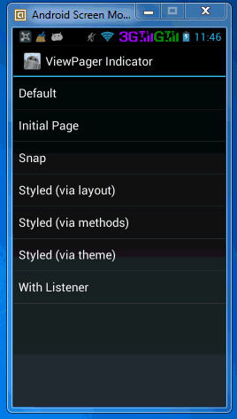

Android-ViewPagerIndicator 源码解析
----------------
> 本文为 [Android-ViewPagerIndicator](https://github.com/JakeWharton/Android-ViewPagerIndicator) 原理解析中 ViewPagerIndicator 部分  
> 项目地址：[ViewPagerIndicator](https://github.com/JakeWharton/Android-ViewPagerIndicator)，分析的版本：，Demo 地址：[ViewPagerIndicator Demo](https://github.com/android-cn/android-open-project-analysis/tree/master/view_pager_indicator_longtaoge/ListSamples)    
> 分析者：[longtaoge](https://github.com/longtaoge)，校对者：，完成状态：未完成   

## 1. 功能介绍    ##

功能介绍，包括功能或优点等  

### Android ViewPagerIndicator ###

这是一个[ViewPager][2]的自定义扩展控件，提供了圆形，图标、线形、页签、标题、下划线共六种Viewpager的自定义指示器，使用方便，功能齐全。 同时兼容 [ActionBarSherlock][3]!

![ViewPagerIndicator Sample Screenshots][9]

### 使用方法 ##

*请参阅代码示例文件夹中的例子*

   
1. 首先要把这个组件放到布局文件中，这个组件主要是配合Viewpager使用的，所以，一般是在Viewpager的上方或者下方，挨着放就行了

	        <com.viewpagerindicator.TitlePageIndicator
	            android:id="@+id/titles"
	            android:layout_height="wrap_content"
	            android:layout_width="fill_parent" />

1.   在Activity中的 `onCreate` 方法中 (或 Fragment的`onCreateView`方法中), 初始化这个控件(findviewbyID，你懂的)
    

         //设置适配器（Adapter）
         ViewPager pager = (ViewPager)findViewById(R.id.pager);
         pager.setAdapter(new TestAdapter(getSupportFragmentManager()));  

         //绑定 指示器（title indicator ）到 adapter
         TitlePageIndicator titleIndicator = (TitlePageIndicator)findViewById(R.id.titles);
         titleIndicator.setViewPager(pager);

1.  *(可选项)* 如果你想在你的Viewpager上使用Viewpager的页面切换状态监听 `OnPageChangeListener`  
     应该把监听设置到指示器个.

         //例如
         titleIndicator.setOnPageChangeListener(mPageChangeListener);

### 主题与样式 ###
有三种方式配置indicators指示器的样式 .

 1. **Theme XML**.主题文件 每个 indicator 都提供了配置属性，可能能过XML中的属性进行配置
    可以定制自己的样式.
 2. **Layout XML**. 也可以在布局文件中进行配置
 3. **Object methods**. 并且，指示器还提供了主题的set和get方法。
    三种方法都可以改变指示器的主题.

每种指示器 都有一个能过三种方法改变主题的示例

### 导入并应用到你的项目 ###

由于Android-ViewPagerIndicator是一个基于 [Android library project][7]. 的项目库
，里面包含了主题、样式等XML属性文件，所以是不可能打包成一个单独的JAR包的，你可以通过Eclipse或ant作为一个[library][8]引入到你的项目中。

如果你是 Maven 用户，那么你可以简单的通过下面的方法引入这个库
a dependency:

    <dependency>
      <groupId>com.viewpagerindicator</groupId>
      <artifactId>library</artifactId>
      <version>2.4.1</version>
      <type>apklib</type>
    </dependency>

这个项目是建立在 `ViewPager`类的基础之上的，具体的细节可以参见
[Android Support Library][2] 或 [ActionBarSherlock][3]的网站或文档

### 开发者 ###

 * Jake Wharton - <jakewharton@gmail.com>
### 参与人员 ###
 * [Patrik Åkerfeldt][1] - [ViewFlow][4]的作者, ViewFlow是一个支持标题和圆形指示器视图的Viewpager指示器开源项目
 
 * [Francisco Figueiredo Jr.][5] - Idea and [first implementation][6] 支持Fragment的Viewpager

 [1]: https://github.com/pakerfeldt
 [2]: http://developer.android.com/sdk/compatibility-library.html
 [3]: http://actionbarsherlock.com
 [4]: https://github.com/pakerfeldt/android-viewflow
 [5]: https://github.com/franciscojunior
 [6]: https://gist.github.com/1122947
 [7]: http://developer.android.com/guide/developing/projects/projects-eclipse.html
 [8]: http://developer.android.com/guide/developing/projects/projects-eclipse.html#ReferencingLibraryProject
 [9]: https://raw.github.com/JakeWharton/Android-ViewPagerIndicator/master/sample/screens.png
 [10]: https://play.google.com/store/apps/details?id=com.viewpagerindicator.sample  

**完成时间**  
11/22/2014 4:03:56 PM 完成  

##2. 详细设计
##2.1 核心类功能介绍
核心类、函数功能介绍及核心功能流程图，流程图可使用 StartUML、Visio 或 Google Drawing。  
##2.2 类关系图
类关系图，类的继承、组合关系图，可是用 StartUML 工具。  

**完成时间**  
- 根据项目大小而定，目前简单根据项目 Java 文件数判断，完成时间大致为：`文件数 * 7 / 10`天，特殊项目具体对待  

##3. 流程图
主要功能流程图  
- 如 Retrofit、Volley 的请求处理流程，Android-Universal-Image-Loader 的图片处理流程图  
- 可使用 StartUML、Visio 或 Google Drawing 等工具完成，其他工具推荐？？  
- 非所有项目必须，不需要的请先在群里反馈  

**完成时间**  
- `两天内`完成  

##4. 总体设计
整个库分为哪些模块及模块之间的调用关系。  
- 如大多数图片缓存会分为 Loader 和 Processer 等模块。  
- 可使用 StartUML、Visio 或 Google Drawing 等工具完成，其他工具推荐？？  
- 非所有项目必须，不需要的请先在群里反馈。  

**完成时间**  
- `两天内`完成  

##5. 杂谈
该项目存在的问题、可优化点及类似功能项目对比等，非所有项目必须。  

**完成时间**  
- `两天内`完成  

##6. 修改完善  
在完成了上面 5 个部分后，移动模块顺序，将  
`2. 详细设计` -> `2.1 核心类功能介绍` -> `2.2 类关系图` -> `3. 流程图` -> `4. 总体设计`  
顺序变为  
`2. 总体设计` -> `3. 流程图` -> `4. 详细设计` -> `4.1 类关系图` -> `4.2 核心类功能介绍`  
并自行校验优化一遍，确认无误后，让`校对 Buddy`进行校对，`校对 Buddy`校队完成后将  
`校对状态：未完成`  
变为：  
`校对状态：已完成`  

**完成时间**  
- `两天内`完成  

**到此便大功告成，恭喜大家^_^**  
