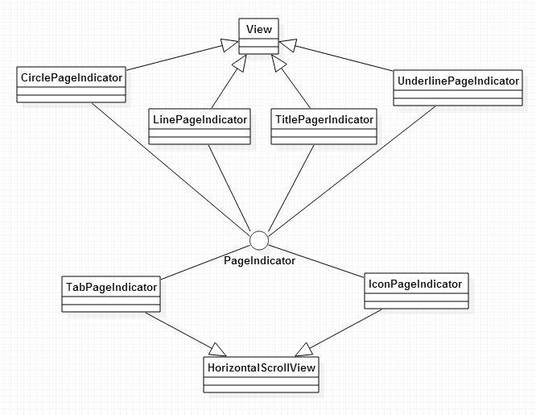
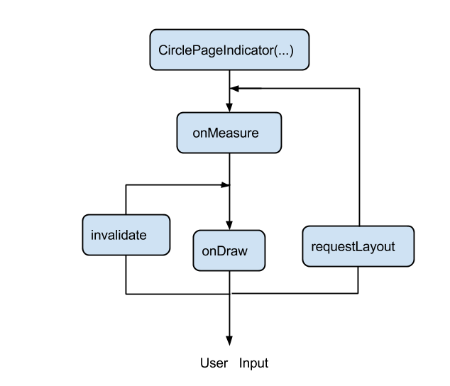
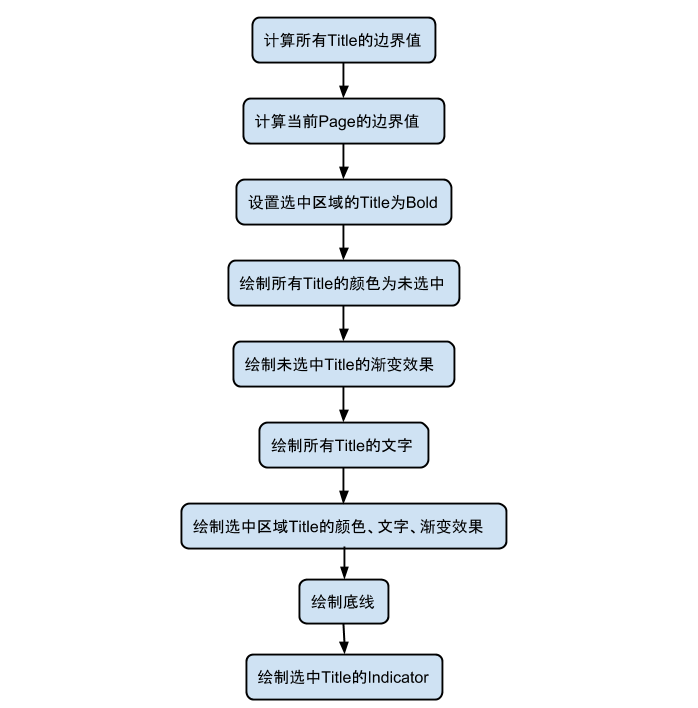

ViewPagerindicator 源码解析
----------------
> 本文为 [Android 开源项目源码解析](https://github.com/android-cn/android-open-project-analysis) 中 ViewPagerindicator 部分  
> 项目地址：[ViewPagerIndicator](https://github.com/JakeWharton/Android-ViewPagerIndicator/)，分析的版本：[8cd549f](https://github.com/JakeWharton/Android-ViewPagerIndicator/commit/8cd549f23f3d20ff920e19a2345c54983f65e26b "Commit id is 8cd549f23f3d20ff920e19a2345c54983f65e26b")，Demo 地址：[ViewPagerIndicator Demo](https://github.com/android-cn/android-open-project-demo/tree/master/viewpager-indicator-demo)  
> 分析者：[lightSky](https://github.com/lightSky)，校对者：[aaronplay](https://github.com/AaronPlay)，校对状态：完成   


### 1. 功能介绍

### 1.1 ViewPagerIndicator  
ViewPagerIndicator用于各种基于AndroidSupportLibrary中ViewPager的界面导航。主要特点：使用简单、样式全、易扩展。

### 2. 总体设计
该项目总体设计非常简单，一个pageIndicator接口类，具体样式的导航类实现该接口，然后根据具体样式去实现相应的逻辑。
IcsLinearLayout：LinearLayout的扩展，支持了4.0以上的divider特性。
CirclePageIndicator、LinePageIndicator、UnderlinePageIndicator、TitlePagerIndicator继承自View。TabPageIndicator、IconPageIndicator 继承自HorizontalScrollView。

CirclePageIndicator、LinePageIndicator、UnderlinePageIndicator继承自View的原因是它们样式相对简单，继承View，自己去定制一套测量和绘制逻辑更简单，而且免去了Measure部分繁琐的步骤，效率更高。  
TitlePagerIndicator相对复杂，Android系统提供的控件中没有类似的，而且实现底部线条的精准控制也复杂，所以只能继承自View，实现绘制逻辑，达到理想的UI效果。      

TabPageIndicator、IconPageIndicator继承自HorizontalScrollView是由于它们各自的ChildView较多，而且具有相似性些，继承自LinearLayout，通过for循环一个个add上去更简单，而且HorizontalScrollView具有水平滑动的功能，当tab比较多的时候，可以左右滑动。  
### 3. 详细设计    
####3.1类关系图
  
####3.2 自定义控件相关知识  
由于ViewPagerIndicator项目全部都是自定义View，因此对于其原理的分析，就是对自定义View的分析，自定义View涉及到的核心部分有：View的绘制机制和Touch事件传递机制。对于View的绘制机制，这里做了详细的阐述，这一部分在Android中为公共知识点，已经将这一部分的内容单独去了，在[tech](https://github.com/android-cn/android-open-project-analysis/tree/master/tech)目录下，而对于Touch事件，由于该项目只是Indicator，因此没有涉及到复杂的Touch传递机制，该项目中与Touch机制相关只有onTouch(Event)方法，因此只对该方法涉及到的相关知识进行介绍。
####3.2.1 自定义控件步骤  

1. 创建自定义的View  
	* 继承View或View的子类，添加必要的构造函数
	* 定义自定义属性（外观与行为）
	* 应用自定义属性：在布局中指定属性值，在初始化时获取并应用到View上
	* 添加控制属性的方法

2. 自定义View的绘制  
重写onDraw()方法,按需求绘制自定义的view。每次屏幕发生绘制以及动画执行过程中，onDraw方法都会被调用到，避免在onDraw方法里面执行复杂的操作，避免创建对象，比如绘制过程中使用的Paint，应该在初始化的时候就创建，而不是在onDraw方法中。

3. 使View具有交互性  
一个好的自定义View还应该具有交互性，使用户可以感受到UI上的微小变化，并且这些变化应该尽可能的和现实世界的物理规律保持一致，更自然。Android提供一个输入事件模型，帮助你处理用户的输入事件,你可以借助GestureDetector、Scroller、属性动画等使得过渡更加自然和流畅。 

####3.2.2 Android的拖拽事件  	
该项目使用的是ViewPager，本来不用处理拖拽事件的，但项目中的CirclePageIndicator、LinePageIndicator、UnderlinePageIndicator、TitlePageIndicator都对onTouchEvent进行了处理，开始不明白，后来看到该项目的Issue，有问到该问题的:[CirclePageIndicator consuming TouchEvents](https://github.com/JakeWharton/Android-ViewPagerIndicator/issues/213) 原来是模仿了IOS中springboard的Indicator，使得点击Indicator的左1/3和右边1/3都可以切换Page，如果你使用该项目同时又处理了Touch事件，有可能它们会出现冲突问题，下面是涉及到的拖拽事件相关的知识点：
	
##### 3.2.2.1 区分原始点及之后的任意触摸点   
ACTION_POINTER_DOWN、ACTION_POINTER_UP:多触摸手势事件中的按下和抬起事件。每当第二个触控点按下或拿起时，会触发该事件。在onTouchEvent()中可以捕捉并处理。
	
##### 3.2.2.2 确保操作中点的ID(the active pointer ID)有效  
当ACTION_POINTER_UP事件发生时，示例程序会移除对该点的索引值的引用，确保操作中的点的ID(the active pointer ID)不会引用已经不在触摸屏上的触摸点。这种情况下，app会选择另一个触摸点来作为操作中(active)的点，并保存它当前的x、y。可以在触控点MOVE时，始终能拿到有效的Pointer正确的计算移动的距离。

##### 3.2.2.3 mTouchSlop  
指在用户触摸事件可被识别为移动手势前,移动过的那一段像素距离。Touchslop通常用来预防用户在做一些其他操作时意外地滑动，例如触摸屏幕上的元素时。

在本项目中，对于onTouche的处理是模板方法，因为没有复杂的交互，仅仅是追踪有效的手势以及确定Page的切换时机。官方文档中在拖拽与缩放中有详细的讲解[Dragging and Scaling](http://developer.android.com/training/gestures/scale.html) 本项目中的onTouchEvent中的代码就是官方文档的模板代码，就是为了确保获取到可用、可信的点，然后对ViewPager相应处理。
    
#### 3.2.3 View绘制机制  
请直接参考[公共技术点viewdrawflow](https://github.com/android-cn/android-open-project-analysis/blob/master/tech/viewdrawflow.md)部分  
  
### 3.3 核心类及功能介绍
#####3.3.1 CirclePageIndicator  
继承自 View 实现了 PageIndicator,整个绘制过程中用到的方法调用规则为：  
  
**(1) 主要成员变量含义**  
1.`mCurrentPage` 当前界面的索引  
2.`mSnapPage` Sanp模式下，当前界面的索引  
3.`mPageOffset` ViewPager的水平偏移量  
4.`mScrollState` ViewPager的滑动状态  
5.`mOrientation` Indicator的模式：水平、竖直  
6.`mLastMotionX` 每一次onTouch事件产生时水平位置的最后偏移量  
7.`mActivePointerId` 当前处于活动中pointer的ID默认值为 -1  
8.`mIsDragging` 用户是否主观的滑动屏幕的标识  
9.`mSnap`   
circle有2种绘制模式:  
     mSnap = true：ViewPager滑动过程中，circle之间不绘制，只绘制最终的实心点  
     mSnap = false：ViewPager滑动过程中，相邻circle之间根据mPageOffset实时绘制circle    
10.`mTouchSlop`   
指在用户触摸事件可被识别为移动手势前,移动过的那一段像素距离。    
Touchslop通常用来预防用户在做一些其他操作时意外地滑动，例如触摸屏幕上的元素时产生的滑动。

**(2) 核心方法**    
1.**onDraw(Canvas canvas)**   
`threeRadius`两相邻circle的间距  
`shortOffset`当前方向的垂直方向的圆心坐标位置  
`longOffset` 当前方向的圆心位置
```java
	//循环的 draw circle
        for (int iLoop = 0; iLoop < count; iLoop++) {
            float drawLong = longOffset + (iLoop * threeRadius);//计算当前方向的每个circle偏移量
            canvas.drawCircle(dX, dY, pageFillRadius, mPaintPageFill);//绘制空心的circle
            canvas.drawCircle(dX, dY, mRadius, mPaintStroke);//绘制stroke
            ...
            计算实心的circle的坐标
            ...
            canvas.drawCircle(dX, dY, mRadius, mPaintFill);//绘制当前page的circle
        }
```
2.**onTouchEvent(MotionEvent ev)**  
核心思想：获取拖拽过程中有效的触摸点，正确计算移动距离。这一部分为模板代码，在其它几种Indicator的实现中，对于Touch的事件的处理是相同的，  
`MotionEvent.ACTION_DOWN`:记录第一触摸点的ID,获取当前水平移动距离  
`MotionEvent.ACTION_MOVE`: 获取第一点的索引并计算其偏移，处理用户是否是主观的滑动屏幕  
`MotionEvent.ACTION_CANCEL`:如果用户不是主动滑动，则以Indicator的1/3和2/3为临界点进行previous和next  
page的处理，处理完成，还原mIsDragging，mActivePointerId、viewpager的fakeDragging状态  
`MotionEvent.ACTION_UP`:同上    
`MotionEventCompat.ACTION_POINTER_DOWN`:当除最初点外的第一个外出现在屏幕上时，触发该事件，这时记录新的mLastMotionX，mActivePointerId  
`MotionEventCompat.ACTION_POINTER_UP`:当非第一点离开屏幕时，获取抬起手指的ID，如果之前跟踪的mActivePointerId是当前抬起的手指ID，那么就重新为mActivePointerId 赋值另一个活动中的pointerId，最后再次获取仍活动在屏幕上pointer的X坐标值  

3.**onMeasure(int widthMeasureSpec, int heightMeasureSpec)**  
View在测量阶段的最终大小的设定是由setMeasuredDimension()方法决定的,也是必须要调用的方法，否则会报异常，这里就直接调用了setMeasuredDimension()方法设置值了。根据CircleIndicator的方向，计算相应的width、height  
```java
        if (mOrientation == HORIZONTAL) {
            setMeasuredDimension(measureLong(widthMeasureSpec), measureShort(heightMeasureSpec));
        } else {
            setMeasuredDimension(measureShort(widthMeasureSpec), measureLong(heightMeasureSpec));
        }
    }
```    
4.**measureLong**    
与之对应的有measureShort，只是处理的方向不同  
如果该View的测量要求为EXACTLY，则能直接确定子View的大小,该大小就是MeasureSpec.getSize(measureSpec)的值  
如果该View的测量要求为UNSPECIFIED或AT_MOST模式，则根据实际需求计算宽度  
```java
        if ((specMode == MeasureSpec.EXACTLY) || (mViewPager == null)){
            //We were told how big to be
            result = specSize;
        } else {
            final int count = mViewPager.getAdapter().getCount();
            result = (int)(getPaddingLeft() + getPaddingRight()
                    + (count * 2 * mRadius) + (count - 1) * mRadius + 1);
            //如果父视图的测量要求为AT_MOST，即限定了一个最大值，则再从系统建议值和自己计算值中取一个较小值
            if (specMode == MeasureSpec.AT_MOST) {
                result = Math.min(result, specSize);
            }
        }
        return result;
```
#####3.3.2 IconPageIndicator、TabPageIndicator
都是继承自HorizontalScrollView，而且实现逻辑很相似，所以这里只对IconPageIndicator分析  

**(1) 主要成员变量含义**  
1.`mIconsLayout`  管理Icon的父视图。在初始化的时候，直接通过addView()加入到根节点。  
2.`mIconSelector`  IconPageIndicator  Post的Runnable对象，该对象会执行滑动到指定的Icon位置的逻辑。

**(2) 核心方法**    
1.`notifyDataSetChanged` 在setViewPager中调用，用于创建IconPageIndicator，内部通过一个for循环不断new ImageView，然后add到mIconsLayout上去，紧接着请求布局。  
2.`animateToIcon`滑动到指定的Icon，及时回收上一次的mIconSelector，同时post一个新的mIconSelector。  
3.`onAttachedToWindow` 该方法在View attach 到Window的时候被调用，此时View拥有了一片可绘制区域，此时可以做一些初始化的操作，这里初始化了之前选定的Icon。  
4.`onDetachedFromWindow`该方法调用后，View不再拥有可绘制的区域。此时可以对View进行一些清理操作。这里将mIconSelector从消息队列中移除。

#####3.3.3 TitlePageIndicator  
由于效果的实时性和复杂性，整个Indicator全部都是绘制出来的，主要逻辑都在onDraw中。    
**(1) 主要成员变量含义**    
1.`mPaintText`绘制Text的Paint  
2.`mPaintFooterLine`绘制底线的Paint  
3.`mPaintFooterIndicator` 当前title底部指示器的Paint

**(2) 核心方法**   
1.`calculateAllBounds` 根据当前选中的Title计算所有Title的边界值  
2.`clipViewOnTheLeft`为左边的TextView设置边界，当TextView向左移至Indicator的边界时，则设置该TextViwe的left坐标值始终为Indicator的left坐标值，从而呈现停留的效果。  
3.`clipViewOnTheRight`同上，反向相反  

整个绘制流程：  



#####3.3.4  LinePageIndicator、UnderLineIndicator
类似CirclePageIndicator，可以参考CirclePageIndicator的分析。  

####3.4 创建自定义View的步骤分析
这里以CirclePageIndicator为例

#####3.4.1 继承自View，实现构造函数  
```java
CirclePageIndicator extends View implements PageIndicator {
    
    public CirclePageIndicator(Context context) {
        this(context, null);
    }

    public CirclePageIndicator(Context context, AttributeSet attrs) {
        this(context, attrs, R.attr.vpiCirclePageIndicatorStyle);
    }

    public CirclePageIndicator(Context context, AttributeSet attrs, int defStyle) {
        super(context, attrs, defStyle);
        ...
    }
}
```

#####3.4.2 定义属性
vpi_attrs.xml  
```xml
 <declare-styleable name="CirclePageIndicator">
        <!-- Color of the filled circle that represents the current page. -->
        <attr name="fillColor" format="color" />
        <!-- Color of the filled circles that represents pages. -->
        <attr name="pageColor" format="color" />
        ...
 </declare-styleable>
```  
#####3.4.3 应用属性  
在布局中应用
```xml
<!--首先指定命名空间，属性才可以使用-->
<LinearLayout
    xmlns:app="http://schemas.android.com/apk/res-auto">
    
<!--应用属性值-->
    <com.viewpagerindicator.CirclePageIndicator
        ...
        app:fillColor="#FF888888"
        app:pageColor="#88FF0000"
        />
</LinearLayout>        
```
在代码中加载布局中的属性值并应用：
```java
 public CirclePageIndicator(Context context, AttributeSet attrs, int defStyle) {
        super(context, attrs, defStyle);

        //加载默认值
        final Resources res = getResources();
        final int defaultPageColor = res.getColor(R.color.default_circle_indicator_page_color);
        //获取并应用属性值
        TypedArray a = context.obtainStyledAttributes(attrs, R.styleable.CirclePageIndicator, defStyle, 0);
        //应用属性值
        mPaintPageFill.setColor(a.getColor(R.styleable.CirclePageIndicator_pageColor, defaultPageColor));
        ...
        a.recycle();//记得及时释放资源
    }
```
#####3.4.4 自定义View的绘制
请参考上面的CirclePageIndicator的onDraw，也可以参考tech下的[View的绘制流程](https://github.com/android-cn/android-open-project-analysis/blob/master/tech/viewdrawflow.md)的Draw部分。
#####3.4.5 使View可交互
请参考上面的CirclePageIndicator的onTouch ，这里只是简单的处理了onTouch事件，交互更好的自定义控件往往会加一些自然的动画等。
##4. 杂谈
大多数的App中的导航都类似，ViewPagerIndicator能够满足你开发的基本需求，如果不能满足，你可以在源码的基础上进行一些简单的改造。其中有一点是很多朋友提出的就是LineIndicator没有实现TextView颜色状态的联动。这个有已经实现的开源库:[PagerSlidingTabStrip](https://github.com/jpardogo/PagerSlidingTabStrip)，你可以作为参考。  
对于什么时候需要自定义控件以及如何更好的进行自定义控件的定制，你可以参考这篇文章[深入解析Android的自定义布局](http://greenrobot.me/devpost/android-custom-layout) 相信会有一些启发。  
整片文章看下来，确实比较多，也是花了一部分时间写的，其实之前是自己整理了一些相关知识，这次一下全部跟大家分享了。整篇文章都在讲View的绘制机制，三个过程也都很详细的通过源码分析介绍了。如果你对View的绘制机制还不清楚，而且希望将来往更高级的方向发展，这一步一定会经历的，那么请你耐心看完，你可以分多次研读，过程中出现问题或者原文分析不到位的地方，欢迎PR。  
当你掌握了这些基本的知识，你可以去研究GitHub上的一部分开源项目了（因为Touch事件这里介绍的不多，而很多项目和Touch事件相关）。

**参考文献**  
http://developer.android.com/training/gestures/index.html  
http://developer.android.com/training/custom-views/create-view.html  
[Google Android官方培训课程中文版](https://github.com/kesenhoo/android-training-course-in-chinese)  

View的绘制：  
http://blog.csdn.net/wangjinyu501/article/details/9008271  
http://blog.csdn.net/qinjuning/article/details/7110211  
http://blog.csdn.net/qinjuning/article/details/8074262
  	
**相关资源**  
[Google I/O 2013 - Writing Custom Views for Android](https://www.youtube.com/watch?v=NYtB6mlu7vA#t=228)  

[best-practices-for-android-user-interface](http://www.rapidvaluesolutions.com/tech_blog/best-practices-for-android-user-interface/)    
[深入解析Android的自定义布局](http://greenrobot.me/devpost/android-custom-layout/)  
[慕课网自定义FlowLayout课程](http://www.imooc.com/learn/237)  

Touch事件传递  
http://blog.csdn.net/xiaanming/article/details/21696315  
http://blog.csdn.net/wangjinyu501/article/details/22584465    


