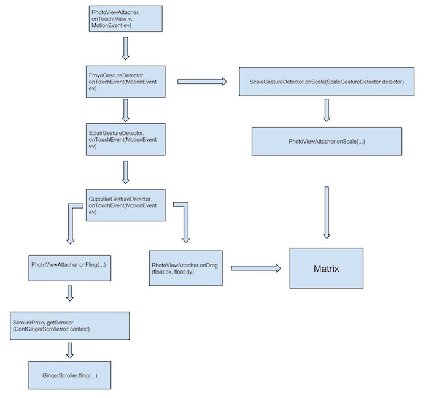
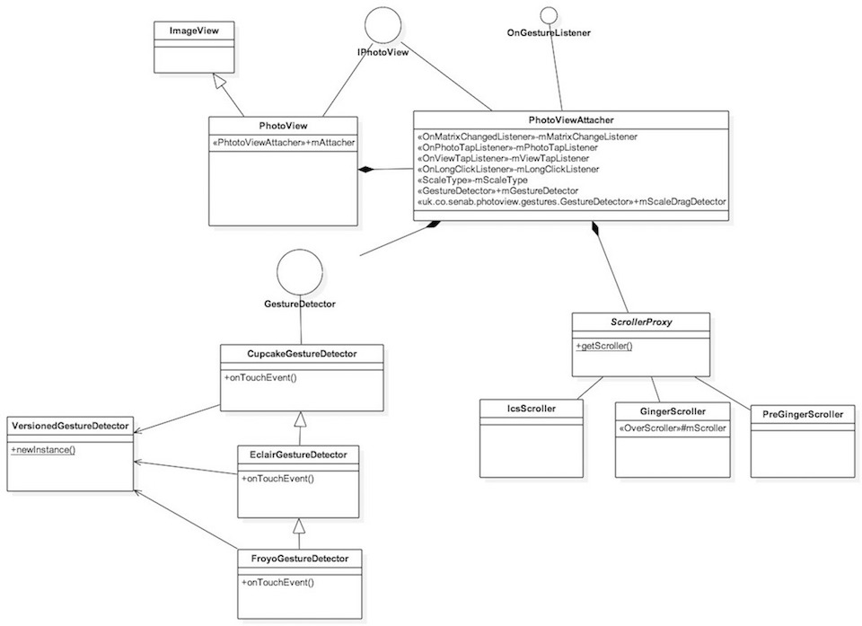
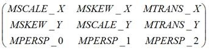
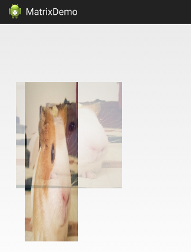
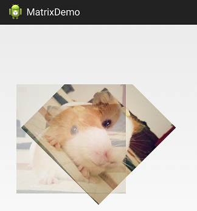

PhotoView 源码解析
====================================
> 本文为 [Android 开源项目源码解析](http://a.codekk.com) 中 PhotoView 部分  
> 项目地址：[PhotoView](https://github.com/chrisbanes/PhotoView)，分析的版本：[48427bf](https://github.com/chrisbanes/PhotoView/commit/48427bff9bb1a408cfebf6697aa019c0788ded76)，Demo 地址：[PhotoView-demo](https://github.com/android-cn/android-open-project-demo/tree/master/photoview-demo)    
> 分析者：[dkmeteor](https://github.com/dkmeteor)，校对者：[cpacm](https://github.com/cpacm)，校对状态：完成   

### 1. 功能介绍

##### 特性(Features)：
- 支持 Pinch 手势自由缩放。
- 支持双击放大/还原。
- 支持平滑滚动。
- 在滑动父控件下能够运行良好。（例如：ViewPager）
- 支持基于 Matrix 变化（放大/缩小/移动）的事件监听。

##### 优势：
- PhotoView 是 ImageView 的子类，自然的支持所有 ImageView 的源生行为。
- 任意项目可以非常方便的从 ImageView 升级到 PhotoView，不用做任何额外的修改。
- 可以非常方便的与 ImageLoader/Picasso 之类的异步网络图片读取库集成使用。
- 事件分发做了很好的处理，可以方便的与 ViewPager 等同样支持滑动手势的控件集成。

### 2. 总体设计

PhotoView 这个库实际上比较简单,关键点其实就是 Touch 事件处理和 Matrix 图形变换的应用.

##### 2.1 TouchEvent 及手势事件处理
对 TouchEvent 分发流程不了解的建议先阅读 [Android Touch 事件传递机制](http://www.trinea.cn/android/touch-event-delivery-mechanism/)

本库中对 Touch 事件的处理流程请参考第三部分的流程图，会有一个比较直观的认识。

##### 2.2 Matrix
由于 Matrix 是 Android 系统源生 API,很多开发者对此都比较熟悉,为了不影响阅读效果，故不在此详细叙述,如果对其不是很了解,可以查看本文档末尾的 Matrix 补充说明

    
### 3. 流程图
Touch 及手势事件判定及传递流程：

如图，从架构上看，干净利落的将事件层层分离，交由不同的 Detector 处理，最后再将处理结果回调给 PhtotViewAttacher 中的 Matrix 去实现图形变换效果。

### 4. 详细设计
### 4.1 核心类功能介绍

### Core 核心类
---
##### 4.1.1 PhotoView
PhotoView 类负责暴露所有供外部调用的 API,其本身直接继承自 ImageView,同时实现了 IPhotoView 接口.
IPhotoView 接口提供了缩放相关的设置属性 和操控 matrix 变化的回调接口.

主要方法说明:

- public PhotoView(Context context)
- public PhotoView(Context context, AttributeSet attr)
- public PhotoView(Context context, AttributeSet attr, int defStyle)

构造函数,完全与 ImageView 相同,你可以将 PhotoView 直接当做 ImageView 使用,完全兼容.

- public void setPhotoViewRotation(float rotationDegree)

用于设置图片旋转角度.

注意：
例如使用 Android 相机拍摄的相片,会根据拍摄时手机方向的不同,在 EXIF 中存储不同的旋转角度信息,显示时往往需要查询 EXIF 信息并将照片旋转至正确的方向.
通常我们处理这种问题有两种方案：

- 通过 Bitmap.createBitmap 方式重建出正确方向的图片，再加载到 ImageView 中显示。(不建议使用，因为会占用双倍的内存，Bitmap 的回收不是立即生效的。)
- 在 ImageView 中使用自定义 Matrix 将图片旋转到正确的方向。

由于 PhotoView 中对图片的 缩放 操作依赖对 Matrix 的操作，自定义 Matrix 会干扰 PhotoView 的缩放行为，所以 PhotoView 并不支持 ScaleType.Matrix.
可参见 PhotoViewAttacher 源码：

     /**
     * @return true if the ScaleType is supported.
     */
    private static boolean isSupportedScaleType(final ScaleType scaleType) {
        if (null == scaleType) {
            return false;
        }

        switch (scaleType) {
            case MATRIX:
                throw new IllegalArgumentException(scaleType.name()
                        + " is not supported in PhotoView");

            default:
                return true;
        }
    }

这里特意提供了一个额外的 setPhotoViewRotation 方法即是为了解决这个问题。

- public boolean canZoom()
- public void setZoomable(boolean zoomable) 

缩放功能开关及状态获取.
关闭后 PhotoView 将不再响应 `缩放` 动作.

- public RectF getDisplayRect()
- public Matrix getDisplayMatrix()
- public boolean setDisplayMatrix(Matrix finalRectangle)

获取及设置当前 `matrix` 状态.

- public ScaleType getScaleType()

获取缩放模式。使用的源生的 ImageView.ScaleType.
在 PhotoView 中默认值为 FIT_CENTER.

- public void setAllowParentInterceptOnEdge(boolean allow)

设置标志位 是否允许父控件捕获发生在边缘的 TouchEvent

这个标志位实际上对应的是
ViewParent.requestDisallowInterceptTouchEvent(boolean flag)

经常做自定义 View 处理 TouchEvent 的对这个方法应当都不陌生。

PhotoView 中英文注释：

         * Here we decide whether to let the ImageView's parent to start taking
         * over the touch event.
         *
         * First we check whether this function is enabled. We never want the
         * parent to take over if we're scaling. We then check the edge we're
         * on, and the direction of the scroll (i.e. if we're pulling against
         * the edge, aka 'overscrolling', let the parent take over).

对应的代码：

        ViewParent parent = imageView.getParent();
        if (mAllowParentInterceptOnEdge && !mScaleDragDetector.isScaling()) {
            if (mScrollEdge == EDGE_BOTH
                    || (mScrollEdge == EDGE_LEFT && dx >= 1f)
                    || (mScrollEdge == EDGE_RIGHT && dx <= -1f)) {
                if (null != parent)
                    parent.requestDisallowInterceptTouchEvent(false);
            }
        } else {
            if (null != parent) {
                parent.requestDisallowInterceptTouchEvent(true);
            }
        }

通过调用 setAllowParentInterceptOnEdge(false),可以完全屏蔽父控件的 TouchEvent.
这个设置是为了防止父控件响应 InterceptTouchEvent.

例如

PhotoView 外层是 ScrollView,通过 requestDisallowInterceptTouchEvent 方法可以阻止 ScrollView 响应滑动手势.

PhotoView 本身已做好了相关处理,在 PhotoView 滚到图片边缘时,Scroll 事件由父控件处理,在 PhotoView 未滚动到边缘时,Scroll 事件由 PhotoView 处理.

除非开发者有特殊的需求,否则不需要自己去调用该方法改变 TouchEvent 事件的阻断逻辑.

- public void setImageDrawable(Drawable drawable)
- public void setImageResource(int resId) 
- public void setImageURI(Uri uri)

重载了 ImageView 的 3 个设置图片的方法,以确保图片改变时 PhotoViewAttacher 及时更新视图和重置 matrix 状态

- protected void onDetachedFromWindow()

重载了 ImageView 的方法,用于在视图被从 Window 中移除时,通知 PhotoViewAttacher 清空数据.

##### 4.1.2 IPhotoView 
IPhotoView 接口定义了缩放相关的一组 set/get 方法.PhotoView 是其实现类.
相关方法已在 PhotoView 中介绍,这里略过.

##### 4.1.3 PhotoViewAttacher
核心类

- private static boolean isSupportedScaleType(final ScaleType scaleType) 
 
判断 ScaleType 是否支持。
这个判断中实际只有 ScaleType.Matrix 会返回 false.

由于 PhotoView 中 缩放 滑动操作都依赖`Matrix`,所以并不支持用户再传入自定义 Matrix.

- public void cleanup()

PhotoView 不再使用时,可用于释放相关资源。移除 Observer, Listener.

- public boolean setDisplayMatrix(Matrix finalMatrix)

通过 Matrix 来直接修改 ImageView 的显示状态。

- private void cancelFling()

取消惯性滑动。

- private boolean checkMatrixBounds() 

检查当前显示范围是否处于边界上，并更新 mScrollEdge 标志位。

处理 TouchEvent 时需要根据 mScrollEdge 标志位的状态来判断是否允许 ViewParent 的 InterceptTouchEvent 接收 TouchEvent.

- private void resetMatrix()

重置 Matrix 状态，并恢复至 FIT_CENTER 状态

- private void updateBaseMatrix(Drawable d)

根据 PhotoView 的宽高和 Drawable 的宽高计算 FIT_CENTER 状态的 Matrix.

- public void onDrag(float dx, float dy)

OnGestureListener 接口回调的实现方法.

实际完成拖拽/移动效果.
核心代码:

    mSuppMatrix.postTranslate(dx, dy);

通过改代码修改 Matrix 中 View 的起始位置,制造出图片被拖拽移动的效果.

- public void onFling(float startX, float startY, float velocityX, float velocityY)

OnGestureListener 接口回调的实现方法.
实际完成惯性滑动效果.

惯性滑动效果分两部分完成.

1) 调用 

    mScroller.fling(startX, startY, velocityX, velocityY, minX,
                        maxX, minY, maxY, 0, 0);

进行惯性滑动辅助计算.

对 Scroller 不了解的可以参考官方说明 [Scroller](http://developer.android.com/reference/android/widget/Scroller.html)

简单来讲,Scroller 是一个辅助计算器,它可以帮你计算出某一时刻 View 的滚动状态及位置,但是它本身不会对 View 进行任何更改

2) 使用了 FlingRunnable 和 Compat.postOnAnimation(imageView,mFlingRunnable)在每一帧绘制前更新 Matrix 状态
关于 FlingRunnable 和 Compat.postOnAnimation 类的作用机制可以参考下面 4.1.4 的说明.

- public void onScale(float scaleFactor, float focusX, float focusY)

OnGestureListener 接口回调的实现方法.

实际完成缩放效果.

核心代码:

    mSuppMatrix.postScale(scaleFactor, scaleFactor, focusX, focusY);

对 Matrix 作用机制不了解的话,可以拉到文档最后,有一个针对 Matrix 的简略介绍.

###### 内部类 FlingRunnable

实现惯性滑动的动画效果.

这个 Runnable 必须配合 View.postOnAnimation(view,runnable) 使用.

在下一帧绘制前,系统会执行该 Runnable,这样我们就可以在 runnable 中更新 UI 状态.

原理上类似一个递归调用,每次 UI 绘制前更新 UI 状态,并指定下次 UI 更新前再执行自己.

这种写法 与 使用循环或 Handler 每隔 16ms 刷新一次 UI 基本等价,但是更为方便快捷.

更新 UI 的核心逻辑非常简单,根据 mScroller 计算出的偏移量更新 Matrix 状态:
    
        mSuppMatrix.postTranslate(dx, dy);

###### 内部类 AnimatedZoomRunnable
实现双击时的 缩放动画.

作用机制基本同上.

区别是 AnimatedZoomRunnable 的执行进度由 AccelerateDecelerateInterpolator 控制.

对 Interpolator 没有概念的可以参阅官方 Demo
[Interpolator](http://developer.android.com/samples/Interpolator/src/com.example.android.interpolator/InterpolatorFragment.html)

你也可以简单认为这就是一个动画进度控制器.

核心逻辑依然很简单,根据动画进度缩小/放大图片

    mSuppMatrix.postScale(deltaScale, deltaScale, mFocalX, mFocalY);

### 接口及工具类
---
##### 4.1.4 Compat
用于做 View.postOnAnimation 方法在低版本上的兼容.

注：View.postOnAnimation (Runnable action) 在 PhotoView 中用于处理  双击 放大/缩小 惯性滑动时的动画效果.

每次系统绘图前都会先执行这个 Runnable 回调，通过在此时改变视图状态以实现动画效果。该方法仅支持 api >= 16
所以 PhotoView 中使用了 Compat 类来做低版本兼容。

实际上也可以使用 android.support.v4.view.ViewCompat 替代。
对比 android.support.v4.view.ViewCompat 和 uk.co.senab.photoview.Compat
其实现原理完全一致，都是通过 view.postDelayed(runnable, frameTime)来实现.

##### 4.1.5 ScrollerProxy
抽象类,主要是为了做不用版本之间的兼容,具体说明见`GingerScroller` `IcsScroller` `PreGingerScroller` 这三个接口实现类的说明.

##### 4.1.6 GingerScroller
`ScrollerProxy` 接口实现类
适用于 API 9 ~ 14 即 2.3 ~ 4.0 之间的所有 Android 版本.
其实现主要基于 android.widget.OverScroller

##### 4.1.7 IcsScroller
适用于 API 14 以上 即 4.0 以上的所有 Android 版本
其实现基于源生 android.widget.OverScroller , 没有任何修改.

##### 4.1.8 PreGingerScroller
适用于 API 9 以下 即 2.3 以下的所有 Android 版本
其实现主要基于 android.widget.Scroller

##### 4.1.9 GestureDetector
接口,主要是为了做不同版本之间的兼容,具体说明见 `CupcakeGestureDetector`,`EclairGestureDetector`,`FroyoGestureDetector` 三个接口的实现类.
##### 4.1.10 OnGestureListener
手势回调接口

##### 4.1.11 CupcakeGestureDetector
适用于 api < 7 的设备,此时 PhotoView 不支持双指 pinch 放大/缩小操作
##### 4.1.12 EclairGestureDetector
适用于 api >= 8 , 用于修正多指操控的问题,使 TouchEvent 的 getActiveX getActiveY 指向正确的 Pointer,并将事件传递给 `CupcakeGestureDetector` 处理,此时 PhotoView 不支持双指 pinch 放大/缩小操作
##### 4.1.13 FroyoGestureDetector
适用于 api > 9 , 通过 android.view.ScaleGestureDetector 实现对 Pinch 手势的支持,并将事件传递给 `EclairGestureDetector` 处理

注意:
以上 3 个类并不实际执行 放大/缩小 行为, 判断行为之后会回调给 PhtotViewAttacher 执行缩放/移动操作

##### 4.1.14 VersionedGestureDetector
提供 GestureDetector 的实例，由它根据系统版本决定实例化哪一个 GestureDetector，主要是为了兼容 Android 的不同版本。
具体调用栈请参考总体设计中调用流程图,注意一点,PhotoViewAttacher 本身就实现了 OnGestureListener 接口,实际的缩放操作是由 PhotoViewAttacher 完成的,而不是这里声明的各个 GestureDetector.

 
### 4.2 类关系图

### 5. 杂谈
该库唯一缺少的可能是 手势旋转 功能(可以参考 QQ). 不过由于 PhotoView 中已将各级事件分开处理,从架构上来看可扩展性良好,自定义一个 RotateGestureDetector 来捕获旋转手势也可行.
但如何在不与 ScaleGestureDetector 冲突的情况下完成该功能会稍微有些麻烦.
如果不需要手势旋转的话，该库提供了单独的接口可以用代码设置旋转角度。

### 6. Matrix 补充说明
Matrix 是一个 3x3 矩阵,使用 Matrix 可以对 Bitmap/Canvas 进行 4 类基本图形变换,使用起来非常简便，如果你对 Matrix 的抽象变换不熟悉，还可以使用 android.graphics.Camera 类进行辅助计算。
Camera 类可以将矩阵变换抽象成 视点（摄像机） 在三维空间内的移动，更易于直观的理解其效果。

矩阵如下：

相关 API 使用起来非常简单。
效果用文字比较难表述，直接看图好了.
你也可以自己运行[Demo Project](https://github.com/android-cn/android-open-project-demo/tree/master/photoview-demo/MatrixDemo)

虚影为原始位置，实图为变换后位置.

#### API 

- public void setTranslate(float dx, float dy)

    对目标进行平移 dx,dy

    

- public void setScale(float sx, float sy, float px, float py)

    以(px,py)为中心,横向上缩放比例 sx,纵向缩放比例 sy
    
    

- public void setRotate(float degrees, float px, float py)

    以(px,py)为中心,旋转 degrees 度
    
    

- public void setSkew(float kx, float ky, float px, float py)

	图像的错切实际上是平面景物在投影平面上的非垂直投影。错切使图像中的图形产生扭变。
    这里是以(px,py)为中心,扭曲图片的 x 轴和 y 轴.
	
	这个用文字难以解释,请参考下面的实际效果图片.
    
	

#### 原理

如果你对矩阵变换背后的数学原理感兴趣且`线性代数`的内容没忘光的话，推荐这篇 [文章](http://www.cnblogs.com/qiengo/archive/2012/06/30/2570874.html).
