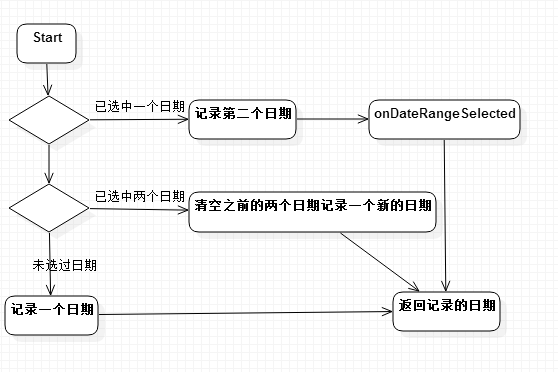
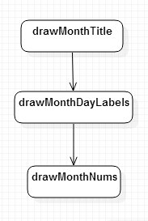
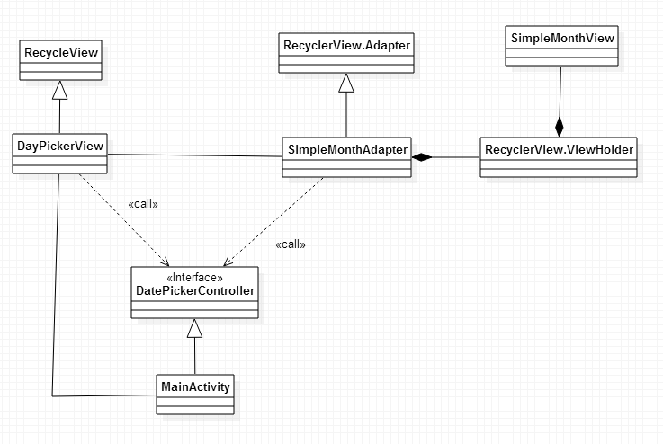

CalendarListView 源码解析
----------------
> 本文为 [CalendarListView](http://a.codekk.com) 中 CalanderListView 部分  
> 项目地址：[CalendarListView](https://github.com/traex/CalendarListview)，分析的版本：[063952b](https://github.com/traex/CalendarListview/commit/063952b3e6e109eebebebfceb52c8c2fc76c6844 "Commit id is 063952b3e6e109eebebebfceb52c8c2fc76c6844]")，Demo 地址：[calendar-list-view-demo](https://github.com/aosp-exchange-group/android-open-project-demo/tree/master/calendar-list-view-demo)  
> 分析者：[Rogary](http://github.com/Rogary)，分析状态：未完成，校对者：[Trinea](https://github.com/trinea)，校对状态：未开始  

## 1. 功能介绍  

calendarlistview 选取提供了一个 API 10+日历日期的简便方法  

只需要在你的布局中添加 datepickerview 无需定制。  

使用控件 RecycleView 实现的日期选择器，可以选择时间段。  

### 1.1 **完成时间**  

- `2015-2-12`完成  


### 1.2 **集成指南**  

lib 已经上传至 Maven 库

[Gradle, please](http://gradleplease.appspot.com/#calendarlistview)  

在 gradle 中

``` xml

dependencies {

    compile 'com.github.traex.calendarlistview:library:1.2.2'

}

```

### 1.3 **使用指南**

>####1.在你的布局 XML 声明一个`DayPickerView`  


>``` xml

  <com.andexert.calendarlistview.library.DayPickerView

         android:id="@+id/pickerView"

         xmlns:calendar="http://schemas.android.com/apk/res-auto"

         android:layout_width="match_parent"

         android:layout_height="match_parent"/>

>```

>####2.在你的 Activity 或 Fragment 中引入`DatePickerController`,然后你需要设置 `getMaxYear` and >`onDayOfMonthSelected`.  

>`getMaxYear`  是设置选择器的最大年数  

>`onDayOfMonthSelected`  是当你选择了某个新日期时的回调  

>``` java

    @Override

    public int getMaxYear()

    {

        return 2015;

    }

    @Override

    public void onDayOfMonthSelected(int year, int month, int day)

    {

        Log.e("Day Selected", day + " / " + month + " / " + year);

    }

>```


---

### 1.4 如何定制

* app:colorCurrentDay [color def:#ff999999] --> 当前日期固定为粗体，但你可以定制颜色

* app:colorSelectedDayBackground [color def:#E75F49] --> 点击的日期的背景圆形或圆角矩形的颜色

* app:colorSelectedDayText [color def:#fff2f2f2] -->  已选择天数的文字颜色

* app:colorPreviousDay [color def:#ff999999] --> 当前日期之前的颜色

* app:colorNormalDay [color def:#ff999999] --> 默认日期的颜色

* app:colorMonthName [color def:#ff999999] --> 月名和年名的默认颜色

* app:colorDayName [color def:#ff999999] --> 日期名字的默认颜色

* app:textSizeDay [dimension def:16sp] --> 日期数字的文本大小

* app:textSizeMonth [dimension def:16sp] --> 月份的文本大小

* app:textSizeDayName [dimension def:10sp] --> 日期名的文本大小

* app:headerMonthHeight [dimension def:50dip] --> 顶部月份栏的高度

* app:drawRoundRect [boolean def:false] --> 选中天数使用圆角矩形而不是使用圆形

* app:selectedDayRadius [dimension def:16dip] --> 如果使用圆角矩形，设置圆角矩形的半径

* app:calendarHeight [dimension def:270dip] --> 月或行的行距

* app:enablePreviousDay [boolean def:true] --> 启用已过期的天数

* app:currentDaySelected [boolean def:false] --> 默认选中当前日期

* app:firstMonth [enum def:-1] --> 默认起始月份

* app:lastMonth [enum def:-1] --> 默认结束月份


## 2. 详细设计

### 2.1 类详细介绍

>#### 1.[`DayPickerView`](https://github.com/traex/CalendarListview/blob/master/library/src/main/java/com/andexert/calendarlistview/library/DayPickerView.java)  

>>`DayPickerView` 继承于`RecyclerView`  

>>>[RecyclerView](http://blog.jobbole.com/74208/)相关知识  

>>>在这里 DayPickerView 作为整个 Calendar—list-view 的容器  

>>>目前 SDK 中提供了三种自带的 LayoutManager:  

>>>LinearLayoutManager  

>>>GridLayoutManager  

>>>StaggeredGridLayoutManager  

>>>这里用到了 LinearLayoutManager  

>>>LinearLayoutManager 可设置方向，这里使用默认的竖向  


>>>**(1) 主要成员变量含义**  

>>>

1.`mCurrentScrollState` 当前滑动状态  

2.`mPreviousScrollPosition` 之前滑动的位置  

3.`mPreviousScrollState` 之前的滑动状态  


>#### 2.[`SimpleMonthAdapter`](https://github.com/traex/CalendarListview/blob/master/library/src/main/java/com/andexert/calendarlistview/library/SimpleMonthAdapter.java)  

>>`SimpleMonthAdapter` 继承于`RecyclerView.Adapter`  

>>>RecyclerView 跟 ListView 一样，需要设置 RecyclerView 的 Adapter，但是这里的 Adapter 跟 ListView 使用的 Adapter 不一样，这里的 Adapter 需要继承 RecyclerView.Adapter，需要实现 3 个方法：  

>>>　　- onCreateViewHolder()  

>>>　　- onBindViewHolder()  

>>>　　- getItemCount()  


>>>onCreateViewHolder(ViewGroup viewGroup, int i)    

>>>>这个方法主要生成为每个 Item inflater 出一个 View，但是该方法返回的是一个 ViewHolder。方法是把 View 直接封装在 ViewHolder 中，然后我们面向的是 ViewHolder 这个实例，这里的 ViewHolder 即`SimpleMonthView`。直接省去了当初的 convertView.setTag(holder)和 convertView.getTag()这些繁琐的步骤。


>>>onBindViewHolder(RecyclerView.ViewHolder viewHolder, int i)    

>>>>这个方法主要用于适配渲染数据到 View 中。方法提供给你了一个 viewHolder，而不是原来的 convertView。  


>>>  这里与 ListViewAdapter 做一个对比

>>> ``` java  

>>> @Override

>>>    public View getView(int position, View convertView, ViewGroup parent) {

>>>        ViewHolder holder;

>>>        if(null == convertView){

>>>            holder = new ViewHolder();

>>>            LayoutInflater mInflater = (LayoutInflater) context.getSystemService(Context.LAYOUT_INFLATER_SERVICE);

>>>            convertView = mInflater.inflate(R.layout.item, null);

>>>            holder.btn = (Button) convertView.findViewById(R.id.btn);

>>>            holder.tv = (TextView) convertView.findViewById(R.id.tv);

>>>            holder.iv = (TextView) convertView.findViewById(R.id.iv);

>>>            convertView.setTag(holder);

>>>        }else{

>>>            holder = (ViewHolder) convertView.getTag();

>>>        }

>>>        final HashMap<String, Object> map = list.get(position);

>>>        holder.iv.setImageResource(Integer.valueOf(map.get("iv").toString()));

>>>        holder.tv.setText(map.get("tv").toString());

>>>        holder.btn.setOnClickListener(new View.OnClickListener() {

>>>            @Override

>>>            public void onClick(View v) {

>>>                Toast.makeText(context, map.get("btn").toString(), Toast.LENGTH_SHORT).show();
>>>            }
>>>        });
>>>        return convertView;
>>>    }
>>>    class ViewHolder{
>>>    
>>>        Button btn;

>>>        ImageView iv;

>>>        TextView tv;
>>>    }

>>> ``` 

>>>旧的写法中 Line5～Line12＋Line28 部分的代码其实起到的作用相当于新的写法的 onCreateViewHolder()；  

>>>旧的写法中 Line14～Line26 部分的代码其实起到的作用相当于新的写法的 onBindViewHolder()；


>>**(1) 主要成员变量含义**  

>>1.`selectedDays` 选中的日期  
2.`firstMonth` 开始的月份  
3.`lastMonth` 结束的月份  


>>**(2) 核心方法**  

>>`setSelectedDay()` 当日期被点击 **流程图为:**  
>>
  


>#### 3.[`SimpleMonthView`](https://github.com/traex/CalendarListview/blob/master/library/src/main/java/com/andexert/calendarlistview/library/SimpleMonthView.java)  

>>`SimpleMonthView` 继承于`View`  

>>`SimpleMonthView`这里作为 RecycleView 的 Item 项，以月份为单位绘制  

>>[View 绘制流程相关知识](http://a.codekk.com/detail/Android/lightSky/%E5%85%AC%E5%85%B1%E6%8A%80%E6%9C%AF%E7%82%B9%E4%B9%8B%20View%20%E7%BB%98%E5%88%B6%E6%B5%81%E7%A8%8B)  

>>**View 绘制流程函数调用链**  

>>图片来自 https://plus.google.com/+ArpitMathur/posts/cT1EuBbxEgN  

>>**(1) 主要成员变量含义**  
>>
1.`mHasToday` 本月中含有今天  
2.`mIsPrev` 是否是过去的月份  
3.`mSelectedBeginDay` 选中的开始日期  
4.`mSelectedLastDay` 选中的结束日期  
5.`mSelectedBeginMonth` 选中的开始日期所在的月份  
6.`mSelectedLastMonth` 选中的结束日期所在的月份  
7.`mSelectedBeginYear` 选中的开始日期所在的年份  
8.`mSelectedLastYear` 选中的结束日期所在的年份  
9.`mToday` 今天  
10.`mNumDays` 本月所含的天数  
11.`mWeekStart` 每周开始是星期几  
12.`mDayOfWeekStart` 结束的月份  
13.`mMonth` 当前月份  
14.`mDrawRect` 选中标记是圆角矩形  
15.`mRowHeight` 行高  
16.`mWidth` 屏幕宽度  
17.`mYear` 当前年份  
18.`isPrevDayEnabled` 是否可选今天以前的日期  
19.`mNumRows` 日期的行数  


>>**(2) 核心方法**  
>>**onDraw()流程图**  
  
>>```java
	protected void onDraw(Canvas canvas) {
		drawMonthTitle(canvas);  //绘制月份头部
		drawMonthDayLabels(canvas); //绘制日期表格
		drawMonthNums(canvas);  //绘制日期
	}
```


>#### 4.[`DatePickerController`](https://github.com/traex/CalendarListview/blob/master/library/src/main/java/com/andexert/calendarlistview/library/DatePickerController.java)  

>>`DatePickerController`  日期选择 Controller 接口，在使用时需要实现以下接口  

>>``` java
    public abstract int getMaxYear();  
    public abstract void onDayOfMonthSelected(int year, int month, int day);  
    public abstract void onDateRangeSelected(final SimpleMonthAdapter.SelectedDays<SimpleMonthAdapter.CalendarDay> selectedDays);  

>>```

>>getMaxYear() :设置最大年份  

>>onDayOfMonthSelected(int year, int month, int day)  :点击日期时的操作  

>>onDateRangeSelected(final SimpleMonthAdapter.SelectedDays<SimpleMonthAdapter.CalendarDay> selectedDays)  ：选择了两个日期时的处理  


>#### 5.[`CalendarUtils`](https://github.com/traex/CalendarListview/blob/master/library/src/main/java/com/andexert/calendarlistview/library/CalendarUtils.java)  

>>`CalendarUtils`  

>>public static int getDaysInMonth(int month, int year)  :获取月份相应的天数


##3. 总体设计
 

