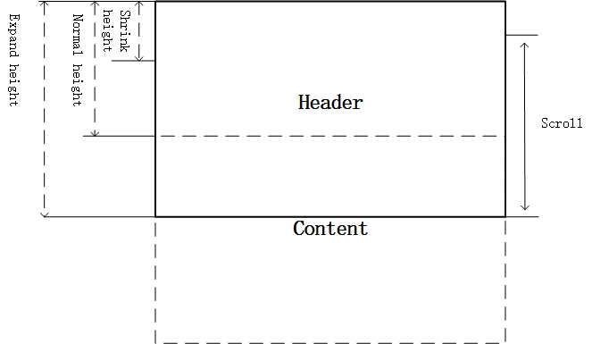
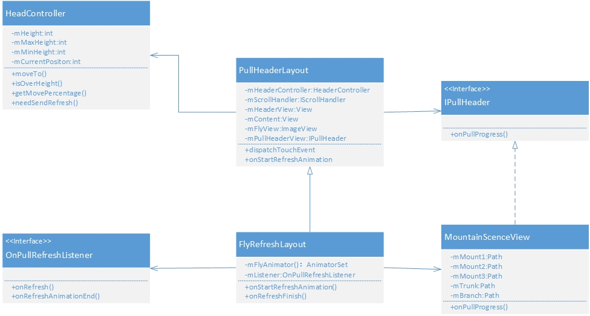
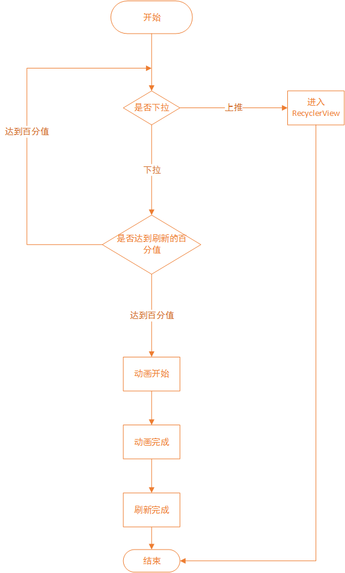

FlyRefresh 源码解析
====================================

> 本文为 [FlyRefresh](http://a.codekk.com) 中 FlyRefresh 部分  
> 项目地址：[FlyRefresh](https://github.com/race604/FlyRefresh)，分析的版本：[5299e8b](https://github.com/race604/FlyRefresh/commit/5299e8b969aab63fc1fde0a5423b19a61cded53b "Commit id is 5299e8b969aab63fc1fde0a5423b19a61cded53b]")，Demo 地址：[fly-refresh-demo](https://github.com/aosp-exchange-group/android-open-project-demo/tree/master/fly-refresh-demo)  

> 分析者：[skyacer](http://github.com/skyacer)，分析状态：完成，校对者：[Trinea](https://github.com/trinea)，校对状态：未开始  


## 1. 功能介绍  

>FlyRefresh 是一个非常漂亮的下拉刷新的框架，下拉后会有纸飞机在顶部转一圈然后如果有新的item则会增加一条。添加方法只需要在你的布局中添加 FlyRefreshLayout 即可，使用的RecyclerView实现。

### 1.1 **完成时间**  

- `2015-08-19`更新 


### 1.2 **集成指南**  


>在 gradle 中

``` xml

dependencies {

    compile 'com.race604.flyrefresh:library:1.0.1''

}

```

### 1.3 **使用指南**

#### 1.在你的布局 XML 声明一个`FlyRefreshLayout`  


``` xml
    
     <com.race604.flyrefresh.FlyRefreshLayout
     android:id="@+id/fly_layout"
     android:layout_width="match_parent"
     android:layout_height="match_parent">
    
        <android.support.v7.widget.RecyclerView
           android:id="@+id/list"
           android:layout_width="match_parent"
           android:layout_height="match_parent"
           android:paddingTop="24dp"
          android:background="#FFFFFF"/>
     </com.race604.flyrefresh.FlyRefreshLayout>
```    

#### 2.在你的Activity或者Fragment中引入`FlyRefreshLayout`，然后你需要设置下拉监听
```  java
       flyrefreshLayout.setOnPullRefreshListener(new FlyRefreshLayout.OnPullRefreshListener() {
             @Override
             public void onRefresh(FlyRefreshLayout flyRefreshLayout) {
               //刷新时需要完成的逻辑
               }
 
             @Override
            public void onRefreshAnimationEnd(FlyRefreshLayout flyRefreshLayout) {
                 //结束刷新，也就是动画结束的时候需要展示的内容
             }
``` 

`recyclerView` 是需要刷新的列表
```
        java
        LinearLayoutManager linearLayoutManager = new LinearLayoutManager(this);
        linearLayoutManager.setOrientation(LinearLayoutManager.VERTICAL);
        recyclerView.setLayoutManager(linearLayoutManager);


``` 

### 1.4 **总体设计分析**
> 由于效果是动画实现，原作者采用把GIF图分解成一帧一帧的图片，分解的方法如下：
>```
convert -coalesce animation.gif frame.png
>```
总体设计是一个下拉刷新的效果;
页面上分为两个部分：头部和内容部分;
头部叠放在内容块的下面;
内容块可以下拉，放手会回弹，并且会触发飞机飞出的动画;
头部块会随着下拉过程中有动画产生（之后会重点来介绍）;
  
布局主要分为上下两部分，上部为头部，虚线括起来的为内容部分。不触摸屏幕的时候，内容部分会覆盖头部的下半部分，留出头部的`Normal height` 的高度。内容区域可以上滑，最多覆盖到`Shrink height`高度；下滑最多可以把头部区域留出`Expended height`，下滑超过`Normal height`的时候，放手会自动弹回。内容区域可以滑动的距离为`Expended_height - Shrink_height`
这是一个比较通用的布局模式，只要重载这个布局，基本上可以涵盖了所有下刷新的模式。例如`Shrink_height=0`的话，头部可以全部收起来的；如果`Shrink_height==Normal height`的话，就是一个有固定头部的下拉控件；如果`Expended_height > Normal height > Shrink_height`，就是头部可以扩展收缩的下拉控件。
头部动画部分，这里会有一些不同的设计，变化最大的部分。但是有一个共同点，就是头部显示会根据内容块的滑动情况来变化。在软件上，设计出接口，不同的动画，实现此接口就可以。`FlyRefresh` 的动画只是这个接口的一个具体实现。如果要实现其他的刷新动画，并不需要做多大的改动。


## 2. 详细设计
类图设计：  

### 2.1 类详细介绍

#### 1.[`HeaderController`](https://github.com/race604/FlyRefresh/blob/master/library/src/main/java/com/race604/flyrefresh/HeaderController.java)

>`HeaderController`是控制刷新框架头部移动的类

>`HeaderController`主要涉及到手指滑动头部的移动以及相对于正常位置时偏移量的改变，并且高度是由最顶部往下递增的。

>**(1) 主要成员变量含义**  

>

>1.`mHeight` 正常位置的高度

>2.`mMaxHegiht` 可以往下拉的最大高度
 
>3.`mMinHegiht` 可以往上推的最小高度

>4.`mIsInTouch` 手指是否触碰屏幕

>5.`mStartPos` 手指触碰屏幕之前的初始坐标

>6.`mCurrentPos` 当前的y方向坐标

>**(2) 主要方法含义**  
>

>1.`public int willMove(float deltaY)` 返回相对于normal位置需要移动的y方向的偏移量，在这个方法中如果偏移量加上初始位置大于正常位置时，偏移量会增加两倍，往上的速度也会相应增加，反之，如果偏移量加上初始位置小于正常位置，往下的偏移量会减少两倍，往下的速度也会相应减少。虽然有点难以理解，但能看到的是刷新框架在振动时，往上振动的力度要大于往下振动的力度，但最终仍会趋于正常位置。

>2.`public boolean isOverHeight()` 判断当前位置是否在normal位置以下

>3.`public float getMovePercentage()` 获得偏移的百分比

>4.`public boolean needSendRefresh()` 判断是否需要开始刷新了(当下拉移动百分比超过0.9f即刷新)


>#### 2.[`PullHeaderLayout`](https://github.com/race604/FlyRefresh/blob/master/library/src/main/java/com/race604/flyrefresh/PullHeaderLayout.java)

>这是一个基类，主要实现了布局和滑动的功能。这个基类继承自`ViewGroup`,而`ViewGroup`可以包括其他视图，它是一个视图的集合，对应到这个框架上来，也定义了最重要的两个子视图，一个是固定悬浮按钮`FloatingActionButton`还有一个纸飞机的`ImageView`，这个类最大的作用是对Touch事件的处理，因为需要时刻的判断View所处的状态，如果`mContent`可以整体滑动时候，layout就要截获Touch事件，并且把这个Touch事件传递给子视图，这样才能完成刷新的功能。
>在这个类中还用到了两个辅助的类，一个是之前的`HeaderController`，还有一个是内部类`ScrollChecker `,这个主要检查`ContentView `是否可以滑动。

>**(1) 主要成员变量和常量含义**  

>

>1.`STATE_IDLE` 闲置状态

>2.`STATE_DRAGE` 拉拽状态
 
>3.`STATE_FLING` 手指离开屏幕但屏幕还在移动

>4.`STATE_BOUNCE` 上下振动状态

>5.`mHeaderView` 头部视图

>6.`mContent` 内容视图，也就是可伸展的部分，有一部分被头部遮挡。

>7.`mScrollChecker` 滑动检查，判断mContent是否可以伸展。

>**(2) 主要方法含义**  
>

>1.`public void setActionDrawable(Drawable actionDrawable)` 这个方法初始化了用到的视图，固定悬浮按钮和纸飞机。

>2.`protected void onFinishInflate()`这个方法是渲染视图结束时的回调，这里对两个子视图`mHead`和`mContent`进行了处理，保证了子视图数量在两个以内，并且保证了`mHead`和`mContent`保持对子视图的引用。 

> 3.`public boolean dispatchTouchEvent(MotionEvent ev)`这个方法显然是对触摸事件的分发，这里着重说一下`ACTION_DOWN`和`ACTION_MOVE`两种情况，第一种`ACTION_DOWN`的时候它会判断控件是不是在上下振动的状态，如果是则立刻停止，这一点很符合我们的习惯。然后是`ACTION_MOVE`,这里做了之前提到的拦截Touch事件的处理：
>```  java
>      if (!mHeaderController.isInTouch()) {
>       mHeaderController.onTouchDown(ev.getX(), ev.getY());
>       offsetY = mHeaderController.getOffsetY();
>       }
>      willMovePos(offsetY);
>```

> 这一段代码也就是当recyclerView到顶部以后要进入刷新头部时候执行的。其中最重要的还是`willMovePos(offsetY)`，这个方法把偏移量`offsetY`传给`willMovePos`然后再通过`private void movePos(float delta)`传给头部子视图。

>#### 3.[`FlyRefreshLayout`](https://github.com/race604/FlyRefresh/blob/master/library/src/main/java/com/race604/flyrefresh/FlyRefreshLayout.java)

>这个类是继承于`PullHeaderLayout`，这个类主要为了简化使用，在这个类中添加了动画头部`MountanScenceView `和刷新的接口`OnPullRefreshListener`，这个类中实现了对纸飞机动画的实现，其中包括三个步骤：
>1. 随着下拉，逆时针转动；
>2. 放手的时候，触发刷新，发射出去；
>3. 刷新完成，飞机飞回来，回到原来的位置。

> 动画1：需要重载`protected void onMoveHeader(int state, float progress)`这个函数，这个函数也是`PullHeaderLayout `的回调，在这个函数中设置相应的旋转角度即可。
> 动画2：是一个组合的动画，飞机整体向右上角移动，同时飞机绕 X 轴做 3D 转动，飞机头部慢慢趋向水平，并且慢慢缩小。利用`ObjectAnimator`实现组合动画，利用`  transY.setInterpolator(PathInterpolatorCompat.create(0.7f, 1f));`来实现贝塞尔曲线插值，使得曲线更加平滑，看起来不会那么生硬。
>动画3：这一步飞机回来和动画二差不多，只是把飞行方向和飞行轨迹进行了相应的调整。

>**(1) 主要成员变量和常量含义**  
>>>

> 1. `mFlyAnimator` 动画集合
> 
> 2. `mListener` 回调OnPullRefreshListener开始和完成的状态

>**(2) 主要方法含义**  
>

>1. `protected void onStartRefreshAnimation()` 刷新开始也是动画开始的回调

>2. `public void onRefreshFinish()` 刷新结束也是动画结束的回调

>这里涉及了很多回调，如果读者对回调不太清楚的请移步至：http://blog.csdn.net/as02446418/article/details/47154849

>同时在下拉的过程中应该注意到山脉和树干的变化，这里作者把它放到另一个类`MountanScenceView`中实现，具体请看2.1.3

>#### 4.[`MountanScenceView`](https://github.com/race604/FlyRefresh/blob/master/library/src/main/java/com/race604/flyrefresh/internal/MountanScenceView.java)

>这个类继承了`View`,并且实现了`IPullHeader`接口，这个接口比较简单，在本类最后有介绍，该类实现了最出彩的山脉和树木弯曲的动画。因为山脉按照远近分为三层景深，近处的山的颜色比较深，而且随着下拉的时候也会向下移动，并且呈现视差，并且伴随树的弯曲，这是整个动画的点睛之笔。因为在移动过程中，山脉图片始终要充满整个屏幕，所以用单纯的图片是不太现实的，所以这里用到的是`Path`来绘制整个场景。在这里用到了`onMeasure()`来计算出缩放的比例

> ``` java
> @Override
>    protected void onMeasure(int widthMeasureSpec, int heightMeasureSpec) {

>        super.onMeasure(widthMeasureSpec, heightMeasureSpec);

>        final float width = getMeasuredWidth();

>        final float height = getMeasuredHeight();

>        mScaleX = width / WIDTH;

>        mScaleY = height / HEIGHT;
>
>        updateMountainPath(mMoveFactor);

>        updateTreePath(mMoveFactor, true);

>    }

> ```


> updateMountainPath(mMoveFactor)的实现也并不难，原理是用多个点练成线绘制而成，下面看实现的一部分代码

> ``` java
> private void updateMountainPath(float factor) {

>        mTransMatrix.reset();
>        mTransMatrix.setScale(mScaleX, mScaleY);
>      
>  //用path绘制山脉，由点连线最后扩充，保证整个屏幕宽度
>       
>        int offset1 = (int) (10 * factor);
>        mMount1.reset();
>        mMount1.moveTo(0, 95 + offset1);
>        mMount1.lineTo(55, 74 + offset1);
>        mMount1.lineTo(146, 104 + offset1);
>        mMount1.lineTo(227, 72 + offset1);
>        mMount1.lineTo(WIDTH, 80 + offset1);
>        mMount1.lineTo(WIDTH, HEIGHT);
>        mMount1.lineTo(0, HEIGHT);
>        mMount1.close();
>        mMount1.transform(mTransMatrix);
>        ...
>        }

>  然后我们来介绍一下这部分最重要的在下拉过程中树的弯曲的实现，这里采用的是将整个树对称中心，用一条“不可见”的贝塞尔曲线支撑，树干和树枝围绕这条中心线密集的用直线堆积构建。树的弯曲效果，只需要移动贝塞尔曲线的控制点。

>  这里生成了一个贝塞尔曲线插值器
>    final Interpolator interpolator = PathInterpolatorCompat.create(0.8f, -0.5f * factor);

> factor是作为弯曲的程度


>  下面的代码大体意思是将每棵树用25个采样点构建树干和树枝
> ```java
>       final int N = 25;
>        final float dp = 1f / N;
>        final float dy = -dp * height;
>        float y = y0;
>        float p = 0;
>        float[] xx = new float[N + 1];
>        float[] yy = new float[N + 1];
>        for (int i = 0; i <= N; i++) {
>            // 把归一化的采样坐标转换为实际坐标
>            xx[i] = interpolator.getInterpolation(p) * maxMove + x0;
>            yy[i] = y;
>
>            y += dy;
>            p += dp;
>        }
>   ```

> 下面是构建树干的代码
>  ```java
>   mTrunk.reset();
>        mTrunk.moveTo(x0 - trunkSize, y0);
>        int max = (int) (N * 0.7f);// 树干的高度为整个树的0.7
>       int max1 = (int) (max * 0.5f);// 三角形收缩开始的点
>        float diff = max - max1;
>        // 添加树干左边的边缘
>        for (int i = 0; i < max; i++) {
>            if (i < max1) { // 等距
>                mTrunk.lineTo(xx[i] - trunkSize, yy[i]);
>            } else { // 线性收缩
>                mTrunk.lineTo(xx[i] - trunkSize * (max - i) / diff, yy[i]);
>            }
>        }
>        // 添加树干右边的边缘，这里和上面对称
>        for (int i = max - 1; i >= 0; i--) {
>            if (i < max1) {
>                mTrunk.lineTo(xx[i] + trunkSize, yy[i]);
>            } else {
>                mTrunk.lineTo(xx[i] + trunkSize * (max - i) / diff, yy[i]);
>            }
>        }
>        mTrunk.close();
>   ```


>这个类介绍的基本已经结束了，最后再说一下实现的`onPullProgress`接口，下面是源代码：

> ``` java
>  @Override
>    public void onPullProgress(PullHeaderLayout parent, int state, float factor) {

>        float bendFactor;
>        //振动状态
>        if (state == PullHeaderLayout.STATE_BOUNCE) {
>           if (factor < mBounceMax) {
>                mBounceMax = factor;
>            }
>            bendFactor = factor;
>        } else {
>            mBounceMax = factor;
>            bendFactor = Math.max(0, factor);
>        }
>
>        mMoveFactor = Math.max(0, mBounceMax);
>        updateMountainPath(mMoveFactor);
>        updateTreePath(bendFactor, false);
>
>        postInvalidate();
>    }
>   ```

>  这里对是否是振动状态进行了判断，最后的方法有必要提一下`postInvalidate()`，这个方法是`View`里的，作用就是在UI线程以外的地方通知UI线程来重绘界面。


>#### 5.[`SampleItemAnimator`](https://github.com/race604/FlyRefresh/blob/master/app/src/main/java/com/race604/flyrefresh/sample/SampleItemAnimator.java)

>最后说一下SampleItemAnimator这个类，这个类继承了BaseItemAnimator，实现了新的item加入列表时候的动画，主要包含三个方法：

>  protected void preAnimateAddImpl(RecyclerView.ViewHolder holder)

>  protected void animateAddImpl(final RecyclerView.ViewHolder holder) 

>  protected void animateRemoveImpl(RecyclerView.ViewHolder viewHolder) 

>这三个方法看方法名也大概知道是做什么用的了，第一个是在加入新item加入列表之前的动画，第二个时加入时候的动画，第三个是移除item的动画。这里给出第二个的实现代码：

> ``` java 

> protected void animateAddImpl(final RecyclerView.ViewHolder holder) {
>        View target = holder.itemView;
>        View icon = target.findViewById(R.id.icon);
>        Animator swing = ObjectAnimator.ofFloat(icon, "rotationX", 45, 0);
>        swing.setInterpolator(new OvershootInterpolator(5));

>        View right = holder.itemView.findViewById(R.id.right);
>        Animator rotateIn = ObjectAnimator.ofFloat(right, "rotationY", 90, 0);
>        rotateIn.setInterpolator(new DecelerateInterpolator());
>
>        AnimatorSet animator = new AnimatorSet();
>        animator.setDuration(getAddDuration());
>        animator.playTogether(swing, rotateIn);

>        animator.start();
>    }
> ``` 


>这里我们可以看到实现动画的代码之前也有提到过类似的，这里其实就是一个动画集合，使用到了插值器，主要的动画是icon 的晃动和内容的 3D 旋转

## 3. 流程设计

>  
