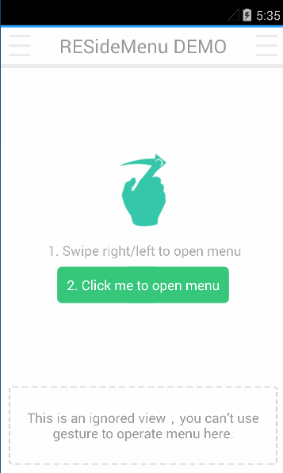
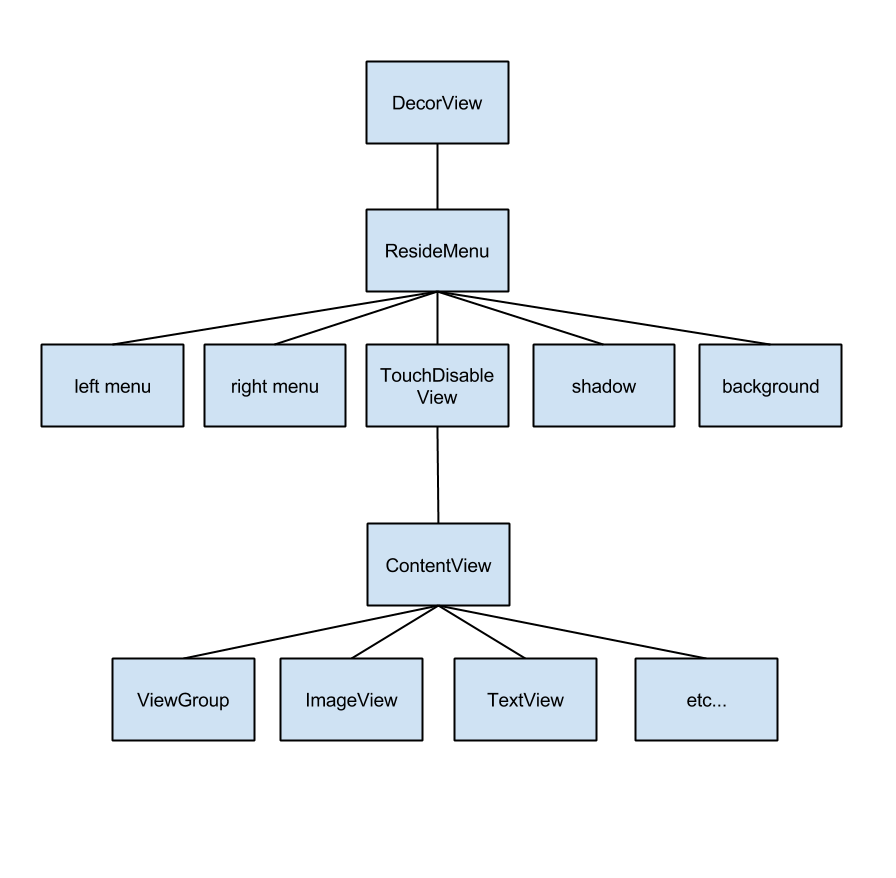
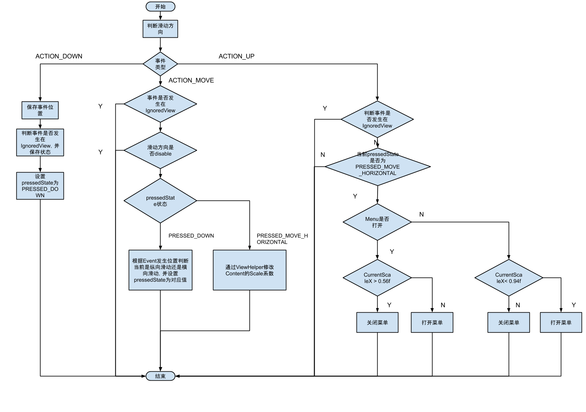
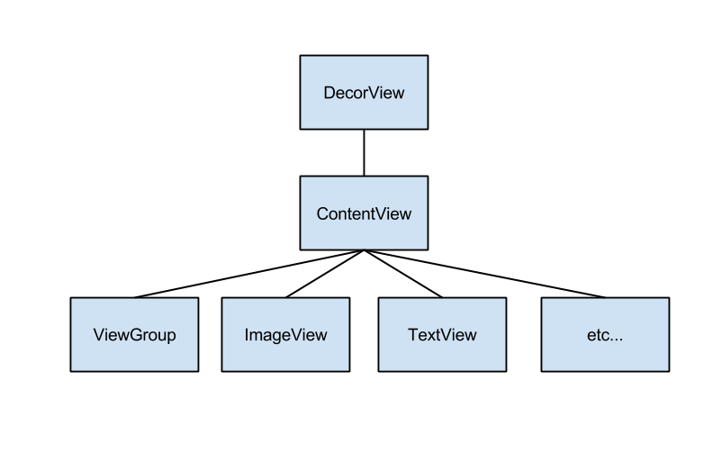

ResideMenu 源码解析
====================================
> 本文为 [Android 开源项目源码解析](http://a.codekk.com) 中 ResideMenu 部分  
> 项目地址：[ResideMenu](https://github.com/SpecialCyCi/AndroidResideMenu)，分析的版本：[70d46c2](https://github.com/SpecialCyCi/AndroidResideMenu/commit/70d46c2ed49c8123847bb07d2f0761e57bb3bc04)，Demo 地址：[ResideMenu-demo]()    
> 分析者：[dkmeteor](https://github.com/dkmeteor)，校对者：[???]()，校对状态：未完成   

### 1. 功能介绍

##### 特性(Features)：
通过手势滑动缩放主界面展现的侧边栏，类似QQ5.0+版本侧滑菜单的出现方式，支持左右双侧边栏。

动效文字比较难以描述，请以演示效果Gif为例：

##### 优势：
- 性能优异，几乎没有额外的重绘和性能损耗。
- 良好的结构设计，易于扩展和改写。
- 与`DrawerLayout`或`SlidingMenu`相比，完全是另一种风格，第一次见到时给人眼前一亮的感觉。
- 事件分发做了很好的处理，可以方便的与其它控件集成。

### 2. 总体设计

#### 2.1 View层次结构分析

View Tree：

#### 2.2动画原理简单介绍:

从视觉效果上来看,可能会有人以为Menu展开过程是个平移+缩小的效果,但是实际上这里只使用了一个`Scale`动画,并没有使用任何平移动画.
    

注意,缩放的中心点在屏幕外.
    
### 3. 事件分发流程图

### 4. 详细设计
### 4.1 核心类功能介绍

---
##### 4.1.1 ResideMenu
核心类

- private void setScaleDirection(int direction)

本方法是该效果实现核心的部分,通过该方法配置了缩放动画的中心点.
	
	
	private void setScaleDirection(int direction){
        int screenWidth = getScreenWidth();
        float pivotX;
        float pivotY = getScreenHeight() * 0.5f;

        if (direction == DIRECTION_LEFT){
            scrollViewMenu = scrollViewLeftMenu;
            pivotX  = screenWidth * 1.5f;
        }else{
            scrollViewMenu = scrollViewRightMenu;
            pivotX  = screenWidth * -0.5f;
        }

        ViewHelper.setPivotX(viewActivity, pivotX);
        ViewHelper.setPivotY(viewActivity, pivotY);
        ViewHelper.setPivotX(imageViewShadow, pivotX);
        ViewHelper.setPivotY(imageViewShadow, pivotY);
        scaleDirection = direction;
    }

通过代码可以看到,
	
当屏幕左滑时,缩放中心是 (-0.5 * width, 0.5 * height)

当屏幕右滑时,缩放中心是 (1.5 * width, 0.5 * height)	

这和平时我们使用的缩放中心 (0.5 * width, 0.5 * height)

效果上有些不同,请结合2.2动画效果示意图
	
- private AnimatorSet buildScaleDownAnimation(View target,float targetScaleX,float targetScaleY)

	构造主界面的缩小动画.这里的target也就是上面的viewActivity,注意其缩放中心并不是常见的View中心点.

- private AnimatorSet buildScaleUpAnimation(View target,float targetScaleX,float targetScaleY)

	构造主界面的放大动画.这里的target也就是上面的viewActivity,注意其缩放中心并不是常见的View中心点.
	
- private AnimatorSet buildMenuAnimation(View target, float alpha)

	构造Menu显示/消失时的渐隐动画.
	
- private void initValue(Activity activity)

实例化`TouchDisableView`,并替换Activity中的`DecorView`.
    
    private void initValue(Activity activity){
        this.activity   = activity;
        ...
        viewDecor = (ViewGroup) activity.getWindow().getDecorView();
        viewActivity = new TouchDisableView(this.activity);
        View mContent   = viewDecor.getChildAt(0);
        viewDecor.removeViewAt(0);
        viewActivity.setContent(mContent);
        ...
        addView(viewActivity);
    }
	
注意方法中这一部分代码,这是目前一种常见的View注入方式, SlidingMenu 和 SwipeBack 等库都使用类似机制以达到获得Activity中根视图控制权的目的.
	
- public void attachToActivity(Activity activity)

调用了上面的initValue方法,并通过执行
	
	viewDecor.addView(this, 0);

将自己添加到viewDecor的子节点上.

此方法执行后,`ResideMenu`成为了Activity中`DecorView`的唯一一个直接子节点,所有`TouchEvent`都由`ResideMenu`的`dispatchTouchEvent`最先处理,同时由`TouchDisableView`作为`ContentView`的容器,通过`TouchDisableView`的`onInterceptTouchEvent`返回值来控制是否屏蔽`ContentView`上的事件.例如,当Menu打开后,`TouchDisableView`的`onInterceptTouchEvent`将会固定返回`true`,此时`TouchDisableView`上发生的所有`TouchEvent`都会被拦截,而不会分发给`ContentView`处理.

图:
attachToActivity执行前

attachToActivity执行后

- public void openMenu(int direction)

	通过代码执行打开menu的动画.

- public void closeMenu()

	通过代码执行打开关闭的动画.
	
- private void showScrollViewMenu(ScrollView scrollViewMenu)
- private void hideScrollViewMenu(ScrollView scrollViewMenu)

	展示/隐藏包含侧栏菜单的scrollViewMenu.
	注意这里的显示和隐藏是通过`addView`或`removeView`实现的.未被添加到视图Tree的View不会参与`measure`,`layout`,`draw`等相关流程,menu未打开时,没有任何额外开销.这算是一项针对视图和OverDraw的优化吧.
	
	
- private void setScaleDirectionByRawX(float currentRawX)

	根据当前`TouchEvent`的X轴位置与上一次`TouchEvent`的X轴位置判断当前滑动的方向.
	
- private float getTargetScale(float currentRawX)

	获得当前缩放系数.
	
- public boolean dispatchTouchEvent(MotionEvent ev)

	逻辑和流程太复杂,用文字不方便表述,看流程图吧.
	
---

- private void setShadowAdjustScaleXByOrientation()

根据横竖屏设置Shadow缩放系数的调整值`shadowAdjustScaleX`和`shadowAdjustScaleY`.

在打开Menu的过程中,阴影越来越明显.其原因在于,阴影的scale系数比content的系数要小,两者之间的差值即是`shadowAdjustScaleX`和`shadowAdjustScaleY`
例如,menu完全打开时,content宽缩小到50%(mScaleValue),而阴影宽只缩小为原来的56%(mScaleValue+shadowAdjustScaleX),所以在打开的过程中,content缩小的更快,shadow缩小的更慢,相比较而言,露出的shadow面积越来越大.

- public void setDirectionDisable(int direction)
- public void setSwipeDirectionDisable(int direction)
- private boolean isInDisableDirection(int direction)

设置disable direction.
	
	 switch (ev.getAction()){
        case MotionEvent.ACTION_DOWN:
			...
        case MotionEvent.ACTION_MOVE:
                if (isInIgnoredView || isInDisableDirection(scaleDirection))
                break;
		...
	}

参考dispatchTouchEvent中部分代码,设置了disable direction后,在对应的方向上滑动时,不会触发打开menu的效果,

- public void addIgnoredView(View v)
- public void removeIgnoredView(View v)
- public void clearIgnoredViewList()
- private boolean isInIgnoredView(MotionEvent ev)

	switch (ev.getAction()){
        case MotionEvent.ACTION_DOWN:
			...
			isInIgnoredView = isInIgnoredView(ev) && !isOpened();
			...
        case MotionEvent.ACTION_MOVE:
                if (isInIgnoredView || isInDisableDirection(scaleDirection))
                break;
		...
	}

参考dispatchTouchEvent中部分代码,设置了IgnoredView后,在IgnoredView上开始的滑动事件,不会触发打开menu的效果.

##### 4.1.2 ResideMenuItem
包装了侧栏菜单的一行,由一个`ImageView`和一个`TextView`组成,提供一些基本的对Text和Icon的设置方法.

	<?xml version="1.0" encoding="utf-8"?>
	<LinearLayout xmlns:android="http://schemas.android.com/apk/res/android"
				  android:orientation="horizontal"
				  android:layout_width="match_parent"
				  android:layout_height="wrap_content"
				  android:gravity="center_vertical"
				  android:paddingTop="15dp"
				  android:paddingBottom="15dp">
		<ImageView
				android:layout_width="30dp"
				android:layout_height="30dp"
				android:scaleType="centerCrop"
				android:id="@+id/iv_icon"/>
		<TextView
				android:layout_width="match_parent"
				android:layout_height="wrap_content"
				android:textColor="@android:color/white"
				android:textSize="18sp"
				android:layout_marginLeft="10dp"
				android:id="@+id/tv_title"/>
	</LinearLayout>

如果你对ResideMenu侧栏菜单的Item样式感到不满意,可以通过修改该xml及ResideMenu代码来实现.

如果你需要一个完全定制的侧栏菜单,并且不满足于Icon+Text的表现形式,那么你需要修改`ResideMenu`中的`layoutLeftMenu` 和 `layoutRightMenu`的相关逻辑,添加方法使其支持加载指定自定义View.

##### 4.1.3 TouchDisableView
该类本身的功能非常单纯，在本项目中起一个容器的作用,通过重载`onInterceptTouchEvent`方法并返回指定值来控制是否拦截内部子`View`的`Touch`事件。
如果读者不了解`onInterceptTouchEvent`的运作机制,可以参考 [View 事件传递](http://a.codekk.com/detail/Android/Trinea/%E5%85%AC%E5%85%B1%E6%8A%80%E6%9C%AF%E7%82%B9%E4%B9%8B%20View%20%E4%BA%8B%E4%BB%B6%E4%BC%A0%E9%80%92)

以ResideMenu中的AnimatorListener回调为例:

	    @Override
        public void onAnimationEnd(Animator animation) {
            // reset the view;
            if(isOpened()){
                viewActivity.setTouchDisable(true);
                viewActivity.setOnClickListener(viewActivityOnClickListener);
            }else{
                viewActivity.setTouchDisable(false);
                viewActivity.setOnClickListener(null);
                hideScrollViewMenu(scrollViewLeftMenu);
                hideScrollViewMenu(scrollViewRightMenu);
                if (menuListener != null)
                    menuListener.closeMenu();
            }
        }
		
当动画结束时,若Menu菜单出于打开状态,那么mContent也就是主界面此时应当出于缩小状态,不再响应任何触摸/点击事件,此时设置viewActivity.setTouchDisable(true)来拦截所有TouchDisableView上的点击事件.

反之.若动画结束后,menu处于关闭状态,那么主界面处于展示状态,应当正常响应触摸/点击事件,此时设置viewActivity.setTouchDisable(false),使事件能够按正常流程进行分发.

请结合事件分发流程图一起理解这部分.

### 5. 杂谈
在分析`ResideMenu`的过程中，我也尝试自己写了一个ResideMenu的效果扩展来印证分析过程中的一些结论：

感兴趣的可以参考[Folder-ResideMenu](https://github.com/dkmeteor/Folder-ResideMenu)

分析轮子,然后造轮子.
