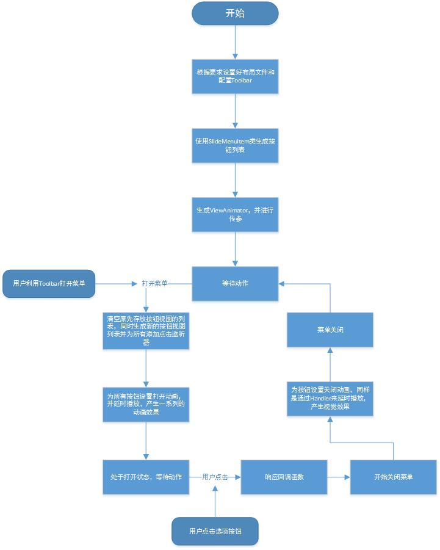
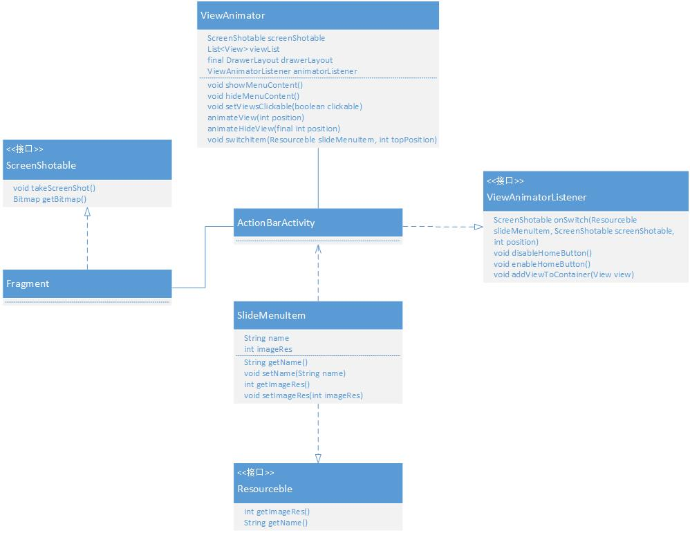

Side Menu.Android 源码解析
====================================
> 本文为 [Android 开源项目源码解析](http://a.codekk.com) 中 Side Menu.Android 部分  
> 项目地址：[Side Menu.Android](https://github.com/Yalantis/Side-Menu.Android)，分析的版本：[2c23bff](https://github.com/Yalantis/Side-Menu.Android/commit/2c23bff1dbebb87b3a3291e3f7d629cc0d5efbfa)，Demo 地址：[side-menu-demo](https://github.com/aosp-exchange-group/android-open-project-demo/tree/master/side-menu-demo)    
> 分析者：[cpacm](https://github.com/cpacm)，校对者：[lightSky](https://github.com/lightSky)，校对状态：完成 

## 1. 功能介绍  
一个交互的动画侧边菜单——`Side Menu`。

#### 1.1 特点
提供了一个翻页动画——`Flip Animation`。    


#### 1.2 要求
**（1）**主界面布局需要使用 DrawerLayout 作为容器        
**（2）**内容界面需要继承 ScreenShotable 接口（如 demo 中的 ContentFragment），以便为 Reveal 效果提供 Bitmap 资源。  
**（4）**主界面需要实现 ViewAnimator.ViewAnimatorListener 接口（如 demo 中的 myActivity）。
 
## 2. 流程图  


## 3. 详细设计  
### 3.1 核心类介绍
#### 3.1.1 ViewAnimator SideMenu 的管理类
其构造函数需要传入 5 个参数，分别为`作为主界面的 ActionBarActivity`、`子按钮列表`、`实现 ScreenShotable 接口的信息界面`、`DrawerLayout`、`实现 ViewAnimatorListener 接口的主界面`。 
  
```java
public ViewAnimator(ActionBarActivity activity,
                        List<T> items,
                        ScreenShotable screenShotable,
                        final DrawerLayout drawerLayout,
                        ViewAnimatorListener animatorListener) {
        this.actionBarActivity = activity;
        this.list = items;
        this.screenShotable = screenShotable;
        this.drawerLayout = drawerLayout;
        this.animatorListener = animatorListener;
    }
```
`showMenuContent()`  
打开菜单界面，简单地将其分成几部分：  
（1）在菜单未完全打开前设置按钮为不可用，同时调用 ViewAnimatorListener 接口中的 disableHomeButton() 方法清空原先存放按钮视图的列表。  

（2）根据传入的按钮个数生成相应个数的按钮 View，并为每个按钮添加点击事件，当事件发生时回调 onSwitch 方法并关闭菜单列表。  

（3）将其添加到存放按钮视图的列表中。调用 AnimatorListener 接口的`addViewToContainer(viewMenu)`方法（我们要在 Activity 中人为的将其添加到界面布局中）。在菜单打开动画未完成情况下，将其属性设为不可用。调用`animateView（）`方法使用 FlipAnimation 类来实现动画设置，Handler 实现延时播放。  

`onSwitch`

```java
/**
 *参数分别为：选中的按钮，当前的信息界面，触摸点的 Y 坐标
 **/
animatorListener.onSwitch(slideMenuItem, screenShotable, topPosition)
```
当点击 MenuItem 切换 ContentView 的时候，调用 onSwitch，从指定的 ScreenShotable 实现类身上获取通过 takeScreenShot 得到的 Bitmap，然后交给 CircularReveal 确定 Reveal 效果的位图以及触发点的 position，紧接着启动 Reveal 动画，最后切换底部内容界面 ContentView，这里的 ContentView 为 Fragment  


`hideMenuContent()`  
关闭菜单界面，为每个按钮视图调用`animateHideView()`方法来设置关闭的动画，并通过 Handler 进行延时播放。在动画结束的监听器中设置视图不可见，并但视图是最后一个按钮时调用  

```java
animatorListener.enableHomeButton();//回调函数，使主界面的菜单键生效
drawerLayout.closeDrawers();
```

`ViewAnimatorListener`  
主界面需要实现的接口，用于管理控制器的状态，向 MenuLayout 中添加 MenuItem，以及菜单切换动作的回调处理。  

`disableHomeButton`，`enableHomeButton`  
在主界面中处理 SideMenu 的状态时使用。你的菜单控制器可以是任意的 View，只需要实现这两个接口去处理控制器的状态即可。  

`addViewToContainer`  
向开发者的 MenuLayout 上添加 MenuItem

`onSwitch`  
点击菜单切换视图时的回调。主要用于实现切换效果的实现，这里实现的是Reveal效果，使用了第三方的开源库：CircularReveal，而该 Reveal 效果库需要一个 Bitmap，以及 Reveal 的触发点。


```java
 public interface ViewAnimatorListener {

        public ScreenShotable onSwitch(Resourceble slideMenuItem, ScreenShotable screenShotable, int position);

        public void disableHomeButton();

        public void enableHomeButton();

        public void addViewToContainer(View view);

    }
```

#### 3.1.2 SlideMenuItem 选项按钮类
一个按钮容器类，里面存放着两个变量，主要用来设置菜单按钮。

```java
    private String name;//名称
    private int imageRes;//图片 id
```
#### 3.1.3 FlipAnimation 翻转动画
一个翻转动画工具类，继承自 Animation 类。根据传入的参数来实现不同的翻转效果。

```java
 /**
  * 参数分别为：起始角度，终止角度，中心点的 X 坐标，中心点的 Y 坐标
  **/
 public FlipAnimation(float fromDegrees, float toDegrees,float centerX, float centerY) {
 ...
 }
```
#### 3.1.4 Resourceble 选项接口
按钮选项必须继承该接口(如 SlideMenuItem 就继承了该接口)，用于存放资源。

```java
public interface Resourceble {
    public int getImageRes();
    public String getName();
}
```
#### 3.1.1 ScreenShotable
用于信息变更的接口,实现切换效果，显示内容的 View 需要去实现它，该接口包含两个方法：

```java
public interface ScreenShotable {
    public void takeScreenShot();
    public Bitmap getBitmap();
}
```
1、takeScreenShot()方法是在按钮被点击时触发,从方法名可以看出该方法是为了对当前界面进行快照，该快照是为了 Reaveal 效果提供 Bitmap。  
2、getBitmap()方法,获取 takeScreenShot 为当前界面创建的 Bitmap，用于 Reveal 效果。  


#### 3.2 类关系图


## 4.个人总结
一个很简单的一个项目，所以从难度上没有什么好讲的（自己的收获则是熟悉了在 Android5.0 下 Toolbar 的用法）。  
我认为问题最大的是它的扩展性太差，从 ViewAnimator 类的构造函数就能发现这个库一定要在相应的环境下（ActionBarActivity,DrawerLayout）才会产生作用。  
其次是动画类型不能让开发者进行二次定制，要想改变动画类型则要进 library 库进行修改。最后是 ViewAnimator 里的很多设置是通过回调函数返回给开发者自己设置，感觉变得更复杂了。  
总体上而言这更像专门定制的一款 UI 设计。不过我认为它最大的意义在于提供了一种在 Toolbar 下自定义菜单的思路，这是最值得我们借鉴的~