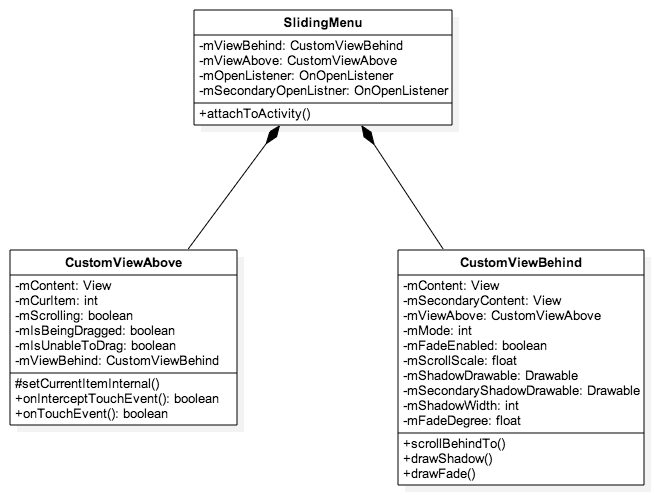
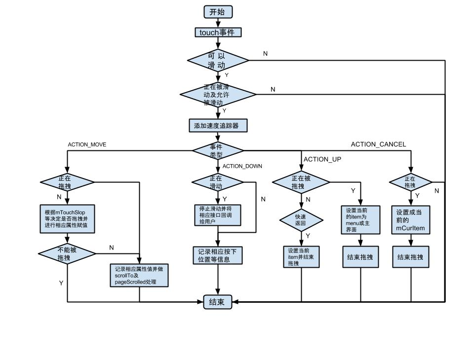

SlidingMenu 源码解析
====================================
> 本文为 [Android 开源项目源码解析](http://a.codekk.com) 中 SlidingMenu 部分  
> 项目地址：[SlidingMenu](https://github.com/jfeinstein10/SlidingMenu)，分析的版本：[4254fec](https://github.com/jfeinstein10/SlidingMenu/commit/4254feca3ece9397cd501921ee733f19ea0fdad8)，Demo 地址：[SlidingMenu Demo](https://github.com/aosp-exchange-group/android-open-project-demo/tree/master/sliding-menu-demo)  
> 分析者：[huxian99](https://github.com/huxian99)，分析状态：完成，校对者：[Trinea](https://github.com/trinea)，校对状态：进行中  

### 1. 功能介绍  
现在主流 App 的导航栏一般有两种，一种是主界面上面 3－4 个 Tab 下面搭配 ViewPager + Fragment，另一种就是侧边栏，如果主导航超过 3 个 Tab 时，建议使用侧边栏作为 App 的主导航。  
SlidingMenu 是一个强大的侧边栏导航框架，并且已经被一些比较牛的 App 使用，主要特点如下：  
(1) 侧边栏可以是一个 Fragment，包含任何 View  
(2) 使用简单方便，支持左滑和右滑等  
(3) 自定义侧边栏显示动画  

### 2. 总体设计  
SlidingMenu 总体由三个主要的类组成。  
(1) SlidingMenu 继承自 RelativeLayout，对外暴露 API 给用户，同时在添加 CustomViewAbove 和 CustomViewBehind  
(2) CustomViewAbove 继承自 ViewGroup，主要用来处理`触摸屏事件`  
(3) CustomViewBehind 继承自 ViewGroup，主要用来`配置参数`，`显示侧边栏的 Menu 部分`  

## 3. 流程图  
请参考 `4.2.2 CustomViewAbove 事件处理流程图`  

### 4. 详细设计  
#### 4.1 类关系图  
  
### 4.2 核心类功能介绍  
#### 4.2.1 SlidingMenu.java  
继承自 RelativeLayout，对外提供 API，用于配置侧边栏的侧滑模式，触摸模式，阴影，渐变及滑动效果等。  
构造器中可以看到主要初始化了 mViewBehind，mViewAbove 及一些属性。  
主要看 attachToActivity 方法  
```java
public void attachToActivity(Activity activity, int slideStyle, boolean actionbarOverlay) {
    ...
    ...
    ViewGroup decor = (ViewGroup) activity.getWindow().getDecorView();
    ViewGroup decorChild = (ViewGroup) decor.getChildAt(0);
    // save ActionBar themes that have transparent assets
    decorChild.setBackgroundResource(background);
    decor.removeView(decorChild);
    decor.addView(this);
    setContent(decorChild);
    break;
    ...
    ...
}
```
> 这里 slideStyle 选取 SLIDING_WINDOW 的 case 进行分析，可以看到主要是获取 decorView，将 decorView 下面的 decorChild(我们的根布局)移除，把 SlidingMenu 添加进来，把 decorChild 赋值给 mViewAbove。  
(SLIDING_CONTENT 原理差不多)  

SlidingMenu 常用的属性设置：  
// 设置侧边, 必须为 LEFT(左边)，RIGHT(右边)，LEFT_RIGHT(左右两边)三者之一
public void setMode(int mode)  
// 设置触摸方式，必须为 TOUCHMODE_FULLSCREEN(全屏可触摸)，TOUCHMODE_MARGIN(边缘可触摸)，默认 48dp, TOUCHMODE_NONE(不可触摸)三者之一  
public void setTouchModeAbove(int i)  
// 根据资源文件 ID 设置阴影部分的 width  
public void setShadowWidthRes(int resId)  
// 根据资源文件 ID 设置阴影部分的效果  
public void setShadowDrawable(int resId)  
// 根据资源文件 ID 设置第二个侧边栏阴影部分的效果  
public void setSecondaryShadowDrawable(int resId)  
// 根据资源文件 ID 设置主界面距离屏幕的偏移量  
public void setBehindOffsetRes(int resID)  
// 设置 fade in 和 fade out 效果的值  
public void setFadeDegree(float f)   
// 设置滑动比例的值，范围为 0-1 之间  
public void setBehindScrollScale(float f)  
// 根据资源文件 ID 设置侧边栏布局  
public void setMenu(int res)  
// 根据 View 设置侧边栏布局  
public void setMenu(View v)  
// 根据资源文件 ID 设置第二个侧边栏布局  
public void setSecondaryMenu(int res)  
// 根据 View 设置第二个侧边栏布局  
public void setSecondaryMenu(View v)  
// 打开菜单  
public void showMenu()  
// 打开第二个菜单  
public void showSecondaryMenu()  
// SlidingMenu 的开关  
public void toggle()  
// 检查侧边栏是否打开  
public boolean isMenuShowing()  
// 检查第二个侧边栏是否打开  
public boolean isSecondaryMenuShowing()  

#### 4.2.2 CustomViewAbove.java  
继承自 ViewGroup，主要用于处理 touch 事件。  
事件处理流程图如下(暂不分析多点触控)：  
  
#### 4.2.3 CustomViewBehind.java  
主要的属性  
```java
/** 第一个侧边栏，一般为左边栏 */  
private View mContent;
/** 第二个侧边栏，一般为右边栏 */  
private View mSecondaryContent;  
/** 滑动侧边栏的最大临界值在设置 TOUCHMODE_MARGIN 起作用，默认 48dp */  
private int mMarginThreshold;  
/** 侧边栏被滑出后，主界面留在屏幕上的 offset */  
private int mWidthOffset;  
/** 有三个值可以选，LEFT/RIGHT/LEFT_RIGHT */  
private int mMode;  
/** 侧边栏在侧滑过程中是否需要 fade 动画效果 */  
private boolean mFadeEnabled;  
/** 定义滑动比例的值，范围 0-1f */  
private float mScrollScale;  
/** 侧边栏滑出后的阴影部分，demo 中用的是 Gradient */  
private Drawable mShadowDrawable;  
/** 同上，为第二个侧边栏的阴影部分 */  
private Drawable mSecondaryShadowDrawable;  
/** 阴影部分的宽 */  
private int mShadowWidth;  
/** 侧边栏滑动过程中 fade 动画的值，范围 0-1f */  
private float mFadeDegree;  
``` 
在侧边栏滑动过程中, 通过回调 CustomViewAbove 的 dispatchDraw 方法画阴影部分和 fade in/out 效果。  
// 画阴影部分  
public void drawShadow(View content, Canvas canvas)  
// 根据 openPercent 画 fade in/out 效果  
public void drawFade(View content, Canvas canvas, float openPercent)  

### 5. 杂谈
关于 selector drawable 存在的一些不理解
SlidingMenu 暴露几个关于 selector drawable 的 API 给用户, CustomViewBehind 的 drawSelector 方法具体实现如下：  
```java
private boolean mSelectorEnabled = true;  
private Bitmap mSelectorDrawable;  
private View mSelectedView;  
if (mSelectorDrawable != null && mSelectedView != null) {
    canvas.save();
    ...
    if (mMode == SlidingMenu.LEFT) {
        ...
        canvas.drawBitmap(mSelectorDrawable, left, getSelectorTop(), null);     
    } else if (mMode == SlidingMenu.RIGHT) {
        ...
        canvas.drawBitmap(mSelectorDrawable, right - mSelectorDrawable.getWidth(), getSelectorTop(), null);
    }
    canvas.restore();
}
```  
其中 canvas.drawBitmap 时传入的 paint 为 null，mSelectedView 除了做判断外并没有看到实际使用
根据它代码中 clip 出来的矩形(在滑动时主界面的左边部分)画 bitmap 对象，想不出其使用的场景在哪里，也想不出当时作者想到了什么才写下了这个方法，并提供 API 给用户。  
