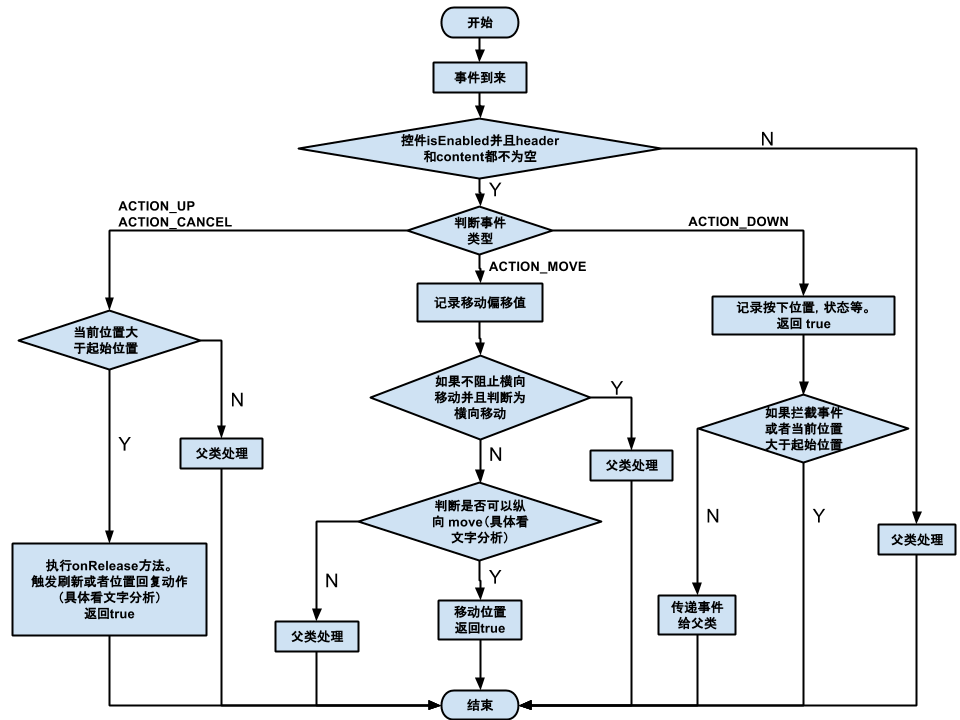
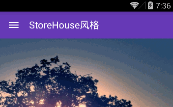
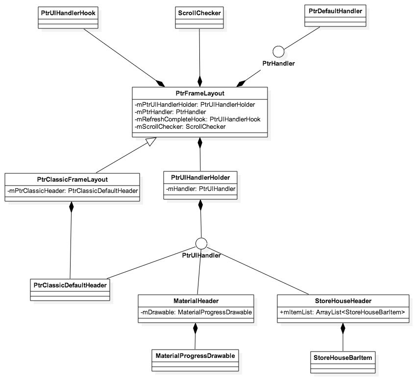
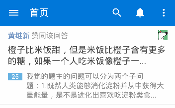
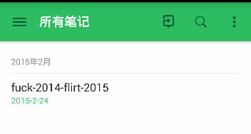

android-Ultra-Pull-To-Refresh 源码解析
====================================
> 本文为 [Android 开源项目源码解析](http://a.codekk.com) 中 android-Ultra-Pull-To-Refresh 部分  
> 项目地址：[android-Ultra-Pull-To-Refresh](https://github.com/liaohuqiu/android-Ultra-Pull-To-Refresh)，分析的版本：[508c632](https://github.com/liaohuqiu/android-Ultra-Pull-To-Refresh/tree/508c63266de51ad8c010ac9912f7592b2f2da8fc)，Demo 地址：[android-Ultra-Pull-To-Refresh Demo](https://github.com/android-cn/android-open-project-demo/tree/master/android-ultra-pull-to-refresh-demo)  
> 分析者：[Grumoon](https://github.com/grumoon)，校对者：[lightSky](https://github.com/lightSky)，校对状态：已完成  

### 1. 功能介绍  
下拉刷新，几乎是每个 Android 应用都会需要的功能。 android-Ultra-Pull-To-Refresh （以下简称 UltraPTR ）便是一个强大的 Andriod 下拉刷新框架。  
主要特点：  
(1).继承于 ViewGroup， Content 可以包含任何 View。  
(2).简洁完善的 Header 抽象，方便进行拓展，构建符合需求的头部。  
> 对比 [Android-PullToRefresh](https://github.com/chrisbanes/Android-PullToRefresh) 项目，UltraPTR 没有实现 **加载更多** 的功能，但我认为 **下拉刷新** 和 **加载更多** 不是同一层次的功能， **下拉刷新** 有更广泛的需求，可以适用于任何页面。而 **加载更多** 的功能应该交由具体的 Content 自己去实现。这应该是和 Google 官方推出 SwipeRefreshLayout 是相同的设计思路，但对比 SwipeRefreshLayout， UltraPTR 更灵活，更容易拓展。

### 2. 总体设计
UltraPTR 总体设计比较简单清晰。  
首先抽象出了两个接口，功能接口和 UI 接口。  
PtrHandler 代表下拉刷新的功能接口，包含刷新功能回调方法以及判断是否可以下拉的方法。用户实现此接口来进行数据刷新工作。   
PtrUIHandler 代表下拉刷新的 UI 接口，包含准备下拉，下拉中，下拉完成，重置以及下拉过程中的位置变化等回调方法。通常情况下， Header 需要实现此接口，来处理下拉刷新过程中头部 UI 的变化。  
整个项目围绕核心类 PtrFrameLayout。 PtrFrameLayout 代表了一个下拉刷新的自定义控件。  
PtrFrameLayout 继承自 ViewGroup，有且只能有两个子 View，头部 Header 和内容 Content。通常情况下 Header 会实现 PtrUIHandler 接口， Content 可以为任意的 View。  
和所有的自定义控件一样， PtrFrameLayout 通过重写 onFinishInflate， onMeasure， onLayout 来确定控件大小和位置。通过重写 dispatchTouchEvent 来确定控件的下拉行为。  

### 3. 流程图
请参照 `4.1.5 PtrFrameLayout 事件拦截流程图`

### 4. 详细设计
### 4.1 核心类功能介绍

#### 4.1.1 PtrHandler.java
下拉刷新功能接口，对下拉刷新功能的抽象，包含以下两个方法。  
```java
public void onRefreshBegin(final PtrFrameLayout frame)
```  
刷新回调函数，用户在这里写自己的刷新功能实现，处理业务数据的刷新。  

```java
public boolean checkCanDoRefresh(final PtrFrameLayout frame, final View content, final View header)
```
判断是否可以下拉刷新。 UltraPTR 的 Content 可以包含任何内容，用户在这里判断决定是否可以下拉。  
例如，如果 Content 是 TextView，则可以直接返回 true，表示可以下拉刷新。  
如果 Content 是 ListView，当第一条在顶部时返回 true，表示可以下拉刷新。  
如果 Content 是 ScrollView，当滑动到顶部时返回 true，表示可以刷新。  

#### 4.1.2 PtrDefaultHandler.java
抽象类，实现了 PtrHandler.java 接口，给出了 `checkCanDoRefresh` 的默认实现，给出了常见 View 是否可以下拉的判断方法。  
```java
@Override
public boolean checkCanDoRefresh(PtrFrameLayout frame, View content, View header) {
    return checkContentCanBePulledDown(frame, content, header);
}
public static boolean checkContentCanBePulledDown(PtrFrameLayout frame, View content, View header) {
    /**
     * 如果 Content 不是 ViewGroup，返回 true,表示可以下拉</br>
     * 例如：TextView，ImageView
     */
    if (!(content instanceof ViewGroup)) {
        return true;
    }
    
    ViewGroup viewGroup = (ViewGroup) content;

    /**
     * 如果 Content 没有子 View（内容为空）时候，返回 true，表示可以下拉
     */
    if (viewGroup.getChildCount() == 0) {
        return true;
    }

    /**
     * 如果 Content 是 AbsListView（ListView，GridView），当第一个 item 不可见是，返回 false，不可以下拉。
     */
    if (viewGroup instanceof AbsListView) {
        AbsListView listView = (AbsListView) viewGroup;
        if (listView.getFirstVisiblePosition() > 0) {
            return false;
        }
    }

    /**
     * 如果 SDK 版本为 14 以上，可以用 canScrollVertically 判断是否能在竖直方向上，向上滑动</br>
     * 不能向上，表示已经滑动到在顶部或者 Content 不能滑动，返回 true，可以下拉</br>
     * 可以向上，返回 false，不能下拉
     */
    if (Build.VERSION.SDK_INT >= 14) {
        return !content.canScrollVertically(-1);
    } else {
        /**
         * SDK 版本小于 14，如果 Content 是 ScrollView 或者 AbsListView,通过 getScrollY 判断滑动位置 </br>
         * 如果位置为 0，表示在最顶部，返回 true，可以下拉
         */
        if (viewGroup instanceof ScrollView || viewGroup instanceof AbsListView) {
            return viewGroup.getScrollY() == 0;
        }
    }

    /**
     * 最终判断，判断第一个子 View 的 top 值</br>
     * 如果第一个子 View 有 margin，则当 top==子 view 的 marginTop+content 的 paddingTop 时，表示在最顶部，返回 true，可以下拉</br>
     * 如果没有 margin，则当 top==content 的 paddinTop 时，表示在最顶部，返回 true，可以下拉
     */
    View child = viewGroup.getChildAt(0);
    ViewGroup.LayoutParams glp = child.getLayoutParams();
    int top = child.getTop();
    if (glp instanceof ViewGroup.MarginLayoutParams) {
        ViewGroup.MarginLayoutParams mlp = (ViewGroup.MarginLayoutParams) glp;
        return top == mlp.topMargin + viewGroup.getPaddingTop();
    } else {
        return top == viewGroup.getPaddingTop();
    }
}
```
这里特别注意一下，以上代码中存在一些小 bug。[Issue](https://github.com/liaohuqiu/android-Ultra-Pull-To-Refresh/issues/30)
```java
if (viewGroup instanceof ScrollView || viewGroup instanceof AbsListView) {
    return viewGroup.getScrollY() == 0;
}
```
如果 Content 是 AbsListView（ListView，GridView），通过 getScrollY() 获取的值一直是 0，所以这段代码的判断，无效。  

> **注意：上述 bug，在新版本 ([3a34b2e](https://github.com/liaohuqiu/android-Ultra-Pull-To-Refresh/tree/3a34b2e89f9dc4522569ce9340910621fd543828)) 中已经做出了修复。以下是最新版本的代码。**
> ```java
public static boolean canChildScrollUp(View view) {
    if (android.os.Build.VERSION.SDK_INT < 14) {
        if (view instanceof AbsListView) {
            final AbsListView absListView = (AbsListView) view;
            return absListView.getChildCount() > 0
                    && (absListView.getFirstVisiblePosition() > 0 || absListView.getChildAt(0)
                    .getTop() < absListView.getPaddingTop());
        } else {
            return view.getScrollY() > 0;
        }
    } else {
        return view.canScrollVertically(-1);
    }
}
> ```
> ```java
public static boolean checkContentCanBePulledDown(PtrFrameLayout frame, View content, View header) {
    return !canChildScrollUp(content);
}
> ```
```java
@Override
public boolean checkCanDoRefresh(PtrFrameLayout frame, View content, View header) {
    return checkContentCanBePulledDown(frame, content, header);
}
> ```
> 新的判断方式也比较简单明了。  
> 当然以上给出的是针对通用 View 的判断方式。如果遇到特殊需求的 View，或者自定义 View。使用者还是要自己实现符合需求的判断。

####4.1.3 PtrUIHandler.java
下拉刷新 UI 接口，对下拉刷新 UI 变化的抽象。一般情况下， Header 会实现此接口，处理下拉过程中的头部 UI 的变化。  
包含以下 5 个方法。  
```java
public void onUIReset(PtrFrameLayout frame);
```
Content 重新回到顶部， Header 消失，整个下拉刷新过程完全结束以后，重置 View。
```java
public void onUIRefreshPrepare(PtrFrameLayout frame);
```
准备刷新，Header 将要出现时调用。
```java
public void onUIRefreshBegin(PtrFrameLayout frame);
```
开始刷新，Header 进入刷新状态之前调用。
```java
public void onUIRefreshComplete(PtrFrameLayout frame);
```
刷新结束，Header 开始向上移动之前调用。
```java
public void onUIPositionChange(PtrFrameLayout frame, boolean isUnderTouch, byte status, int oldPosition, int currentPosition, float oldPercent, float currentPercent);
```
下拉过程中位置变化回调。
####4.1.4 PtrUIHandlerHolder.java
实现 UI 接口 PtrUIHandler，封装了 PtrUIHandler，并将其组织成链表的形式。之所以封装成链表的目的是作者希望调用者可以像 Header 一样去实现 PtrUIHandler，能够捕捉到 onUIReset，onUIRefreshPrepare，onUIRefreshBegin，onUIRefreshComplete 这几个时机去实现自己的逻辑或者 UI 效果，而它们统一由 PtrUIHandlerHolder 来管理，你只需要 通过 addHandler 方法加入到链表中即可，这一点的抽象为那些希望去做一些处理的开发者还是相当方便的。  
####4.1.5 PtrFrameLayout.java
UltraPTR 的核心类，自定义控件类。  
作为自定义控件， UltraPTR 有 8 个自定义属性。  
`ptr_header`，设置头部 id。  
`ptr_content`，设置内容 id。  
`ptr_resistance`，阻尼系数，默认: `1.7f`，越大，感觉下拉时越吃力。  
`ptr_ratio_of_header_height_to_refresh`，触发刷新时移动的位置比例，默认，`1.2f`，移动达到头部高度 1.2 倍时可触发刷新操作。  
`ptr_duration_to_close`，回弹延时，默认 `200ms`，回弹到刷新高度所用时间。  
`ptr_duration_to_close_header`，头部回弹时间，默认 `1000ms`。  
`ptr_pull_to_fresh`，刷新是否保持头部，默认值 `true`。  
`ptr_keep_header_when_refresh`，下拉刷新 / 释放刷新，默认为释放刷新。  
  
下面从 **显示** 和 **行为** 两个方面分析此类。  
**（1）显示（ View 绘制）**    
参考技术点，[公共技术点之 View 绘制流程](http://a.codekk.com/detail/Android/lightSky/%E5%85%AC%E5%85%B1%E6%8A%80%E6%9C%AF%E7%82%B9%E4%B9%8B%20View%20%E7%BB%98%E5%88%B6%E6%B5%81%E7%A8%8B)  
```java
@Override
protected void onFinishInflate() {...}
```
UltraPTR 有且只有两个子 View，重写 onFinishInflate 方法来确定 Header 和 Content。  
可以通过 `setHeaderView` 在代码中设置 Header，或者通过 `ptr_header` 和 `ptr_content ` 两个自定义属性来设置。也可以直接在布局文件中，为 PtrFrameLayout 加入两个子 View，然后在 onFinishInflate 进行判断赋值。  
通常情况下， Header 会实现 PtrUIHandler 接口。  
最终，将 Header 实例赋值给 mHeaderView 变量，Content 实例赋值给 mContent 变量。  

```java
@Override
protected void onMeasure(int widthMeasureSpec, int heightMeasureSpec) {
    super.onMeasure(widthMeasureSpec, heightMeasureSpec);
    ...
    // 测量 Header
    if (mHeaderView != null) {
        measureChildWithMargins(mHeaderView, widthMeasureSpec, 0, heightMeasureSpec, 0);
        MarginLayoutParams lp = (MarginLayoutParams) mHeaderView.getLayoutParams();
        mHeaderHeight = mHeaderView.getMeasuredHeight() + lp.topMargin + lp.bottomMargin;
        mOffsetToRefresh = (int) (mHeaderHeight * mRatioOfHeaderHeightToRefresh);
        ...
    }
    // 测量 Content 
    if (mContent != null) {
        measureContentView(mContent, widthMeasureSpec, heightMeasureSpec);
        ...
    }
}

```
重写 onMeasure，测量 Header 和 Content，将 Header 的高度赋值给 `mHeaderHeight` 变量，将计算出的下拉刷新偏移量赋值给 `mOffsetToRefresh `变量。
```java
@Override
protected void onLayout(boolean flag, int i, int j, int k, int l) {...}
```
PtrFrameLayout 继承 ViewGroup，继承 ViewGroup 必须重写 onLayout 方法来确定子 View 的位置。  
PtrFrameLayout 只有两个子 View。  
对于 Header   
```java
final int top = paddingTop + lp.topMargin + offsetX - mHeaderHeight;
```  
对于 Content  
```java
final int top = paddingTop + lp.topMargin + offsetX;
```
以上代码可以看出，计算 Header top 值的时候，向上偏移的一个 Header 的高度 （`mHeaderHeight`），这样初始情况下， Header 就会被隐藏。  
代码中有个 `offsetX` 变量（我认为改为 `offsetY` 好些），初始时为 0，随着下拉的过程， `offsetX` 会逐渐增大，这样 Header 和 Content 都会向下移动， Header 会显示出来，出现下拉的位置移动效果。 

**（2）行为（ View 事件）**  
参考技术点，[公共技术点之 View 事件传递](http://a.codekk.com/detail/Android/Trinea/%E5%85%AC%E5%85%B1%E6%8A%80%E6%9C%AF%E7%82%B9%E4%B9%8B%20View%20%E4%BA%8B%E4%BB%B6%E4%BC%A0%E9%80%92)  
ViewGroup 的事件处理，通常重写 onInterceptTouchEvent 方法或者 dispatchTouchEvent 方法，PtrFrameLayout 重写了 dispatchTouchEvent 方法。  
**事件处理流程图** 如下：  
  
以上有两点需要分析下  
> 1. ACTION_UP 或者 ACTION_CANCEL 时候执行的 onRelease 方法。  
> **功能上**，通过执行 `tryToPerformRefresh` 方法，如果向下拉动的位移已经超过了触发下拉刷新的偏移量 `mOffsetToRefresh`，并且当前状态是 PTR_STATUS_PREPARE，执行刷新功能回调。  
> **行为上**，如果没有达到触发刷新的偏移量，或者当前状态为 PTR_STATUS_COMPLETE，或者刷新过程中不保持头部位置，则执行向上的位置回复动作。
> 2. ACTION_MOVE 中判断是否可以纵向 move。  
> ACTION_MOVE 的方向**向下**，如果 `mPtrHandler` 不为空，并且 `mPtrHandler.checkCanDoRefresh` 返回值为 true，则可以移动， Header 和 Content 向下移动，否则，事件交由父类处理。  
> ACTION_MOVE 的方向**向上**，如果当前位置大于起始位置，则可以移动，Header 和 Content 向上移动，否则，事件交由父类处理。

####4.1.6 PtrClassicDefaultHeader.java
经典下拉刷新的头部实现  
  
PtrClassicDefaultHeader 实现了 PtrUIHandler 接口。  
经典样式的 Header 实现，可以作为我们实现自定义 Header 的参考，以下是具体实现。  
```java
@Override
public void onUIReset(PtrFrameLayout frame) {
    resetView();
    mShouldShowLastUpdate = true;
    tryUpdateLastUpdateTime();
}
private void resetView() {
    hideRotateView();
    mProgressBar.setVisibility(INVISIBLE);
}
private void hideRotateView() {
    mRotateView.clearAnimation();
    mRotateView.setVisibility(INVISIBLE);
}
```
重置 View，隐藏忙碌进度条，隐藏箭头 View，更新最后刷新时间。  
```java
@Override
public void onUIRefreshPrepare(PtrFrameLayout frame) {
    mShouldShowLastUpdate = true;
    tryUpdateLastUpdateTime();
    mLastUpdateTimeUpdater.start();

    mProgressBar.setVisibility(INVISIBLE);

    mRotateView.setVisibility(VISIBLE);
    mTitleTextView.setVisibility(VISIBLE);
    if (frame.isPullToRefresh()) {
        mTitleTextView.setText(getResources().getString(R.string.cube_ptr_pull_down_to_refresh));
    } else {
        mTitleTextView.setText(getResources().getString(R.string.cube_ptr_pull_down));
    }
} 
```
准备刷新，隐藏忙碌进度条，显示箭头 View，显示文字，如果是下拉刷新，显示“下拉刷新”，如果是释放刷新，显示“下拉”。  
```java
@Override
public void onUIRefreshBegin(PtrFrameLayout frame) {
    mShouldShowLastUpdate = false;
    hideRotateView();
    mProgressBar.setVisibility(VISIBLE);
    mTitleTextView.setVisibility(VISIBLE);
    mTitleTextView.setText(R.string.cube_ptr_refreshing);
    
    tryUpdateLastUpdateTime();
    mLastUpdateTimeUpdater.stop();
}
```
开始刷新，隐藏箭头 View，显示忙碌进度条，显示文字，显示“加载中...”，更新最后刷新时间。  
```java
@Override
public void onUIRefreshComplete(PtrFrameLayout frame) {

    hideRotateView();
    mProgressBar.setVisibility(INVISIBLE);
    
    mTitleTextView.setVisibility(VISIBLE);
    mTitleTextView.setText(getResources().getString(R.string.cube_ptr_refresh_complete));
    
    // update last update time
    SharedPreferences sharedPreferences = getContext().getSharedPreferences(KEY_SharedPreferences, 0);
    if (!TextUtils.isEmpty(mLastUpdateTimeKey)) {
        mLastUpdateTime = new Date().getTime();
        sharedPreferences.edit().putLong(mLastUpdateTimeKey, mLastUpdateTime).commit();
    }
}
```
刷新结束，隐藏箭头 View，隐藏忙碌进度条，显示文字，显示“更新完成”，写入最后刷新时间。  
```java
@Override
public void onUIPositionChange(PtrFrameLayout frame, boolean isUnderTouch, byte status, int lastPos, int currentPos, float oldPercent, float currentPercent) {
    final int mOffsetToRefresh = frame.getOffsetToRefresh();
    if (currentPos < mOffsetToRefresh && lastPos >= mOffsetToRefresh) {
        if (isUnderTouch && status == PtrFrameLayout.PTR_STATUS_PREPARE) {
            crossRotateLineFromBottomUnderTouch(frame);
            if (mRotateView != null) {
                mRotateView.clearAnimation();
                mRotateView.startAnimation(mReverseFlipAnimation);
            }
        }
    } else if (currentPos > mOffsetToRefresh && lastPos <= mOffsetToRefresh) {
        if (isUnderTouch && status == PtrFrameLayout.PTR_STATUS_PREPARE) {
            crossRotateLineFromTopUnderTouch(frame);
            if (mRotateView != null) {
                mRotateView.clearAnimation();
                mRotateView.startAnimation(mFlipAnimation);
            }
        }
    }
}
```
下拉过程中位置变化回调。  
在拖动情况下，当下拉距离从 **小于刷新高度到大于刷新高度** 时，箭头 View 从向下，变成向上，同时改变文字显示。  
当下拉距离从 **大于刷新高度到小于刷新高度** 时，箭头 View 从向上，变为向下，同时改变文字显示。

####4.1.7 PtrClassicFrameLayout.java
继承 PtrFrameLayout.java，经典下拉刷新实现类。  
添加了 PtrClassicDefaultHeader 作为头部，用户使用时只需要设置 Content 即可。
####4.1.8 PtrUIHandlerHook.java
钩子任务类，实现了 Runnable 接口，可以理解为在原来的操作之间，插入了一段任务去执行。  
一个钩子任务只能执行一次，通过调用 `takeOver` 去执行。执行结束，用户需要调用 `resume` 方法，去恢复执行原来的操作。  
如果钩子任务已经执行过了，调用 `takeOver` 将会直接恢复执行原来的操作。  
可以通过 PtrFrameLayout 类的 `setRefreshCompleteHook(PtrUIHandlerHook hook)` 进行设置。当用户调用 `refreshComplete()` 方法表示刷新结束以后，如果有 hook 存在，先执行 hook 的 `takeOver` 方法，执行结束，用户需要主动调用 hook 的 `resume` 方法，然后才会进行 Header 回弹到顶部的动作。
####4.1.9 MaterialHeader.java
Material Design 风格的头部实现  

####4.1.10 StoreHouseHeader.java
StoreHouse 风格的头部实现  

####4.1.11 PtrLocalDisplay.java
显示相关工具类，用于获取用户设备屏幕宽度（像素，DP），高度（像素，DP）以及屏幕密度。同时提供了 dp 和 px 的转化方法。
  
###4.2 类关系图



###5. 杂谈
####5.1 优点
#####5.1.1 头部行为抽象解耦
刷微博，刷空间，刷朋友圈，“**刷**” 已经成为很多人的习惯动作。  
现在的移动应用，几乎所有的用户主动刷新操作，都是通过下拉来完成的。  
所以一个精心设计的下拉刷新头部，可以使你的应用让人眼前一亮。  
UltraPTR 对头部行为的抽象，可以很方便的使用户定制自己的下拉刷新头部，来实现各种效果。  
#####5.1.2 Content 可包含任何 View
UltraPTR 的 Content 可以包含任意的 View。这样的好处，就是整个项目中的刷新操作，不管是 ListView， GridView 还是一个 LinearLayout，都可以用 UltraPTR 来完成，简便，统一。
  
####5.2 期望
  
目前 UltraPTR 在下拉过程中， Header 和 Content 都会有位置变化。  

希望能增加更加灵活的行为，来应对诸如这样的需求。  
例如  
**知乎**，下拉时 Header 和 Content 都没有位置变化，只是 Header 中有效果变化。  
  
**Evernote**，下拉时 Content 不动， Header 有位置变化。  
  
总结起来，就是希望更加抽象 Header 和 Content 在下拉过程中的行为变化。做到真正的 **Ultra**  
> **注意：**在新版本 ([3a34b2e](https://github.com/liaohuqiu/android-Ultra-Pull-To-Refresh/tree/3a34b2e89f9dc4522569ce9340910621fd543828))，可以使用  
> ```java
> public void setPinContent(boolean pinContent)
> ```
> 将 Content 固定，这样下拉只有 Header 位置移动。  

####5.3 关于加载更多
UltraPTR 没有集成加载更多的功能。项目的 Issue 里面也有人提到希望加入这个功能。  
[希望加入下拉加载········ #35](https://github.com/liaohuqiu/android-Ultra-Pull-To-Refresh/issues/35)  
[要是把上拉加载更多 集成进去，就无敌了 #8](https://github.com/liaohuqiu/android-Ultra-Pull-To-Refresh/issues/8)  
作者给予了回复，认为下拉刷新和加载更多，不是同一个层级的功能。加载更多不应该由 UltraPTR 去实现，而应该由 Content 自己去实现。  
我也觉得这样是合适的，UltraPTR 的强大之处，就是它的 Content 可以是任何的 View。因为刷新的动作，可以在任何的 View 上进行，比如一个 TextView，一个 ImageView，一个 WebView 或者一个 LinearLayout 布局中。而加载更多的功能，很多时候只是用在了例如 ListView，GridView 等上面，而大部分的 View 不会需要这个功能。所以交由 ListView 或者 GridView 自己去实现比较好些。  
