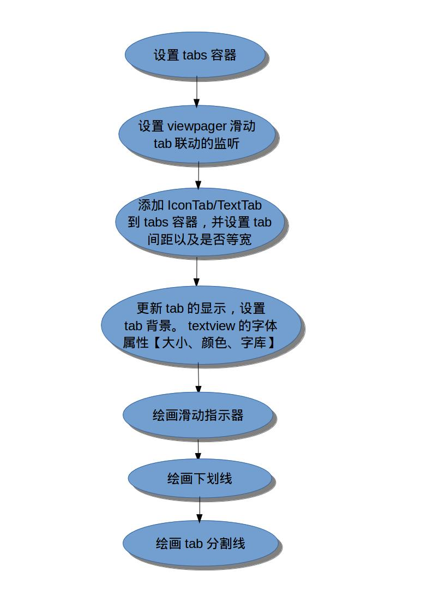
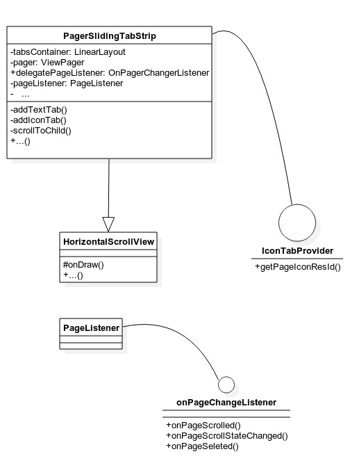

PagerSlidingTabStrip 源码解析
====================================
> 本文为 [Android 开源项目源码解析](http://a.codekk.com) 中 PagerSlidingTabStrip 部分  
 项目地址：[PagerSlidingTabStrip](https://github.com/astuetz/PagerSlidingTabStrip)，分析的版本：[3f4738e](https://github.com/astuetz/PagerSlidingTabStrip/commit/3f4738eca833faeca563d93cd77c8df763a45fb6)，Demo 地址：[PagerSlidingTabStrip Demo](https://github.com/aosp-exchange-group/android-open-project-demo/tree/master/pager-sliding-tab-strip-demo-ayyb1988)  
 分析者：[ayyb1988](https://github.com/ayyb1988)，分析状态：已完成，校对者：[Trinea](https://github.com/Trinea)，校对状态：校对中

### 1. 总体设计
pagerSlidingTabStrip 实现联动效果的原理是，它引用了 ViewPager 的`OnPageChangeListener`。
但是 viewpager 注册的 listener 不是自身的`OnPageChangeListener`，而是 pagerSlidingTabStrip 内部类`PageListener`。
通过`PageListener`实现对对 viewpager 和 tab 的封装。从而实现滑动联动效果。
可以设置 tab 的类型为 textview 还是 icon。对于 textview 可设置字库属性。
通过提供方法如滑动指示器 下划线 tab 风格线 tab 权重等达到自定义的效果。

### 2. 流程图


### 3. 功能介绍
#### 3.1 特性介绍
* 兼容 Android 支持库中的 ViewPager 的一个滑动分页指示器的控件。
* 滑动时实现 TextView 颜色状态的联动
* 支持文字导航指示，可指定选中的 pager 导航字体属性
* 支持图片导航指示，可高亮选中 pager 页导航背景
* 很好的扩展性

#### 3.2 集成及使用指南
##### 3.2.1
在 gradle 中
```java
dependencies {
    compile 'com.astuetz:pagerslidingtabstrip:1.0.1'
}
```
    
##### 3.2.2 在 layout 布局文件中引入 PagerSlidingTabStrip，通常布局在 viewpager 上面。如下：
```java
<com.astuetz.PagerSlidingTabStrip
    android:id="@+id/tabs"
    android:layout_width="match_parent"
    android:layout_height="48dip" />
```
##### 3.2.3 在 oncreate 方法中（或 Fragment 的 onCreateView）中，绑定 PagerSlidingTabStrip 到 Viewpager
```java
 // 初始化 ViewPager 和 Adapter
 ViewPager pager = (ViewPager) findViewById(R.id.pager);
 pager.setAdapter(new TestAdapter(getSupportFragmentManager()));

 // 绑定 PagerSlidingTabStrip 到 ViewPager 上
 PagerSlidingTabStrip tabs = (PagerSlidingTabStrip) findViewById(R.id.tabs);
 tabs.setViewPager(pager);
```

##### 3.2.4 如果你的 view pager 使用到 OnPageChangeListener。你应该通过这个 PagerSlidingTabStrip 控件设置而不是 Viewpager。如下：
```java
     // continued from above
     tabs.setOnPageChangeListener(mPageChangeListener);
```
#### 3.3 用户定制
 根据你的需要修改下面的值
* `pstsIndicatorColor` 滑动指示器的颜色
* `pstsUnderlineColor` 整个 view【PagerSlidingTabStrip】下划线的颜色
* `pstsDividerColor` tabs 之间分割线的颜色
* `pstsIndicatorHeight` 滑动指示器的高度
* `pstsUnderlineHeight` 整个 View【PagerSlidingTabStrip】下滑线的高度
* `pstsDivviderPadding` 分割线上部、下部的内间距
* `pstsTabPaddingLeftRight` 每个 tab 左右内间距
* `pstsScrollOffset` 选中 tab 的滑动的距离
* `pstsTabBackground` 每个 tab 的背景图片，使用 StateListDrawable
* `pstsShouldExpand` 如果设置为 true，每个 tab 的宽度拥有相同的权重
* `pstsTextAllCaps` 如果设置为 true，所有的 tab 字体转为大写


### 4. 详细设计
#### 4.1 类详细介绍


#### 4.2 核心方法及功能介绍
pagerSlidingTabStrip 实现联动效果的原理是，它引用了 ViewPager 的 OnPageChangeListener。但是 viewpager 注册的 listener 不是自身的`OnPageChangeListener`，而是 pagerSlidingTabStrip 内部类`PageListener`。通过 PageListener 实现对对 viewpager 和 tab 的封装。从而实现滑动联动效果。下面结合代码详细说明
```java
 private class PageListener implements OnPageChangeListener {
	
	@Override
	public void onPageScrolled(int position, float positionOffset, int positionOffsetPixels) {
	
	    //当前 view 的位置也即 tab 的位置
	    currentPosition = position;
	    //当前 view 滑动的距离。其中 currentPositionOffset 为 float，介于 0~1 代表相对于 tab 宽偏移的比例
	    currentPositionOffset = positionOffset;
	    //根据上面得到的 view 的位置和偏移位置，来同步 tab 的位置和偏移距离。
	    scrollToChild(position, (int) (positionOffset * tabsContainer.getChildAt(position).getWidth()));
			//重绘 view，实现 tab 滑动的效果。
	    invalidate();
			//下面的 delegatePageListener 就是我们设置的 viewpager.setOnPageChangeListener.而现在把它封装在整个 pagerSlidingTabStrip 中，实现 viewpager 滑动的效果。
	    if (delegatePageListener != null) {
	        delegatePageListener.onPageScrolled(position, positionOffset, positionOffsetPixels);
	    }
	}
	
	@Override
	public void onPageScrollStateChanged(int state) {
		//滑动结束。positionOffset 归零
	    if (state == ViewPager.SCROLL_STATE_IDLE) {
	        scrollToChild(pager.getCurrentItem(), 0);
	    }
	    //调用 viewpager.setOnPageChangeListener
	    if (delegatePageListener != null) {
	        delegatePageListener.onPageScrollStateChanged(state);
	    }
	}
	
	@Override
	public void onPageSelected(int position) {
	//调用 viewpager.setOnPageChangeListener
	    if (delegatePageListener != null) {
	        delegatePageListener.onPageSelected(position);
	    }
	}
	
}
```

scrollToChild，tab 的滑动位置 实现如下：
```java
private void scrollToChild(int position, int offset) {

	if (tabCount == 0) {
	    return;
	}
	
	int newScrollX = tabsContainer.getChildAt(position).getLeft() + offset;
	
	if (position > 0 || offset > 0) {
	    newScrollX -= scrollOffset;
	}
	
	//滑动到的位置。
	if (newScrollX != lastScrollX) {
	    lastScrollX = newScrollX;
	    scrollTo(newScrollX, 0);
	}

}
```

接下来说下 **addTextTab**   **addIconTab**。即 tab 是 text 还是 icon。如果是 icon 的话，通过 viewpager 的 adapter 实现接口`IconTabProvider`。来确定 icontab。
```java
for (int i = 0; i < tabCount; i++) {

    if (pager.getAdapter() instanceof IconTabProvider) {
        addIconTab(i, ((IconTabProvider) pager.getAdapter()).getPageIconResId(i));
    } else {
        addTextTab(i, pager.getAdapter().getPageTitle(i).toString());
    }

}
```

#### 4.3 View 绘制机制
请参考[公共技术点 viewdrawflow](http://a.codekk.com/detail/Android/lightSky/%E5%85%AC%E5%85%B1%E6%8A%80%E6%9C%AF%E7%82%B9%E4%B9%8B%20View%20%E7%BB%98%E5%88%B6%E6%B5%81%E7%A8%8B)部分

在 pagerSlidingTabStrip 中重写了 onDraw 函数
**绘画滑动指示器; 绘画整个 tabs 下划线; 绘画 tab 之间间隔线。**代码如下
```java
 // draw indicator line

        rectPaint.setColor(indicatorColor);

        // default: line below current tab
        View currentTab = tabsContainer.getChildAt(currentPosition);
        float lineLeft = currentTab.getLeft();
        float lineRight = currentTab.getRight();

        // if there is an offset, start interpolating left and right coordinates between current and next tab
        if (currentPositionOffset > 0f && currentPosition < tabCount - 1) {

            View nextTab = tabsContainer.getChildAt(currentPosition + 1);
            final float nextTabLeft = nextTab.getLeft();
            final float nextTabRight = nextTab.getRight();

            lineLeft = (currentPositionOffset * nextTabLeft + (1f - currentPositionOffset) * lineLeft);
            lineRight = (currentPositionOffset * nextTabRight + (1f - currentPositionOffset) * lineRight);
        }

        canvas.drawRect(lineLeft, height - indicatorHeight, lineRight, height, rectPaint);

        // draw underline

        rectPaint.setColor(underlineColor);
        canvas.drawRect(0, height - underlineHeight, tabsContainer.getWidth(), height, rectPaint);

        // draw divider

        dividerPaint.setColor(dividerColor);
        for (int i = 0; i < tabCount - 1; i++) {
            View tab = tabsContainer.getChildAt(i);
            canvas.drawLine(tab.getRight(), dividerPadding, tab.getRight(), height - dividerPadding, dividerPaint);
        }
```
### 
### 5. 杂谈
该库有很好的自定义性和扩展性。比如修改滑动指示器为一张图片【目前为设定颜色值和高度来决定】

### 6.参考文献

[ViewPagerindicator 源码解析](http://a.codekk.com/detail/Android/lightSky/ViewPagerindicator%20%E6%BA%90%E7%A0%81%E8%A7%A3%E6%9E%90)

#### View 的绘制：
1. [How Android Draws Views](http://developer.android.com/guide/topics/ui/how-android-draws.html)
2. [View 绘制流程](http://a.codekk.com/detail/Android/lightSky/%E5%85%AC%E5%85%B1%E6%8A%80%E6%9C%AF%E7%82%B9%E4%B9%8B%20View%20%E7%BB%98%E5%88%B6%E6%B5%81%E7%A8%8B)
3. [ Android View 绘制流程](http://blog.csdn.net/wangjinyu501/article/details/9008271)
4. [Android 中 View 绘制流程以及 invalidate()等相关方法分析](http://blog.csdn.net/qinjuning/article/details/7110211)
5. [Android 中 measure 过程、WRAP_CONTENT 详解以及 xml 布局文件解析流程浅析(下)](http://blog.csdn.net/qinjuning/article/details/8074262)

#### TOUCH 事件处理
1. [View 事件传递](http://a.codekk.com/detail/Android/Trinea/%E5%85%AC%E5%85%B1%E6%8A%80%E6%9C%AF%E7%82%B9%E4%B9%8B%20View%20%E4%BA%8B%E4%BB%B6%E4%BC%A0%E9%80%92)
2. [Andriod 从源码的角度详解 View,ViewGroup 的 Touch 事件的分发机制](http://blog.csdn.net/xiaanming/article/details/21696315)
3. [Android 中 Touch（触屏）事件传递机制](http://blog.csdn.net/wangjinyu501/article/details/22584465)
