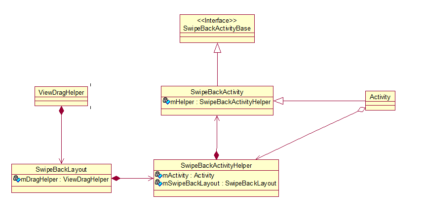
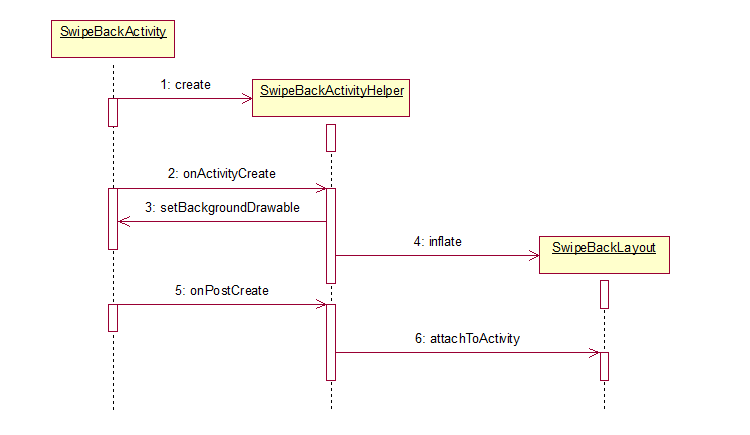

Picasso 源码分析
====================================
> 本文为 [Android 开源项目源码解析](http://a.codekk.com) 中 SwipeBackLayout 部分  
> 项目地址：[SwipeBackLayout](https://github.com/ikew0ng/SwipeBackLayout)，分析的版本：，Demo 地址：
> 分析者：[Neocomb](https://github.com/Neocomb)，分析状态：进行中。校对者：，校对状态：未开始

### 1. 功能介绍
#### 1.1 SwipeBackLayout
	这是一个让你的 Activity 具有滑动返回手势的库
#### 1.2 基本使用
	1. 确保当前 Activity 所使用的主题添加了 <item name="android:windowIsTranslucent">true</item> 来使背景透明
	2. 使 Activity 继承 SwipeBackActivity 

### 2. 总体设计

### 3. 流程图
#### 3.1 使 Activity 透明 ####

	1. 在 SwipeBackActivity 的 onCreate()时，初始化 SwipeBackActivityHelper，并调用其 onActivityCreate()方法
	2. 在 onActivityCreate()中，将 Activity 的背景设置为透明色，并加载 SwipeBackLayout 的布局，辅助实现滑动的效果
	3. 在 SwipeBackActivity 的 onPostCreate()时，在 decorView 和 contentView 之间添加 SwipeBackLayout
        public void attachToActivity(Activity activity) {
        mActivity = activity;
        TypedArray a = activity.getTheme().obtainStyledAttributes(new int[]{
                android.R.attr.windowBackground
        });
        int background = a.getResourceId(0, 0);
        a.recycle();

        ViewGroup decor = (ViewGroup) activity.getWindow().getDecorView();
        ViewGroup decorChild = (ViewGroup) decor.getChildAt(0);
        decorChild.setBackgroundResource(background);
        decor.removeView(decorChild);
        addView(decorChild);
        setContentView(decorChild);
        decor.addView(this);
    }

#### 3.2 处理触摸事件####
>SwipeBackLayout 继承于 FrameLayout，然后搭配专门处理拖拽事件的 ViewDragHelper，完成整个 Activity 的手势效果。
>在较高版本的 Support-v4 包下，有提供 ViewDragHelper，但是作者并没有使用，而是自定义了一个 ViewDragHelper，功能类似。
>使用 ViewDragHelper 主要是实现 ViewDragHelper.Callback 的一个回调，同时将 touch 事件交递给 ViewDragHelper 处理。

SwipeBackLayout.java:

	- View 的事件处理
	@Override
    public boolean onInterceptTouchEvent(MotionEvent event) {
        if (!mEnable) {
            return false;
        }
        try {
            return mDragHelper.shouldInterceptTouchEvent(event);
        } catch (ArrayIndexOutOfBoundsException e) {
            // FIXME: handle exception
            // issues #9
            return false;
        }
    }

    @Override
    public boolean onTouchEvent(MotionEvent event) {
        if (!mEnable) {
            return false;
        }
        mDragHelper.processTouchEvent(event);
        return true;
    }

	- Callback 实现
		//判断当前 View 是否可以拖拽并且是否是可拖拽的边缘
		@Override
		public boolean tryCaptureView(View view, int pointId) {
            boolean ret = mDragHelper.isEdgeTouched(mEdgeFlag, i);
            if (ret) {
                if (mDragHelper.isEdgeTouched(EDGE_LEFT, i)) {
                    mTrackingEdge = EDGE_LEFT;
				...
        }

		//返回指定 View 在横向上能滑动的最大距离，大于 0 即可滑动
        @Override
        public int getViewHorizontalDragRange(View child) {
            return mEdgeFlag & (EDGE_LEFT | EDGE_RIGHT);
        }

		//返回指定 View 在纵向上能滑动的最大距离，大于 0 即可滑动
        @Override
        public int getViewVerticalDragRange(View child) {
            return mEdgeFlag & EDGE_BOTTOM;
        }

		//当 Activity 的位置发生改变时调用，计算滑动完成的百分比，当超出阀值时，finish 掉 Activity
        @Override
        public void onViewPositionChanged(View changedView, int left, int top, int dx, int dy) {
            super.onViewPositionChanged(changedView, left, top, dx, dy);
            if ((mTrackingEdge & EDGE_LEFT) != 0) {
                mScrollPercent = Math.abs((float) left
                        / (mContentView.getWidth() + mShadowLeft.getIntrinsicWidth()));
           ...

            if (mScrollPercent >= 1) {
                if (!mActivity.isFinishing())
                    mActivity.finish();
            }
        }

		//当 Activity 拖拽被释放时调用，判断当 Activity 的拖拽结束时的位置，使 Activity 复原或者移出屏幕
		//xvel,yvel 分别为松开时，Activity 在 x 和 y 方向上的速度
        @Override
        public void onViewReleased(View releasedChild, float xvel, float yvel) {
            final int childWidth = releasedChild.getWidth();
            final int childHeight = releasedChild.getHeight();

            int left = 0, top = 0;
            if ((mTrackingEdge & EDGE_LEFT) != 0) {
                left = xvel > 0 || xvel == 0 && mScrollPercent > mScrollThreshold ? childWidth
                        + mShadowLeft.getIntrinsicWidth() + OVERSCROLL_DISTANCE : 0;
     		...

            mDragHelper.settleCapturedViewAt(left, top);
            invalidate();
        }

		//计算 Activity 在水平方向上滑动的偏移，left 为上一次的偏移，dx 为本次偏移量
        @Override
        public int clampViewPositionHorizontal(View child, int left, int dx) { ...  }

        @Override
        public int clampViewPositionVertical(View child, int top, int dy) {
            int ret = 0;
            if ((mTrackingEdge & EDGE_BOTTOM) != 0) {
                ret = Math.min(0, Math.max(top, -child.getHeight()));
            }
            return ret;
        }

		//通知 Activity 的状态发生变化
        @Override
        public void onViewDragStateChanged(int state) {
            super.onViewDragStateChanged(state);
            if (mListeners != null && !mListeners.isEmpty()) {
                for (SwipeListener listener : mListeners) {
                    listener.onScrollStateChange(state, mScrollPercent);
                }
            }
        }

#### 参考 ####
[Touch 事件传递](http://codekk.com/blogs/detail/54cfab086c4761e5001b253e)  
[http://blog.csdn.net/shaw1994/article/details/44536667](http://blog.csdn.net/shaw1994/article/details/44536667)