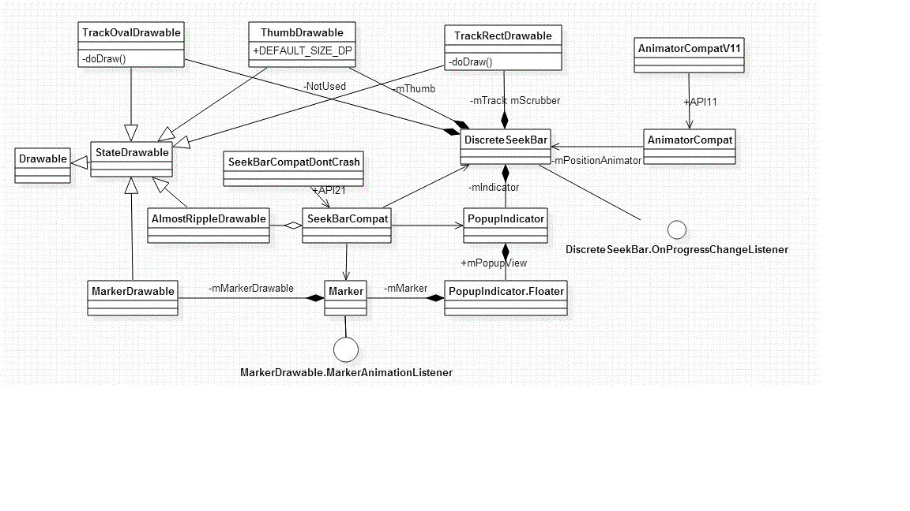

DiscreteSeekBar 源码解析
====================================
> 本文为 [Android 开源项目源码解析](http://a.codekk.com) 中 DiscreteSeekBar 部分  
> 项目地址：[discreteSeekBar](https://github.com/AnderWeb/discreteSeekBar)，分析的版本：[f54f0cd6](https://github.com/AnderWeb/discreteSeekBar/commit/f54f0cd64cd33da9effe9103d80bcc408178d171 "Commit id is f54f0cd64cd33da9effe9103d80bcc408178d171")，Demo 地址：[discrete-seek-bar-demo](https://github.com/aosp-exchange-group/android-open-project-demo/tree/master/discrete-seek-bar-demo)    
> 分析者：[wangeason](https://github.com/wangeason)，分析状态：已完成，校对者：[Trinea](https://github.com/trinea)，[huxian99](https://github.com/huxian99) 校对状态：未开始   

### 1. 功能介绍  

DiscreteSeekBar 实现了类似 Material design 风格的 Discrete Slider。DiscreteSeekBar 可以在 2.1 以上的应用中使用，可以直接在 xml 中配置，使用方法类似 SeekBar，很简单。

可以在 xml 中配置显示的格式，也可以在代码中自定义显示的数字或者指定显示字符。

### 2. 总体设计

这是一个材料设计的 seekbar，其主要的几个类分别对应了这个 seekbar 的几个主要组件。

ThumbDrawable -> seekBar 没有被按下时，seekBar 上的那个圆点；

TrackRectDrawable -> seekBar 的进度条，设置不同的宽度和颜色后，被用作背景和前景的显示；

MarkerDrawable -> Thumb 被按下时的显示状态的背景，这个类里面封装了动画打开和关闭，提供了颜色设置的接口；

Marker -> 是个 ViewGroup，包含一个 TextView 和一个 MarkerDrawable。Thumb 被按下时的显示状态, 增加了文字显示，宽度计算等，实现了文本设置的接口；

PopupIndicator.Floater -> FrameLayout, 封装了一个 Marker 在里面，实现 Marker 的滑动；

PopupIndicator -> 最终被集成到 DiscreteSeekBar 类，保证 Floater 始终和 Thumb
的 x 坐标相同；

DiscreteSeekBar -> 集成了上述的组件的实例、OnProgressChangeListener 接口、从 xml 中获取设置、提供 api 方法。总之就是让这个 View 看着像一个 SeekBar；

### 3. 详细设计  
### 3.1 类关系图



### 3.2 核心类功能介绍  
#### 3.2.1 StateDrawable  
抽象类 StateDrawable 继承自 Drawable，根据状态切换 Drawable 的颜色
```java
//根据状态判断是否应该刷新当前的色彩
private boolean updateTint(int[] state)
//抽象方法，具体的子类实现具体的画法
abstract void doDraw(Canvas canvas, Paint paint);
```

#### 3.2.2 AlmostRippleDrawable  
继承自抽象类 StateDrawable，顾名思义，总是有 Ripple 效果。  
通过一个 mUpdater 的 Runnable 对象，不断地做 drawCircle，来达到低版本的 Ripple 效果。  

#### 3.2.3 MarkerDrawable  
```java
private void computePath(Rect bounds)
```  
这个 Marker 实际是用 path 画了一个 3 个圆角，一个直角的正方形, 再用 Matrix 调整它的角度和相对位置。 把这个动画的完成度作为入参来调整这个图形，完成从圆形到 marker 的变化。

```java
public void animateToPressed()
```  
动画变换到 marker，动画完成时，调用打开完成的接口 MarkerAnimationListener.onOpeningComplete  

```java
public void animateToNormal()
```  
动画变换到关闭状态，动画完成时，调用关闭完成的接口 MarkerAnimationListener.onClosingComplete

```java
private void updateAnimation(float factor)
```  
根据开始动画的时间和动画的方向计算动画的完成度，并调用 computePath 方法画 Marker  

```java
private static int blendColors(int color1, int color2, float factor)
```  
根据设置的开始和结束颜色，还有动画完成度，调出当前颜色，注意：这里的 factor 和 updateAnimation 中的 factor 不一样，已经是计算结果了。

#### 3.2.4 ThumbDrawable

seekBar 上的圆形按钮，在按下以后调用 animateToPressed,100ms 以后不会再绘制，直到再次调用 animateToNormal，因为按下以后会绘制 marker。 这里有个疑问为什么要在 100ms 以后，作者的解释是：This special delay is meant to help avoiding frame glitches while the Marker is added to the Window。 这 100ms 用来绘制 Marker，避免同时绘制 Thumb 出现掉帧，感觉卡顿。

#### 3.2.5 TrackRectDrawable
绘制矩形，用来画 ProgressBar 和 Track

#### 3.2.6 TrackOvalDrawable
没有调用和实现，应该是作者准备用来做圆形 seekBar 的。

#### 3.2.7 Marker
```java
public void resetSizes(String maxValue)
```  
这个方法根据 seekbar 的最大值来确定 marker 的宽度，如果有负数的时候会出现 bug，如果改成最大和最小值中的最大位数就不会可以在显示整数的时候避免这个问题。  

```java
public void animateOpen()
```
在 onAttachedToWindow()被调用，动画打开 Marker。同时 PopupIndicator 中的 showIndicator()和 invokePopup()都会调用该方法。  

```java
public void animateClose()
```
在 PopupIndicator 中被调用，动画关闭 Marker，并设置 mNumber 为 INVISIBLE。  

```java
public void setColors(int startColor, int endColor)
```  
设置 MarkerDrawable 的动画开始和结束时的颜色。  

#### 3.2.8 Floater  
PopupIndicator 的内部类，用来实现 Marker 的滑动
```java
public void setFloatOffset(int x)
```  
通过设置 childview 的 Marker 的左右偏移，来实现 Floater 的滑动，被 PopupIndicator 调用，实现 Marker 的滑动。

<Li>MarkerAnimationListener 的实现  
在 onClosingComplete()中，把 PopupIndicator 中的 Floater 删除了。  

#### 3.2.9 PopupIndicator  
用来管理 Floater 的指示器  
```java
public void updateSizes(String maxValue)
```  
主要调用 Marker 的 resetSizes(String maxValue)方法，来确定 Marker 的宽度。  

```java
private void measureFloater()
```  
通过调用 Floater 的 measure 方法，设置其宽度为 full-width，作者说这里有待改进

```java
public void setValue(CharSequence value)
```  
设置 Marker 的 TextView 值  

```java
public void showIndicator(View parent, Rect touchBounds)
```  
在指定位置显示出 Indicator，Rect touchBounds 为 DiscreteSeekBar 传入的 Thumb 的 Bounds。在 DiscreteSeekBar 的 showFloater()中调用。

```java
private WindowManager.LayoutParams createPopupLayout(IBinder token)  
private void updateLayoutParamsForPosiion(View anchor, WindowManager.LayoutParams p, int yOffset)  
```
创建和编辑 Floater 的 LayoutParams  

```java
private void invokePopup(WindowManager.LayoutParams p)
```  
添加 Floater，动画打开 Marker  

#### 3.2.10 DiscreteSeekBar  
onTouchEvent 事件主要调用了如下三个方法  
```java
private boolean startDragging(MotionEvent ev, boolean ignoreTrackIfInScrollContainer)
private void updateDragging(MotionEvent ev)
private void stopDragging()
```  
顾名思义，这 3 个方法主要就是为了`拖动 Thumb`的。  

```java
public interface OnProgressChangeListener
```  
用户实现，监听 DiscreteSeekBar 数值变化  

```java
public static abstract class NumericTransformer {
    public abstract int transform(int value);

    public String transformToString(int value) {
        return String.valueOf(value);
    }

    public boolean useStringTransform() {
        return false;
    }
}
```  
其中抽象方法 public abstract int transform(int value)根据 DiscreteSeekBar 的数值 value，返回要在 Marker 中显示的数值，而且这个返回的数值会被设置的正则 Formatter 转换，默认的 Formatter 是 DEFAULT_FORMATTER = "%d"，这个 Formatter 可以通过 setIndicatorFormatter 方法或者 xml 设置

useStringTransform()方法默认返回 false，调用 transform(int value)方法根据 Formatter 转换，如果 return true，则会调用 transformToString(int value)方法，表示这个字符不会被 Formatter 转换。  

```java
public void setNumericTransformer
```  
设置 Transformer，并刷新 Marker 上的显示

```java
public void setMax(int max) 
public void setMin(int min)
```  
这两个方法用来设置 DiscreteSeekBar 的最大最小值，并且刷新如果用按键控制 SeekBar 时的步进值。

```java
public void setProgress(int progress)  
```  
设置进度，其中检查了这个 progress，使它过大和过小时都能正常运行

```java
private void notifyProgress(int value, boolean fromUser)
```
调用 onProgressChanged 接口，并且调用一个空的方法 onValueChanged，当有 DiscreteSeekBar 的继承类的时候，可以复写 onValueChanged，而不必实现 onProgressChanged。

```java
private void notifyBubble(boolean open)
```
作用类似于 onValueChanged，只不过这个监听的是 Floater、Marker 的消失和显示

```java
private void updateFromDrawableState()
```  
根据 Drawable 的状态来设置不同 drawable 的动画。这个方法被 onLayout 和 drawableStateChanged 调用。  

```java
private void updateThumbPos(int posX)
```  
根据滑动的拖动的位置绘制进度条（mScruber）和 mThumb  

### 4. 杂谈
1. Marker 的宽度的设定太死板，当设定的 min 值得长度大于 max 值得时候 min 值就没法完整显示了。
2. 进度条上没有标记点，可以考虑在背景 trackBar 上设置一些点，这些点着重突出出来，在 scruber 滑过这些点的时候，出一些效果。这个我准备完成以后再和大家分享。


