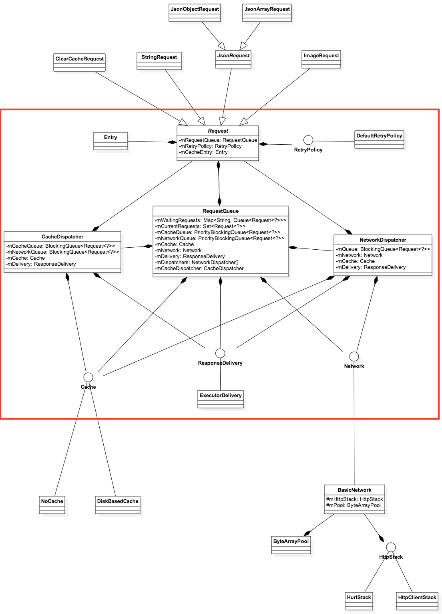

Volley 实现原理解析
====================================
> 本文为 [Android 开源项目实现原理解析](https://github.com/android-cn/android-open-project-analysis) 中 Volley 部分  
> 项目地址：[Volley](https://android.googlesource.com/platform/frameworks/volley/)，分析的版本：[35ce778](https://android.googlesource.com/platform/frameworks/volley/+/35ce77836d8e1e951b8e4b2ec43e07fb7336dab6)，Demo 地址：[Volley Demo](https://github.com/android-cn/android-open-project-demo/tree/master/volley-demo)    
> 分析者：[grumoon](https://github.com/grumoon)，校对者：[huxian99](https://github.com/huxian99)，校对状态：未完成   


###1. 功能介绍  
Volley是Google推出的Android异步网络调用框架和图片加载框架。在Google I/O 2013大会上发布。
> 名字由来：a burst or emission of many things or a large amount at once  
> 发布演讲时候的配图  
> 

从名字由来和配图中无数急促的火箭可以看出Volley的特点：特别适合**数据量小，通信频繁**的网络操作。（个人认为Android应用中绝大多数的网络操作都属于这种类型）。

**Volley的主要特点**
> 1.默认Android2.3及以上基于HttpURLConnection，2.3以下使用基于HttpClient  
> 2.符合Http **缓存语义** 的缓存机制  
> 3.请求队列的优先级排序  
> 4.提供多样的取消机制  
> 5.提供简便的图片加载工具  

###2. 总体设计
和所有的网络调用框架一样，Volley实现了**主线程发起函数调用，工作线程处理网络请求，请求结果返回主线程回调**的过程。  
具体请参照`3. 流程图`，`4.1 类关系图`以及`4.2.3 RequestQueue.java`，`4.2.4 CacheDispatcher.java `，`4.2.5 NetworkDispatcher.java `中的流程图。  

###3. 流程图
Volley请求流程图  
  
> **上图是Volley请求时的流程图，在Volley的发布演讲中给出，我在这里将其用中文重新画出。**   

###4. 详细设计

###4.1 类关系图
  
这是Volley框架的主要类关系图    
> 图中**红色圈内**的部分，组成了Volley框架的核心，围绕RequestQueue类，将各个功能点以**组合**的方式结合在了一起。各个功能点也都是以**接口**或者**抽象类**的形式提供。  
> 红色圈外面的部分，在Volley源码中放在了toolbox包中，作为Volley为各个功能点提供的默认的具体实现。    
> 通过类图我们看出，Volley有着非常好的拓展性。通过各个功能点的接口，我们可以给出自定义的，更符合我们需求的具体实现。
> 
> **多用组合，少用继承;针对接口编程，不针对具体实现编程。**  
>   
> **优秀框架的设计，令人叫绝，受益良多。**

 

###4.2 核心类功能介绍
####4.2.1 Volley.java 
这个和Volley框架同名的类，其实是个工具类。作用是帮助构建一个RequestQueue对象。有两个重载的静态方法。  
```java
public static RequestQueue newRequestQueue(Context context)

public static RequestQueue newRequestQueue(Context context, HttpStack stack)
```
第一个方法的实现调用第二个方法，传HttpStack参数为null。  
第二个方法中，如果HttpStatck为null，则默认情况下如果系统版本大于等于9，采用基于UrlConnection的HurlStack，如果小于9，采用基于HttpClient的HttpClientStack。  
```java
if (stack == null) {
    if (Build.VERSION.SDK_INT >= 9) {
        stack = new HurlStack();
    } else {
        stack = new HttpClientStack(AndroidHttpClient.newInstance(userAgent));
    }
}
```

得到了HttpStack,然后通过它构造一个代表网络（Network）的具体实现BasicNetwork。  
接着构造一个代表缓存（Cache）的基于Disk的具体实现DiskBasedCache。  
最后将网络（Network）对象和缓存（Cache）对象传入构建一个RequestQueue，启动这个RequestQueue，并返回。
```java
Network network = new BasicNetwork(stack);
RequestQueue queue = new RequestQueue(new DiskBasedCache(cacheDir), network);
queue.start();
return queue;
```
> 我们平时大多采用`Volly.newRequestQueue(context)`的默认实现，构建RequestQueue。  
> 通过源码可以看出，我们可以抛开Volley工具类构建自定义的RequestQueue，采用自定义的HttpStatck，采用自定义的Network实现，采用自定义的Cache实现等来构建RequestQueue。  
**优秀框架的高可拓展性的魅力来源于此啊**

####4.2.2 Request.java
代表一个网络请求的抽象类。我们通过构建Request类的具体实现（StringRequest,JsonRequest,ImageRequest等），并将其加入到RequestQueue中来完成网络请求操作。  
Volley支持8个http请求方法**GET,POST,PUT,DELETE,HEAD,OPTIONS,TRACE,PATCH**  
Request类中包含了，请求url，请求方法，请求Header，请求Body，请求的优先级等信息。  

**因为是抽象类，子类必须重写的两个方法。**  
```java
abstract protected Response<T> parseNetworkResponse(NetworkResponse response);
```
子类重写此方法，将网络返回的原生字节内容，转换成合适的类型。此方法会在工作线程中被调用。


```java
abstract protected void deliverResponse(T response);
```
子类重写此方法，将解析成合适类型的内容传递给它们的监听回调。

**以下两个方法也经常会被重写**
```java
protected Map<String, String> getParams()
```
重写这个方法，可构建用于POST、PUT、PATCH的键值对Body内容。
```java
public byte[] getBody()
```
重写此方法，可以构建用于POST、PUT、PATCH的字节Body内容。


####4.2.3 RequestQueue.java
Volley框架的核心类，将请求Request加入到一个运行的RequestQueue中，来完成请求操作。
####(1)主要成员变量
RequestQueue中维护了两个**基于优先级**的Request队列，缓存请求队列和网络请求队列。  
放在缓存请求队列中的Request，将通过缓存获取数据；放在网络请求队列中的Request，将通过网络获取数据。  
```java
private final PriorityBlockingQueue<Request<?>> mCacheQueue = new PriorityBlockingQueue<Request<?>>();
private final PriorityBlockingQueue<Request<?>> mNetworkQueue = new PriorityBlockingQueue<Request<?>>();
```
维护了一个已经加入到RequestQueue中，并且还没有完成的请求集合。   
```java
private final Set<Request<?>> mCurrentRequests = new HashSet<Request<?>>();
```
维护了一个等待请求的集合  
如果一个请求正在被处理并且可以被缓存，后续的相同url的请求，将进入等待队列。  
```java
private final Map<String, Queue<Request<?>>> mWaitingRequests = new HashMap<String, Queue<Request<?>>>();
```

####(2)启动队列
创建出RequestQueue以后，调用start方法，启动队列。  

```java
/**
 * Starts the dispatchers in this queue.
 */
public void start() {
    stop();  // Make sure any currently running dispatchers are stopped.
    // Create the cache dispatcher and start it.
    mCacheDispatcher = new CacheDispatcher(mCacheQueue, mNetworkQueue, mCache, mDelivery);
    mCacheDispatcher.start();

    // Create network dispatchers (and corresponding threads) up to the pool size.
    for (int i = 0; i < mDispatchers.length; i++) {
        NetworkDispatcher networkDispatcher = new NetworkDispatcher(mNetworkQueue, mNetwork,
                mCache, mDelivery);
        mDispatchers[i] = networkDispatcher;
        networkDispatcher.start();
    }
}
```
start方法，开启一个**缓存调度线程**和默认的4个**网络调度线程**。  
缓存调度线程不断的从缓存请求队列中取出Request去处理，网络调度线程不断的从网络请求队列中取出Request去处理。
####(3)加入请求
```java
public <T> Request<T> add(Request<T> request);
```
流程图如下：  

####(4)请求完成
```java
void finish(Request<?> request)
```
完成参数所传入的请求  
> 1）首先在当前请求集合`mCurrentRequests`中移除所传请求。  
> 2）然后如果所传请求存在等待队列，则将等待队列移除，将等待队列所有的请求添加到缓存请求队列中。  

####(5)请求取消
```java
public void cancelAll(RequestFilter filter)
public void cancelAll(final Object tag)
```
取消当前请求集合中所有符合条件的请求   

####4.2.4 CacheDispatcher.java
缓存调度线程类，不断的从缓存请求队列中取出Request去处理。  
####(1)成员变量
`BlockingQueue<Request<?>> mCacheQueue` 缓存请求队列  
`BlockingQueue<Request<?>> mNetworkQueue` 网络请求队列  
`Cache mCache` 缓存类，代表了一个可以获取请求结果，存储请求结果的缓存  
`ResponseDelivery mDelivery` 请求结果传递类  
####(2)处理流程图

####4.2.5 NetworkDispatcher.java
网络调度线程类，不断的从网络请求队列中取出Request去处理。
####(1)成员变量
`BlockingQueue<Request<?>> mQueue` 网络请求队列  
`Network mNetwork` 网络类，代表了一个可以执行请求的网络  
`Cache mCache`  缓存类，代表了一个可以获取请求结果，存储请求结果的缓存  
`ResponseDelivery mDelivery` 请求结果传递类，可以传递请求的结果或者错误到调用者  
####(2)处理流程图  


####4.2.6 Cache.java
缓存接口，代表了一个可以获取请求结果，存储请求结果的缓存。
####(1)主要方法：  
`public Entry get(String key);` 通过key获取请求的缓存实体  
`public void put(String key, Entry entry);` 存入一个请求的缓存实体  
`public void remove(String key);` 移除指定的缓存实体  
`public void clear();` 清空缓存  
####(2)代表缓存实体的内部类Entry
成员变量和方法  
`byte[] data` 请求返回的数据（Body实体）  
`String etag` Http响应首部中用于缓存新鲜度验证的ETag  
`long serverDate` Http响应首部中的响应产生时间  
`long ttl` 缓存的过期时间  
`long softTtl` 缓存的新鲜时间  
`Map<String, String> responseHeaders` 响应的Headers  
`boolean isExpired()` 判断缓存是否过期，过期缓存不能继续使用  
`boolean refreshNeeded()` 判断缓存是否新鲜，不新鲜的缓存需要发到服务端做新鲜度的检测  
####4.2.7 DiskBasedCache.java
继承Cache类，基于Disk的缓存实现类
####4.2.8 NoCache.java
继承Cache类，不做任何操作的缓存实现类

####4.2.9 Network.java
代表网络的接口  
唯一的方法，用于执行特定请求  
```java
public NetworkResponse performRequest(Request<?> request) throws VolleyError;
```
####4.2.10 NetworkResponse.java
Network中方法performRequest的返回值。  
封装了网络请求响应的StatusCode，Headers和Body等。  
成员变量：  
`int statusCode` Http响应状态码  
`byte[] data` Body数据  
`Map<String, String> headers` 响应Headers  
`boolean notModified` 表示是否为304响应  
`long networkTimeMs` 请求耗时  
####4.2.11 BasicNetwork.java
继承Network，Volley中默认的网络接口实现类  
主要实现了以下功能：  
1）利用HttpStack执行网络请求。  
2）如果Request中带有实体信息，如Etag,Last-Modify等，则进行缓存新鲜度的验证，并处理304（Not Modify）响应。  
3）如果发生超时，认证失败等错误，进行重试操作。


####4.2.12 HttpStack.java
代表基于http的网络的接口  
唯一方法，执行请求  
```java
public HttpResponse performRequest(Request<?> request, Map<String, String> additionalHeaders)
        throws IOException, AuthFailureError;
```
执行request代表的请求，第二个参数表示发起请求之前，添加额外的请求Headers
####4.2.13 HttpClientStack.java
继承HttpStack，基于HttpClient的实现类
####4.2.14 HurlStack.java
继承HttpStack，基于urlconnection的实现类

####4.2.15 Response.java
封装了经过解析后的数据，用于传输。
####4.2.16 ByteArrayPool.java
byte[] 的回收池，用于byte[]的回收再利用，减少了内存的分配和回收。  
```java
public synchronized void returnBuf(byte[] buf)
```
将用过的byte[]回收，根据byte[]长度按照从小到大的排序将byte[]放入到一个`ArrayList`中。  
```java
public synchronized byte[] getBuf(int len)
```
获取byte[]，遍历`ArrayList`池，找出第一个长度大于传入参数`len`的byte[]，并返回；如果最终没有合适的byte[]，new一个返回。  
**Volley提高性能的优化之一**
####4.2.17 PoolingByteArrayOutputStream.java
继承ByteArrayOutputStream，使用了ByteArrayPool获取Byte[]来提高性能。

####4.2.18 HttpHeaderParser.java
Http header的解析工具类  
有三个方法  
```java
public static long parseDateAsEpoch(String dateStr)
```
解析时间，将RFC1123的时间格式，解析成epoch时间

```java
public static String parseCharset(Map<String, String> headers)
```
解析编码集，在Content-Type首部中获取编码集，如果没有找到，默认返回ISO-8859-1

```java
public static Cache.Entry parseCacheHeaders(NetworkResponse response)
```
**比较重要的方法**，通过网络响应中的缓存控制Header和Body内容，构建缓存实体。  
1）根据Date首部，获取响应生成时间  
2）根据ETag首部，获取响应实体标签  
3）根据Cache－Control和Expires首部，计算出缓存的过期时间，和缓存的新鲜度时间

>两点需要说明下：  
>1.没有处理`Last-Modify`首部，而是处理存储了`Date`首部，并在后续的新鲜度验证时，使用`Date`来构建`If-Modified-Since`。
>这与Http 1.1的语义有些违背。  
>2.计算过期时间，Cache－Control首部优先于Expires首部。

####4.2.19 RetryPolicy.java
重试策略接口  
有三个方法：  
```java
public int getCurrentTimeout();
```
获取当前请求用时（用于Log）
```java
public int getCurrentRetryCount();
```
获取已经重试的次数（用于Log）
```java
public void retry(VolleyError error) throws VolleyError;
```
为下一次请求做准备
####4.2.20 DefaultRetryPolicy.java
继承RetryPolicy，Volley默认的重试策略实现类。
####4.2.21 ResponseDelivery.java
请求结果的传输接口，用于传递请求结果或者请求错误。  
有三个方法：  
```java
public void postResponse(Request<?> request, Response<?> response);
```
此方法用于传递请求结果。  
```java
public void postResponse(Request<?> request, Response<?> response, Runnable runnable);
```
此方法用于传递请求结果，Runnable将在传输完成后执行。
```java
public void postError(Request<?> request, VolleyError error);
```
此方法用于传输请求错误。
####4.2.22 ExecutorDelivery.java
请求结果传输接口具体实现类。  
利用Handler将缓存调度线程或者网络调度线程中产生的请求结果和请求错误传输到主线程的回调函数中。
####4.2.23 StringRequest.java
继承Request类,代表了一个返回值为String的请求。将网络返回的结果数据解析为String类型。
####4.2.24 JsonRequest.java
抽象类，继承自Request，代表了JSON请求。提供了构建JSON请求参数的方法。
####4.2.25 JsonObjectRequest.java
继承自JsonRequest，将网络返回的结果数据解析为JSONObject类型。
####4.2.26 JsonArrayRequest.java
继承自JsonRequest，将网络返回的结果数据解析为JSONArray类型。
####4.2.27 ImageRequest.java
继承Request类,代表了一个返回值为Image的请求。将网络返回的结果数据解析为Bitmap类型。  
可以设置请求图片的最大宽度和最大高度。  
####4.2.28 ImageLoader.java
封装了ImageRequst的方便使用的图片加载工具类。 
>1.可以设置自定义的`ImageCache`，可以是内存缓存，也可以是Disk缓存，将获取的图片缓存起来，重复利用，减少请求。    
>2.可以定义图片请求过程中显示的图片和请求失败后显示的图片。  
>3.相同请求（相同地址，相同大小）只发送一个，可以避免重复请求。  

####4.2.29 NetworkImageView.java
利用ImageLoader，可以加载网络图片的ImageView  
有三个公开的方法：  
```java
public void setDefaultImageResId(int defaultImage)
```
设置默认图片，加载图片过程中显示。  
```java
public void setErrorImageResId(int errorImage)
```
设置错误图片，加载图片失败后显示。  
```java
public void setImageUrl(String url, ImageLoader imageLoader)
```
设置网络图片的Url和ImageLoader，将利用这个ImageLoader去获取网络图片。  
>如果有新的图片加载请求，会把这个ImageView上旧的加载请求取消。

####4.2.30 ClearCacheRequest.java
用于人为清空Http缓存的请求  
添加到RequestQueue后能很快执行，因为优先级很高，为`Priority.IMMEDIATE`  
并且清空缓存的方法`mCache.clear()`写在了`isCanceled()`方法体中，能最早的得到执行。
####4.2.31 Authenticator.java
Http认证交互接口，用于基本认证或者摘要认证
####4.2.32 AndroidAuthenticator.java
继承Authenticator，基于Android AccountManager的认证交互实现类
####4.2.33 VolleyLog.java
Volley的Log工具类
####4.2.34 VolleyError.java
Volley中所有错误异常的父类，继承自Exception，可通过此类设置和获取NetworkResponse或者请求的耗时。
####4.2.35 AuthFailureError.java
继承自VelleyError，代表认证失败错误。
####4.2.36 NetworkError.java
继承自VolleyError，代表网络错误。
####4.2.37 ParseError.java
继承自VolleyError，代表内容解析错误。
####4.2.38 ServerError.java
继承自VolleyError，代表服务端错误。
####4.2.39 TimeoutError.java
继承自VolleyError，代表请求超时错误。
####4.2.40 NoConnectionError.java
继承自NetworkError，代表无法建立连接错误。  


###5. 杂谈
#### 关于Http缓存
Volley构建了一套相对完整的符合Http语义的缓存机制。
    
**优点和特点**   
（1）根据`Cache-Control`和`Expires`首部来计算缓存的过期时间。如果两个首部都存在情况下，以`Cache-Control`为准。  
（2）利用`If-None-Match`和`If-Modified-Since`对过期缓存或者不新鲜缓存，进行请求再验证，并处理304响应，更新缓存。  
（3）默认的缓存实现，将缓存以文件的形式存储在Disk，程序退出后不会丢失。

**我个人认为的不足之处**  
缓存的再验证方面，在构建`If-Modified-Since`请求首部时，Volley使用了服务端响应的`Date`首部，没有使用`Last-Modified`首部。整个框架没有使用`Last-Modified`首部。这与Http语义不符。    
```java   
private void addCacheHeaders(Map<String, String> headers, Cache.Entry entry) {
    // If there's no cache entry, we're done.
    if (entry == null) {
        return;
    }

    if (entry.etag != null) {
        headers.put("If-None-Match", entry.etag);
    }

    if (entry.serverDate > 0) {
        Date refTime = new Date(entry.serverDate);
        headers.put("If-Modified-Since", DateUtils.formatDate(refTime));
    }
}
```
服务端根据请求时通过`If-Modified-Since`首部传过来的时间，判断资源文件是否在`If-Modified-Since`时间 **以后** 有改动，如果有改动，返回新的请求结果。如果没有改动，返回304 not modified。  
`Last-Modified`代表了资源文件的最后修改时间。通常使用这个首部构建`If-Modified-Since`的时间。  
`Date`代表了响应产生的时间，正常情况下`Date`时间在`Last-Modified`时间之后。也就是`Date`>=`Last-Modified`。  
通过以上原理，既然`Date`>=`Last-Modified`。那么我利用`Date`构建，也是完全正确的。  
  
**可能的问题出在服务端的Http实现上，如果服务端完全遵守Http语义，采用时间比较的方式来验证`If-Modified-Since`，判断服务器资源文件修改时间是不是在`If-Modified-Since`之后。那么使用`Date`完全正确。**   
**可是有的服务端实现不是比较时间，而是直接的判断服务器资源文件修改时间，是否和`If-Modified-Since`所传时间相等。这样使用`Date`就不能实现正确的再验证，因为`Date`的时间总不会和服务器资源文件修改时间相等。**  

尽管使用`Date`可能出现的不正确情况，归结于服务端没有正确的实现Http语义。  
**但我还是希望Volley也能完全正确的实现Http语义，至少同时处理`Last-Modified`和`Date`,并且优先使用`Last-Modified`。**

 
 
