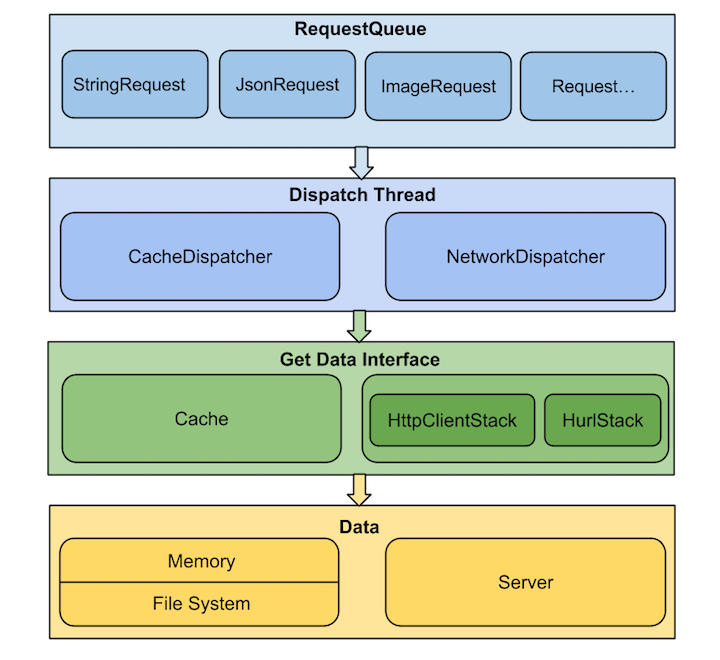

Volley 源码解析
====================================
> 本文为 [Android 开源项目源码解析](https://github.com/android-cn/android-open-project-analysis) 中 Volley 部分  
> 项目地址：[Volley](https://android.googlesource.com/platform/frameworks/volley/)，分析的版本：[35ce778](https://android.googlesource.com/platform/frameworks/volley/+/35ce77836d8e1e951b8e4b2ec43e07fb7336dab6)，Demo 地址：[Volley Demo](https://github.com/android-cn/android-open-project-demo/tree/master/volley-demo)    
> 分析者：[grumoon](https://github.com/grumoon)，校对者：[huxian99](https://github.com/huxian99)、[Trinea](https://github.com/trinea)，校对状态：完成   

###1. 功能介绍  
####1.1. Volley  
Volley 是 Google 推出的 Android 异步网络请求框架和图片加载框架。在 Google I/O 2013 大会上发布。
> 名字由来：a burst or emission of many things or a large amount at once  
> 发布演讲时候的配图  
> 

从名字由来和配图中无数急促的火箭可以看出 Volley 的特点：特别适合**数据量小，通信频繁**的网络操作。（个人认为 Android 应用中绝大多数的网络操作都属于这种类型）。

####1.2 Volley 的主要特点
(1). 扩展性强。Volley 中大多是基于接口的设计，可配置性强。  
(2). 一定程度符合 Http 规范，包括返回 ResponseCode(2xx、3xx、4xx、5xx）的处理，请求头的处理，缓存机制的支持等。并支持重试及优先级定义。  
(3). 默认 Android2.3 及以上基于 HttpURLConnection，2.3 以下基于 HttpClient 实现，这两者的区别及优劣在`4.2.1 Volley`中具体介绍。  
(4). 提供简便的图片加载工具。  

###2. 总体设计
####2.1. 总体设计图  
  
上面是 Volley 的总体设计图，主要是通过两种`Diapatch Thread`不断从`RequestQueue`中取出请求，根据是否已缓存调用`Cache`或`Network`这两类数据获取接口之一，从内存缓存或是服务器取得请求的数据，然后交由`ResponseDelivery`去做结果分发及回调处理。  

####2.2. Volley 中的概念
简单介绍一些概念，在`详细设计`中会仔细介绍。  
Volley 的调用比较简单，通过 newRequestQueue(…) 函数新建并启动一个请求队列`RequestQueue`后，只需要往这个`RequestQueue`不断 add Request 即可。  

**Volley：**Volley 对外暴露的 API，通过 newRequestQueue(…) 函数新建并启动一个请求队列`RequestQueue`。  

**Request：**表示一个请求的抽象类。`StringRequest`、`JsonRequest`、`ImageRequest` 都是它的子类，表示某种类型的请求。  

**RequestQueue：**表示请求队列，里面包含一个`CacheDispatcher`(用于处理走缓存请求的调度线程)、`NetworkDispatcher`数组(用于处理走网络请求的调度线程)，一个`ResponseDelivery`(返回结果分发接口)，通过 start() 函数启动时会启动`CacheDispatcher`和`NetworkDispatchers`。  

**CacheDispatcher：**一个线程，用于调度处理走缓存的请求。启动后会不断从缓存请求队列中取请求处理，队列为空则等待，请求处理结束则将结果传递给`ResponseDelivery`去执行后续处理。当结果未缓存过、缓存失效或缓存需要刷新的情况下，该请求都需要重新进入`NetworkDispatcher`去调度处理。  

**NetworkDispatcher：**一个线程，用于调度处理走网络的请求。启动后会不断从网络请求队列中取请求处理，队列为空则等待，请求处理结束则将结果传递给`ResponseDelivery`去执行后续处理，并判断结果是否要进行缓存。  

**ResponseDelivery：**返回结果分发接口，目前只有基于`ExecutorDelivery`的在入参 handler 对应线程内进行分发。  

**HttpStack：**处理 Http 请求，返回请求结果。目前 Volley 中有基于 HttpURLConnection 的`HurlStack`和 基于 Apache HttpClient 的`HttpClientStack`。  

**Network：**调用`HttpStack`处理请求，并将结果转换为可被`ResponseDelivery`处理的`NetworkResponse`。  

**Cache：**缓存请求结果，Volley 默认使用的是基于 sdcard 的`DiskBasedCache`。`NetworkDispatcher`得到请求结果后判断是否需要存储在 Cache，`CacheDispatcher`会从 Cache 中取缓存结果。  

###3. 流程图
Volley 请求流程图  
  
> **上图是 Volley 请求时的流程图，在  Volley 的发布演讲中给出，我在这里将其用中文重新画出。**   

###4. 详细设计
####4.1 类关系图
  
这是 Volley 框架的主要类关系图    
> 图中**红色圈内**的部分，组成了 Volley 框架的核心，围绕 RequestQueue 类，将各个功能点以**组合**的方式结合在了一起。各个功能点也都是以**接口**或者**抽象类**的形式提供。  
> 红色圈外面的部分，在 Volley 源码中放在了toolbox包中，作为 Volley 为各个功能点提供的默认的具体实现。    
> 通过类图我们看出， Volley 有着非常好的拓展性。通过各个功能点的接口，我们可以给出自定义的，更符合我们需求的具体实现。
> 
> **多用组合，少用继承；针对接口编程，不针对具体实现编程。**  
>   
> **优秀框架的设计，令人叫绝，受益良多。**  

###4.2 核心类功能介绍
####4.2.1 Volley.java 
这个和 Volley 框架同名的类，其实是个工具类，作用是构建一个可用于添加网络请求的`RequestQueue`对象。  
**(1). 主要函数**   
Volley.java 有两个重载的静态方法。  
```java
public static RequestQueue newRequestQueue(Context context)

public static RequestQueue newRequestQueue(Context context, HttpStack stack)
```
第一个方法的实现调用了第二个方法，传 HttpStack 参数为 null。  
第二个方法中，如果 HttpStatck 参数为 null，则如果系统在 Gingerbread 及之后(即 API Level >= 9)，采用基于 HttpURLConnection 的 HurlStack，如果小于 9，采用基于 HttpClient 的 HttpClientStack。  
```java
if (stack == null) {
    if (Build.VERSION.SDK_INT >= 9) {
        stack = new HurlStack();
    } else {
        stack = new HttpClientStack(AndroidHttpClient.newInstance(userAgent));
    }
}
```
得到了 HttpStack,然后通过它构造一个代表网络（Network）的具体实现`BasicNetwork`。  
接着构造一个代表缓存（Cache）的基于 Disk 的具体实现`DiskBasedCache`。  
最后将网络（Network）对象和缓存（Cache）对象传入构建一个 RequestQueue，启动这个 RequestQueue，并返回。
```java
Network network = new BasicNetwork(stack);
RequestQueue queue = new RequestQueue(new DiskBasedCache(cacheDir), network);
queue.start();
return queue;
```
> 我们平时大多采用`Volly.newRequestQueue(context)`的默认实现，构建RequestQueue。  
> 通过源码可以看出，我们可以抛开 Volley 工具类构建自定义的RequestQueue，采用自定义的`HttpStatck`，采用自定义的`Network`实现，采用自定义的Cache实现等来构建`RequestQueue`。  
**优秀框架的高可拓展性的魅力来源于此啊**

**(2). HttpURLConnection 和 AndroidHttpClient(HttpClient 的封装)如何选择及原因：**  
在 Froyo(2.2) 之前，HttpURLConnection 有个重大 Bug，调用 close() 函数会影响连接池，导致连接复用失效，所以在 Froyo 之前使用 HttpURLConnection 需要关闭 keepAlive。  
另外在 Gingerbread(2.3) HttpURLConnection 默认开启了 gzip 压缩，提高了 HTTPS 的性能，Ice Cream Sandwich(4.0) HttpURLConnection 支持了请求结果缓存。  
再加上 HttpURLConnection 本身 API 相对简单，所以对 Android 来说，在 2.3 之后建议使用 HttpURLConnection，之前建议使用 AndroidHttpClient。  

**(3). 关于 User Agent**  
通过代码我们发现如果是使用 AndroidHttpClient，Volley 还会将请求头中的 User-Agent 字段设置为 App 的 ${packageName}/${versionCode}，如果异常则使用 "volley/0"，不过这个获取 User-Agent 的操作应该放到 if else 内部更合适。而对于 HttpURLConnection 却没有任何操作，为什么呢？  
如果用 [Fiddler 或 Charles](http://www.trinea.cn/android/android-network-sniffer/) 对数据抓包我们会发现，我们会发现 HttpURLConnection 默认是有 User-Agent 的，类似：  
```xml
Dalvik/1.6.0 (Linux; U; Android 4.1.1; Google Nexus 4 - 4.1.1 - API 16 - 768x1280_1 Build/JRO03S)
```
经常用 WebView 的同学会也许会发现似曾相识，是的，WebView 默认的 User-Agent 也是这个。实际在请求发出之前，会检测 User-Agent 是否为空，如果不为空，则加上系统默认 User-Agent。在 Android 2.1 之后，我们可以通过
```java
String userAgent = System.getProperty("http.agent");
```
得到系统默认的 User-Agent，Volley 如果希望自定义 User-Agent，可在自定义 Request 中重写 getHeaders() 函数
```java
@Override
public Map<String, String> getHeaders() throws AuthFailureError {
    // self-defined user agent
    Map<String, String> headerMap = new HashMap<String, String>();
    headerMap.put("User-Agent", "android-open-project-analysis/1.0");
    return headerMap;
}
```  

####4.2.2 Request.java
代表一个网络请求的抽象类。我们通过构建一个`Request`类的非抽象子类(StringRequest、JsonRequest、ImageRequest或自定义)对象，并将其加入到·RequestQueue·中来完成一次网络请求操作。  
Volley 支持 8 种 Http 请求方式 **GET, POST, PUT, DELETE, HEAD, OPTIONS, TRACE, PATCH**  
Request 类中包含了请求 url，请求请求方式，请求 Header，请求 Body，请求的优先级等信息。  

**因为是抽象类，子类必须重写的两个方法。**  
```java
abstract protected Response<T> parseNetworkResponse(NetworkResponse response);
```
子类重写此方法，将网络返回的原生字节内容，转换成合适的类型。此方法会在工作线程中被调用。  

```java
abstract protected void deliverResponse(T response);
```
子类重写此方法，将解析成合适类型的内容传递给它们的监听回调。

**以下两个方法也经常会被重写**
```java
public byte[] getBody()
```
重写此方法，可以构建用于 POST、PUT、PATCH 请求方式的 Body 内容。
```java
protected Map<String, String> getParams()
```
在上面`getBody`函数没有被重写情况下，此方法的返回值会被 key、value 分别编码后拼装起来转换为字节码作为 Body 内容。  

####4.2.3 RequestQueue.java
Volley 框架的核心类，将请求Request加入到一个运行的`RequestQueue`中，来完成请求操作。
####(1). 主要成员变量
RequestQueue 中维护了两个**基于优先级**的 Request 队列，缓存请求队列和网络请求队列。  
放在缓存请求队列中的 Request，将通过缓存获取数据；放在网络请求队列中的 Request，将通过网络获取数据。  
```java
private final PriorityBlockingQueue<Request<?>> mCacheQueue = new PriorityBlockingQueue<Request<?>>();
private final PriorityBlockingQueue<Request<?>> mNetworkQueue = new PriorityBlockingQueue<Request<?>>();
```
维护了一个正在进行中，尚未完成的请求集合。   
```java
private final Set<Request<?>> mCurrentRequests = new HashSet<Request<?>>();
```
维护了一个等待请求的集合，如果一个请求正在被处理并且可以被缓存，后续的相同 url 的请求，将进入此等待队列。  
```java
private final Map<String, Queue<Request<?>>> mWaitingRequests = new HashMap<String, Queue<Request<?>>>();
```

####(2). 启动队列
创建出 RequestQueue 以后，调用 start 方法，启动队列。  

```java
/**
 * Starts the dispatchers in this queue.
 */
public void start() {
    stop();  // Make sure any currently running dispatchers are stopped.
    // Create the cache dispatcher and start it.
    mCacheDispatcher = new CacheDispatcher(mCacheQueue, mNetworkQueue, mCache, mDelivery);
    mCacheDispatcher.start();

    // Create network dispatchers (and corresponding threads) up to the pool size.
    for (int i = 0; i < mDispatchers.length; i++) {
        NetworkDispatcher networkDispatcher = new NetworkDispatcher(mNetworkQueue, mNetwork,
                mCache, mDelivery);
        mDispatchers[i] = networkDispatcher;
        networkDispatcher.start();
    }
}
```
start 方法中，开启一个**缓存调度线程`CacheDispatcher`**和 n 个**网络调度线程`NetworkDispatcher`**，这里 n 默认为4，存在优化的余地，比如可以根据 CPU 核数以及网络类型计算更合适的并发数。  
缓存调度线程不断的从缓存请求队列中取出 Request 去处理，网络调度线程不断的从网络请求队列中取出 Request 去处理。  

####(3). 加入请求
```java
public <T> Request<T> add(Request<T> request);
```
流程图如下：  
  

####(4). 请求完成
```java
void finish(Request<?> request)
```
Request 请求结束  
> (1). 首先从正在进行中请求集合`mCurrentRequests`中移除该请求。  
> (2). 然后查找请求等待集合`mWaitingRequests`中是否存在等待的请求，如果存在，则将等待队列移除，并将等待队列所有的请求添加到缓存请求队列中，让缓存请求处理线程`CacheDispatcher`自动处理。  

####(5). 请求取消
```java
public void cancelAll(RequestFilter filter)
public void cancelAll(final Object tag)
```
取消当前请求集合中所有符合条件的请求。  
filter 参数表示可以按照自定义的过滤器过滤需要取消的请求。  
tag 表示按照`Request.setTag`设置好的 tag 取消请求，比如同属于某个 Activity 的。  

####4.2.4 CacheDispatcher.java
一个线程，用于调度处理走缓存的请求。启动后会不断从缓存请求队列中取请求处理，队列为空则等待，请求处理结束则将结果传递给`ResponseDelivery` 去执行后续处理。当结果未缓存过、缓存失效或缓存需要刷新的情况下，该请求都需要重新进入`NetworkDispatcher`去调度处理。  
####(1). 成员变量
`BlockingQueue<Request<?>> mCacheQueue` 缓存请求队列  
`BlockingQueue<Request<?>> mNetworkQueue` 网络请求队列  
`Cache mCache` 缓存类，代表了一个可以获取请求结果，存储请求结果的缓存  
`ResponseDelivery mDelivery` 请求结果传递类  

####(2). 处理流程图
  

####4.2.5 NetworkDispatcher.java
一个线程，用于调度处理走网络的请求。启动后会不断从网络请求队列中取请求处理，队列为空则等待，请求处理结束则将结果传递给 ResponseDelivery 去执行后续处理，并判断结果是否要进行缓存。
####(1). 成员变量
`BlockingQueue<Request<?>> mQueue` 网络请求队列  
`Network mNetwork` 网络类，代表了一个可以执行请求的网络  
`Cache mCache`  缓存类，代表了一个可以获取请求结果，存储请求结果的缓存  
`ResponseDelivery mDelivery` 请求结果传递类，可以传递请求的结果或者错误到调用者  

####(2). 处理流程图  
  

####4.2.6 Cache.java
缓存接口，代表了一个可以获取请求结果，存储请求结果的缓存。
####(1). 主要方法：  
`public Entry get(String key);` 通过 key 获取请求的缓存实体  
`public void put(String key, Entry entry);` 存入一个请求的缓存实体  
`public void remove(String key);` 移除指定的缓存实体  
`public void clear();` 清空缓存  

####(2). 代表缓存实体的内部类 Entry
成员变量和方法  
`byte[] data` 请求返回的数据（Body 实体）  
`String etag` Http 响应首部中用于缓存新鲜度验证的 ETag  
`long serverDate` Http 响应首部中的响应产生时间  
`long ttl` 缓存的过期时间  
`long softTtl` 缓存的新鲜时间  
`Map<String, String> responseHeaders` 响应的 Headers  
`boolean isExpired()` 判断缓存是否过期，过期缓存不能继续使用  
`boolean refreshNeeded()` 判断缓存是否新鲜，不新鲜的缓存需要发到服务端做新鲜度的检测  

####4.2.7 DiskBasedCache.java
继承 Cache 类，基于 Disk 的缓存实现类。
####(1). 主要方法：  
`public synchronized void initialize()` 初始化，扫描缓存目录得到所有缓存数据摘要信息放入内存。  
`public synchronized Entry get(String key)` 从缓存中得到数据。先从摘要信息中得到摘要信息，然后读取缓存数据文件得到内容。  
`public synchronized void put(String key, Entry entry)` 将数据存入缓存内。先检查缓存是否会满，会则先删除缓存中部分数据，然后再新建缓存文件。  
`private void pruneIfNeeded(int neededSpace)` 检查是否能再分配 neededSpace 字节的空间，如果不能则删除缓存中部分数据。  
`public synchronized void clear()` 清空缓存。
`public synchronized void remove(String key)` 删除缓存中某个元素。  

####(2). CacheHeader 类
CacheHeader 是缓存文件摘要信息，存储在缓存文件的头部，与上面的`Cache.Entry`相似。  

####4.2.8 NoCache.java
继承 Cache 类，不做任何操作的缓存实现类，可将它作为构建`RequestQueue`的参数以实现一个不带缓存的请求队列。  

####4.2.9 Network.java
代表网络的接口，处理网络请求。  
唯一的方法，用于执行特定请求。  
```java
public NetworkResponse performRequest(Request<?> request) throws VolleyError;
```
####4.2.10 NetworkResponse.java
`Network`中方法 performRequest 的返回值，`Request`的 parseNetworkResponse(…) 方法入参，是 Volley 中用于内部 Response 转换的一级。  
封装了网络请求响应的 StatusCode，Headers 和 Body 等。  
####(1). 成员变量  
`int statusCode` Http 响应状态码  
`byte[] data` Body 数据  
`Map<String, String> headers` 响应 Headers  
`boolean notModified` 表示是否为 304 响应  
`long networkTimeMs` 请求耗时  

####(2). Volley 的内部 Response 转换流程图  
  
从上到下表示从得到数据后一步步的处理，箭头旁的注释表示该步处理后的实体类。  

####4.2.11 BasicNetwork.java
实现 Network，Volley 中默认的网络接口实现类。调用`HttpStack`处理请求，并将结果转换为可被`ResponseDelivery`处理的`NetworkResponse`。  
主要实现了以下功能：  
(1). 利用 HttpStack 执行网络请求。  
(2). 如果 Request 中带有实体信息，如 Etag,Last-Modify 等，则进行缓存新鲜度的验证，并处理 304（Not Modify）响应。  
(3). 如果发生超时，认证失败等错误，进行重试操作，直到成功、抛出异常(不满足重试策略等)结束。  

####4.2.12 HttpStack.java
用于处理 Http 请求，返回请求结果的接口。目前 Volley 中的实现有基于 HttpURLConnection 的 HurlStack 和 基于 Apache HttpClient 的 HttpClientStack。  
唯一方法，执行请求  
```java
public HttpResponse performRequest(Request<?> request, Map<String, String> additionalHeaders)
        throws IOException, AuthFailureError;
```
执行 Request 代表的请求，第二个参数表示发起请求之前，添加额外的请求 Headers。  

####4.2.13 HttpClientStack.java
实现 HttpStack 接口，利用 Apache 的 HttpClient 进行各种请求方式的请求。  
基本就是 org.apache.http 包下面相关类的常见用法，不做详解，不过与下面 HttpURLConnection 做下对比就能发现 HttpURLConnection 的 API 相对简单的多。  

####4.2.14 HurlStack.java
实现 HttpStack 接口，利用 Java 的 HttpURLConnection 进行各种请求方式的请求。  

####4.2.15 Response.java
封装了经过解析后的数据，用于传输。并且有两个内部接口 Listener 和 ErrorListener 分别可表示请求失败和成功后的回调。  
Response 的构造函数被私有化，而通过两个函数名更易懂的静态方法构建对象。  

####4.2.16 ByteArrayPool.java
byte[] 的回收池，用于 byte[] 的回收再利用，减少了内存的分配和回收。
主要通过一个元素长度从小到大排序的`ArrayList`作为 byte[] 的缓存，另有一个按使用时间先后排序的`ArrayList`属性用于缓存满时清理元素。  
```java
public synchronized void returnBuf(byte[] buf)
```
将用过的 byte[] 回收，根据 byte[] 长度按照从小到大的排序将 byte[] 插入到缓存中合适位置。  
```java
public synchronized byte[] getBuf(int len)
```
获取长度不小于 len 的 byte[]，遍历缓存，找出第一个长度大于传入参数`len`的 byte[]，并返回；如果最终没有合适的byte[]，new 一个返回。  
```java
private synchronized void trim()
```
当缓存的 byte 超过预先设置的大小时，按照先进先出的顺序删除最早的 byte[]。  

####4.2.17 PoolingByteArrayOutputStream.java
继承ByteArrayOutputStream，原始 ByteArrayOutputStream 中用于接受写入 bytes 的 buf，每次空间不足时便会 new 更大容量的 byte[]，而 PoolingByteArrayOutputStream 使用了 ByteArrayPool 作为 Byte[] 缓存来减少这种操作，从而提高性能。  

####4.2.18 HttpHeaderParser.java
Http header 的解析工具类，在 Volley 中主要作用是用于解析 Header 从而判断返回结果是否需要缓存，如果需要返回 Header 中相关信息。  
有三个方法  
```java
public static long parseDateAsEpoch(String dateStr)
```
解析时间，将 RFC1123 的时间格式，解析成 epoch 时间

```java
public static String parseCharset(Map<String, String> headers)
```
解析编码集，在 Content-Type 首部中获取编码集，如果没有找到，默认返回 ISO-8859-1

```java
public static Cache.Entry parseCacheHeaders(NetworkResponse response)
```
**比较重要的方法**，通过网络响应中的缓存控制 Header 和 Body 内容，构建缓存实体。如果 Header 的 Cache-Control 字段含有`no-cache`或`no-store`表示不缓存，返回 null。  
(1). 根据 Date 首部，获取响应生成时间  
(2). 根据 ETag 首部，获取响应实体标签  
(3). 根据 Cache－Control 和 Expires 首部，计算出缓存的过期时间，和缓存的新鲜度时间

>两点需要说明下：  
>1.没有处理`Last-Modify`首部，而是处理存储了`Date`首部，并在后续的新鲜度验证时，使用`Date`来构建`If-Modified-Since`。
>这与 Http 1.1 的语义有些违背。  
>2.计算过期时间，Cache－Control 首部优先于 Expires 首部。  

####4.2.19 RetryPolicy.java
重试策略接口  
有三个方法：  
```java
public int getCurrentTimeout();
```
获取当前请求用时（用于Log）
```java
public int getCurrentRetryCount();
```
获取已经重试的次数（用于Log）
```java
public void retry(VolleyError error) throws VolleyError;
```
确定是否重试，参数为这次异常的具体信息。在请求异常时此接口会被调用，可在此函数实现中抛出传入的异常表示停止重试。  

####4.2.20 DefaultRetryPolicy.java
实现 RetryPolicy，Volley 默认的重试策略实现类。主要通过在 retry(…) 函数中判断重试次数是否达到上限确定是否继续重试。  
其中`mCurrentTimeoutMs`变量表示已经重试次数。  
`mBackoffMultiplier`表示每次重试之前的 timeout 该乘以的因子。  
`mCurrentTimeoutMs`变量表示当前重试的 timeout 时间，会以`mBackoffMultiplier`作为因子累计前几次重试的 timeout。  

####4.2.21 ResponseDelivery.java
请求结果的传输接口，用于传递请求结果或者请求错误。  
有三个方法：  
```java
public void postResponse(Request<?> request, Response<?> response);
```
此方法用于传递请求结果，`request` 和 `response` 参数分别表示请求信息和返回结果信息。  
```java
public void postResponse(Request<?> request, Response<?> response, Runnable runnable);
```
此方法用于传递请求结果，并在完成传递后执行 Runnable。
```java
public void postError(Request<?> request, VolleyError error);
```
此方法用于传输请求错误。  

####4.2.22 ExecutorDelivery.java
请求结果传输接口具体实现类。  
在 Handler 对应线程中传输缓存调度线程或者网络调度线程中产生的请求结果或请求错误，会在请求成功的情况下调用 Request.deliverResponse(…) 函数，失败时调用 Request.deliverError(…) 函数。  

####4.2.23 StringRequest.java
继承 Request 类,代表了一个返回值为 String 的请求。将网络返回的结果数据解析为 String 类型。通过构造函数的 listener 传参，支持请求成功后的 onResponse(…) 回调。  

####4.2.24 JsonRequest.java
抽象类，继承自 Request，代表了 body 为 JSON 的请求。提供了构建 JSON 请求参数的方法。  

####4.2.25 JsonObjectRequest.java
继承自 JsonRequest，将网络返回的结果数据解析为 JSONObject 类型。  

####4.2.26 JsonArrayRequest.java
继承自 JsonRequest，将网络返回的结果数据解析为 JSONArray 类型。  

####4.2.27 ImageRequest.java
继承 Request 类，代表了一个返回值为 Image 的请求。将网络返回的结果数据解析为 Bitmap 类型。  
可以设置图片的最大宽度和最大高度，并计算出合适尺寸返回。每次最多解析一张图片防止 OOM。  

####4.2.28 ImageLoader.java
封装了 ImageRequst 的方便使用的图片加载工具类。 
>1.可以设置自定义的`ImageCache`，可以是内存缓存，也可以是 Disk 缓存，将获取的图片缓存起来，重复利用，减少请求。    
>2.可以定义图片请求过程中显示的图片和请求失败后显示的图片。  
>3.相同请求（相同地址，相同大小）只发送一个，可以避免重复请求。  
// TODO  

####4.2.29 NetworkImageView.java
利用 ImageLoader，可以加载网络图片的 ImageView  
有三个公开的方法：  
```java
public void setDefaultImageResId(int defaultImage)
```
设置默认图片，加载图片过程中显示。  
```java
public void setErrorImageResId(int errorImage)
```
设置错误图片，加载图片失败后显示。  
```java
public void setImageUrl(String url, ImageLoader imageLoader)
```
设置网络图片的 Url 和 ImageLoader，将利用这个 ImageLoader 去获取网络图片。  
>如果有新的图片加载请求，会把这个ImageView上旧的加载请求取消。  

####4.2.30 ClearCacheRequest.java
用于人为清空 Http 缓存的请求。  
添加到 RequestQueue 后能很快执行，因为优先级很高，为`Priority.IMMEDIATE`。并且清空缓存的方法`mCache.clear()`写在了`isCanceled()`方法体中，能最早的得到执行。  

ClearCacheRequest 的写法不敢苟同，目前看来唯一的好处就是可以将清空缓存操作也当做一个请求。而在`isCanceled()`中做清空操作本身就造成了歧义，不看源码没人知道在`NetworkDispatcher` run 方法循环的过程中，`isCanceled()`这个读操作竟然做了可能造成缓存被清空。只能跟源码的解释一样当做一个 Hack 操作。  

####4.2.31 Authenticator.java
身份认证接口，用于基本认证或者摘要认证。这个类是 Volley 用于和身份验证打通的接口，比如 OAuth，不过目前的使用不是特别广泛和 Volley 的内部结合也不是特别紧密。  

####4.2.32 AndroidAuthenticator.java
继承 Authenticator，基于 Android AccountManager 的认证交互实现类。  

####4.2.33 VolleyLog.java
Volley 的 Log 工具类。  

####4.2.34 VolleyError.java
Volley 中所有错误异常的父类，继承自 Exception，可通过此类设置和获取 NetworkResponse 或者请求的耗时。  

####4.2.35 AuthFailureError.java
继承自 VolleyError，代表请求认证失败错误，如 RespondeCode 的 401 和 403。  

####4.2.36 NetworkError.java
继承自 VolleyError，代表网络错误。  

####4.2.37 ParseError.java
继承自 VolleyError，代表内容解析错误。  

####4.2.38 ServerError.java
继承自 VolleyError，代表服务端错误。  

####4.2.39 TimeoutError.java
继承自 VolleyError，代表请求超时错误。  

####4.2.40 NoConnectionError.java
继承自NetworkError，代表无法建立连接错误。  

###5. 杂谈
####5.1 关于 Http 缓存
Volley 构建了一套相对完整的符合 Http 语义的缓存机制。  
**优点和特点**   
(1). 根据`Cache-Control`和`Expires`首部来计算缓存的过期时间。如果两个首部都存在情况下，以`Cache-Control`为准。  
(2). 利用`If-None-Match`和`If-Modified-Since`对过期缓存或者不新鲜缓存，进行请求再验证，并处理 304 响应，更新缓存。  
(3). 默认的缓存实现，将缓存以文件的形式存储在 Disk，程序退出后不会丢失。

**我个人认为的不足之处**  
缓存的再验证方面，在构建`If-Modified-Since`请求首部时，Volley 使用了服务端响应的`Date`首部，没有使用`Last-Modified`首部。整个框架没有使用`Last-Modified`首部。这与 Http 语义不符。    
```java   
private void addCacheHeaders(Map<String, String> headers, Cache.Entry entry) {
    // If there's no cache entry, we're done.
    if (entry == null) {
        return;
    }

    if (entry.etag != null) {
        headers.put("If-None-Match", entry.etag);
    }

    if (entry.serverDate > 0) {
        Date refTime = new Date(entry.serverDate);
        headers.put("If-Modified-Since", DateUtils.formatDate(refTime));
    }
}
```
服务端根据请求时通过`If-Modified-Since`首部传过来的时间，判断资源文件是否在`If-Modified-Since`时间 **以后** 有改动，如果有改动，返回新的请求结果。如果没有改动，返回 304 not modified。  
`Last-Modified`代表了资源文件的最后修改时间。通常使用这个首部构建`If-Modified-Since`的时间。  
`Date`代表了响应产生的时间，正常情况下`Date`时间在`Last-Modified`时间之后。也就是`Date`>=`Last-Modified`。  
通过以上原理，既然`Date`>=`Last-Modified`。那么我利用`Date`构建，也是完全正确的。  
  
**可能的问题出在服务端的 Http 实现上，如果服务端完全遵守 Http 语义，采用时间比较的方式来验证`If-Modified-Since`，判断服务器资源文件修改时间是不是在`If-Modified-Since`之后。那么使用`Date`完全正确。**   
**可是有的服务端实现不是比较时间，而是直接的判断服务器资源文件修改时间，是否和`If-Modified-Since`所传时间相等。这样使用`Date`就不能实现正确的再验证，因为`Date`的时间总不会和服务器资源文件修改时间相等。**  

尽管使用`Date`可能出现的不正确情况，归结于服务端没有正确的实现 Http 语义。  
**但我还是希望Volley也能完全正确的实现Http语义，至少同时处理`Last-Modified`和`Date`,并且优先使用`Last-Modified`。**  

####5.2 Bug
#####(1). BasicNetwork.performRequest(…)
如下代码：  
```java
@Override
public NetworkResponse performRequest(Request<?> request) throws VolleyError {
    ……
    while (true) {
        ……
        try {
            ……
        } catch (IOException e) {
            int statusCode = 0;
            NetworkResponse networkResponse = null;
            ……
            if (responseContents != null) {
              ……
            } else {
                throw new NetworkError(networkResponse);
            }
        }
    }
}
```
BasicNetwork.performRequest(…) 最后的  
```java
throw new NetworkError(networkResponse);
```
应该是  
```java
throw new NetworkError(e);
```
更合理。  