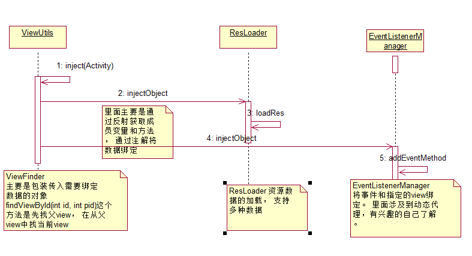
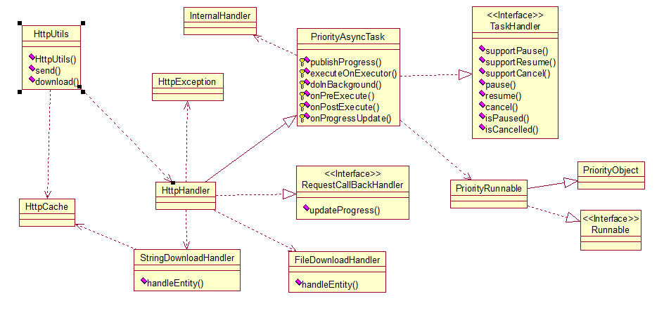
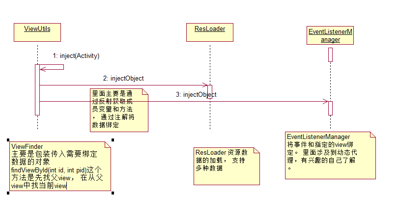
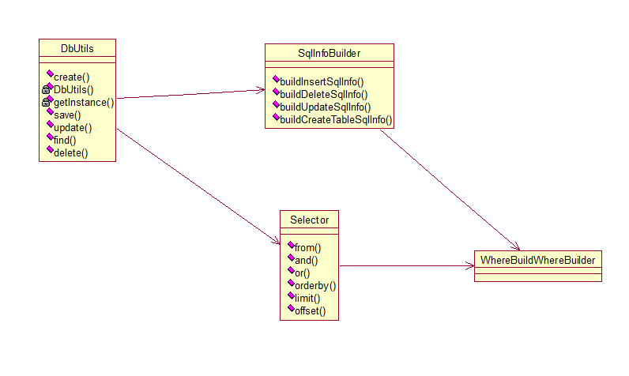
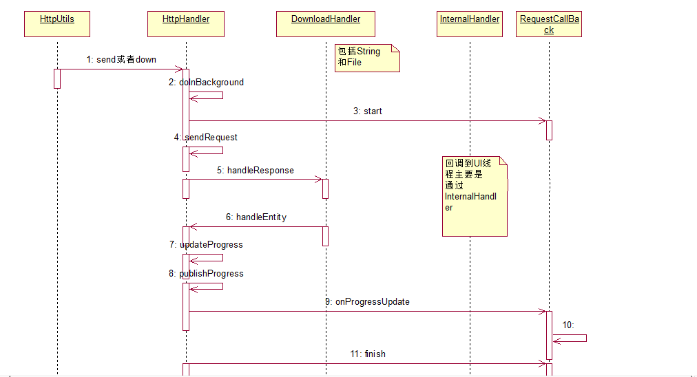

XUtils 实现原理解析
====================================
> 本文为 [Android 开源项目实现原理解析](https://github.com/android-cn/android-open-project-analysis) 中 XUtils 部分，  [Demo地址](https://github.com/android-cn/android-open-project-demo) 
> 分析者：[Caij](https://github.com/Caij)，校对者：[maogy](https://github.com/maogy)，校对状态：未完成   

###1. 功能介绍  
xUtils一个Android公共库框架，主要包括四个部分：View，Db, Http, Bitmap 四个模块。
- View模块主要的功能是通过注解绑定UI，资源，事件。减少代码冗余。
- Db模块是一个数据库orm框架， 简单的语句就能进行数据的操作。
- Http模块主要访问网络，支持同步，异步方式的请求，支持文件的下载，上传。
- Bitmap模块是加载图片以及图片的处理， 支持加载本地，网络图片。而且支持图片的内存和本地缓存。

###2. 详细设计
####2.1 核心类功能介绍
#####2.1.1 View模块
注解和反射知识是这个模块的主要内容
- ViewUtils，其实主要功能就是通过反射和注解将Ui和资源、事件和资源绑定。
- EventListenerManager view和事件方法的绑定， 其中的设计是通过动态代理。

#####2.1.2 Db模块
注解、反射和数据库操作知识这个模块的主要内容
- DbUtils，主要功能数据库的创建，数据库的增删改查。
- SqlInfoBuilder， sql语句的组合。
- Selector，WhereBuilder， sql条件语句的组合。

#####2.1.3 Http模块
Handler、AysnTask异步通信
- HttpUtils，支持异步同步访问网络数据， 断点下载文件和上传文件。
- HttpHandler，获取网络数据逻辑的实现。

#####2.1.4 Bitmap模块  
- BitmapUtils，图片的异步加载，支持本地和网络图片， 图片的压缩处理， 图片的内存缓存已经本地缓存。

####2.2 类关系图
#####2.2.1 View模块
 
 
#####2.2.2 Db模块
类模快和关系层次较少， 所以不绘制类图

#####2.2.3Http模块
 
 
类关系图，类的继承、组合关系图，可是用 StartUML 工具。  

**完成时间**  
- 根据项目大小而定，目前简单根据项目 Java 文件数判断，完成时间大致为：`文件数 * 7 / 10`天，特殊项目具体对待  

###3. 流程图
主要功能流程图  
####3.1 View模块

主要的顺序就是在ViewUtils的`inject(View)`将需要的绑定数据的对象传入，`injectObject(Object, ViewFinder)` 主要通过反射获取对象的成员变量和方法， 
然后获取成员变量和方法的注解的值， 将成员变量赋值， 事件和方法绑定， 在EventListenerManager中是通过代理将事件和方法绑定。

####3.2 DB模块

`DbUtils`中`getInstance()`获取XUtils的实例，里面的操作就是检查数据库版本和升级，然后就是创建数据库（单例模式， 如果存在数据库不会重复创建）。
 `createDatabase()`通过配置创建数据库。save，find，update，delete 都是然后通过`SqlInfoBuilder`或者Selector组合对象的sql语句， 然后通过系统自带数据库api进行数据库操作。
 `SqlInfoBuilder`的原理也是反射加注解。
 
####3.3 Http模块

- 1.HttpUtils通过send或者down获取网络请求。
- 2.HttpHandler异步任务读取数据，doInBackground()中访问网络， 开始的时候调用publishProgress()，
sendRequest()，handleResponse()将网络数据包装入ResponseInfo，
updateProgress()是在DownloadHandler数据读写时候的回调， 次方法又调用publishProgress()，
publishProgress()通过Handler回调onProgressUpdate() ,
onProgressUpdate()调用RequestCallback，完成回调流程。
- 3.DownloadHandler， handleEntity()将网络数据转化为需要的数据格式。 在读写数据的时候会回调HttpHandler的updateProgress(), 如果当用户选择停止的时候直接停止数据读写。

- 可使用 StartUML、Visio 或 Google Drawing 等工具完成，其他工具推荐？？  
- 非所有项目必须，不需要的请先在群里反馈  

**完成时间**  
- `两天内`完成  

###4. 总体设计
整个库分为哪些模块及模块之间的调用关系。  
- 如大多数图片缓存会分为 Loader 和 Processer 等模块。  
- 可使用 StartUML、Visio 或 Google Drawing 等工具完成，其他工具推荐？？  
- 非所有项目必须，不需要的请先在群里反馈。  

**完成时间**  
- `两天内`完成  

###5. 杂谈
该项目存在的问题、可优化点及类似功能项目对比等，非所有项目必须。  

**完成时间**  
- `两天内`完成  

###6. 修改完善  
在完成了上面 5 个部分后，移动模块顺序，将  
`2. 详细设计` -> `2.1 核心类功能介绍` -> `2.2 类关系图` -> `3. 流程图` -> `4. 总体设计`  
顺序变为  
`2. 总体设计` -> `3. 流程图` -> `4. 详细设计` -> `4.1 类关系图` -> `4.2 核心类功能介绍`  
并自行校验优化一遍，确认无误后，让`校对 Buddy`进行校对，`校对 Buddy`校队完成后将  
`校对状态：未完成`  
变为：  
`校对状态：已完成`  

**完成时间**  
- `两天内`完成  

**到此便大功告成，恭喜大家^_^**  
