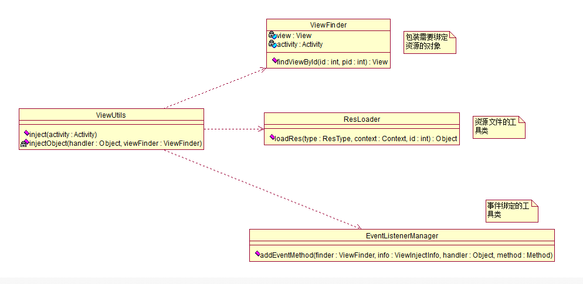

XUtils 实现原理解析
====================================
> 本文为 [Android 开源项目实现原理解析](https://github.com/android-cn/android-open-project-analysis) 中 XUtils 部分  
> 分析者：[Caij](https://github.com/Caij)，校对者：[maogy](https://github.com/maogy)，校对状态：未完成   

###1. 功能介绍  
xUtils一个Android公共库框架，主要包括四个部分：View，Db, Http, Bitmap 四个模块。
- View模块主要的功能是通过注解绑定UI，资源，事件。减少代码冗余。
- Db模块是一个数据库orm框架， 简单的语句就能进行数据的操作。
- Http模块主要访问网络，支持同步，异步方式的请求，支持文件的下载，上传。
- Bitmap模块是加载图片以及图片的处理， 支持加载本地，网络图片。而且支持图片的内存和本地缓存。

###2. 详细设计
####2.1 核心类功能介绍
#####2.1.1 View模块
- ViewUtils，其实主要功能就是通过反射和注解将Ui和资源、事件和资源绑定。

#####2.1.2 Db模块
#####2.1.3 Http模块
#####2.1.4 Bitmap模块  
####2.2 类关系图
#####2.2.1 View模块
 
 
类关系图，类的继承、组合关系图，可是用 StartUML 工具。  

**完成时间**  
- 根据项目大小而定，目前简单根据项目 Java 文件数判断，完成时间大致为：`文件数 * 7 / 10`天，特殊项目具体对待  

###3. 流程图
主要功能流程图  
####3.1 View模块

- 可使用 StartUML、Visio 或 Google Drawing 等工具完成，其他工具推荐？？  
- 非所有项目必须，不需要的请先在群里反馈  

**完成时间**  
- `两天内`完成  

###4. 总体设计
整个库分为哪些模块及模块之间的调用关系。  
- 如大多数图片缓存会分为 Loader 和 Processer 等模块。  
- 可使用 StartUML、Visio 或 Google Drawing 等工具完成，其他工具推荐？？  
- 非所有项目必须，不需要的请先在群里反馈。  

**完成时间**  
- `两天内`完成  

###5. 杂谈
该项目存在的问题、可优化点及类似功能项目对比等，非所有项目必须。  

**完成时间**  
- `两天内`完成  

###6. 修改完善  
在完成了上面 5 个部分后，移动模块顺序，将  
`2. 详细设计` -> `2.1 核心类功能介绍` -> `2.2 类关系图` -> `3. 流程图` -> `4. 总体设计`  
顺序变为  
`2. 总体设计` -> `3. 流程图` -> `4. 详细设计` -> `4.1 类关系图` -> `4.2 核心类功能介绍`  
并自行校验优化一遍，确认无误后，让`校对 Buddy`进行校对，`校对 Buddy`校队完成后将  
`校对状态：未完成`  
变为：  
`校对状态：已完成`  

**完成时间**  
- `两天内`完成  

**到此便大功告成，恭喜大家^_^**  
